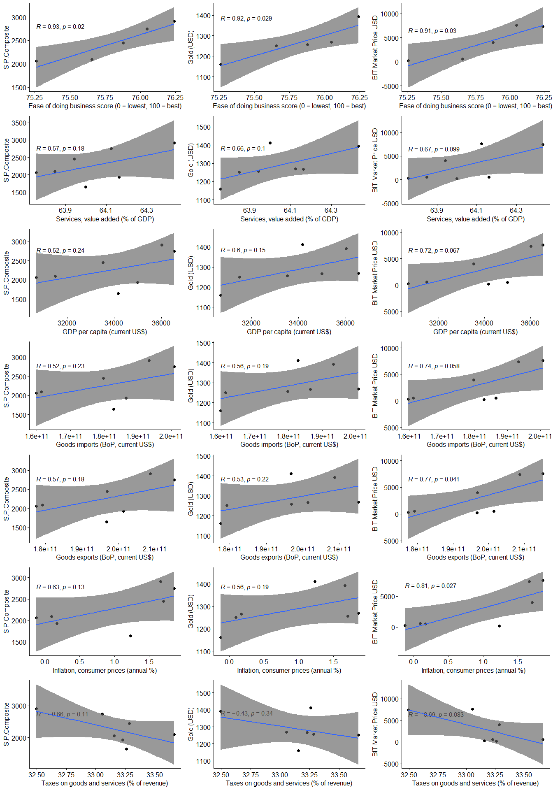

## Podsumowanie analizy

Na podstawie przeprowadzonej analizy można stwierdzić, że ceny złota są powiązane z różnymi w wskaźnikami ekonomicznymi w krajach wysoko rozwiniętych (w wypadku tej analizy - krajach Unii Europejskiej w latach 2013-2019). Utworzony model regresji wykazał, że najistotniejszy wpływ na predykcję cen złota miała inflacja.


## Podstawowe statystyki

Zbiór danych składa się z 5 tabel:


```{=html}
<div id="htmlwidget-29d29edb66c10ed97587" style="width:100%;height:auto;" class="datatables html-widget"></div>
<script type="application/json" data-for="htmlwidget-29d29edb66c10ed97587">{"x":{"style":"bootstrap","filter":"none","vertical":false,"data":[["Bitcoin","Currency Exchange Rates","Gold prices","S&amp;P Composite","World Development Indicators"],[5,52,7,10,216],[13,24,54,151,10710]],"container":"<table class=\"table table-bordered table-striped\">\n  <thead>\n    <tr>\n      <th>Table<\/th>\n      <th>No. of columns (attributes)<\/th>\n      <th>No. of rows (observations)<\/th>\n    <\/tr>\n  <\/thead>\n<\/table>","options":{"dom":"t","columnDefs":[{"targets":1,"render":"function(data, type, row, meta) {\n    return type !== 'display' ? data : DTWidget.formatRound(data, 2, 3, \",\", \".\");\n  }"},{"targets":2,"render":"function(data, type, row, meta) {\n    return type !== 'display' ? data : DTWidget.formatRound(data, 2, 3, \",\", \".\");\n  }"},{"className":"dt-right","targets":[1,2]}],"order":[],"autoWidth":false,"orderClasses":false}},"evals":["options.columnDefs.0.render","options.columnDefs.1.render"],"jsHooks":[]}</script>
```

Łącznie w całym zbiorze danych występuje 10952 obserwacji oraz 286 atrybutów.

## Szczegółowa analiza atrybutów

### Bitcoin

```{=html}
<div id="htmlwidget-f742d7a715ae873a590b" style="width:100%;height:auto;" class="datatables html-widget"></div>
<script type="application/json" data-for="htmlwidget-f742d7a715ae873a590b">{"x":{"style":"bootstrap","filter":"none","vertical":false,"data":[["character","numeric","numeric","numeric","numeric"],["Date","BIT Difficulty","BIT Hash Rate","BIT Market Price USD","BIT USD Exchange Trade Volume"],[0,0,0,0,0],[1,1,1,1,1],[4,null,null,null,null],[4,null,null,null,null],[0,null,null,null,null],[13,null,null,null,null],[0,null,null,null,null],[null,3957786186336.31,28521852.7763601,5854.03649103939,155486175.602276],[null,6889348202952.88,49255677.9114028,12216.7391124505,233643226.414681],[null,0.987233606249642,4.47586885226583e-06,0,0],[null,2125246.06029908,15.7019500124912,8.47412475409836,298104.977516615],[null,54435310096.6834,405804.814904851,525.599890410959,11487882.4348434],[null,4970320545967.22,36394798.5688129,7362.71320319633,189145596.268735],[null,19789690360642.1,140094812.581309,44566.4538489209,626774501.41702],[null,"▇▁▁▁▂","▇▁▁▁▂","▇▁▁▁▁","▇▂▁▁▂"]],"container":"<table class=\"table table-bordered table-striped\">\n  <thead>\n    <tr>\n      <th>skim_type<\/th>\n      <th>skim_variable<\/th>\n      <th>n_missing<\/th>\n      <th>complete_rate<\/th>\n      <th>character.min<\/th>\n      <th>character.max<\/th>\n      <th>character.empty<\/th>\n      <th>character.n_unique<\/th>\n      <th>character.whitespace<\/th>\n      <th>numeric.mean<\/th>\n      <th>numeric.sd<\/th>\n      <th>numeric.p0<\/th>\n      <th>numeric.p25<\/th>\n      <th>numeric.p50<\/th>\n      <th>numeric.p75<\/th>\n      <th>numeric.p100<\/th>\n      <th>numeric.hist<\/th>\n    <\/tr>\n  <\/thead>\n<\/table>","options":{"dom":"tp","scrollX":"TRUE","scrollY":"TRUE","autoWidth":"TRUE","columnDefs":[{"targets":2,"render":"function(data, type, row, meta) {\n    return type !== 'display' ? data : DTWidget.formatRound(data, 2, 3, \",\", \".\");\n  }"},{"targets":3,"render":"function(data, type, row, meta) {\n    return type !== 'display' ? data : DTWidget.formatRound(data, 2, 3, \",\", \".\");\n  }"},{"targets":4,"render":"function(data, type, row, meta) {\n    return type !== 'display' ? data : DTWidget.formatRound(data, 2, 3, \",\", \".\");\n  }"},{"targets":5,"render":"function(data, type, row, meta) {\n    return type !== 'display' ? data : DTWidget.formatRound(data, 2, 3, \",\", \".\");\n  }"},{"targets":6,"render":"function(data, type, row, meta) {\n    return type !== 'display' ? data : DTWidget.formatRound(data, 2, 3, \",\", \".\");\n  }"},{"targets":7,"render":"function(data, type, row, meta) {\n    return type !== 'display' ? data : DTWidget.formatRound(data, 2, 3, \",\", \".\");\n  }"},{"targets":8,"render":"function(data, type, row, meta) {\n    return type !== 'display' ? data : DTWidget.formatRound(data, 2, 3, \",\", \".\");\n  }"},{"targets":9,"render":"function(data, type, row, meta) {\n    return type !== 'display' ? data : DTWidget.formatRound(data, 2, 3, \",\", \".\");\n  }"},{"targets":10,"render":"function(data, type, row, meta) {\n    return type !== 'display' ? data : DTWidget.formatRound(data, 2, 3, \",\", \".\");\n  }"},{"targets":11,"render":"function(data, type, row, meta) {\n    return type !== 'display' ? data : DTWidget.formatRound(data, 2, 3, \",\", \".\");\n  }"},{"targets":12,"render":"function(data, type, row, meta) {\n    return type !== 'display' ? data : DTWidget.formatRound(data, 2, 3, \",\", \".\");\n  }"},{"targets":13,"render":"function(data, type, row, meta) {\n    return type !== 'display' ? data : DTWidget.formatRound(data, 2, 3, \",\", \".\");\n  }"},{"targets":14,"render":"function(data, type, row, meta) {\n    return type !== 'display' ? data : DTWidget.formatRound(data, 2, 3, \",\", \".\");\n  }"},{"targets":15,"render":"function(data, type, row, meta) {\n    return type !== 'display' ? data : DTWidget.formatRound(data, 2, 3, \",\", \".\");\n  }"},{"width":"100px","targets":"_all"},{"className":"dt-right","targets":[2,3,4,5,6,7,8,9,10,11,12,13,14,15]}],"order":[],"orderClasses":false}},"evals":["options.columnDefs.0.render","options.columnDefs.1.render","options.columnDefs.2.render","options.columnDefs.3.render","options.columnDefs.4.render","options.columnDefs.5.render","options.columnDefs.6.render","options.columnDefs.7.render","options.columnDefs.8.render","options.columnDefs.9.render","options.columnDefs.10.render","options.columnDefs.11.render","options.columnDefs.12.render","options.columnDefs.13.render"],"jsHooks":[]}</script>
```
### Currency Exchange Rates

```{=html}
<div id="htmlwidget-b29327f11ece858f95ba" style="width:100%;height:auto;" class="datatables html-widget"></div>
<script type="application/json" data-for="htmlwidget-b29327f11ece858f95ba">{"x":{"style":"bootstrap","filter":"none","vertical":false,"data":[["character","numeric","numeric","numeric","numeric","numeric","numeric","numeric","numeric","numeric","numeric","numeric","numeric","numeric","numeric","numeric","numeric","numeric","numeric","numeric","numeric","numeric","numeric","numeric","numeric","numeric","numeric","numeric","numeric","numeric","numeric","numeric","numeric","numeric","numeric","numeric","numeric","numeric","numeric","numeric","numeric","numeric","numeric","numeric","numeric","numeric","numeric","numeric","numeric","numeric","numeric","numeric"],["Date","Algerian.Dinar","Australian.Dollar","Bahrain.Dinar","Bolivar.Fuerte","Botswana.Pula","Brazilian.Real","Brunei.Dollar","Canadian.Dollar","Chilean.Peso","Chinese.Yuan","Colombian.Peso","Czech.Koruna","Danish.Krone","Euro","Hungarian.Forint","Icelandic.Krona","Indian.Rupee","Indonesian.Rupiah","Iranian.Rial","Israeli.New.Sheqel","Japanese.Yen","Kazakhstani.Tenge","Korean.Won","Kuwaiti.Dinar","Libyan.Dinar","Malaysian.Ringgit","Mauritian.Rupee","Mexican.Peso","Nepalese.Rupee","New.Zealand.Dollar","Norwegian.Krone","Nuevo.Sol","Pakistani.Rupee","Peso.Uruguayo","Philippine.Peso","Polish.Zloty","Qatar.Riyal","Rial.Omani","Russian.Ruble","Saudi.Arabian.Riyal","Singapore.Dollar","South.African.Rand","Sri.Lanka.Rupee","Swedish.Krona","Swiss.Franc","Thai.Baht","Trinidad.And.Tobago.Dollar","Tunisian.Dinar","U.A.E..Dirham","U.K..Pound.Sterling","U.S..Dollar"],[0,15,0,0,13,3,0,3,0,0,0,0,6,0,3,3,0,0,3,0,6,0,10,0,0,0,0,7,3,0,0,0,15,0,14,11,2,0,0,8,0,0,0,0,0,0,0,0,15,0,0,0],[1,0.375,1,1,0.458333333333333,0.875,1,0.875,1,1,1,1,0.75,1,0.875,0.875,1,1,0.875,1,0.75,1,0.583333333333333,1,1,1,1,0.708333333333333,0.875,1,1,1,0.375,1,0.416666666666667,0.541666666666667,0.916666666666667,1,1,0.666666666666667,1,1,1,1,1,1,1,1,0.375,1,1,1],[4,null,null,null,null,null,null,null,null,null,null,null,null,null,null,null,null,null,null,null,null,null,null,null,null,null,null,null,null,null,null,null,null,null,null,null,null,null,null,null,null,null,null,null,null,null,null,null,null,null,null,null],[4,null,null,null,null,null,null,null,null,null,null,null,null,null,null,null,null,null,null,null,null,null,null,null,null,null,null,null,null,null,null,null,null,null,null,null,null,null,null,null,null,null,null,null,null,null,null,null,null,null,null,null],[0,null,null,null,null,null,null,null,null,null,null,null,null,null,null,null,null,null,null,null,null,null,null,null,null,null,null,null,null,null,null,null,null,null,null,null,null,null,null,null,null,null,null,null,null,null,null,null,null,null,null,null],[24,null,null,null,null,null,null,null,null,null,null,null,null,null,null,null,null,null,null,null,null,null,null,null,null,null,null,null,null,null,null,null,null,null,null,null,null,null,null,null,null,null,null,null,null,null,null,null,null,null,null,null],[0,null,null,null,null,null,null,null,null,null,null,null,null,null,null,null,null,null,null,null,null,null,null,null,null,null,null,null,null,null,null,null,null,null,null,null,null,null,null,null,null,null,null,null,null,null,null,null,null,null,null,null],[null,91.1536051757265,0.770069916023369,0.376,2498.60695048788,0.275536032830395,2.19308591641366,1.5021609726149,1.26458785303909,542.180000145139,7.43022421457858,2106.71998485911,23.1932897819145,6.27266622219987,1.2068842321297,229.960493825328,92.9604220413393,48.7530850163921,9362.04564760266,12125.2352908314,3.98393865180764,107.880963436991,188.241354771531,1101.03453533713,0.294192037635813,1.52365717690876,3.51559070961918,30.9998142450014,12.2353136291227,78.0632407022195,0.662781899361555,6.98708840230403,2.97525778002773,71.6830206137579,22.7545170643232,41.0150796987688,3.30544512138513,3.64,0.3845,37.6496367549015,3.74868243243243,1.49546001348882,8.21956996364416,104.076878939305,7.74061404485929,1.20042511107359,35.0922444215076,6.32355794801134,1.85655114769758,3.6723141376807,1.60732973629673,1],[null,17.2478235384615,0.137496023543121,0,8269.22262620015,0.570262806556682,0.767227148280551,0.193304946504064,0.183329181654819,82.5760887734119,0.895247154988052,593.404426593751,5.4104630956221,0.878118773226032,0.161215915373558,36.2763693338815,24.2184080959402,9.82301518925928,3357.44687197924,11130.6155383002,0.407205005191637,13.4708791841168,81.2834552417869,145.607896184224,0.0106292405038237,0.616189028637977,0.478427777567792,2.43217050735853,3.47169328307052,15.7093294275942,0.113491304030637,1.05653657531947,0.280823149656529,24.5973678877684,6.2307299095299,8.55460606072216,0.495995094925958,0,0,14.4334411927916,0.00219649952346281,0.183496674000911,2.89118745242571,30.1610490752258,1.02811462512922,0.24973953366361,5.24464591557718,0.192685901617764,0.399489904318828,0.000503653184874609,0.167724529276356,0],[null,72.8413933035714,0.517895102040816,0.376,2.1446,0.0919240663900415,0.91609756097561,1.25042231759657,0.989033624454148,401.985,6.14343275862069,913.609715447154,17.031594488189,5.0986408,0.89565256916996,171.799163346614,62.8373913043478,32.3974206349206,2248.03174603175,1747.88375768699,3.48019736842105,79.7706329113924,120.2943359375,770.901234567901,0.268834033613445,0.525,2.5080225,27.5279101265823,6.51091666666667,51.8839688715953,0.420687601626016,5.60979205020921,2.63743378995434,31.7080237354086,9.32,25.8353,2.40453934426229,3.64,0.3845,24.8687141129032,3.745,1.25015420168067,3.62713114754098,51.2644726890756,6.49535165289256,0.887587469387755,24.9191020408163,5.89339403292181,1.40689257425743,3.671,1.28871239837398,1],[null,77.635898173516,0.715375480321285,0.376,3.43407,0.119255508474576,1.79611537629585,1.36599696969697,1.0971654412403,486.72218393499,6.59789185051593,1833.34671253965,19.5650736514523,5.61954855628263,1.10911417004049,202.259561752988,70.7753969392635,43.3426641162775,8932.0327510917,1753.24231702824,3.60170640207494,101.969236769284,137.207035123967,1045.34003695309,0.286321987489673,0.726602101182994,3.20297418961864,29.5130515217391,10.7966804878049,69.3439086507937,0.622421275510204,6.2244164516129,2.7531256281407,56.5060272727273,20.3789466180867,41.0722222222222,3.03873350622407,3.64,0.3845,28.6937809151786,3.74753378378378,1.37243142405063,6.44719217658633,85.9715751566728,6.84053285411622,0.979198329959514,31.4627351629597,6.26189335866606,1.56156405529954,3.6725,1.52557302748191,1],[null,80.56382375,0.757793032786885,0.376,6.05671140350877,0.147559128630705,2.07127661157025,1.4544776,1.28896974427012,526.440277501244,7.78952032802455,2087.40334774869,21.6733365770239,5.99702618286019,1.24386472868217,224.460950413223,89.7186930057548,46.1405122126437,9378.40677966102,9228.06129141312,3.87186660656329,108.728300539728,148.37039222739,1124.20098898545,0.298245971978504,1.932367,3.72760654278547,30.6986517241379,11.2863443396226,74.0866521211421,0.692908046187683,6.59549285108562,2.83571365638767,61.4502198685647,21.8821244615078,43.3142079646018,3.24693599639856,3.64,0.3845,30.7199236658766,3.75,1.43577243534137,7.47052617131758,106.121741034664,7.54690559693514,1.19118384766021,34.2991861386421,6.27969619980291,1.70495957943925,3.6725,1.58176547293781,1],[null,109.451447755102,0.842471004098361,0.376,7.83195483870968,0.19672375,2.92803319844594,1.69028299595142,1.38851034136546,603.898290509259,8.2773672788163,2534.41734487966,24.562816848702,6.70481395,1.32794081632653,258.344691358025,117.73196804059,54.7331289272327,11323.3333333333,13799.9363719381,4.39693051728888,116.665287456446,210.222243187398,1167.01800088652,0.303363410190999,1.9324,3.8,31.9086266949153,13.2999350877193,87.4359347536289,0.722054327240696,7.87817568561873,3.2345,95.2050983032504,28.1266100509306,45.4987124463519,3.74210408889657,3.64,0.3845,43.4347357259919,3.75,1.67731084580257,9.86060834567434,127.999849042354,8.30918807768924,1.37161349535098,40.1813306320621,6.38849174131303,2.14238468085106,3.6725,1.65035775213566,1],[null,114.140239506173,1.03598583333333,0.376,27431.2499942857,2.75849038461538,3.4878784,1.79185301204819,1.5704252,691.234773662551,8.37405714285714,3050.15078512397,38.0219872611465,8.31830241935484,1.47075546875,286.458016528926,131.895875,67.197172173913,13632.6075949367,38039.1129032258,4.73798744769875,131.081295546559,341.905714285714,1394.53403361345,0.306843807106599,1.9324,4.29893073593074,35.5251519313305,18.8622720338983,107.45162601626,0.831026666666667,8.98879759036144,3.37091542288557,112.23591025641,30.0645882352941,51.5977763157895,4.1007689119171,3.64,0.3845,66.848743697479,3.75,1.79185301204819,14.7023584051724,155.170953947368,10.3259124497992,1.69034761904762,44.4844658119658,6.75576710526316,2.4357108974359,3.67251012145749,2.00180546875,1],[null,"▇▁▁▂▅","▂▂▇▃▂","▁▁▇▁▁","▇▁▁▁▁","▇▁▁▁▁","▃▅▇▂▅","▇▇▁▃▇","▇▃▆▅▆","▃▇▇▂▆","▃▃▁▁▇","▂▂▇▃▅","▇▅▂▁▁","▇▆▇▁▃","▃▃▅▇▅","▃▇▅▃▇","▇▂▂▂▅","▂▇▅▂▅","▂▁▂▇▃","▇▅▁▂▂","▇▇▂▂▃","▃▃▇▅▅","▇▁▁▁▂","▂▂▇▅▂","▂▂▃▃▇","▃▁▁▁▇","▂▃▃▇▂","▆▇▆▂▅","▃▇▆▁▃","▂▇▅▂▅","▂▂▅▇▃","▇▇▃▆▃","▇▅▁▂▇","▃▇▁▃▅","▂▁▇▂▇","▃▁▁▇▃","▃▃▇▂▆","▁▁▇▁▁","▁▁▇▁▁","▇▁▁▂▂","▃▁▁▁▇","▅▇▂▃▆","▃▇▅▂▂","▅▂▇▃▃","▇▅▅▁▂","▇▃▅▂▂","▂▇▇▆▅","▁▁▇▁▂","▇▅▂▂▅","▁▁▁▁▇","▃▇▇▃▁","▁▁▇▁▁"]],"container":"<table class=\"table table-bordered table-striped\">\n  <thead>\n    <tr>\n      <th>skim_type<\/th>\n      <th>skim_variable<\/th>\n      <th>n_missing<\/th>\n      <th>complete_rate<\/th>\n      <th>character.min<\/th>\n      <th>character.max<\/th>\n      <th>character.empty<\/th>\n      <th>character.n_unique<\/th>\n      <th>character.whitespace<\/th>\n      <th>numeric.mean<\/th>\n      <th>numeric.sd<\/th>\n      <th>numeric.p0<\/th>\n      <th>numeric.p25<\/th>\n      <th>numeric.p50<\/th>\n      <th>numeric.p75<\/th>\n      <th>numeric.p100<\/th>\n      <th>numeric.hist<\/th>\n    <\/tr>\n  <\/thead>\n<\/table>","options":{"dom":"tp","scrollX":"TRUE","scrollY":"TRUE","autoWidth":"TRUE","columnDefs":[{"targets":2,"render":"function(data, type, row, meta) {\n    return type !== 'display' ? data : DTWidget.formatRound(data, 2, 3, \",\", \".\");\n  }"},{"targets":3,"render":"function(data, type, row, meta) {\n    return type !== 'display' ? data : DTWidget.formatRound(data, 2, 3, \",\", \".\");\n  }"},{"targets":4,"render":"function(data, type, row, meta) {\n    return type !== 'display' ? data : DTWidget.formatRound(data, 2, 3, \",\", \".\");\n  }"},{"targets":5,"render":"function(data, type, row, meta) {\n    return type !== 'display' ? data : DTWidget.formatRound(data, 2, 3, \",\", \".\");\n  }"},{"targets":6,"render":"function(data, type, row, meta) {\n    return type !== 'display' ? data : DTWidget.formatRound(data, 2, 3, \",\", \".\");\n  }"},{"targets":7,"render":"function(data, type, row, meta) {\n    return type !== 'display' ? data : DTWidget.formatRound(data, 2, 3, \",\", \".\");\n  }"},{"targets":8,"render":"function(data, type, row, meta) {\n    return type !== 'display' ? data : DTWidget.formatRound(data, 2, 3, \",\", \".\");\n  }"},{"targets":9,"render":"function(data, type, row, meta) {\n    return type !== 'display' ? data : DTWidget.formatRound(data, 2, 3, \",\", \".\");\n  }"},{"targets":10,"render":"function(data, type, row, meta) {\n    return type !== 'display' ? data : DTWidget.formatRound(data, 2, 3, \",\", \".\");\n  }"},{"targets":11,"render":"function(data, type, row, meta) {\n    return type !== 'display' ? data : DTWidget.formatRound(data, 2, 3, \",\", \".\");\n  }"},{"targets":12,"render":"function(data, type, row, meta) {\n    return type !== 'display' ? data : DTWidget.formatRound(data, 2, 3, \",\", \".\");\n  }"},{"targets":13,"render":"function(data, type, row, meta) {\n    return type !== 'display' ? data : DTWidget.formatRound(data, 2, 3, \",\", \".\");\n  }"},{"targets":14,"render":"function(data, type, row, meta) {\n    return type !== 'display' ? data : DTWidget.formatRound(data, 2, 3, \",\", \".\");\n  }"},{"targets":15,"render":"function(data, type, row, meta) {\n    return type !== 'display' ? data : DTWidget.formatRound(data, 2, 3, \",\", \".\");\n  }"},{"width":"100px","targets":"_all"},{"className":"dt-right","targets":[2,3,4,5,6,7,8,9,10,11,12,13,14,15]}],"order":[],"orderClasses":false}},"evals":["options.columnDefs.0.render","options.columnDefs.1.render","options.columnDefs.2.render","options.columnDefs.3.render","options.columnDefs.4.render","options.columnDefs.5.render","options.columnDefs.6.render","options.columnDefs.7.render","options.columnDefs.8.render","options.columnDefs.9.render","options.columnDefs.10.render","options.columnDefs.11.render","options.columnDefs.12.render","options.columnDefs.13.render"],"jsHooks":[]}</script>
```
### Gold prices

```{=html}
<div id="htmlwidget-14838a6519d68163a5f7" style="width:100%;height:auto;" class="datatables html-widget"></div>
<script type="application/json" data-for="htmlwidget-14838a6519d68163a5f7">{"x":{"style":"bootstrap","filter":"none","vertical":false,"data":[["character","numeric","numeric","numeric","numeric","numeric","numeric"],["Date","USD..AM.","USD..PM.","GBP..AM.","GBP..PM.","EURO..AM.","EURO..PM."],[0,0,0,0,0,31,31],[1,1,1,1,1,0.425925925925926,0.425925925925926],[4,null,null,null,null,null,null],[4,null,null,null,null,null,null],[0,null,null,null,null,null,null],[54,null,null,null,null,null,null],[0,null,null,null,null,null,null],[null,580.957457904324,580.692825794103,374.947759084367,374.768832966259,805.09314912377,804.845758400358],[null,498.161743916533,497.976106669218,359.86726256548,359.748022650539,424.120934183901,424.125395145469],[null,35.9636862745098,35.9502362204724,15.0121098039216,15.0064448818898,261.634182539683,261.366741035857],[null,282.997844908714,282.848262948207,179.255917290137,179.158344641434,344.145194991251,343.69039],[null,382.500232919255,382.192370916335,241.586042725391,241.463504541833,926.31938339921,925.110876494024],[null,828.386989394977,827.81863735534,441.392930927298,440.366830582432,1121.53935549595,1121.81133808765],[null,1801.00079787234,1800.0204787234,1379.37358267717,1378.84142857143,1549.45421259843,1548.86400793651],[null,"▇▂▁▂▁","▇▂▁▂▁","▇▁▁▂▁","▇▁▁▂▁","▇▂▂▆▂","▇▂▂▆▂"]],"container":"<table class=\"table table-bordered table-striped\">\n  <thead>\n    <tr>\n      <th>skim_type<\/th>\n      <th>skim_variable<\/th>\n      <th>n_missing<\/th>\n      <th>complete_rate<\/th>\n      <th>character.min<\/th>\n      <th>character.max<\/th>\n      <th>character.empty<\/th>\n      <th>character.n_unique<\/th>\n      <th>character.whitespace<\/th>\n      <th>numeric.mean<\/th>\n      <th>numeric.sd<\/th>\n      <th>numeric.p0<\/th>\n      <th>numeric.p25<\/th>\n      <th>numeric.p50<\/th>\n      <th>numeric.p75<\/th>\n      <th>numeric.p100<\/th>\n      <th>numeric.hist<\/th>\n    <\/tr>\n  <\/thead>\n<\/table>","options":{"dom":"tp","scrollX":"TRUE","scrollY":"TRUE","autoWidth":"TRUE","columnDefs":[{"targets":2,"render":"function(data, type, row, meta) {\n    return type !== 'display' ? data : DTWidget.formatRound(data, 2, 3, \",\", \".\");\n  }"},{"targets":3,"render":"function(data, type, row, meta) {\n    return type !== 'display' ? data : DTWidget.formatRound(data, 2, 3, \",\", \".\");\n  }"},{"targets":4,"render":"function(data, type, row, meta) {\n    return type !== 'display' ? data : DTWidget.formatRound(data, 2, 3, \",\", \".\");\n  }"},{"targets":5,"render":"function(data, type, row, meta) {\n    return type !== 'display' ? data : DTWidget.formatRound(data, 2, 3, \",\", \".\");\n  }"},{"targets":6,"render":"function(data, type, row, meta) {\n    return type !== 'display' ? data : DTWidget.formatRound(data, 2, 3, \",\", \".\");\n  }"},{"targets":7,"render":"function(data, type, row, meta) {\n    return type !== 'display' ? data : DTWidget.formatRound(data, 2, 3, \",\", \".\");\n  }"},{"targets":8,"render":"function(data, type, row, meta) {\n    return type !== 'display' ? data : DTWidget.formatRound(data, 2, 3, \",\", \".\");\n  }"},{"targets":9,"render":"function(data, type, row, meta) {\n    return type !== 'display' ? data : DTWidget.formatRound(data, 2, 3, \",\", \".\");\n  }"},{"targets":10,"render":"function(data, type, row, meta) {\n    return type !== 'display' ? data : DTWidget.formatRound(data, 2, 3, \",\", \".\");\n  }"},{"targets":11,"render":"function(data, type, row, meta) {\n    return type !== 'display' ? data : DTWidget.formatRound(data, 2, 3, \",\", \".\");\n  }"},{"targets":12,"render":"function(data, type, row, meta) {\n    return type !== 'display' ? data : DTWidget.formatRound(data, 2, 3, \",\", \".\");\n  }"},{"targets":13,"render":"function(data, type, row, meta) {\n    return type !== 'display' ? data : DTWidget.formatRound(data, 2, 3, \",\", \".\");\n  }"},{"targets":14,"render":"function(data, type, row, meta) {\n    return type !== 'display' ? data : DTWidget.formatRound(data, 2, 3, \",\", \".\");\n  }"},{"targets":15,"render":"function(data, type, row, meta) {\n    return type !== 'display' ? data : DTWidget.formatRound(data, 2, 3, \",\", \".\");\n  }"},{"width":"100px","targets":"_all"},{"className":"dt-right","targets":[2,3,4,5,6,7,8,9,10,11,12,13,14,15]}],"order":[],"orderClasses":false}},"evals":["options.columnDefs.0.render","options.columnDefs.1.render","options.columnDefs.2.render","options.columnDefs.3.render","options.columnDefs.4.render","options.columnDefs.5.render","options.columnDefs.6.render","options.columnDefs.7.render","options.columnDefs.8.render","options.columnDefs.9.render","options.columnDefs.10.render","options.columnDefs.11.render","options.columnDefs.12.render","options.columnDefs.13.render"],"jsHooks":[]}</script>
```
### S&P Composite

```{=html}
<div id="htmlwidget-aac77bd07acd23f8026c" style="width:100%;height:auto;" class="datatables html-widget"></div>
<script type="application/json" data-for="htmlwidget-aac77bd07acd23f8026c">{"x":{"style":"bootstrap","filter":"none","vertical":false,"data":[["character","numeric","numeric","numeric","numeric","numeric","numeric","numeric","numeric","numeric"],["Date","S.P.Composite","Dividend","Earnings","CPI","Long.Interest.Rate","Real.Price","Real.Dividend","Real.Earnings","Cyclically.Adjusted.PE.Ratio"],[0,0,0,0,0,0,0,0,0,10],[1,1,1,1,1,1,1,1,1,0.933774834437086],[4,null,null,null,null,null,null,null,null,null],[4,null,null,null,null,null,null,null,null,null],[0,null,null,null,null,null,null,null,null,null],[151,null,null,null,null,null,null,null,null,null],[0,null,null,null,null,null,null,null,null,null],[null,332.147332895749,6.90122765643245,15.7598827064018,62.6186898964134,4.50057036423841,625.905936490933,17.6366521889944,35.2410126906879,17.2373502650651],[null,696.688617032099,12.433879294118,29.6288539758815,76.7497713055971,2.29458947867136,742.278632691927,11.3732450013984,30.2442146986964,6.99438463030487],[null,3.13583333333333,0.18,0.205833333333333,6.46197488975,0.894166666666667,84.7912069949841,5.72770724941793,7.87068731465407,5.31138084613639],[null,7.89375,0.421666666666667,0.570416666666667,10.212298554125,3.21854166666667,186.284281824126,9.36498956413036,14.5290859580942,12.0025251018651],[null,17.0808333333333,0.893333333333333,1.42166666666667,20.0416666666667,3.81958333333333,281.084127295434,14.3312972490241,22.8915150024646,16.4569131660598],[null,160.445833333333,7.14,14.9679166666667,101.741666666667,5.04916666666667,711.638501312318,22.4886129642459,43.98744103994,20.7740276698108],[null,4114.70532438953,59.0941252525967,134.9175,267.81705,13.9108333333333,4172.50349255526,62.3386112681904,144.071657695154,42.0680305866661],[null,"▇▁▁▁▁","▇▁▁▁▁","▇▁▁▁▁","▇▁▁▁▁","▆▇▂▁▁","▇▁▁▁▁","▇▅▁▁▁","▇▃▁▁▁","▅▇▃▁▁"]],"container":"<table class=\"table table-bordered table-striped\">\n  <thead>\n    <tr>\n      <th>skim_type<\/th>\n      <th>skim_variable<\/th>\n      <th>n_missing<\/th>\n      <th>complete_rate<\/th>\n      <th>character.min<\/th>\n      <th>character.max<\/th>\n      <th>character.empty<\/th>\n      <th>character.n_unique<\/th>\n      <th>character.whitespace<\/th>\n      <th>numeric.mean<\/th>\n      <th>numeric.sd<\/th>\n      <th>numeric.p0<\/th>\n      <th>numeric.p25<\/th>\n      <th>numeric.p50<\/th>\n      <th>numeric.p75<\/th>\n      <th>numeric.p100<\/th>\n      <th>numeric.hist<\/th>\n    <\/tr>\n  <\/thead>\n<\/table>","options":{"dom":"tp","scrollX":"TRUE","scrollY":"TRUE","autoWidth":"TRUE","columnDefs":[{"targets":2,"render":"function(data, type, row, meta) {\n    return type !== 'display' ? data : DTWidget.formatRound(data, 2, 3, \",\", \".\");\n  }"},{"targets":3,"render":"function(data, type, row, meta) {\n    return type !== 'display' ? data : DTWidget.formatRound(data, 2, 3, \",\", \".\");\n  }"},{"targets":4,"render":"function(data, type, row, meta) {\n    return type !== 'display' ? data : DTWidget.formatRound(data, 2, 3, \",\", \".\");\n  }"},{"targets":5,"render":"function(data, type, row, meta) {\n    return type !== 'display' ? data : DTWidget.formatRound(data, 2, 3, \",\", \".\");\n  }"},{"targets":6,"render":"function(data, type, row, meta) {\n    return type !== 'display' ? data : DTWidget.formatRound(data, 2, 3, \",\", \".\");\n  }"},{"targets":7,"render":"function(data, type, row, meta) {\n    return type !== 'display' ? data : DTWidget.formatRound(data, 2, 3, \",\", \".\");\n  }"},{"targets":8,"render":"function(data, type, row, meta) {\n    return type !== 'display' ? data : DTWidget.formatRound(data, 2, 3, \",\", \".\");\n  }"},{"targets":9,"render":"function(data, type, row, meta) {\n    return type !== 'display' ? data : DTWidget.formatRound(data, 2, 3, \",\", \".\");\n  }"},{"targets":10,"render":"function(data, type, row, meta) {\n    return type !== 'display' ? data : DTWidget.formatRound(data, 2, 3, \",\", \".\");\n  }"},{"targets":11,"render":"function(data, type, row, meta) {\n    return type !== 'display' ? data : DTWidget.formatRound(data, 2, 3, \",\", \".\");\n  }"},{"targets":12,"render":"function(data, type, row, meta) {\n    return type !== 'display' ? data : DTWidget.formatRound(data, 2, 3, \",\", \".\");\n  }"},{"targets":13,"render":"function(data, type, row, meta) {\n    return type !== 'display' ? data : DTWidget.formatRound(data, 2, 3, \",\", \".\");\n  }"},{"targets":14,"render":"function(data, type, row, meta) {\n    return type !== 'display' ? data : DTWidget.formatRound(data, 2, 3, \",\", \".\");\n  }"},{"targets":15,"render":"function(data, type, row, meta) {\n    return type !== 'display' ? data : DTWidget.formatRound(data, 2, 3, \",\", \".\");\n  }"},{"width":"100px","targets":"_all"},{"className":"dt-right","targets":[2,3,4,5,6,7,8,9,10,11,12,13,14,15]}],"order":[],"orderClasses":false}},"evals":["options.columnDefs.0.render","options.columnDefs.1.render","options.columnDefs.2.render","options.columnDefs.3.render","options.columnDefs.4.render","options.columnDefs.5.render","options.columnDefs.6.render","options.columnDefs.7.render","options.columnDefs.8.render","options.columnDefs.9.render","options.columnDefs.10.render","options.columnDefs.11.render","options.columnDefs.12.render","options.columnDefs.13.render"],"jsHooks":[]}</script>
```
### World Development Indicators

```{=html}
<div id="htmlwidget-b45728b41507acee281e" style="width:100%;height:auto;" class="datatables html-widget"></div>
<script type="application/json" data-for="htmlwidget-b45728b41507acee281e">{"x":{"style":"bootstrap","filter":"none","vertical":false,"data":[["character","character","character","numeric","numeric","numeric","numeric","numeric","numeric","numeric","numeric","numeric","numeric","numeric","numeric","numeric","numeric","numeric","numeric","numeric","numeric","numeric","numeric","numeric","numeric","numeric","numeric","numeric","numeric","numeric","numeric","numeric","numeric","numeric","numeric","numeric","numeric","numeric","numeric","numeric","numeric","numeric","numeric","numeric","numeric","numeric","numeric","numeric","numeric","numeric","numeric","numeric","numeric","numeric","numeric","numeric","numeric","numeric","numeric","numeric","numeric","numeric","numeric","numeric","numeric","numeric","numeric","numeric","numeric","numeric","numeric","numeric","numeric","numeric","numeric","numeric","numeric","numeric","numeric","numeric","numeric","numeric","numeric","numeric","numeric","numeric","numeric","numeric","numeric","numeric","numeric","numeric","numeric","numeric","numeric","numeric","numeric","numeric","numeric","numeric","numeric","numeric","numeric","numeric","numeric","numeric","numeric","numeric","numeric","numeric","numeric","numeric","numeric","numeric","numeric","numeric","numeric","numeric","numeric","numeric","numeric","numeric","numeric","numeric","numeric","numeric","numeric","numeric","numeric","numeric","numeric","numeric","numeric","numeric","numeric","numeric","numeric","numeric","numeric","numeric","numeric","numeric","numeric","numeric","numeric","numeric","numeric","numeric","numeric","numeric","numeric","numeric","numeric","numeric","numeric","numeric","numeric","numeric","numeric","numeric","numeric","numeric","numeric","numeric","numeric","numeric","numeric","numeric","numeric","numeric","numeric","numeric","numeric","numeric","numeric","numeric","numeric","numeric","numeric","numeric","numeric","numeric","numeric","numeric","numeric","numeric","numeric","numeric","numeric","numeric","numeric","numeric","numeric","numeric","numeric","numeric","numeric","numeric","numeric","numeric","numeric","numeric","numeric","numeric","numeric","numeric","numeric","numeric","numeric","numeric","numeric","numeric","numeric","numeric","numeric","numeric"],["Country Name","Country Code","Date","Access to electricity (% of population)","Account ownership at a financial institution or with a mobile-money-service provider (% of population ages 15+)","Automated teller machines (ATMs) (per 100,000 adults)","Average number of visits or required meetings with tax officials (for affected firms)","Average precipitation in depth (mm per year)","Bank capital to assets ratio (%)","Birth rate, crude (per 1,000 people)","CO2 emissions (kg per 2010 US$ of GDP)","CO2 emissions (kg per 2017 PPP $ of GDP)","CO2 emissions (kg per PPP $ of GDP)","CO2 emissions (kt)","CO2 emissions (metric tons per capita)","CO2 emissions from electricity and heat production, total (% of total fuel combustion)","CO2 emissions from gaseous fuel consumption (% of total)","CO2 emissions from gaseous fuel consumption (kt)","CO2 emissions from liquid fuel consumption (% of total)","CO2 emissions from liquid fuel consumption (kt)","CO2 emissions from manufacturing industries and construction (% of total fuel combustion)","CO2 emissions from other sectors, excluding residential buildings and commercial and public services (% of total fuel combustion)","CO2 emissions from residential buildings and commercial and public services (% of total fuel combustion)","CO2 emissions from solid fuel consumption (% of total)","CO2 emissions from solid fuel consumption (kt)","CO2 emissions from transport (% of total fuel combustion)","CO2 intensity (kg per kg of oil equivalent energy use)","Consumer price index (2010 = 100)","Current health expenditure (% of GDP)","Current health expenditure per capita (current US$)","Deposit interest rate (%)","Diabetes prevalence (% of population ages 20 to 79)","Ease of doing business score (0 = lowest performance to 100 = best performance)","Electricity production from coal sources (% of total)","Electricity production from hydroelectric sources (% of total)","Electricity production from natural gas sources (% of total)","Electricity production from nuclear sources (% of total)","Electricity production from oil, gas and coal sources (% of total)","Electricity production from renewable sources, excluding hydroelectric (% of total)","Electricity production from renewable sources, excluding hydroelectric (kWh)","Employers, total (% of total employment) (modeled ILO estimate)","Employment in agriculture (% of total employment) (modeled ILO estimate)","Employment in industry (% of total employment) (modeled ILO estimate)","Employment in services (% of total employment) (modeled ILO estimate)","Expense (% of GDP)","Exports of goods and services (annual % growth)","Exports of goods and services (current US$)","External debt stocks (% of GNI)","Food exports (% of merchandise exports)","Food imports (% of merchandise imports)","Fuel exports (% of merchandise exports)","Fuel imports (% of merchandise imports)","GDP (current US$)","GDP growth (annual %)","GDP per capita (current US$)","GDP per capita growth (annual %)","GNI growth (annual %)","Goods exports (BoP, current US$)","Goods imports (BoP, current US$)","Government expenditure on education, total (% of GDP)","Gross domestic savings (% of GDP)","Gross domestic savings (current US$)","Gross national expenditure (% of GDP)","Gross national expenditure (current US$)","Gross savings (% of GDP)","Gross savings (current US$)","ICT goods exports (% of total goods exports)","Imports of goods and services (% of GDP)","Imports of goods and services (current US$)","Income share held by highest 10%","Individuals using the Internet (% of population)","Inflation, consumer prices (annual %)","Interest payments (% of expense)","International migrant stock (% of population)","International tourism, expenditures (current US$)","Labor force, total","Land area (sq. km)","Lending interest rate (%)","Life expectancy at birth, total (years)","Literacy rate, adult total (% of people ages 15 and above)","Manufacturing, value added (% of GDP)","Merchandise exports to high-income economies (% of total merchandise exports)","Methane emissions (% change from 1990)","Methane emissions (kt of CO2 equivalent)","Methane emissions in energy sector (thousand metric tons of CO2 equivalent)","Mortality caused by road traffic injury (per 100,000 population)","Mortality rate, infant (per 1,000 live births)","Natural gas rents (% of GDP)","Net acquisition of financial assets (% of GDP)","Net domestic credit (current LCU)","Net official aid received (current US$)","Net official development assistance received (current US$)","Net primary income (BoP, current US$)","Net primary income (Net income from abroad) (constant LCU)","Net primary income (Net income from abroad) (current LCU)","Net primary income (Net income from abroad) (current US$)","Nitrous oxide emissions (% change from 1990)","Nitrous oxide emissions (thousand metric tons of CO2 equivalent)","Nitrous oxide emissions in energy sector (% of total)","Number of under-five deaths","Part time employment, total (% of total employment)","Patent applications, nonresidents","Patent applications, residents","PM2.5 air pollution, mean annual exposure (micrograms per cubic meter)","PM2.5 air pollution, population exposed to levels exceeding WHO guideline value (% of total)","PM2.5 pollution, population exposed to levels exceeding WHO Interim Target-1 value (% of total)","PM2.5 pollution, population exposed to levels exceeding WHO Interim Target-2 value (% of total)","PM2.5 pollution, population exposed to levels exceeding WHO Interim Target-3 value (% of total)","Population ages 0-14 (% of total population)","Population ages 15-64 (% of total population)","Population ages 65 and above (% of total population)","Population density (people per sq. km of land area)","Population growth (annual %)","Population in largest city","Population in the largest city (% of urban population)","Population in urban agglomerations of more than 1 million","Population living in slums (% of urban population)","Population, female","Population, female (% of total population)","Population, male","Population, male (% of total population)","Population, total","Portfolio equity, net inflows (BoP, current US$)","Portfolio investment, bonds (PPG + PNG) (NFL, current US$)","Portfolio investment, net (BoP, current US$)","Prevalence of undernourishment (% of population)","Primary income payments (BoP, current US$)","Primary income receipts (BoP, current US$)","Primary school starting age (years)","Proportion of seats held by women in national parliaments (%)","Pupil-teacher ratio, preprimary","Pupil-teacher ratio, primary","Pupil-teacher ratio, secondary","Pupil-teacher ratio, tertiary","Pupil-teacher ratio, upper secondary","Rail lines (total route-km)","Railways, goods transported (million ton-km)","Railways, passengers carried (million passenger-km)","Real interest rate (%)","Renewable electricity output (% of total electricity output)","Renewable energy consumption (% of total final energy consumption)","Renewable internal freshwater resources per capita (cubic meters)","Renewable internal freshwater resources, total (billion cubic meters)","Research and development expenditure (% of GDP)","Researchers in R&amp;D (per million people)","Rural population","Rural population (% of total population)","Rural population growth (annual %)","S&amp;P Global Equity Indices (annual % change)","School enrollment, tertiary (gross), gender parity index (GPI)","Scientific and technical journal articles","Secondary education, pupils","Secondary education, teachers","Secure Internet servers","Secure Internet servers (per 1 million people)","Self-employed, female (% of female employment) (modeled ILO estimate)","Self-employed, male (% of male employment) (modeled ILO estimate)","Self-employed, total (% of total employment) (modeled ILO estimate)","Service exports (BoP, current US$)","Service imports (BoP, current US$)","Services, value added (% of GDP)","Share of youth not in education, employment or training, female (% of female youth population)","Share of youth not in education, employment or training, male (% of male youth population)","Share of youth not in education, employment or training, total (% of youth population)","Short-term debt (% of exports of goods, services and primary income)","Short-term debt (% of total external debt)","Short-term debt (% of total reserves)","Stocks traded, total value (% of GDP)","Stocks traded, total value (current US$)","Stocks traded, turnover ratio of domestic shares (%)","Strength of legal rights index (0=weak to 12=strong)","Suicide mortality rate (per 100,000 population)","Suicide mortality rate, female (per 100,000 female population)","Suicide mortality rate, male (per 100,000 male population)","Survival to age 65, female (% of cohort)","Survival to age 65, male (% of cohort)","Tax payments (number)","Tax revenue (% of GDP)","Tax revenue (current LCU)","Taxes less subsidies on products (constant LCU)","Taxes less subsidies on products (current LCU)","Taxes less subsidies on products (current US$)","Taxes on exports (% of tax revenue)","Taxes on exports (current LCU)","Taxes on goods and services (% of revenue)","Taxes on goods and services (% value added of industry and services)","Taxes on goods and services (current LCU)","Taxes on income, profits and capital gains (% of revenue)","Taxes on income, profits and capital gains (% of total taxes)","Taxes on income, profits and capital gains (current LCU)","Taxes on international trade (% of revenue)","Taxes on international trade (current LCU)","Time required to build a warehouse (days)","Time required to enforce a contract (days)","Time required to get electricity (days)","Total alcohol consumption per capita (liters of pure alcohol, projected estimates, 15+ years of age)","Total greenhouse gas emissions (% change from 1990)","Total greenhouse gas emissions (kt of CO2 equivalent)","Total natural resources rents (% of GDP)","Trade (% of GDP)","Trade in services (% of GDP)","Trademark applications, direct nonresident","Trademark applications, direct resident","Trademark applications, total","Trained teachers in primary education (% of total teachers)","Trained teachers in secondary education (% of total teachers)","Trained teachers in upper secondary education (% of total teachers)","Transport services (% of commercial service exports)","Transport services (% of commercial service imports)","Unemployment with advanced education (% of total labor force with advanced education)","Unemployment, total (% of total labor force) (national estimate)","Urban land area (sq. km)","Urban population","Urban population (% of total population)","Urban population growth (annual %)","Value lost due to electrical outages (% of sales for affected firms)"],[0,102,0,5355,10276,7970,10414,9118,9109,917,3197,5816,5717,2096,2099,4941,2587,2261,2587,2214,4941,4941,4941,2587,2261,4941,4957,3679,7413,7280,6499,10309,9788,4833,4833,4833,4937,4833,4833,4827,5403,5403,5403,5403,7041,4530,3052,6063,4403,4369,4768,4377,1958,2213,1961,2216,5495,3952,3942,6889,3407,3453,3816,3498,5004,5224,7696,3058,3051,9011,4888,3500,6984,9488,6991,5040,218,6652,1124,9566,4058,2330,6398,1476,1214,7122,1920,2755,8459,3724,10292,3841,4207,9844,3054,3093,6376,1456,3372,2196,9007,6703,6970,8442,8442,8526,8526,8526,1029,1029,1029,241,137,3162,2828,4692,10085,1052,1029,1052,1029,134,4681,8922,4538,7708,4007,4014,935,6506,6299,4730,6262,7058,8822,8764,8654,8755,6805,5298,4878,9046,9041,8777,9164,185,162,564,8748,5879,7100,3992,5996,8546,8472,5403,5403,5403,3935,3943,3923,9286,9287,9267,6742,5610,6441,7984,7951,8303,9420,7130,7130,7130,1210,1210,8092,6778,6839,4958,4174,4218,6990,6977,6825,7535,6902,6785,6876,6870,6785,6866,8130,7815,8759,9816,6864,1658,2111,3059,4146,6428,6459,6185,9396,9920,10146,4196,4033,8951,6296,10188,185,162,187,10416],[1,0.990476190476191,1,0.5,0.0405228758169934,0.255835667600373,0.0276377217553688,0.148646125116713,0.149486461251167,0.91437908496732,0.701493930905696,0.456956115779645,0.466199813258637,0.804295051353875,0.804014939309057,0.538655462184874,0.758450046685341,0.788888888888889,0.758450046685341,0.79327731092437,0.538655462184874,0.538655462184874,0.538655462184874,0.758450046685341,0.788888888888889,0.538655462184874,0.537161531279178,0.656489262371615,0.307843137254902,0.320261437908497,0.393183940242764,0.0374416433239962,0.0860877684407096,0.548739495798319,0.548739495798319,0.548739495798319,0.539028944911298,0.548739495798319,0.548739495798319,0.549299719887955,0.495518207282913,0.495518207282913,0.495518207282913,0.495518207282913,0.342577030812325,0.57703081232493,0.715032679738562,0.433893557422969,0.588888888888889,0.592063492063492,0.554808590102708,0.591316526610644,0.8171802054155,0.793370681605976,0.816900093370682,0.793090569561158,0.486928104575163,0.630999066293184,0.631932773109244,0.356769374416433,0.681886087768441,0.677591036414566,0.643697478991597,0.673389355742297,0.532773109243697,0.512231559290383,0.281419234360411,0.714472455648926,0.715126050420168,0.158636788048553,0.543604108309991,0.673202614379085,0.347899159663866,0.114098972922502,0.347245564892624,0.529411764705882,0.979645191409897,0.378898225957049,0.895051353874883,0.106816059757236,0.621101774042951,0.782446311858077,0.402614379084967,0.86218487394958,0.886647992530345,0.335014005602241,0.820728291316527,0.742763772175537,0.210177404295051,0.652287581699346,0.0390289449112978,0.641363211951447,0.60718954248366,0.080859010270775,0.71484593837535,0.711204481792717,0.404668534080299,0.864052287581699,0.68515406162465,0.794957983193277,0.159010270774977,0.374136321195145,0.349206349206349,0.211764705882353,0.211764705882353,0.203921568627451,0.203921568627451,0.203921568627451,0.903921568627451,0.903921568627451,0.903921568627451,0.97749766573296,0.987208216619981,0.704761904761905,0.735947712418301,0.561904761904762,0.0583566760037348,0.901774042950514,0.903921568627451,0.901774042950514,0.903921568627451,0.987488328664799,0.562931839402428,0.166946778711485,0.576283846872082,0.280298786181139,0.625863678804855,0.625210084033613,0.912698412698413,0.392530345471522,0.411858076563959,0.558356676003735,0.41531279178338,0.340989729225023,0.176283846872082,0.181699346405229,0.191970121381886,0.182539682539683,0.364612511671335,0.505322128851541,0.54453781512605,0.155368814192344,0.155835667600373,0.180485527544351,0.144351073762839,0.982726423902894,0.984873949579832,0.94733893557423,0.183193277310924,0.451073762838469,0.337068160597572,0.627264239028945,0.44014939309057,0.202054154995331,0.208963585434174,0.495518207282913,0.495518207282913,0.495518207282913,0.632586367880486,0.631839402427638,0.633706816059757,0.132959850606909,0.132866479925303,0.134733893557423,0.370494864612512,0.476190476190476,0.39859943977591,0.25452847805789,0.257609710550887,0.224743230625584,0.120448179271709,0.334267040149393,0.334267040149393,0.334267040149393,0.887021475256769,0.887021475256769,0.244444444444444,0.367133520074697,0.361437908496732,0.537068160597572,0.610270774976657,0.606162464985994,0.34733893557423,0.348552754435107,0.362745098039216,0.296451914098973,0.355555555555556,0.366479925303455,0.357983193277311,0.358543417366947,0.366479925303455,0.358916900093371,0.240896358543417,0.2703081232493,0.182166199813259,0.0834733893557423,0.359103641456583,0.845191409897292,0.802894491129785,0.71437908496732,0.612885154061625,0.399813258636788,0.396918767507003,0.42250233426704,0.122689075630252,0.0737628384687208,0.0526610644257703,0.608216619981326,0.6234360410831,0.164239028944911,0.412138188608777,0.0487394957983194,0.982726423902894,0.984873949579832,0.982539682539682,0.0274509803921569],[4,3,4,null,null,null,null,null,null,null,null,null,null,null,null,null,null,null,null,null,null,null,null,null,null,null,null,null,null,null,null,null,null,null,null,null,null,null,null,null,null,null,null,null,null,null,null,null,null,null,null,null,null,null,null,null,null,null,null,null,null,null,null,null,null,null,null,null,null,null,null,null,null,null,null,null,null,null,null,null,null,null,null,null,null,null,null,null,null,null,null,null,null,null,null,null,null,null,null,null,null,null,null,null,null,null,null,null,null,null,null,null,null,null,null,null,null,null,null,null,null,null,null,null,null,null,null,null,null,null,null,null,null,null,null,null,null,null,null,null,null,null,null,null,null,null,null,null,null,null,null,null,null,null,null,null,null,null,null,null,null,null,null,null,null,null,null,null,null,null,null,null,null,null,null,null,null,null,null,null,null,null,null,null,null,null,null,null,null,null,null,null,null,null,null,null,null,null,null,null,null,null,null,null,null,null,null,null,null,null,null,null,null,null,null,null],[48,3,4,null,null,null,null,null,null,null,null,null,null,null,null,null,null,null,null,null,null,null,null,null,null,null,null,null,null,null,null,null,null,null,null,null,null,null,null,null,null,null,null,null,null,null,null,null,null,null,null,null,null,null,null,null,null,null,null,null,null,null,null,null,null,null,null,null,null,null,null,null,null,null,null,null,null,null,null,null,null,null,null,null,null,null,null,null,null,null,null,null,null,null,null,null,null,null,null,null,null,null,null,null,null,null,null,null,null,null,null,null,null,null,null,null,null,null,null,null,null,null,null,null,null,null,null,null,null,null,null,null,null,null,null,null,null,null,null,null,null,null,null,null,null,null,null,null,null,null,null,null,null,null,null,null,null,null,null,null,null,null,null,null,null,null,null,null,null,null,null,null,null,null,null,null,null,null,null,null,null,null,null,null,null,null,null,null,null,null,null,null,null,null,null,null,null,null,null,null,null,null,null,null,null,null,null,null,null,null,null,null,null,null,null,null],[0,0,0,null,null,null,null,null,null,null,null,null,null,null,null,null,null,null,null,null,null,null,null,null,null,null,null,null,null,null,null,null,null,null,null,null,null,null,null,null,null,null,null,null,null,null,null,null,null,null,null,null,null,null,null,null,null,null,null,null,null,null,null,null,null,null,null,null,null,null,null,null,null,null,null,null,null,null,null,null,null,null,null,null,null,null,null,null,null,null,null,null,null,null,null,null,null,null,null,null,null,null,null,null,null,null,null,null,null,null,null,null,null,null,null,null,null,null,null,null,null,null,null,null,null,null,null,null,null,null,null,null,null,null,null,null,null,null,null,null,null,null,null,null,null,null,null,null,null,null,null,null,null,null,null,null,null,null,null,null,null,null,null,null,null,null,null,null,null,null,null,null,null,null,null,null,null,null,null,null,null,null,null,null,null,null,null,null,null,null,null,null,null,null,null,null,null,null,null,null,null,null,null,null,null,null,null,null,null,null,null,null,null,null,null,null],[210,208,51,null,null,null,null,null,null,null,null,null,null,null,null,null,null,null,null,null,null,null,null,null,null,null,null,null,null,null,null,null,null,null,null,null,null,null,null,null,null,null,null,null,null,null,null,null,null,null,null,null,null,null,null,null,null,null,null,null,null,null,null,null,null,null,null,null,null,null,null,null,null,null,null,null,null,null,null,null,null,null,null,null,null,null,null,null,null,null,null,null,null,null,null,null,null,null,null,null,null,null,null,null,null,null,null,null,null,null,null,null,null,null,null,null,null,null,null,null,null,null,null,null,null,null,null,null,null,null,null,null,null,null,null,null,null,null,null,null,null,null,null,null,null,null,null,null,null,null,null,null,null,null,null,null,null,null,null,null,null,null,null,null,null,null,null,null,null,null,null,null,null,null,null,null,null,null,null,null,null,null,null,null,null,null,null,null,null,null,null,null,null,null,null,null,null,null,null,null,null,null,null,null,null,null,null,null,null,null,null,null,null,null,null,null],[0,0,0,null,null,null,null,null,null,null,null,null,null,null,null,null,null,null,null,null,null,null,null,null,null,null,null,null,null,null,null,null,null,null,null,null,null,null,null,null,null,null,null,null,null,null,null,null,null,null,null,null,null,null,null,null,null,null,null,null,null,null,null,null,null,null,null,null,null,null,null,null,null,null,null,null,null,null,null,null,null,null,null,null,null,null,null,null,null,null,null,null,null,null,null,null,null,null,null,null,null,null,null,null,null,null,null,null,null,null,null,null,null,null,null,null,null,null,null,null,null,null,null,null,null,null,null,null,null,null,null,null,null,null,null,null,null,null,null,null,null,null,null,null,null,null,null,null,null,null,null,null,null,null,null,null,null,null,null,null,null,null,null,null,null,null,null,null,null,null,null,null,null,null,null,null,null,null,null,null,null,null,null,null,null,null,null,null,null,null,null,null,null,null,null,null,null,null,null,null,null,null,null,null,null,null,null,null,null,null,null,null,null,null,null,null],[null,null,null,81.5996789599462,54.5125873352525,44.564590249176,2.7933104634017,1195.83542713568,10.2150698900795,26.4011382102507,0.543979053705002,0.259854316524711,0.337176808950595,530304.274373531,4.76346511698025,34.8764936522427,11.6702571137451,91224.2941242488,67.1473687991539,182783.304076352,20.2100175267831,4.86257964728849,10.7953940170484,15.4477232900386,219992.749206922,29.228883138631,2.32918369980828,75.4379158999891,6.28707856679102,899.533993274033,48.4873111176621,7.65179325144748,61.7146461967046,16.9412259676963,32.020474053929,17.5785236703471,4.92685847147963,58.9744149084262,2.23611065543229,7827808601.05388,3.19481861102681,29.4334099959271,20.0612174275087,50.506786127342,26.7418791838373,142.332552276022,212631371693.519,58.2027158983979,26.7698419781913,14.0344340998115,16.1048676523973,13.6253783365225,728796776454.757,3.47374064057857,9811.82989989889,1.79130546521514,3.46091997360622,184769847747.193,181339782076.47,4.32830031858341,19.1940405914734,223931971057.398,104.580147273377,851044468094.473,21.1111907550049,72619976700.0196,4.82926366057331,42.6208878653275,208241621760.901,30.0324308416716,22.9512954065977,26.3203461758722,8.84702277864717,10.8071946166643,16125880009.2212,72989357.5952381,2719580.51416965,42.4464893903507,66.1289039630697,79.1750402275499,13.3161734095463,68.0532555141571,23.1284008502403,156237.837245269,51560.2267423926,17.9309756265115,44.9522125839001,0.263621405411454,1.65887706131997,41993404921518,791932175.058756,1971689726.94689,-464713990.959111,-28438282506.9284,-905428965759.824,-407057137.404903,17.095529013789,58094.5340454235,8.8644242041337,173074.734437397,27.9284508630205,16462.0863488894,36025.7989304813,29.0714677908572,92.8815936226874,26.0042289322454,46.2984831389692,74.5571804109052,33.0932814050652,60.0754471981336,6.83127139680123,354.603145950459,1.6662202748208,2947763.0472973,33.8071687195412,9328816.9848787,44.2969757328275,67701437.0952578,50.0840731945548,68869216.4838476,49.9159268054452,124770118.768816,7929840106.34379,5015413532.43848,-1817344061.65932,10.8186283707923,37494541213.8771,34193085976.1372,6.15447570332481,17.5609488731948,20.9932141487191,28.0882205,18.1525806497302,15.0848849479737,15.7918310858051,10318.409457297,101684.804401841,33078.2184446797,5.83036599577598,29.9131543915002,30.2973589645105,36639.4429089982,1074.50532654284,0.943343952405587,2003.64902645139,69572152.5235154,46.1952516036747,0.45943450521655,9.32283164586007,0.891617743978155,34391.4618684432,12767599.7129121,993896.470549059,219514.061460259,5117.87868870208,44.3470989262681,42.5657927225678,43.3547167647781,49790754388.2078,48900466544.1468,51.1340645224301,21.1902359216309,13.4811040900622,17.1934147288661,32.9791142093637,11.9156333443523,817.859534184977,30.2306793687385,1735709580683.16,47.4352813711502,5.19432564589153,10.6006272846826,5.13523579365911,16.2302874977802,71.8011401821896,62.25645297808,28.2782582764849,16.9336369179033,6441017840901.29,2972590887442.6,2773975863292.39,14861747043.4167,1.07388942457401,50772276213.8389,30.3946703520762,10.29374975007,2775112586489.63,23.307557610594,35.5853581882573,3075802358166.42,8.6684376972884,403056422694.318,179.485061332807,634.177028291966,99.3582580850386,6.14182973740569,42.8889398727493,763287.912109846,6.48596356626123,79.8415194187542,22.4551192490819,20646.3241475946,57929.7052458245,78935.004640884,84.2982120956642,80.2331571651411,79.8946631597289,26.7509532373215,41.4521872771097,6.29980768648691,8.05254006224765,82862.2030591472,55761136.2984323,53.8047483963253,2.64598175356846,4.30062098285806],[null,null,null,29.1633805706919,30.202220543853,46.5601726597555,1.61529390060212,799.478686989396,3.90292233214913,12.6189566481509,0.543403749634742,0.210803341823547,0.297806900560869,2573411.43011326,11.3692861176029,18.5937619336874,19.917363475062,461592.199563817,29.6291859201778,885968.557737256,11.9093773860534,8.73685584613566,7.99816224807521,23.1387085920409,1141038.7273084,16.9750123757939,2.61223085494905,335.41619115844,2.75529273433359,1567.59716883813,2022.52620780216,4.02718801408992,13.664239056706,25.366318882532,32.7720546026977,26.7554715686677,12.9099135265722,33.4164512062533,5.49380687015144,57355730068.2157,2.40683581013613,24.2117620436445,8.57643505435675,18.818480029384,12.1005756701832,10746.1068134025,1328677903979.53,66.5448248908473,27.1450119765246,7.5296312031924,27.6030125594219,9.51390836659239,4552833593649.1,6.2428672517942,18126.4911885128,6.08306159731381,5.16393376508827,1101752525018.95,1078623147701.77,1.88594304820179,17.1279759862556,1274009176420.53,16.2590008509577,4821927839158.85,12.9675214653368,315045891739.426,8.78271273669637,28.2676213318461,1296365958013.85,7.04115543661563,29.1373843690358,355.657720522861,7.66125629427722,15.7916330128549,101074415416.01,347460096.873048,13257626.930455,1567.66846519822,10.5089918970418,19.3832379258404,7.30735546815124,21.7574034646068,127.208809861235,742867.841584272,261415.757041133,9.05304451843889,40.6341473896974,0.999115749807545,4.63795527540715,390751788730573,1405462186.53454,11091551106.6158,15465797351.9352,227788928821.346,16935029828537.1,14698687201.5589,144.752528137714,270939.456676785,11.872589985425,934571.087243917,11.7702461221614,70253.1399427336,169698.649598177,17.8527713491202,21.8177014974005,38.8523668747996,44.4512673356637,38.2832491148505,10.6997334569723,7.09607499180905,4.71128079409286,1688.29811749218,1.57930207323118,4515427.48714828,18.7953443049108,27025624.5200859,24.9120650427408,332670622.657316,2.61490655830056,339700343.436286,2.61490655830056,643923230.774559,62169175076.7204,23440122714.5257,35304800142.7067,10.9572234958623,262056916948.248,263270913257.161,0.613164835929138,11.3114063651934,9.1612435504045,13.1534885247299,7.66508619137891,8.05494901642685,9.82865898045493,24291.0664113161,409238.660488918,128281.298367015,16.0644018681158,33.7485176250159,30.2508417839937,374312.449871942,4762.14327086463,0.944101026861651,1884.58322560003,363371172.916792,24.8908137700122,4.39093286320132,40.5683701459611,0.389871423066766,181275.25848109,57401527.245561,3843953.0802592,3080989.79090924,25389.5765957449,32.0491748973907,25.4559674612838,28.0067158229282,321282508488.274,302054960449.375,12.7684379998546,12.6569157305978,7.44291967422089,8.97771153980719,112.7281997582,11.8017398361068,12690.997964174,62.0289198261401,8118309610531.46,71.8913687002442,3.006990138936,8.93343084304331,4.00983346912007,14.8980148763265,16.4049634484254,15.6333496249486,18.8877768508511,7.02141100329753,65408727622477.2,22980138930004.9,29589591309796.3,50668246571.0208,4.21466523525914,763857927684.597,13.2308291448125,5.38479625957652,29364586355819.1,13.6748785270153,17.8395418157975,32404035517298.9,10.9869569504129,3105688321329.51,91.6270584878056,288.612775297395,70.3864166453527,4.28212660071196,153.657169586261,3615083.29897256,10.3894608181846,54.9841147485624,24.5537753191903,83125.665519354,263582.461302351,343647.725664041,17.8494447543336,20.9907060898876,22.5157372787449,19.509092273114,17.4348018154134,5.2522949708623,6.04369344127332,373970.607846867,292597804.023312,24.8908137700122,2.96507103908108,4.9298600641286],[null,null,null,0.533898532390594,1.52169871330261,0,1,18.1,0,5.9,0,0,0,0,0,0,-0.729527630859019,-146.68,-6.08860377358491,-161.348,0,-2.32558139534884,0,-4.32357043235704,-113.677,0,0.0541369145747932,1.30245662568943e-13,1.26357353,4.33537483,-0.383657405833333,1,20.92479,0,0,0,0,0,0,0,0,0.0299999993294477,0.280000001192093,5.34000015258789,2.80606806409765,-96.3644192913386,693280.952105841,0,0,0.473760728207188,0,0.00933218693830111,8824447.74022325,-64.047106973488,22.7953453066678,-64.9923691755583,-50.1432466512698,199074.426142818,5153120.82511771,0,-141.973940276766,-7621878297.57299,21.2123256515474,18046706.5868263,-236.26583294031,-26010016894.4777,1.228e-07,0,0,18.3,0,-18.1086301300715,0,0.0325964938683881,100000.001490116,31205,2.027,0,18.907,9.43381023406982,0,0.00735980481187902,-100,0,0,0,1.5,0,-24.5865139949109,-54237641050688.6,-461600006.103516,-989940002.441406,-105172643985.726,-2540360692000,-481321056609700,-99049385578.4837,-100,0,0,0,0.140000000596046,1,1,5.86133100081928,0,0,0,0,11.0484016780033,45.4490605980418,0.685591605508686,0.13579163008487,-10.9551494210987,18587,2.86702123225852,34329,0.00100000004749745,25864,23.2890539732064,25278,44.3651876668918,5740,-244072000000,-23102513000,-807954000000,2.5,-218731248.667438,-50607238.3570632,4,0,3.22959,5.22581,4.97932,0.79125,3.71041,100,0.695,0,-97.6934771154966,0,0,0,0,0.00544,5.91183,0,0,-235.792445456701,-84.2300033569,0,0,0,0,0,0,0.0700000002980232,0.389999985694885,0.409999996423721,0,912800.146157559,10.8591155618071,0.100000001490116,0.129999995231628,0.0599999986588955,0,0,0,0.000314682781105734,20000,0.00155,0,0,0,0,6.4638997,1.476723,3,0.0434947005242334,0.000966666666666667,-98323116751800,-125496297000000,-14435512683.1011,-25.2242438200254,-404894860000,0,0.0341253107300658,0,-1.35085685022672,-4.46899868497886,-351363000000,-15.8416948621915,-296896790000,27,120,7,0.003,-83.5245969987233,1.39020967,0,0.0209992321838355,1.16450656923797,8,1,1,0,9.00473976135254,12.9790201187134,-381.366459627329,0.291623256115514,0.0500000007450581,0.05,0,1267,2.845,-187.141619687869,0],[null,null,null,72.092587,28.5698828697204,8.50862205065398,1.875,591,7.32364008035896,15.023,0.244341072197768,0.129760110222223,0.159963578901499,1300,0.506035656505785,22.4299065420561,0,0,43.6029834345193,802.15625,12.4950384640878,0.384615384615384,4.72001716369878,0,0,16.8374191974631,1.59021555413006,26.1083763101642,4.27316856,59.48486137,3.38746723332279,5,52.79414,0,2.33962264150943,0,0,30.939226519337,0,0,1.24000000953674,7.02500009536743,14.2299995422363,36.5091506917373,17.4629398680878,-0.300387142420135,951394079.656378,25.7734847525784,6.51422020660642,8.36311455841958,0.533958239668167,7.22884989099,2366373902.81619,1.23351991332927,733.961564686351,-0.352458759350039,1.31205838334355,576201265.53699,980264549.5975,3.07253003120422,11.0070662818322,377140287.192007,97.7177871211121,4300603650.59524,14.924128101912,697082710.581105,0.1319365048,24.5181057197681,1305547015.44115,24.6,0.1396094335,2.33773495361871,3.61561566984304,1.34497319051773,138000000,1115226.25,17200,8.35144372916667,59.22975,67.881498336792,7.91397384965727,56.7006274792901,-5.35280144797342,1817.0525,160,10.975,12.7,0,0,2545772444.76383,6974999.78542328,30950000.7629395,-1296239710.01271,-12469629250,-11522000000,-1014046884.28853,-15.3058301606776,550.6282,2.6685865630444,676.25,19.125,56,34,15.6894447292603,99.9101355793441,0,0,52.7304923661947,23.3695698603865,53.4252870371423,3.2322541065679,23.4384055459272,0.608112609252296,610059.75,20.5286308957651,1078178.25,25.1000003814697,936674,49.6246958854229,962046,48.9551678846532,779866.5,0,-4119500,-107702777.777777,2.5,100216679.4239,27038670.4736669,6,9.16666666666667,14.707675,18.1925875,12.62998,9.800025,10.68746,1209.011,1057.74051175,395,1.93142092312019,0.207755133237909,3.85165446525253,1331.65690570135,7.1,0.24281,414.781835,275911,26.1305,-0.464759895225389,-12.6826157681162,0.577214986085892,28.1475,73631.5,3958.75,45,10.3800620920654,12.8900003433228,19.7249994277954,16.8099994659424,202250000,315075998.152142,42.1012388671508,11.4899997711182,8.48999977111816,10.4649996757507,6.42603565654563,3.34015,14.4693004521171,1.57259478951528,622005000,8.0155332765359,2,5,2.3,7.1,60.52502165,51.79521675,11,12.0087617875602,3618042278.12718,2163404000,476372500,176853345.69512,0,0,22.9517287641338,6.31407332262286,1841373919.46654,14.3479257391703,23.6201736480049,942250000,0.894165657338591,45734705.1712231,121,455,60,2.3225,-8.02078507533075,7530,0.230955749468392,45.5485329060578,9.16540681620313,1405,376.5,2088,73.949348449707,66.7704067230224,67.1381244659424,12.7867801401491,28.0072015303252,3.06499993801116,4,565.5597534,343890,33.3740175023741,1.03423042891037,1.1],[null,null,null,99.5729370117188,50.5520286560058,34.3121473326474,2.4078125,1071,9.95562268459101,24.04,0.38176946844224,0.205223505011284,0.263313841134226,9295.845,2.09584251265906,34.4398340248963,0.630761766132945,7.334,70.3451724137931,4173.046,18.613270005757,2.50345153941097,9.39947780678851,2.23548660470202,91.675,25.8741258741259,2.31244700642277,67.407095306877,5.85191727,237.79998016,6.219875,6.7,61.3965702358491,0.499888913574761,18.7440034299582,3.24123273113709,0,64.679515912147,0.0373293515358362,5000000,2.83999991416931,24.3899993896484,20.3899993896484,51.5,25.7864695383499,4.84466767433855,5441952392.6816,41.3319196720442,15.7430091633907,12.5438955873995,3.48007918038428,12.115361898229,12437251570.1178,3.64231634949867,2515.62404521845,2.02606405932885,3.61517974220575,3805470741.22236,5210306439.5672,4.22588503360748,20.7195743778411,3665749712.62111,102.988157423632,21148350000,20.9474510841279,4393459654.90871,0.84310815795,35.2940430562514,6530237287.22859,28.1,6.8,5.29849854395765,7.14656658568753,3.99671085535305,555000000,3547515,107160,12.169110305335,68.898,84.9201126098633,12.8048721906449,73.0275932686901,8.02518349969338,7927.055,990,16.9607518036015,31.4,0,0.456472406410442,48985471375.395,160050003.051758,136639999.389648,-170100000,-925012000,-452682950,-118950000,2.71539594345997,3550,5.73770491803279,5770.5,26.8999996185303,341,262.5,24.2700501870989,100,0.051691620575095,33.5147077029227,99.9514093921361,34.22689076148,60.6232143782136,4.72789363285432,68.8910408432148,1.54521494638714,1287166,30.9361508210884,1999004,43.2999992370605,3264182,50.3366353661651,3232083.5,49.6633646338349,5255798,0,230000,0,6.3,645454881.217575,226868810.373785,6,16,19.86555,25.63749,16.88446,13.466575,14.364125,3121.5,4221,2165,5.72228072408124,15.3755335113155,18.8901996612549,3733.44225790314,44.7,0.58275,1391.187915,2266647,46.825,0.661797805311149,6.09919762074471,0.956700026988983,255.71,437764,30651.5,386,126.90808142254,39.5999984741211,38.060001373291,38.2700004577637,1231308421.99379,1328679851.57878,51.3881523836939,18.5100002288819,12.0900001525879,16.3899993896484,17.0752143964078,9.2982,39.3305479100009,8.15231992736447,12992300000,27.8552456193896,5.32456140350877,8.3,4.1,11.9945116013063,77.0207583,64.4565995851503,28,16.1935408876921,42329200000,28365786600,7882100000,978126650,0,0,31.2288235096783,10.1415426867998,20030517500,21.0374479115856,34.5108447666884,13901753555,4.43003755185498,981710353.11,165,570,85,5.65700107361151,10.4498567024616,33645,2.01054529128664,67.6810707730401,14.9856465268882,3671.5,2410,6302,90.6395416259765,86.9926948547363,87.9104881286621,23.3337264486705,40.7160443917679,4.55000019073486,6.6,3394.8896485,2372849,53.175,2.35849560810573,2.5],[null,null,null,100,82.2007522583008,61.1277896063455,3.225,1761,12.3570505387642,37.241,0.650491123636956,0.31929086943588,0.397580556259282,66837.5,6.26268553080696,47.1391076115486,17.0231642739823,9446.192,94.2942857142857,31005.40175,25.9635974304068,5.2757793764988,15,25.1176562982913,8870.473,37.1968762844225,2.83502190020316,100,7.98103571,860.4680328375,10.2958333333334,9.4,72.79316,28.5853831808898,58.7226371362349,23.1294678316124,0,91.1062225015713,1.47296199460056,579000000,4.55999994277954,46.4099998474121,25.6280094444354,65.8199996948242,34.2327900778,10.5488450325002,39897074756.1018,69.8356350188057,41.4022210752654,17.8900279209746,15.6468844787477,18.3692099061243,93676909210.5263,5.99709232020214,10076.127427419,4.31108256256879,5.96199672890507,31566250000,31025719445.8768,5.35444021224976,27.9280070697951,35732679418.8798,110.267453501378,136259415294.307,27.071740202524,32276684525.4955,4.7653347865,53.9211073387648,39534686069.1212,34.3,41.06,10.8463268285233,11.6150160831575,12.2345560203684,3716500000,12188352,547566,18,73.93675,94.6993675231934,17.6645445039689,84.242230131617,28.3060505408713,31467.5,6417.74818657926,24.8,66.8,0.0908942968708079,2.07537361559369,633021741309.228,789217498.779297,475130004.882813,-3928784.9956084,6740297750,0,0,22.810017775953,12887.5,9.93291402373073,42036.25,36.204999923706,3396,2054.25,38.3569886709454,100,48.1129119423547,99.9549945706171,100,43.2013935696644,66.1082335117756,9.90524603548755,160.677197316556,2.57969708764895,2996022.75,43.0347743856785,6761455.25,64.3000030517578,11613003.25,51.0448321153467,11554150.5,50.3753041145771,19451410,97000000,1093963250,29502261.7218365,14.875,5461969254.02505,2442008535.54542,7,24,25.823815,35.3234325,21.813585,18.5382425,18.7168375,7950,16629.75,11902.5,10.1092396644811,55.6238289517009,51.8756513595581,17636.3161263568,200,1.32833,3232.49290002768,9430554,66.6259824976259,1.84214258224247,26.5203651329481,1.20946002006531,4495.0625,1888648.25,121517.5,5751.25,1294.53288965814,76.185001373291,63.2200012207032,66.7700004577636,8472355482.52765,8884792736.86972,59.6393267298642,29.2600002288818,16.1950006484985,21.9849996566772,31.1876621826399,16.551575,96.9992569371105,34.7108594193407,195473461139.261,62.0690052597957,7,13.025,6.87048752331876,19.9,84.55924395,73.9311981,40,21.6171176826039,309175500000,245564752600,100698500000,6070922526.84478,0.0604467776827207,9500000,38.2671670983771,13.6924421759381,138819608445.122,30.7486638497635,45.9787712368437,119572496069.75,12.439565682217,14215100000,218,721,117,9.4875,47.8036817219792,121270.5692,8.12051621690813,99.0470565186496,25.8669768956187,8590,13140,21415,99.5656147003174,98.7273044586181,100,36.7882579661923,54.0295119182747,7.22499990463256,10.35,15564.95215,9277423,73.8695,3.94919687577169,5.6],[null,null,null,100,100,324.172288036612,18.8,3240,30.7079353562177,56.948,5.35096734099743,1.96865435638745,2.52446446425904,34041045.9740377,360.853233420262,90.3787103377687,207.367542512342,7056781.13418749,258.5235,10482497.5737726,81.25,86.9565217391304,48.4314233860513,216.648275299238,15291329.3955925,96.969696969697,103.157894736842,20422.8933712573,24.24389076,10623.84960938,130591.969638176,30.5,87.16633,99.7950482185664,100,100,87.9862207549878,100,65.443742011262,1644540000000,17.8799991607666,92.370002746582,59.5800018310547,89.9400024414063,210.205131644358,844788.207796751,25247985794973.3,1233.09915594627,354.552668620802,62.416018386306,359.256137205845,94.0570866839066,87607773878148.9,149.972963487965,190512.737442436,140.367024092216,44.2644322265263,19262553026373.4,19006596990597.8,44.3339805603027,88.3894938455733,23478971753231,261.427822286963,87149338258089.2,100.6717495459,6256953481218.16,63.636053585,427.576470588235,24723587089459,61.5,100,23773.1317741016,63.9849569942779,88.4040483728066,1549615849529.04,3467973718,129956634.129,99764.5329502716,85.4170731707317,99.9981918334961,50.0369869943871,100,2414.77618027939,8174420,3187680,64.6,219.3,22.4134612572863,55.4091098671935,1.02117e+16,8320969726.5625,167800328125,257794000000,284899669000,105131000000000,292301000000,2509.80624536789,2986520,192.226930003153,12493789,96.3099975585938,885152,2294881,100.784427886379,100,100,100,100,51.5742409068904,86.3982477225187,28.3972730704411,21388.6,17.6334103002929,37468302,100,409712858,98.9000015258789,3842820324,55.6348123331082,3907216408,76.7109460267936,7752840547,1257803920572.46,281419973000,282689352952.114,67.5,4858648262607.16,4790066687040.95,8,63.75,113.9653,100.23649,80.05232,147.56,322.15242,203875,2946579,1345690,628.319666261162,100,98.342903137207,10662187.2513482,43392.1551,4.95278,8065.88729,3398794081,97.155,29.628339929332,912.2812791399,1.87216997146606,2554373.36151358,601000000,36500000,89189073,741078.810728578,99.379997253418,98.9300003051758,98.9599990844727,6246125540216.12,5884869109186.17,96.2048773616296,79.1100006103516,86.7900009155273,68.5599975585938,4343.89042434366,88.9828,527646.781493169,952.667323279516,101168029658780,1721.5435231707,12,92.6,39.5,147.8,96.093347,92.9782434,147,62.50279444785,1.54399468337968e+15,450281900000000,651107600000000,774147989000,51.6770052271511,28855600000000,91.285524753858,40.0047056275997,704537914447775,78.0126849894292,130.539774653234,772265718286668,64.6598434677905,62554400000000,714,1785,602,20.5,2519.01956747104,45873850,87.507447433313,860.8,304.276145502055,1026624,3958768,4960737,100,100,100,100,98.4674484431864,46.0299987792969,57,3629312.18700318,4352232429,100,48.9355685810974,33.8],[null,null,null,"▁▁▁▁▇","▅▆▆▅▇","▇▂▁▁▁","▇▁▁▁▁","▇▆▅▃▂","▂▇▃▁▁","▇▇▆▆▂","▇▁▁▁▁","▇▂▁▁▁","▇▁▁▁▁","▇▁▁▁▁","▇▁▁▁▁","▅▇▇▃▁","▇▁▁▁▁","▇▁▁▁▁","▃▇▂▁▁","▇▁▁▁▁","▇▇▂▁▁","▇▁▁▁▁","▇▆▂▁▁","▇▁▁▁▁","▇▁▁▁▁","▅▇▂▁▁","▇▁▁▁▁","▇▁▁▁▁","▇▇▁▁▁","▇▁▁▁▁","▇▁▁▁▁","▇▆▁▁▁","▁▃▇▇▆","▇▂▁▁▁","▇▂▂▂▂","▇▁▁▁▁","▇▁▁▁▁","▃▃▃▅▇","▇▁▁▁▁","▇▁▁▁▁","▇▅▁▁▁","▇▃▃▂▁","▃▇▅▁▁","▂▆▇▇▃","▇▁▁▁▁","▇▁▁▁▁","▇▁▁▁▁","▇▁▁▁▁","▇▁▁▁▁","▇▆▁▁▁","▇▁▁▁▁","▇▂▁▁▁","▇▁▁▁▁","▁▇▁▁▁","▇▁▁▁▁","▁▇▁▁▁","▁▁▇▂▁","▇▁▁▁▁","▇▁▁▁▁","▇▁▁▁▁","▁▁▁▇▁","▇▁▁▁▁","▁▇▁▁▁","▇▁▁▁▁","▁▁▁▇▁","▇▁▁▁▁","▇▁▁▁▁","▇▁▁▁▁","▇▁▁▁▁","▇▆▃▁▁","▇▂▁▁▁","▇▁▁▁▁","▇▂▁▁▁","▇▁▁▁▁","▇▁▁▁▁","▇▁▁▁▁","▇▁▁▁▁","▇▁▁▁▁","▁▁▃▇▆","▁▁▂▃▇","▆▇▂▁▁","▁▂▃▇▇","▇▁▁▁▁","▇▁▁▁▁","▇▁▁▁▁","▅▇▃▁▁","▇▃▂▁▁","▇▁▁▁▁","▁▇▁▁▁","▇▁▁▁▁","▇▁▁▁▁","▇▁▁▁▁","▁▇▁▁▁","▁▁▁▁▇","▁▁▁▁▇","▁▇▁▁▁","▇▁▁▁▁","▇▁▁▁▁","▇▁▁▁▁","▇▁▁▁▁","▃▇▃▁▁","▇▁▁▁▁","▇▁▁▁▁","▇▅▂▁▁","▁▁▁▁▇","▇▁▁▁▂","▇▁▁▁▆","▂▁▁▁▇","▅▇▆▇▇","▅▅▇▁▁","▇▂▂▁▁","▇▁▁▁▁","▁▂▇▁▁","▇▁▁▁▁","▆▇▃▁▁","▇▁▁▁▁","▆▇▇▆▃","▇▁▁▁▁","▁▁▁▁▇","▇▁▁▁▁","▇▁▁▁▁","▇▁▁▁▁","▇▁▁▁▁","▇▁▁▁▁","▁▁▁▇▁","▇▂▁▁▁","▇▁▁▁▁","▇▁▁▁▁","▁▂▇▃▁","▇▇▃▁▁","▇▃▁▁▁","▇▇▂▁▁","▇▃▁▁▁","▇▁▁▁▁","▇▁▁▁▁","▇▁▁▁▁","▇▁▁▁▁","▇▁▁▁▁","▇▁▁▁▁","▇▂▂▁▂","▇▃▂▁▂","▇▁▁▁▁","▇▁▁▁▁","▇▂▁▁▁","▇▃▂▁▁","▇▁▁▁▁","▆▇▇▇▃","▁▁▁▁▇","▇▁▁▁▁","▃▅▇▇▁","▇▁▁▁▁","▇▁▁▁▁","▇▁▁▁▁","▇▁▁▁▁","▇▁▁▁▁","▇▃▃▃▅","▇▇▆▅▃","▇▆▅▃▅","▇▁▁▁▁","▇▁▁▁▁","▁▅▇▃▁","▇▇▃▁▁","▇▂▁▁▁","▇▇▂▁▁","▇▁▁▁▁","▇▂▁▁▁","▇▁▁▁▁","▇▁▁▁▁","▇▁▁▁▁","▇▁▁▁▁","▆▂▇▂▂","▇▁▁▁▁","▇▂▁▁▁","▇▁▁▁▁","▁▁▃▅▇","▁▂▅▇▅","▇▆▁▁▁","▃▇▂▁▁","▇▁▁▁▁","▇▁▁▁▁","▇▁▁▁▁","▇▁▁▁▁","▁▇▁▁▁","▇▁▁▁▁","▂▇▅▁▁","▆▇▂▁▁","▇▁▁▁▁","▅▇▃▁▁","▃▇▂▁▁","▇▁▁▁▁","▃▇▂▁▁","▇▁▁▁▁","▇▇▁▁▁","▃▇▂▁▁","▇▂▁▁▁","▇▆▅▂▁","▇▁▁▁▁","▇▁▁▁▁","▇▁▁▁▁","▇▁▁▁▁","▇▁▁▁▁","▇▁▁▁▁","▇▁▁▁▁","▇▁▁▁▁","▁▁▁▂▇","▁▁▂▂▇","▁▁▁▂▇","▁▁▁▁▇","▂▇▇▃▁","▇▁▁▁▁","▇▂▁▁▁","▇▁▁▁▁","▇▁▁▁▁","▃▇▇▇▆","▁▁▁▅▇","▇▂▁▁▁"]],"container":"<table class=\"table table-bordered table-striped\">\n  <thead>\n    <tr>\n      <th>skim_type<\/th>\n      <th>skim_variable<\/th>\n      <th>n_missing<\/th>\n      <th>complete_rate<\/th>\n      <th>character.min<\/th>\n      <th>character.max<\/th>\n      <th>character.empty<\/th>\n      <th>character.n_unique<\/th>\n      <th>character.whitespace<\/th>\n      <th>numeric.mean<\/th>\n      <th>numeric.sd<\/th>\n      <th>numeric.p0<\/th>\n      <th>numeric.p25<\/th>\n      <th>numeric.p50<\/th>\n      <th>numeric.p75<\/th>\n      <th>numeric.p100<\/th>\n      <th>numeric.hist<\/th>\n    <\/tr>\n  <\/thead>\n<\/table>","options":{"dom":"tp","scrollX":"TRUE","scrollY":"TRUE","autoWidth":"TRUE","columnDefs":[{"targets":2,"render":"function(data, type, row, meta) {\n    return type !== 'display' ? data : DTWidget.formatRound(data, 2, 3, \",\", \".\");\n  }"},{"targets":3,"render":"function(data, type, row, meta) {\n    return type !== 'display' ? data : DTWidget.formatRound(data, 2, 3, \",\", \".\");\n  }"},{"targets":4,"render":"function(data, type, row, meta) {\n    return type !== 'display' ? data : DTWidget.formatRound(data, 2, 3, \",\", \".\");\n  }"},{"targets":5,"render":"function(data, type, row, meta) {\n    return type !== 'display' ? data : DTWidget.formatRound(data, 2, 3, \",\", \".\");\n  }"},{"targets":6,"render":"function(data, type, row, meta) {\n    return type !== 'display' ? data : DTWidget.formatRound(data, 2, 3, \",\", \".\");\n  }"},{"targets":7,"render":"function(data, type, row, meta) {\n    return type !== 'display' ? data : DTWidget.formatRound(data, 2, 3, \",\", \".\");\n  }"},{"targets":8,"render":"function(data, type, row, meta) {\n    return type !== 'display' ? data : DTWidget.formatRound(data, 2, 3, \",\", \".\");\n  }"},{"targets":9,"render":"function(data, type, row, meta) {\n    return type !== 'display' ? data : DTWidget.formatRound(data, 2, 3, \",\", \".\");\n  }"},{"targets":10,"render":"function(data, type, row, meta) {\n    return type !== 'display' ? data : DTWidget.formatRound(data, 2, 3, \",\", \".\");\n  }"},{"targets":11,"render":"function(data, type, row, meta) {\n    return type !== 'display' ? data : DTWidget.formatRound(data, 2, 3, \",\", \".\");\n  }"},{"targets":12,"render":"function(data, type, row, meta) {\n    return type !== 'display' ? data : DTWidget.formatRound(data, 2, 3, \",\", \".\");\n  }"},{"targets":13,"render":"function(data, type, row, meta) {\n    return type !== 'display' ? data : DTWidget.formatRound(data, 2, 3, \",\", \".\");\n  }"},{"targets":14,"render":"function(data, type, row, meta) {\n    return type !== 'display' ? data : DTWidget.formatRound(data, 2, 3, \",\", \".\");\n  }"},{"targets":15,"render":"function(data, type, row, meta) {\n    return type !== 'display' ? data : DTWidget.formatRound(data, 2, 3, \",\", \".\");\n  }"},{"width":"100px","targets":"_all"},{"className":"dt-right","targets":[2,3,4,5,6,7,8,9,10,11,12,13,14,15]}],"order":[],"orderClasses":false}},"evals":["options.columnDefs.0.render","options.columnDefs.1.render","options.columnDefs.2.render","options.columnDefs.3.render","options.columnDefs.4.render","options.columnDefs.5.render","options.columnDefs.6.render","options.columnDefs.7.render","options.columnDefs.8.render","options.columnDefs.9.render","options.columnDefs.10.render","options.columnDefs.11.render","options.columnDefs.12.render","options.columnDefs.13.render"],"jsHooks":[]}</script>
```

## Badanie korelacji

Do dalszej analizy zbiór krajów branych pod uwagę zostanie ograniczony do krajów należących do Unii Europejskiej w latach 2013-2019. W tym okresie UE posiadała najwięcej państw członkowskich w swoich dziejach (28). Dodatkową zaletą tak dobranego okresu jest kompletność danych we wszystkich dostępnych tabelach oraz mniej wartości pustych. Wynika to m.in. z tego, że rejestrowanie części wskaźników rozpoczęto stosunkowo niedawno. Aby uniknąć zaburzenia wyników wszystkie atrybuty z tabeli World Development Indicators z kompletnością danych niższą niż 50% nie będę brane pod uwagę w dalszej analizie.

Poniżej zaprezentowano tabelę z uśrednionymi wartościami wzkaźników dla Unii Europejskiej.


```{=html}
<div id="htmlwidget-211f8b9447b9fe5749ad" style="width:100%;height:auto;" class="datatables html-widget"></div>
<script type="application/json" data-for="htmlwidget-211f8b9447b9fe5749ad">{"x":{"style":"bootstrap","filter":"none","vertical":false,"data":[["2013","2014","2015","2016","2017","2018","2019"],[100,100,100,99.9653846153846,100,100,100],[81.5054842926609,83.9514092023613,83.4871681158779,82.3029132628232,82.481708975803,79.2130253352325,80.3400280728992],[7.88367564517382,8.24760423279179,8.50750418491006,8.42830726075015,8.96646068600271,8.96985774309102,8.72619965210169],[10.1175,10.2016538461538,10.1235,10.1558461538462,9.97184615384615,9.79469230769231,9.55153846153846],[0.290222068111843,0.275281462621024,0.264744393753916,0.256871411602009,0.252646903899919,0.240549264809679,null],[0.192462727660167,0.181626054454506,0.174432936019517,0.17015234153518,0.166688026720675,0.159195929266059,null],[0.209011229663676,0.194608663852852,0.185514966818023,0.17408545262247,0.166688026720675,0.155263468107007,null],[113485.384615385,108020.769230769,110233.461538462,110484.615384615,111270,109153.846153846,null],[7.10173844598153,6.76997836113249,6.6626967886732,6.65738110545433,6.70671745229775,6.61628042808965,null],[27920.8200769231,24639.7013076923,19259.084,20326.4865833333,null,null,null],[45410.0124230769,44954.7402692308,35523.9097083333,36268.3107083333,null,null,null],[36520.9223461538,34798.2785769231,34519.3045,33131.6505833333,null,null,null],[107.411586371061,107.598975267857,107.469043817293,107.577009214349,109.424086354977,111.480455057219,113.370725923589],[8.39054575307692,8.37979999038462,8.26317365346154,8.29427735653846,8.23167956846154,8.23776703615385,null],[3043.83703026385,3101.55851863,2651.92099585962,2714.81099290115,2863.72131112846,3101.70645845885,null],[2.45056258768897,1.60899096943013,1.00797889504349,0.599656645981401,0.424173456636759,0.418050771267508,0.576030486249346],[null,null,75.2600542307692,75.6557288461538,75.8768392307692,76.0478273076923,76.2406853846154],[4.17461535563836,4.13653844594955,4.13384614999478,4.11923078390268,4.11653846960801,4.01576924324036,4.0303846185024],[6.17807691830855,6.07692307692308,5.77192304684566,5.35307690730462,5.15769234528909,4.95153841605553,4.74653846942461],[24.0053846652691,23.7419231121357,23.8099999427795,23.9249998606168,23.8953845684345,23.9907691662128,23.970769405365],[69.8184613447923,70.1819229125977,70.4196153787466,70.7215376633864,70.9476924309364,71.0580770052396,71.2834614973802],[40.8982979373915,40.3319879709326,38.8759054396241,37.8489730237224,36.8707044440734,36.8185396727482,36.8535363574327],[3.38936858907023,5.51473563314274,6.71650402341178,4.68340460347526,6.87389744606424,4.25904431041311,4.06278548412746],[261080562395.148,271766511952.516,242817991613.967,246491735065.771,270962129219.037,298494623635.757,293678624355.245],[94.9702635308156,83.4508688991331,82.2928740374737,76.7202843096326,71.2370794221275,62.5147882017035,60.0504362733608],[11.8563264584332,11.9001455030481,11.9951245903557,12.2497200959219,11.888853232083,12.1880713270353,12.1522885963607],[10.6560058557663,10.4958907179634,10.7762322879074,11.0238783395572,10.8083396179409,10.2674347008743,10.4749852171609],[10.2688089771719,9.47468707900187,8.27906639825872,7.11831194556369,8.72702069437775,8.77168543682526,8.08928514333481],[18.5010131623387,16.5761158479313,12.5274118149083,10.3380265079541,11.6198533087581,12.9804397519867,11.9830987729627],[584351057669.707,597311015582.604,517513943362.169,530530363302.12,562797473718.56,609655530450.878,597264569042.962],[0.469843926724706,2.2208024499458,3.70017843704652,2.72942476612554,3.86325367234552,3.31086103982532,2.77773544237236],[34167.1673430885,34993.4284284144,30691.3477295907,31490.0919830125,33527.9286397761,36535.2818014736,36014.7978984284],[0.328933701847319,2.04981478038393,3.46504921300376,2.47355825567295,3.59370214301011,2.96901780732787,2.37140156417998],[0.719632871502125,2.09812605134436,2.79855001752287,2.49394100404546,3.99307956794532,3.32928116138872,2.86409095191334],[196781732914.964,201453420764.036,177532144555.464,179228230604.461,196884163300.538,215224973400.363,208754287515.689],[182886321988.717,186529315638.412,159808856708.016,161234081941.812,179714640116.74,200803530137.384,193371551489.44],[24.2413720459045,25.0705496491756,26.5660537990453,26.8952695296482,27.5432555873355,27.670830735376,27.7837147730437],[136651662170.101,143790335806.187,129973231161.565,134436590481.97,145295799100.576,158443022775.789,156503690954.152],[95.8145098012036,95.3906085021761,94.7315898580605,94.6118651240841,94.4274320112752,94.7539271948401,95.1111114617369],[563888039577.606,574687603805.363,494770930041.555,507176091369.411,538711879911.44,585823632382.233,574567726617.34],[21.561439213674,22.2182375069946,22.9934467868154,23.055561788424,23.953328336433,24.0724051205482,24.5832686834945],[132184004828.039,138511895725.647,123960416982.835,129164713774.078,140349274626.371,153523336064.672,157045101169.512],[5.42171236264231,5.39334667569615,5.59734894990769,5.64196620342692,5.36101927081538,5.35160390634231,5.36634905234231],[61.8090911817338,62.8807329791993,63.2629745076135,62.3451116488285,64.1081894429329,64.5415883578458,64.6588197555424],[240635423393.429,249230395121.296,220085535860.599,223182597601.66,246881087437.493,274780583650.277,271062924471.852],[74.5290846153846,76.2057501303846,77.3220905865385,79.0016639980769,80.6271323434615,82.5988670565385,84.6980873534615],[1.23226081450987,0.171222800470381,-0.124280249117921,0.0973378605464713,1.70655149998836,1.86118991263814,1.66805747550899],[5.53421463979684,5.43651437884397,5.19542863636469,4.84391204474683,4.48896791517812,4.08740852226794,3.81194345481591],[13679789473.6842,14349052631.5789,12663190476.1905,13135919927.6879,14616380952.381,15927142857.1429,15745447368.4211],[8070753.15384615,8096326,8110483.65384615,8145885.07692308,8189837.61538462,8220598.61538462,8240480.76923077],[151803.392307692,151853.292307692,151829.853846154,151845.023076923,151844.194230769,151982.403038462,151982.403038462],[6.42944337928924,6.54459690971083,5.10612813727454,4.31893347758163,3.81515909486785,3.89280215194795,3.95836819428105],[79.3997739212008,79.7252326454034,79.6208724202627,79.9323011257036,79.9827879924953,80.109894934334,80.2157242026266],[13.6991713577338,13.8359119613053,14.5836017440492,14.5703806470048,14.4831222991094,14.2982457054754,13.9787673047216],[78.0308772739164,79.1376375905314,80.7572188402765,81.5525675369451,80.4016071276762,80.5374989938151,80.8682888106568],[15707.6923076923,15513.0769230769,15526.5384615385,15337.6923076923,15234.6153846154,15093.4615384615,null],[3110,2978.07692307692,2996.92307692308,2936.15384615385,2925.76923076923,2915.76923076923,null],[6.64615384615385,6.54615384615385,6.65384615384615,6.39615384615385,6.04230769230769,6.13846153846154,5.89615384615385],[3.8,3.68076923076923,3.57692307692308,3.48461538461538,3.36538461538462,3.26153846153846,3.16153846153846],[0.115553316216966,0.0748654383710778,0.0539454380081251,0.0320313399202492,0.0444598148984503,0.0542872177324437,0.0393883166440139],[1910707449174.85,1973046329520.27,1994760016815.27,2058036448480.04,2149133660033.08,2206013087501.38,2388631538376.04],[null,null,null,null,null,null,null],[3044009895.1427,2238414277.95908,943093.831092202,865301151.134479,1144565545.57361,3076593827.67381,2706602578.40451],[-37382562049.4452,-60449578626.8441,-71312336571.1059,-46643244241.6848,-67186873573.3625,-68662602546.246,-56552670844.3085],[3216730687.83638,2315713938.43641,-71141137.818191,842866790.586288,1242782029.44033,2066729293.77218,2691156778.62662],[8199.61538461538,8245.38461538462,8325,8238.46153846154,8255,8159.23076923077,null],[741.653846153846,715.653846153846,693.153846153846,674.538461538462,658.538461538462,643.230769230769,627.076923076923],[877.458333333333,996.782608695652,1032.73913043478,993.56,1067.20833333333,1109.375,1051.08],[3876.875,3865.83333333333,3655.34782608696,3736.04,3809.79166666667,3574.28,3547.32],[14.1976934205672,13.748884966066,13.8605443857099,12.9178175398003,12.9421653985934,null,null],[79.6722206226801,77.0888133833856,77.08957260527,73.3346565643729,73.3587662085499,null,null],[0.143625568952373,0.0601273975108688,0.0658553588091156,0.0239237186771823,0.0239086406974027,null,null],[3.41727013493956,2.98015584127115,3.45968871731992,1.80687974753733,1.82416523636289,null,null],[39.554896072829,35.5143105309483,35.922304523606,29.804930171665,30.5000028446328,null,null],[15.6421537904533,15.6145023052945,15.6100316720002,15.5629231493006,15.5615833125506,15.5788231404937,15.5734204935375],[66.7208618041375,66.3895088396485,66.0455135882935,65.7476740021251,65.4207300754097,65.0806625810153,64.7551968129618],[17.6369844054092,17.995988855057,18.3444547397063,18.6894028485743,19.0176866120397,19.340514278491,19.6713826935008],[175.313515596038,176.744049344,178.520088603248,180.243337373384,182.237292199376,184.610025165036,187.42157257633],[0.177939857701035,0.233320341125464,0.269037260988976,0.26380379968232,0.256727922381503,0.316389257083271,0.374454758199722],[2280742.72727273,2296218.68181818,2311867.77272727,2327702.22727273,2343699.81818182,2359876.86363636,2372722.09090909],[24.5933069820135,24.6990650392267,24.7907515929976,24.8796830059844,24.9768137270783,25.0556926934712,25.0725071940231],[3991395,4017965.72222222,4045017.94444444,4072580.94444444,4100430.44444444,4128587.44444444,4150158.61111111],[8612105.76923077,8632064.80769231,8648547.42307692,8663865.11538462,8673822.92307692,8684145.57692308,8685725.15384615],[51.3002946968948,51.2836517145588,51.2637633474207,51.2401912157684,51.2135342000874,51.1856768185987,51.1595997588626],[8197743.30769231,8220166.96153846,8240681.80769231,8261401.5,8277989.07692308,8295406.03846154,8304366.80769231],[48.6997053031052,48.7163482854412,48.7362366525793,48.7598087842316,48.7864657999126,48.8143231814013,48.8404002411374],[16809849.0769231,16852231.7692308,16889229.2307692,16925266.6153846,16951812,16979551.6153846,16990091.9615385],[19119739581.3025,28858352356.7538,28692797259.6133,15363468596.4519,33234897447.6251,8134263177.55458,19763759039.8065],[-5153093684.60651,3251126048.05606,391287349.748486,18595453707.1078,13085898334.0916,12666864783.2364,-2320036806.25865],[2.61923076923077,2.54615384615385,2.53461538461538,2.54230769230769,2.52307692307692,2.51153846153846,2.51923076923077],[58872647631.0428,60036256693.5439,53239658138.4019,52845030008.278,55669528596.7847,62401690059.8086,61178593737.4818],[61916315427.4932,62274778439.5594,53240388445.7465,53710140516.8287,56814048604.3782,65478302653.0718,63885154738.1033],[6.26923076923077,6.26923076923077,6.26923076923077,6.26923076923077,6.26923076923077,6.26923076923077,6.26923076923077],[27.0207504765937,26.973701171299,26.8292571941268,27.001077007718,28.014499855728,28.2152527232453,29.8620291299137],[12.8612477272727,12.3364745,12.4597238888889,12.4457323809524,12.4286211111111,null,null],[4.82392577660623,4.89851343171427,2.96694662168459,2.54827615504804,0.877230965555023,0.168645338454406,-0.306852097612514],[20.1576843720216,20.8693574758676,21.2205652273618,21.4544268754812,21.6219307459318,22.3397154624646,null],[4407594.96153846,4388035.15384615,4364945.07692308,4340385.30769231,4312338.30769231,4283395.84615385,4248081.34615385],[26.8068076923077,26.6262692307692,26.4453461538462,26.2606153846154,26.0710769230769,25.8758461538462,25.6748461538462],[-0.895245841797531,-0.753350813004404,-0.726868652823042,-0.752574121132284,-0.782218744873069,-0.743291122949353,-0.71032770079574],[1.22399666657051,1.22410834332307,1.22394920825958,1.20841385538761,1.20764038195977,1.20903536906609,null],[19893.0903846154,20437.4715384615,20331.9411538462,20401.2661538462,20421.7646153846,19966.2557692308,null],[1427538.88020833,1367189.2575,1368334.49038462,1359443.15384615,1361936.89423077,1364711.95673077,null],[127777.5078125,102032.331473214,127080.934955798,116609.012784091,134268.874294705,144181.944140625,null],[21845.7307692308,28381.4615384615,38382,110027.307692308,316420.384615385,506457.961538462,715386.153846154],[1501.47618162115,1935.65088979099,2519.14580108511,6865.96825514875,20675.4009387608,31851.1257258244,46912.4158084216],[12.3330769355481,12.126538331692,11.8949999625866,11.4650000242087,11.3365385899177,11.1134615678054,10.9638460782858],[19.502692259275,19.3434616235586,18.8680769480192,18.4496154051561,17.9942307105431,17.6638460526099,17.6338460262005],[16.2369231444139,16.0457692879897,15.6792307266822,15.254615343534,14.9492307442885,14.6653845860408,14.577692251939],[66011748356.2208,71337626872.0277,66410188489.3426,68238019911.4541,75699915020.1381,84237247897.4525,85558858436.9167],[58934645351.6053,63948989329.2586,61044737382.5512,62716667118.7437,68197444144.2414,74711533794.1191,78495488419.1851],[64.0000091894306,64.1622957732319,63.7570856440776,63.848527099653,63.9426347732469,64.1248390817172,64.4335257211389],[35.8749378019701,29.221199812648,26.1454046066886,24.0672050578092,23.0057038995102,21.2778740815816,21.751479544888],[25.7951,23.6828,21.7263,21.5265,23.2647,23.8035,24.4308],[5.23076923076923,5.42307692307692,5.42307692307692,5.42307692307692,5.42307692307692,5.57692307692308,5.57692307692308],[14.9692307692308,14.5076923076923,14.0153846153846,13.3461538461538,13.4115384615385,12.9346153846154,12.6884615384615],[6.65769230769231,6.63461538461539,6.58461538461538,6.06153846153846,6.35384615384615,6.09615384615385,6.05769230769231],[23.9384615384615,22.9884615384615,22.0038461538462,21.1538461538462,20.9615384615385,20.2346153846154,19.7692307692308],[90.8165775923077,90.9685934538462,91.1206093153846,91.2726251769231,91.4246410384615,91.5464656461538,91.6682902538462],[81.2720266692308,81.5936239153846,81.9152211615385,82.2368184076923,82.5584156538462,82.8231662,83.0879167461539],[12.3846153846154,11.3461538461538,10.8461538461538,10.8846153846154,10.9230769230769,10.8076923076923,10.3846153846154],[21.7911418483827,22.0269018408415,21.8100663714475,21.850559200397,21.552600953189,21.6304666339162,21.6760044158938],[457153611532.695,488499010682.755,519498867457.176,536202713910.501,556389175827.373,594810537847.579,640382179698.481],[291699291669.231,298439663034.615,311119424219.231,318026453336.185,330392932462.217,342322865375.314,355194010124.803],[275621583000.4,291254363256.654,312817336779.405,316609213011.937,339619023444.573,374688070972.859,399923351344.357],[60766463242.71,62260539051.82,54125969924.3875,55874353632.8229,59564695463.8055,64855058523.3677,63422524846.0389],[0,0,0,0,0,0,0],[0,0,0,0,0,0,0],[33.2607157247272,33.228385836249,33.1547044092225,33.6644431623031,33.2836430410344,33.0537168936664,32.4958854532919],[14.5872902009651,14.6655501639977,14.5684007178388,14.6402223624464,14.3232829458952,14.4148257660187,14.3246328663226],[284019906344.772,300699110571.136,320690316631.687,322893609765.676,332997447650.61,363431057232.712,388225080101.468],[21.3893619462068,21.6842814322763,21.9268074050223,22.1578390075171,22.4177814221719,22.2671655173256,22.8893450784881],[36.471855292031,36.7328974956884,37.1728844174414,37.2336899962065,37.8123041613402,37.7971647048964,38.0579840424849],[141878657673.763,155314448411.419,164470992131.389,176060543236.566,183815932580.615,188472314810.816,204796366962.443],[0.0424837990124056,0.0480627776525426,0.00728986167863986,-0.00157890980958935,0.00668154297603408,0.00835075895602686,0.0104451604311002],[54559543.5825636,17252969.0062094,9613935.69780479,7801573.28142697,9957142.11643645,14878823.4544438,19870164.7392226],[188.076923076923,180.923076923077,181.346153846154,177.076923076923,174.826923076923,175.25,175.25],[618.230769230769,644.384615384615,634,639.807692307692,639.807692307692,639.807692307692,639.807692307692],[111.576923076923,100.538461538462,94.0769230769231,97.5769230769231,95.6538461538462,93.8076923076923,93.2692307692308],[141209.615384615,135703.076923077,137838.076923077,137836.923076923,138275.769230769,135660,null],[0.526288545542191,0.434746409545241,0.334305772729033,0.296525827876145,0.363577573985666,0.383060519053124,0.320057139822849],[127.792541896509,130.337590282795,131.790726532545,130.063291421905,133.816272714943,134.267584312467,134.206115818691],[44.8236017632193,47.5693918906958,50.0422353452936,49.7857714879522,50.7479508664616,50.360352976029,52.1235838670729],[2929.63636363636,2805.13636363636,2456,2689.72727272727,2925.57142857143,2944.86363636364,2912.2380952381],[14636,15050.6818181818,14442.8095238095,15451,16420.2380952381,15776.1818181818,16723.380952381],[17087.3913043478,17374.3043478261,17452.7391304348,17642.8260869565,18788.0909090909,18221.5652173913,19075.8181818182],[24.4112846345103,24.2261876477568,23.9506102258738,23.0665813186371,23.3084603254461,23.5847531480229,23.1145887826182],[24.9369832169559,24.5320598375806,24.0766174008256,23.5082211468125,24.0445159987652,23.6705309358453,23.1546867926572],[11.1669230769231,10.55,9.72807692307692,8.77307692307692,7.7,6.65576923076923,6.05038461538462],[12402254.1153846,12464196.6153846,12524284.1538462,12584881.3076923,12639473.6923077,12696155.7692308,12742010.6153846],[73.1931923076923,73.3737307692308,73.5546538461538,73.7393846153846,73.9289230769231,74.1241538461538,74.3251538461539],[0.442900716833358,0.481755470496548,0.517931280641812,0.518630750310979,0.518877397214946,0.58741338750014,0.65426963284734]],"container":"<table class=\"table table-bordered table-striped\">\n  <thead>\n    <tr>\n      <th>Date<\/th>\n      <th>Access to electricity (% of population)<\/th>\n      <th>Automated teller machines (ATMs) (per 100,000 adults)<\/th>\n      <th>Bank capital to assets ratio (%)<\/th>\n      <th>Birth rate, crude (per 1,000 people)<\/th>\n      <th>CO2 emissions (kg per 2010 US$ of GDP)<\/th>\n      <th>CO2 emissions (kg per 2017 PPP $ of GDP)<\/th>\n      <th>CO2 emissions (kg per PPP $ of GDP)<\/th>\n      <th>CO2 emissions (kt)<\/th>\n      <th>CO2 emissions (metric tons per capita)<\/th>\n      <th>CO2 emissions from gaseous fuel consumption (kt)<\/th>\n      <th>CO2 emissions from liquid fuel consumption (kt)<\/th>\n      <th>CO2 emissions from solid fuel consumption (kt)<\/th>\n      <th>Consumer price index (2010 = 100)<\/th>\n      <th>Current health expenditure (% of GDP)<\/th>\n      <th>Current health expenditure per capita (current US$)<\/th>\n      <th>Deposit interest rate (%)<\/th>\n      <th>Ease of doing business score (0 = lowest, 100 = best)<\/th>\n      <th>Employers, total (% of total employment) (modeled ILO estimate)<\/th>\n      <th>Employment in agriculture (% of total employment) (modeled ILO estimate)<\/th>\n      <th>Employment in industry (% of total employment) (modeled ILO estimate)<\/th>\n      <th>Employment in services (% of total employment) (modeled ILO estimate)<\/th>\n      <th>Expense (% of GDP)<\/th>\n      <th>Exports of goods and services (annual % growth)<\/th>\n      <th>Exports of goods and services (current US$)<\/th>\n      <th>External debt stocks (% of GNI)<\/th>\n      <th>Food exports (% of merchandise exports)<\/th>\n      <th>Food imports (% of merchandise imports)<\/th>\n      <th>Fuel exports (% of merchandise exports)<\/th>\n      <th>Fuel imports (% of merchandise imports)<\/th>\n      <th>GDP (current US$)<\/th>\n      <th>GDP growth (annual %)<\/th>\n      <th>GDP per capita (current US$)<\/th>\n      <th>GDP per capita growth (annual %)<\/th>\n      <th>GNI growth (annual %)<\/th>\n      <th>Goods exports (BoP, current US$)<\/th>\n      <th>Goods imports (BoP, current US$)<\/th>\n      <th>Gross domestic savings (% of GDP)<\/th>\n      <th>Gross domestic savings (current US$)<\/th>\n      <th>Gross national expenditure (% of GDP)<\/th>\n      <th>Gross national expenditure (current US$)<\/th>\n      <th>Gross savings (% of GDP)<\/th>\n      <th>Gross savings (current US$)<\/th>\n      <th>ICT goods exports (% of total goods exports)<\/th>\n      <th>Imports of goods and services (% of GDP)<\/th>\n      <th>Imports of goods and services (current US$)<\/th>\n      <th>Individuals using the Internet (% of population)<\/th>\n      <th>Inflation, consumer prices (annual %)<\/th>\n      <th>Interest payments (% of expense)<\/th>\n      <th>International tourism, expenditures (current US$)<\/th>\n      <th>Labor force, total<\/th>\n      <th>Land area (sq. km)<\/th>\n      <th>Lending interest rate (%)<\/th>\n      <th>Life expectancy at birth, total (years)<\/th>\n      <th>Manufacturing, value added (% of GDP)<\/th>\n      <th>Merchandise exports to high-income economies (% of total merchandise exports)<\/th>\n      <th>Methane emissions (kt of CO2 equivalent)<\/th>\n      <th>Methane emissions in energy sector (thousand metric tons of CO2 equivalent)<\/th>\n      <th>Mortality caused by road traffic injury (per 100,000 population)<\/th>\n      <th>Mortality rate, infant (per 1,000 live births)<\/th>\n      <th>Natural gas rents (% of GDP)<\/th>\n      <th>Net domestic credit (current LCU)<\/th>\n      <th>Net official development assistance received (current US$)<\/th>\n      <th>Net primary income (BoP, current US$)<\/th>\n      <th>Net primary income (Net income from abroad) (current LCU)<\/th>\n      <th>Net primary income (Net income from abroad) (current US$)<\/th>\n      <th>Nitrous oxide emissions (thousand metric tons of CO2 equivalent)<\/th>\n      <th>Number of under-five deaths<\/th>\n      <th>Patent applications, nonresidents<\/th>\n      <th>Patent applications, residents<\/th>\n      <th>PM2.5 air pollution, mean annual exposure (micrograms per cubic meter)<\/th>\n      <th>PM2.5 air pollution, population exposed to levels exceeding WHO guideline value (% of total)<\/th>\n      <th>PM2.5 pollution, population exposed to levels exceeding WHO Interim Target-1 value (% of total)<\/th>\n      <th>PM2.5 pollution, population exposed to levels exceeding WHO Interim Target-2 value (% of total)<\/th>\n      <th>PM2.5 pollution, population exposed to levels exceeding WHO Interim Target-3 value (% of total)<\/th>\n      <th>Population ages 0-14 (% of total population)<\/th>\n      <th>Population ages 15-64 (% of total population)<\/th>\n      <th>Population ages 65 and above (% of total population)<\/th>\n      <th>Population density (people per sq. km of land area)<\/th>\n      <th>Population growth (annual %)<\/th>\n      <th>Population in largest city<\/th>\n      <th>Population in the largest city (% of urban population)<\/th>\n      <th>Population in urban agglomerations of more than 1 million<\/th>\n      <th>Population, female<\/th>\n      <th>Population, female (% of total population)<\/th>\n      <th>Population, male<\/th>\n      <th>Population, male (% of total population)<\/th>\n      <th>Population, total<\/th>\n      <th>Portfolio equity, net inflows (BoP, current US$)<\/th>\n      <th>Portfolio investment, net (BoP, current US$)<\/th>\n      <th>Prevalence of undernourishment (% of population)<\/th>\n      <th>Primary income payments (BoP, current US$)<\/th>\n      <th>Primary income receipts (BoP, current US$)<\/th>\n      <th>Primary school starting age (years)<\/th>\n      <th>Proportion of seats held by women in national parliaments (%)<\/th>\n      <th>Pupil-teacher ratio, primary<\/th>\n      <th>Real interest rate (%)<\/th>\n      <th>Renewable energy consumption (% of total final energy consumption)<\/th>\n      <th>Rural population<\/th>\n      <th>Rural population (% of total population)<\/th>\n      <th>Rural population growth (annual %)<\/th>\n      <th>School enrollment, tertiary (gross), gender parity index (GPI)<\/th>\n      <th>Scientific and technical journal articles<\/th>\n      <th>Secondary education, pupils<\/th>\n      <th>Secondary education, teachers<\/th>\n      <th>Secure Internet servers<\/th>\n      <th>Secure Internet servers (per 1 million people)<\/th>\n      <th>Self-employed, female (% of female employment) (modeled ILO estimate)<\/th>\n      <th>Self-employed, male (% of male employment) (modeled ILO estimate)<\/th>\n      <th>Self-employed, total (% of total employment) (modeled ILO estimate)<\/th>\n      <th>Service exports (BoP, current US$)<\/th>\n      <th>Service imports (BoP, current US$)<\/th>\n      <th>Services, value added (% of GDP)<\/th>\n      <th>Short-term debt (% of exports of goods, services and primary income)<\/th>\n      <th>Short-term debt (% of total external debt)<\/th>\n      <th>Strength of legal rights index (0=weak to 12=strong)<\/th>\n      <th>Suicide mortality rate (per 100,000 population)<\/th>\n      <th>Suicide mortality rate, female (per 100,000 female population)<\/th>\n      <th>Suicide mortality rate, male (per 100,000 male population)<\/th>\n      <th>Survival to age 65, female (% of cohort)<\/th>\n      <th>Survival to age 65, male (% of cohort)<\/th>\n      <th>Tax payments (number)<\/th>\n      <th>Tax revenue (% of GDP)<\/th>\n      <th>Tax revenue (current LCU)<\/th>\n      <th>Taxes less subsidies on products (constant LCU)<\/th>\n      <th>Taxes less subsidies on products (current LCU)<\/th>\n      <th>Taxes less subsidies on products (current US$)<\/th>\n      <th>Taxes on exports (% of tax revenue)<\/th>\n      <th>Taxes on exports (current LCU)<\/th>\n      <th>Taxes on goods and services (% of revenue)<\/th>\n      <th>Taxes on goods and services (% value added of industry and services)<\/th>\n      <th>Taxes on goods and services (current LCU)<\/th>\n      <th>Taxes on income, profits and capital gains (% of revenue)<\/th>\n      <th>Taxes on income, profits and capital gains (% of total taxes)<\/th>\n      <th>Taxes on income, profits and capital gains (current LCU)<\/th>\n      <th>Taxes on international trade (% of revenue)<\/th>\n      <th>Taxes on international trade (current LCU)<\/th>\n      <th>Time required to build a warehouse (days)<\/th>\n      <th>Time required to enforce a contract (days)<\/th>\n      <th>Time required to get electricity (days)<\/th>\n      <th>Total greenhouse gas emissions (kt of CO2 equivalent)<\/th>\n      <th>Total natural resources rents (% of GDP)<\/th>\n      <th>Trade (% of GDP)<\/th>\n      <th>Trade in services (% of GDP)<\/th>\n      <th>Trademark applications, direct nonresident<\/th>\n      <th>Trademark applications, direct resident<\/th>\n      <th>Trademark applications, total<\/th>\n      <th>Transport services (% of commercial service exports)<\/th>\n      <th>Transport services (% of commercial service imports)<\/th>\n      <th>Unemployment, total (% of total labor force) (national estimate)<\/th>\n      <th>Urban population<\/th>\n      <th>Urban population (% of total population)<\/th>\n      <th>Urban population growth (annual %)<\/th>\n    <\/tr>\n  <\/thead>\n<\/table>","options":{"dom":"tp","scrollX":"TRUE","scrollY":"TRUE","autoWidth":"TRUE","columnDefs":[{"targets":1,"render":"function(data, type, row, meta) {\n    return type !== 'display' ? data : DTWidget.formatRound(data, 2, 3, \",\", \".\");\n  }"},{"targets":2,"render":"function(data, type, row, meta) {\n    return type !== 'display' ? data : DTWidget.formatRound(data, 2, 3, \",\", \".\");\n  }"},{"targets":3,"render":"function(data, type, row, meta) {\n    return type !== 'display' ? data : DTWidget.formatRound(data, 2, 3, \",\", \".\");\n  }"},{"targets":4,"render":"function(data, type, row, meta) {\n    return type !== 'display' ? data : DTWidget.formatRound(data, 2, 3, \",\", \".\");\n  }"},{"targets":5,"render":"function(data, type, row, meta) {\n    return type !== 'display' ? data : DTWidget.formatRound(data, 2, 3, \",\", \".\");\n  }"},{"targets":6,"render":"function(data, type, row, meta) {\n    return type !== 'display' ? data : DTWidget.formatRound(data, 2, 3, \",\", \".\");\n  }"},{"targets":7,"render":"function(data, type, row, meta) {\n    return type !== 'display' ? data : DTWidget.formatRound(data, 2, 3, \",\", \".\");\n  }"},{"targets":8,"render":"function(data, type, row, meta) {\n    return type !== 'display' ? data : DTWidget.formatRound(data, 2, 3, \",\", \".\");\n  }"},{"targets":9,"render":"function(data, type, row, meta) {\n    return type !== 'display' ? data : DTWidget.formatRound(data, 2, 3, \",\", \".\");\n  }"},{"targets":10,"render":"function(data, type, row, meta) {\n    return type !== 'display' ? data : DTWidget.formatRound(data, 2, 3, \",\", \".\");\n  }"},{"targets":11,"render":"function(data, type, row, meta) {\n    return type !== 'display' ? data : DTWidget.formatRound(data, 2, 3, \",\", \".\");\n  }"},{"targets":12,"render":"function(data, type, row, meta) {\n    return type !== 'display' ? data : DTWidget.formatRound(data, 2, 3, \",\", \".\");\n  }"},{"targets":13,"render":"function(data, type, row, meta) {\n    return type !== 'display' ? data : DTWidget.formatRound(data, 2, 3, \",\", \".\");\n  }"},{"targets":14,"render":"function(data, type, row, meta) {\n    return type !== 'display' ? data : DTWidget.formatRound(data, 2, 3, \",\", \".\");\n  }"},{"targets":15,"render":"function(data, type, row, meta) {\n    return type !== 'display' ? data : DTWidget.formatRound(data, 2, 3, \",\", \".\");\n  }"},{"targets":16,"render":"function(data, type, row, meta) {\n    return type !== 'display' ? data : DTWidget.formatRound(data, 2, 3, \",\", \".\");\n  }"},{"targets":17,"render":"function(data, type, row, meta) {\n    return type !== 'display' ? data : DTWidget.formatRound(data, 2, 3, \",\", \".\");\n  }"},{"targets":18,"render":"function(data, type, row, meta) {\n    return type !== 'display' ? data : DTWidget.formatRound(data, 2, 3, \",\", \".\");\n  }"},{"targets":19,"render":"function(data, type, row, meta) {\n    return type !== 'display' ? data : DTWidget.formatRound(data, 2, 3, \",\", \".\");\n  }"},{"targets":20,"render":"function(data, type, row, meta) {\n    return type !== 'display' ? data : DTWidget.formatRound(data, 2, 3, \",\", \".\");\n  }"},{"targets":21,"render":"function(data, type, row, meta) {\n    return type !== 'display' ? data : DTWidget.formatRound(data, 2, 3, \",\", \".\");\n  }"},{"targets":22,"render":"function(data, type, row, meta) {\n    return type !== 'display' ? data : DTWidget.formatRound(data, 2, 3, \",\", \".\");\n  }"},{"targets":23,"render":"function(data, type, row, meta) {\n    return type !== 'display' ? data : DTWidget.formatRound(data, 2, 3, \",\", \".\");\n  }"},{"targets":24,"render":"function(data, type, row, meta) {\n    return type !== 'display' ? data : DTWidget.formatRound(data, 2, 3, \",\", \".\");\n  }"},{"targets":25,"render":"function(data, type, row, meta) {\n    return type !== 'display' ? data : DTWidget.formatRound(data, 2, 3, \",\", \".\");\n  }"},{"targets":26,"render":"function(data, type, row, meta) {\n    return type !== 'display' ? data : DTWidget.formatRound(data, 2, 3, \",\", \".\");\n  }"},{"targets":27,"render":"function(data, type, row, meta) {\n    return type !== 'display' ? data : DTWidget.formatRound(data, 2, 3, \",\", \".\");\n  }"},{"targets":28,"render":"function(data, type, row, meta) {\n    return type !== 'display' ? data : DTWidget.formatRound(data, 2, 3, \",\", \".\");\n  }"},{"targets":29,"render":"function(data, type, row, meta) {\n    return type !== 'display' ? data : DTWidget.formatRound(data, 2, 3, \",\", \".\");\n  }"},{"targets":30,"render":"function(data, type, row, meta) {\n    return type !== 'display' ? data : DTWidget.formatRound(data, 2, 3, \",\", \".\");\n  }"},{"targets":31,"render":"function(data, type, row, meta) {\n    return type !== 'display' ? data : DTWidget.formatRound(data, 2, 3, \",\", \".\");\n  }"},{"targets":32,"render":"function(data, type, row, meta) {\n    return type !== 'display' ? data : DTWidget.formatRound(data, 2, 3, \",\", \".\");\n  }"},{"targets":33,"render":"function(data, type, row, meta) {\n    return type !== 'display' ? data : DTWidget.formatRound(data, 2, 3, \",\", \".\");\n  }"},{"targets":34,"render":"function(data, type, row, meta) {\n    return type !== 'display' ? data : DTWidget.formatRound(data, 2, 3, \",\", \".\");\n  }"},{"targets":35,"render":"function(data, type, row, meta) {\n    return type !== 'display' ? data : DTWidget.formatRound(data, 2, 3, \",\", \".\");\n  }"},{"targets":36,"render":"function(data, type, row, meta) {\n    return type !== 'display' ? data : DTWidget.formatRound(data, 2, 3, \",\", \".\");\n  }"},{"targets":37,"render":"function(data, type, row, meta) {\n    return type !== 'display' ? data : DTWidget.formatRound(data, 2, 3, \",\", \".\");\n  }"},{"targets":38,"render":"function(data, type, row, meta) {\n    return type !== 'display' ? data : DTWidget.formatRound(data, 2, 3, \",\", \".\");\n  }"},{"targets":39,"render":"function(data, type, row, meta) {\n    return type !== 'display' ? data : DTWidget.formatRound(data, 2, 3, \",\", \".\");\n  }"},{"targets":40,"render":"function(data, type, row, meta) {\n    return type !== 'display' ? data : DTWidget.formatRound(data, 2, 3, \",\", \".\");\n  }"},{"targets":41,"render":"function(data, type, row, meta) {\n    return type !== 'display' ? data : DTWidget.formatRound(data, 2, 3, \",\", \".\");\n  }"},{"targets":42,"render":"function(data, type, row, meta) {\n    return type !== 'display' ? data : DTWidget.formatRound(data, 2, 3, \",\", \".\");\n  }"},{"targets":43,"render":"function(data, type, row, meta) {\n    return type !== 'display' ? data : DTWidget.formatRound(data, 2, 3, \",\", \".\");\n  }"},{"targets":44,"render":"function(data, type, row, meta) {\n    return type !== 'display' ? data : DTWidget.formatRound(data, 2, 3, \",\", \".\");\n  }"},{"targets":45,"render":"function(data, type, row, meta) {\n    return type !== 'display' ? data : DTWidget.formatRound(data, 2, 3, \",\", \".\");\n  }"},{"targets":46,"render":"function(data, type, row, meta) {\n    return type !== 'display' ? data : DTWidget.formatRound(data, 2, 3, \",\", \".\");\n  }"},{"targets":47,"render":"function(data, type, row, meta) {\n    return type !== 'display' ? data : DTWidget.formatRound(data, 2, 3, \",\", \".\");\n  }"},{"targets":48,"render":"function(data, type, row, meta) {\n    return type !== 'display' ? data : DTWidget.formatRound(data, 2, 3, \",\", \".\");\n  }"},{"targets":49,"render":"function(data, type, row, meta) {\n    return type !== 'display' ? data : DTWidget.formatRound(data, 2, 3, \",\", \".\");\n  }"},{"targets":50,"render":"function(data, type, row, meta) {\n    return type !== 'display' ? data : DTWidget.formatRound(data, 2, 3, \",\", \".\");\n  }"},{"targets":51,"render":"function(data, type, row, meta) {\n    return type !== 'display' ? data : DTWidget.formatRound(data, 2, 3, \",\", \".\");\n  }"},{"targets":52,"render":"function(data, type, row, meta) {\n    return type !== 'display' ? data : DTWidget.formatRound(data, 2, 3, \",\", \".\");\n  }"},{"targets":53,"render":"function(data, type, row, meta) {\n    return type !== 'display' ? data : DTWidget.formatRound(data, 2, 3, \",\", \".\");\n  }"},{"targets":54,"render":"function(data, type, row, meta) {\n    return type !== 'display' ? data : DTWidget.formatRound(data, 2, 3, \",\", \".\");\n  }"},{"targets":55,"render":"function(data, type, row, meta) {\n    return type !== 'display' ? data : DTWidget.formatRound(data, 2, 3, \",\", \".\");\n  }"},{"targets":56,"render":"function(data, type, row, meta) {\n    return type !== 'display' ? data : DTWidget.formatRound(data, 2, 3, \",\", \".\");\n  }"},{"targets":57,"render":"function(data, type, row, meta) {\n    return type !== 'display' ? data : DTWidget.formatRound(data, 2, 3, \",\", \".\");\n  }"},{"targets":58,"render":"function(data, type, row, meta) {\n    return type !== 'display' ? data : DTWidget.formatRound(data, 2, 3, \",\", \".\");\n  }"},{"targets":59,"render":"function(data, type, row, meta) {\n    return type !== 'display' ? data : DTWidget.formatRound(data, 2, 3, \",\", \".\");\n  }"},{"targets":60,"render":"function(data, type, row, meta) {\n    return type !== 'display' ? data : DTWidget.formatRound(data, 2, 3, \",\", \".\");\n  }"},{"targets":61,"render":"function(data, type, row, meta) {\n    return type !== 'display' ? data : DTWidget.formatRound(data, 2, 3, \",\", \".\");\n  }"},{"targets":62,"render":"function(data, type, row, meta) {\n    return type !== 'display' ? data : DTWidget.formatRound(data, 2, 3, \",\", \".\");\n  }"},{"targets":63,"render":"function(data, type, row, meta) {\n    return type !== 'display' ? data : DTWidget.formatRound(data, 2, 3, \",\", \".\");\n  }"},{"targets":64,"render":"function(data, type, row, meta) {\n    return type !== 'display' ? data : DTWidget.formatRound(data, 2, 3, \",\", \".\");\n  }"},{"targets":65,"render":"function(data, type, row, meta) {\n    return type !== 'display' ? data : DTWidget.formatRound(data, 2, 3, \",\", \".\");\n  }"},{"targets":66,"render":"function(data, type, row, meta) {\n    return type !== 'display' ? data : DTWidget.formatRound(data, 2, 3, \",\", \".\");\n  }"},{"targets":67,"render":"function(data, type, row, meta) {\n    return type !== 'display' ? data : DTWidget.formatRound(data, 2, 3, \",\", \".\");\n  }"},{"targets":68,"render":"function(data, type, row, meta) {\n    return type !== 'display' ? data : DTWidget.formatRound(data, 2, 3, \",\", \".\");\n  }"},{"targets":69,"render":"function(data, type, row, meta) {\n    return type !== 'display' ? data : DTWidget.formatRound(data, 2, 3, \",\", \".\");\n  }"},{"targets":70,"render":"function(data, type, row, meta) {\n    return type !== 'display' ? data : DTWidget.formatRound(data, 2, 3, \",\", \".\");\n  }"},{"targets":71,"render":"function(data, type, row, meta) {\n    return type !== 'display' ? data : DTWidget.formatRound(data, 2, 3, \",\", \".\");\n  }"},{"targets":72,"render":"function(data, type, row, meta) {\n    return type !== 'display' ? data : DTWidget.formatRound(data, 2, 3, \",\", \".\");\n  }"},{"targets":73,"render":"function(data, type, row, meta) {\n    return type !== 'display' ? data : DTWidget.formatRound(data, 2, 3, \",\", \".\");\n  }"},{"targets":74,"render":"function(data, type, row, meta) {\n    return type !== 'display' ? data : DTWidget.formatRound(data, 2, 3, \",\", \".\");\n  }"},{"targets":75,"render":"function(data, type, row, meta) {\n    return type !== 'display' ? data : DTWidget.formatRound(data, 2, 3, \",\", \".\");\n  }"},{"targets":76,"render":"function(data, type, row, meta) {\n    return type !== 'display' ? data : DTWidget.formatRound(data, 2, 3, \",\", \".\");\n  }"},{"targets":77,"render":"function(data, type, row, meta) {\n    return type !== 'display' ? data : DTWidget.formatRound(data, 2, 3, \",\", \".\");\n  }"},{"targets":78,"render":"function(data, type, row, meta) {\n    return type !== 'display' ? data : DTWidget.formatRound(data, 2, 3, \",\", \".\");\n  }"},{"targets":79,"render":"function(data, type, row, meta) {\n    return type !== 'display' ? data : DTWidget.formatRound(data, 2, 3, \",\", \".\");\n  }"},{"targets":80,"render":"function(data, type, row, meta) {\n    return type !== 'display' ? data : DTWidget.formatRound(data, 2, 3, \",\", \".\");\n  }"},{"targets":81,"render":"function(data, type, row, meta) {\n    return type !== 'display' ? data : DTWidget.formatRound(data, 2, 3, \",\", \".\");\n  }"},{"targets":82,"render":"function(data, type, row, meta) {\n    return type !== 'display' ? data : DTWidget.formatRound(data, 2, 3, \",\", \".\");\n  }"},{"targets":83,"render":"function(data, type, row, meta) {\n    return type !== 'display' ? data : DTWidget.formatRound(data, 2, 3, \",\", \".\");\n  }"},{"targets":84,"render":"function(data, type, row, meta) {\n    return type !== 'display' ? data : DTWidget.formatRound(data, 2, 3, \",\", \".\");\n  }"},{"targets":85,"render":"function(data, type, row, meta) {\n    return type !== 'display' ? data : DTWidget.formatRound(data, 2, 3, \",\", \".\");\n  }"},{"targets":86,"render":"function(data, type, row, meta) {\n    return type !== 'display' ? data : DTWidget.formatRound(data, 2, 3, \",\", \".\");\n  }"},{"targets":87,"render":"function(data, type, row, meta) {\n    return type !== 'display' ? data : DTWidget.formatRound(data, 2, 3, \",\", \".\");\n  }"},{"targets":88,"render":"function(data, type, row, meta) {\n    return type !== 'display' ? data : DTWidget.formatRound(data, 2, 3, \",\", \".\");\n  }"},{"targets":89,"render":"function(data, type, row, meta) {\n    return type !== 'display' ? data : DTWidget.formatRound(data, 2, 3, \",\", \".\");\n  }"},{"targets":90,"render":"function(data, type, row, meta) {\n    return type !== 'display' ? data : DTWidget.formatRound(data, 2, 3, \",\", \".\");\n  }"},{"targets":91,"render":"function(data, type, row, meta) {\n    return type !== 'display' ? data : DTWidget.formatRound(data, 2, 3, \",\", \".\");\n  }"},{"targets":92,"render":"function(data, type, row, meta) {\n    return type !== 'display' ? data : DTWidget.formatRound(data, 2, 3, \",\", \".\");\n  }"},{"targets":93,"render":"function(data, type, row, meta) {\n    return type !== 'display' ? data : DTWidget.formatRound(data, 2, 3, \",\", \".\");\n  }"},{"targets":94,"render":"function(data, type, row, meta) {\n    return type !== 'display' ? data : DTWidget.formatRound(data, 2, 3, \",\", \".\");\n  }"},{"targets":95,"render":"function(data, type, row, meta) {\n    return type !== 'display' ? data : DTWidget.formatRound(data, 2, 3, \",\", \".\");\n  }"},{"targets":96,"render":"function(data, type, row, meta) {\n    return type !== 'display' ? data : DTWidget.formatRound(data, 2, 3, \",\", \".\");\n  }"},{"targets":97,"render":"function(data, type, row, meta) {\n    return type !== 'display' ? data : DTWidget.formatRound(data, 2, 3, \",\", \".\");\n  }"},{"targets":98,"render":"function(data, type, row, meta) {\n    return type !== 'display' ? data : DTWidget.formatRound(data, 2, 3, \",\", \".\");\n  }"},{"targets":99,"render":"function(data, type, row, meta) {\n    return type !== 'display' ? data : DTWidget.formatRound(data, 2, 3, \",\", \".\");\n  }"},{"targets":100,"render":"function(data, type, row, meta) {\n    return type !== 'display' ? data : DTWidget.formatRound(data, 2, 3, \",\", \".\");\n  }"},{"targets":101,"render":"function(data, type, row, meta) {\n    return type !== 'display' ? data : DTWidget.formatRound(data, 2, 3, \",\", \".\");\n  }"},{"targets":102,"render":"function(data, type, row, meta) {\n    return type !== 'display' ? data : DTWidget.formatRound(data, 2, 3, \",\", \".\");\n  }"},{"targets":103,"render":"function(data, type, row, meta) {\n    return type !== 'display' ? data : DTWidget.formatRound(data, 2, 3, \",\", \".\");\n  }"},{"targets":104,"render":"function(data, type, row, meta) {\n    return type !== 'display' ? data : DTWidget.formatRound(data, 2, 3, \",\", \".\");\n  }"},{"targets":105,"render":"function(data, type, row, meta) {\n    return type !== 'display' ? data : DTWidget.formatRound(data, 2, 3, \",\", \".\");\n  }"},{"targets":106,"render":"function(data, type, row, meta) {\n    return type !== 'display' ? data : DTWidget.formatRound(data, 2, 3, \",\", \".\");\n  }"},{"targets":107,"render":"function(data, type, row, meta) {\n    return type !== 'display' ? data : DTWidget.formatRound(data, 2, 3, \",\", \".\");\n  }"},{"targets":108,"render":"function(data, type, row, meta) {\n    return type !== 'display' ? data : DTWidget.formatRound(data, 2, 3, \",\", \".\");\n  }"},{"targets":109,"render":"function(data, type, row, meta) {\n    return type !== 'display' ? data : DTWidget.formatRound(data, 2, 3, \",\", \".\");\n  }"},{"targets":110,"render":"function(data, type, row, meta) {\n    return type !== 'display' ? data : DTWidget.formatRound(data, 2, 3, \",\", \".\");\n  }"},{"targets":111,"render":"function(data, type, row, meta) {\n    return type !== 'display' ? data : DTWidget.formatRound(data, 2, 3, \",\", \".\");\n  }"},{"targets":112,"render":"function(data, type, row, meta) {\n    return type !== 'display' ? data : DTWidget.formatRound(data, 2, 3, \",\", \".\");\n  }"},{"targets":113,"render":"function(data, type, row, meta) {\n    return type !== 'display' ? data : DTWidget.formatRound(data, 2, 3, \",\", \".\");\n  }"},{"targets":114,"render":"function(data, type, row, meta) {\n    return type !== 'display' ? data : DTWidget.formatRound(data, 2, 3, \",\", \".\");\n  }"},{"targets":115,"render":"function(data, type, row, meta) {\n    return type !== 'display' ? data : DTWidget.formatRound(data, 2, 3, \",\", \".\");\n  }"},{"targets":116,"render":"function(data, type, row, meta) {\n    return type !== 'display' ? data : DTWidget.formatRound(data, 2, 3, \",\", \".\");\n  }"},{"targets":117,"render":"function(data, type, row, meta) {\n    return type !== 'display' ? data : DTWidget.formatRound(data, 2, 3, \",\", \".\");\n  }"},{"targets":118,"render":"function(data, type, row, meta) {\n    return type !== 'display' ? data : DTWidget.formatRound(data, 2, 3, \",\", \".\");\n  }"},{"targets":119,"render":"function(data, type, row, meta) {\n    return type !== 'display' ? data : DTWidget.formatRound(data, 2, 3, \",\", \".\");\n  }"},{"targets":120,"render":"function(data, type, row, meta) {\n    return type !== 'display' ? data : DTWidget.formatRound(data, 2, 3, \",\", \".\");\n  }"},{"targets":121,"render":"function(data, type, row, meta) {\n    return type !== 'display' ? data : DTWidget.formatRound(data, 2, 3, \",\", \".\");\n  }"},{"targets":122,"render":"function(data, type, row, meta) {\n    return type !== 'display' ? data : DTWidget.formatRound(data, 2, 3, \",\", \".\");\n  }"},{"targets":123,"render":"function(data, type, row, meta) {\n    return type !== 'display' ? data : DTWidget.formatRound(data, 2, 3, \",\", \".\");\n  }"},{"targets":124,"render":"function(data, type, row, meta) {\n    return type !== 'display' ? data : DTWidget.formatRound(data, 2, 3, \",\", \".\");\n  }"},{"targets":125,"render":"function(data, type, row, meta) {\n    return type !== 'display' ? data : DTWidget.formatRound(data, 2, 3, \",\", \".\");\n  }"},{"targets":126,"render":"function(data, type, row, meta) {\n    return type !== 'display' ? data : DTWidget.formatRound(data, 2, 3, \",\", \".\");\n  }"},{"targets":127,"render":"function(data, type, row, meta) {\n    return type !== 'display' ? data : DTWidget.formatRound(data, 2, 3, \",\", \".\");\n  }"},{"targets":128,"render":"function(data, type, row, meta) {\n    return type !== 'display' ? data : DTWidget.formatRound(data, 2, 3, \",\", \".\");\n  }"},{"targets":129,"render":"function(data, type, row, meta) {\n    return type !== 'display' ? data : DTWidget.formatRound(data, 2, 3, \",\", \".\");\n  }"},{"targets":130,"render":"function(data, type, row, meta) {\n    return type !== 'display' ? data : DTWidget.formatRound(data, 2, 3, \",\", \".\");\n  }"},{"targets":131,"render":"function(data, type, row, meta) {\n    return type !== 'display' ? data : DTWidget.formatRound(data, 2, 3, \",\", \".\");\n  }"},{"targets":132,"render":"function(data, type, row, meta) {\n    return type !== 'display' ? data : DTWidget.formatRound(data, 2, 3, \",\", \".\");\n  }"},{"targets":133,"render":"function(data, type, row, meta) {\n    return type !== 'display' ? data : DTWidget.formatRound(data, 2, 3, \",\", \".\");\n  }"},{"targets":134,"render":"function(data, type, row, meta) {\n    return type !== 'display' ? data : DTWidget.formatRound(data, 2, 3, \",\", \".\");\n  }"},{"targets":135,"render":"function(data, type, row, meta) {\n    return type !== 'display' ? data : DTWidget.formatRound(data, 2, 3, \",\", \".\");\n  }"},{"targets":136,"render":"function(data, type, row, meta) {\n    return type !== 'display' ? data : DTWidget.formatRound(data, 2, 3, \",\", \".\");\n  }"},{"targets":137,"render":"function(data, type, row, meta) {\n    return type !== 'display' ? data : DTWidget.formatRound(data, 2, 3, \",\", \".\");\n  }"},{"targets":138,"render":"function(data, type, row, meta) {\n    return type !== 'display' ? data : DTWidget.formatRound(data, 2, 3, \",\", \".\");\n  }"},{"targets":139,"render":"function(data, type, row, meta) {\n    return type !== 'display' ? data : DTWidget.formatRound(data, 2, 3, \",\", \".\");\n  }"},{"targets":140,"render":"function(data, type, row, meta) {\n    return type !== 'display' ? data : DTWidget.formatRound(data, 2, 3, \",\", \".\");\n  }"},{"targets":141,"render":"function(data, type, row, meta) {\n    return type !== 'display' ? data : DTWidget.formatRound(data, 2, 3, \",\", \".\");\n  }"},{"targets":142,"render":"function(data, type, row, meta) {\n    return type !== 'display' ? data : DTWidget.formatRound(data, 2, 3, \",\", \".\");\n  }"},{"targets":143,"render":"function(data, type, row, meta) {\n    return type !== 'display' ? data : DTWidget.formatRound(data, 2, 3, \",\", \".\");\n  }"},{"targets":144,"render":"function(data, type, row, meta) {\n    return type !== 'display' ? data : DTWidget.formatRound(data, 2, 3, \",\", \".\");\n  }"},{"targets":145,"render":"function(data, type, row, meta) {\n    return type !== 'display' ? data : DTWidget.formatRound(data, 2, 3, \",\", \".\");\n  }"},{"targets":146,"render":"function(data, type, row, meta) {\n    return type !== 'display' ? data : DTWidget.formatRound(data, 2, 3, \",\", \".\");\n  }"},{"targets":147,"render":"function(data, type, row, meta) {\n    return type !== 'display' ? data : DTWidget.formatRound(data, 2, 3, \",\", \".\");\n  }"},{"targets":148,"render":"function(data, type, row, meta) {\n    return type !== 'display' ? data : DTWidget.formatRound(data, 2, 3, \",\", \".\");\n  }"},{"targets":149,"render":"function(data, type, row, meta) {\n    return type !== 'display' ? data : DTWidget.formatRound(data, 2, 3, \",\", \".\");\n  }"},{"targets":150,"render":"function(data, type, row, meta) {\n    return type !== 'display' ? data : DTWidget.formatRound(data, 2, 3, \",\", \".\");\n  }"},{"targets":151,"render":"function(data, type, row, meta) {\n    return type !== 'display' ? data : DTWidget.formatRound(data, 2, 3, \",\", \".\");\n  }"},{"targets":152,"render":"function(data, type, row, meta) {\n    return type !== 'display' ? data : DTWidget.formatRound(data, 2, 3, \",\", \".\");\n  }"},{"width":"100px","targets":"_all"},{"className":"dt-right","targets":[1,2,3,4,5,6,7,8,9,10,11,12,13,14,15,16,17,18,19,20,21,22,23,24,25,26,27,28,29,30,31,32,33,34,35,36,37,38,39,40,41,42,43,44,45,46,47,48,49,50,51,52,53,54,55,56,57,58,59,60,61,62,63,64,65,66,67,68,69,70,71,72,73,74,75,76,77,78,79,80,81,82,83,84,85,86,87,88,89,90,91,92,93,94,95,96,97,98,99,100,101,102,103,104,105,106,107,108,109,110,111,112,113,114,115,116,117,118,119,120,121,122,123,124,125,126,127,128,129,130,131,132,133,134,135,136,137,138,139,140,141,142,143,144,145,146,147,148,149,150,151,152]}],"order":[],"orderClasses":false}},"evals":["options.columnDefs.0.render","options.columnDefs.1.render","options.columnDefs.2.render","options.columnDefs.3.render","options.columnDefs.4.render","options.columnDefs.5.render","options.columnDefs.6.render","options.columnDefs.7.render","options.columnDefs.8.render","options.columnDefs.9.render","options.columnDefs.10.render","options.columnDefs.11.render","options.columnDefs.12.render","options.columnDefs.13.render","options.columnDefs.14.render","options.columnDefs.15.render","options.columnDefs.16.render","options.columnDefs.17.render","options.columnDefs.18.render","options.columnDefs.19.render","options.columnDefs.20.render","options.columnDefs.21.render","options.columnDefs.22.render","options.columnDefs.23.render","options.columnDefs.24.render","options.columnDefs.25.render","options.columnDefs.26.render","options.columnDefs.27.render","options.columnDefs.28.render","options.columnDefs.29.render","options.columnDefs.30.render","options.columnDefs.31.render","options.columnDefs.32.render","options.columnDefs.33.render","options.columnDefs.34.render","options.columnDefs.35.render","options.columnDefs.36.render","options.columnDefs.37.render","options.columnDefs.38.render","options.columnDefs.39.render","options.columnDefs.40.render","options.columnDefs.41.render","options.columnDefs.42.render","options.columnDefs.43.render","options.columnDefs.44.render","options.columnDefs.45.render","options.columnDefs.46.render","options.columnDefs.47.render","options.columnDefs.48.render","options.columnDefs.49.render","options.columnDefs.50.render","options.columnDefs.51.render","options.columnDefs.52.render","options.columnDefs.53.render","options.columnDefs.54.render","options.columnDefs.55.render","options.columnDefs.56.render","options.columnDefs.57.render","options.columnDefs.58.render","options.columnDefs.59.render","options.columnDefs.60.render","options.columnDefs.61.render","options.columnDefs.62.render","options.columnDefs.63.render","options.columnDefs.64.render","options.columnDefs.65.render","options.columnDefs.66.render","options.columnDefs.67.render","options.columnDefs.68.render","options.columnDefs.69.render","options.columnDefs.70.render","options.columnDefs.71.render","options.columnDefs.72.render","options.columnDefs.73.render","options.columnDefs.74.render","options.columnDefs.75.render","options.columnDefs.76.render","options.columnDefs.77.render","options.columnDefs.78.render","options.columnDefs.79.render","options.columnDefs.80.render","options.columnDefs.81.render","options.columnDefs.82.render","options.columnDefs.83.render","options.columnDefs.84.render","options.columnDefs.85.render","options.columnDefs.86.render","options.columnDefs.87.render","options.columnDefs.88.render","options.columnDefs.89.render","options.columnDefs.90.render","options.columnDefs.91.render","options.columnDefs.92.render","options.columnDefs.93.render","options.columnDefs.94.render","options.columnDefs.95.render","options.columnDefs.96.render","options.columnDefs.97.render","options.columnDefs.98.render","options.columnDefs.99.render","options.columnDefs.100.render","options.columnDefs.101.render","options.columnDefs.102.render","options.columnDefs.103.render","options.columnDefs.104.render","options.columnDefs.105.render","options.columnDefs.106.render","options.columnDefs.107.render","options.columnDefs.108.render","options.columnDefs.109.render","options.columnDefs.110.render","options.columnDefs.111.render","options.columnDefs.112.render","options.columnDefs.113.render","options.columnDefs.114.render","options.columnDefs.115.render","options.columnDefs.116.render","options.columnDefs.117.render","options.columnDefs.118.render","options.columnDefs.119.render","options.columnDefs.120.render","options.columnDefs.121.render","options.columnDefs.122.render","options.columnDefs.123.render","options.columnDefs.124.render","options.columnDefs.125.render","options.columnDefs.126.render","options.columnDefs.127.render","options.columnDefs.128.render","options.columnDefs.129.render","options.columnDefs.130.render","options.columnDefs.131.render","options.columnDefs.132.render","options.columnDefs.133.render","options.columnDefs.134.render","options.columnDefs.135.render","options.columnDefs.136.render","options.columnDefs.137.render","options.columnDefs.138.render","options.columnDefs.139.render","options.columnDefs.140.render","options.columnDefs.141.render","options.columnDefs.142.render","options.columnDefs.143.render","options.columnDefs.144.render","options.columnDefs.145.render","options.columnDefs.146.render","options.columnDefs.147.render","options.columnDefs.148.render","options.columnDefs.149.render","options.columnDefs.150.render","options.columnDefs.151.render"],"jsHooks":[]}</script>
```


### Korelacja między wskaźnikami WDI a cenami złota, bitcoina oraz indeksem S&P

```{=html}
<div id="htmlwidget-79e73aef7156841fa5c2" style="width:100%;height:auto;" class="datatables html-widget"></div>
<script type="application/json" data-for="htmlwidget-79e73aef7156841fa5c2">{"x":{"style":"bootstrap","filter":"none","vertical":false,"data":[["Access to electricity (% of population)","Automated teller machines (ATMs) (per 100,000 adults)","Bank capital to assets ratio (%)","Birth rate, crude (per 1,000 people)","CO2 emissions (kg per 2010 US$ of GDP)","CO2 emissions (kg per 2017 PPP $ of GDP)","CO2 emissions (kg per PPP $ of GDP)","CO2 emissions (kt)","CO2 emissions (metric tons per capita)","CO2 emissions from gaseous fuel consumption (kt)","CO2 emissions from liquid fuel consumption (kt)","CO2 emissions from solid fuel consumption (kt)","Consumer price index (2010 = 100)","Current health expenditure (% of GDP)","Current health expenditure per capita (current US$)","Deposit interest rate (%)","Ease of doing business score (0 = lowest, 100 = best)","Employers, total (% of total employment) (modeled ILO estimate)","Employment in agriculture (% of total employment) (modeled ILO estimate)","Employment in industry (% of total employment) (modeled ILO estimate)","Employment in services (% of total employment) (modeled ILO estimate)","Expense (% of GDP)","Exports of goods and services (annual % growth)","Exports of goods and services (current US$)","External debt stocks (% of GNI)","Food exports (% of merchandise exports)","Food imports (% of merchandise imports)","Fuel exports (% of merchandise exports)","Fuel imports (% of merchandise imports)","GDP (current US$)","GDP growth (annual %)","GDP per capita (current US$)","GDP per capita growth (annual %)","GNI growth (annual %)","Goods exports (BoP, current US$)","Goods imports (BoP, current US$)","Gross domestic savings (% of GDP)","Gross domestic savings (current US$)","Gross national expenditure (% of GDP)","Gross national expenditure (current US$)","Gross savings (% of GDP)","Gross savings (current US$)","ICT goods exports (% of total goods exports)","Imports of goods and services (% of GDP)","Imports of goods and services (current US$)","Individuals using the Internet (% of population)","Inflation, consumer prices (annual %)","Interest payments (% of expense)","International tourism, expenditures (current US$)","Labor force, total","Land area (sq. km)","Lending interest rate (%)","Life expectancy at birth, total (years)","Manufacturing, value added (% of GDP)","Merchandise exports to high-income economies (% of total merchandise exports)","Methane emissions (kt of CO2 equivalent)","Methane emissions in energy sector (thousand metric tons of CO2 equivalent)","Mortality caused by road traffic injury (per 100,000 population)","Mortality rate, infant (per 1,000 live births)","Natural gas rents (% of GDP)","Net domestic credit (current LCU)","Net primary income (BoP, current US$)","Net primary income (Net income from abroad) (current LCU)","Net primary income (Net income from abroad) (current US$)","Nitrous oxide emissions (thousand metric tons of CO2 equivalent)","Number of under-five deaths","Patent applications, nonresidents","Patent applications, residents","PM2.5 air pollution, mean annual exposure (micrograms per cubic meter)","PM2.5 air pollution, population exposed to levels exceeding WHO guideline value (% of total)","PM2.5 pollution, population exposed to levels exceeding WHO Interim Target-1 value (% of total)","PM2.5 pollution, population exposed to levels exceeding WHO Interim Target-2 value (% of total)","PM2.5 pollution, population exposed to levels exceeding WHO Interim Target-3 value (% of total)","Population ages 0-14 (% of total population)","Population ages 15-64 (% of total population)","Population ages 65 and above (% of total population)","Population density (people per sq. km of land area)","Population growth (annual %)","Population in largest city","Population in the largest city (% of urban population)","Population in urban agglomerations of more than 1 million","Population, female","Population, female (% of total population)","Population, male","Population, male (% of total population)","Population, total","Portfolio equity, net inflows (BoP, current US$)","Portfolio investment, net (BoP, current US$)","Prevalence of undernourishment (% of population)","Primary income payments (BoP, current US$)","Primary income receipts (BoP, current US$)","Proportion of seats held by women in national parliaments (%)","Pupil-teacher ratio, primary","Real interest rate (%)","Renewable energy consumption (% of total final energy consumption)","Rural population","Rural population (% of total population)","Rural population growth (annual %)","School enrollment, tertiary (gross), gender parity index (GPI)","Scientific and technical journal articles","Secondary education, pupils","Secondary education, teachers","Secure Internet servers","Secure Internet servers (per 1 million people)","Self-employed, female (% of female employment) (modeled ILO estimate)","Self-employed, male (% of male employment) (modeled ILO estimate)","Self-employed, total (% of total employment) (modeled ILO estimate)","Service exports (BoP, current US$)","Service imports (BoP, current US$)","Services, value added (% of GDP)","Short-term debt (% of exports of goods, services and primary income)","Short-term debt (% of total external debt)","Strength of legal rights index (0=weak to 12=strong)","Suicide mortality rate (per 100,000 population)","Suicide mortality rate, female (per 100,000 female population)","Suicide mortality rate, male (per 100,000 male population)","Survival to age 65, female (% of cohort)","Survival to age 65, male (% of cohort)","Tax payments (number)","Tax revenue (% of GDP)","Tax revenue (current LCU)","Taxes less subsidies on products (constant LCU)","Taxes less subsidies on products (current LCU)","Taxes less subsidies on products (current US$)","Taxes on goods and services (% of revenue)","Taxes on goods and services (% value added of industry and services)","Taxes on goods and services (current LCU)","Taxes on income, profits and capital gains (% of revenue)","Taxes on income, profits and capital gains (% of total taxes)","Taxes on income, profits and capital gains (current LCU)","Taxes on international trade (% of revenue)","Taxes on international trade (current LCU)","Time required to build a warehouse (days)","Time required to enforce a contract (days)","Time required to get electricity (days)","Total greenhouse gas emissions (kt of CO2 equivalent)","Total natural resources rents (% of GDP)","Trade (% of GDP)","Trade in services (% of GDP)","Trademark applications, direct nonresident","Trademark applications, direct resident","Trademark applications, total","Transport services (% of commercial service exports)","Transport services (% of commercial service imports)","Unemployment, total (% of total labor force) (national estimate)","Urban population","Urban population (% of total population)","Urban population growth (annual %)"],[0.16,-0.65,0.87,-0.9,-0.96,-0.96,-0.97,-0.42,-0.75,-0.95,-0.83,-0.94,0.94,-0.86,0.06,-0.81,0.93,-0.94,-0.95,0.33,0.96,-0.9,-0.02,0.75,-0.99,0.56,-0.45,-0.45,-0.62,0.36,0.6,0.52,0.55,0.74,0.57,0.52,0.9,0.82,-0.5,0.33,0.97,0.83,-0.44,0.95,0.72,0.99,0.63,-0.98,0.79,0.99,0.9,-0.84,0.94,0.25,0.61,-0.97,-0.84,-0.92,-0.99,-0.67,0.97,0.21,-0.5,0.03,-0.29,-0.97,0.84,-0.81,-0.83,-0.87,-0.87,-0.73,-0.84,-0.73,-0.98,0.98,0.99,0.93,0.98,0.97,0.98,0.94,-0.99,0.97,0.99,0.96,-0.28,0.24,-0.82,0.42,0.37,0.88,-0.67,-0.96,0.97,-0.99,-0.98,0.65,-0.76,0.01,-0.66,0.64,0.96,0.95,-0.95,-0.96,-0.96,0.94,0.96,0.57,-0.88,-0.02,0.91,-0.93,-0.78,-0.95,0.98,0.98,-0.82,-0.67,0.98,0.99,0.99,0.48,-0.66,-0.83,0.98,0.93,0.96,0.97,-0.59,-0.47,-0.86,0.55,-0.78,-0.61,-0.58,0.94,0.87,0.35,0.85,0.91,-0.72,-0.83,-0.98,0.98,0.98,0.95],[0.18,-0.5,-0.33,-0.43,0.55,0.58,0.48,0.6,0.86,0.92,0.78,0.71,0.39,0.62,0.63,0.41,0.92,-0.09,-0.06,0.64,-0.06,0.16,-0.79,0.46,0.01,-0.1,-0.32,0.42,0.46,0.63,-0.72,0.6,-0.76,-0.5,0.53,0.56,-0.26,0.39,0.68,0.64,-0.08,0.47,-0.51,-0.07,0.49,0.11,0.56,-0.16,0.44,0.1,0.22,0.16,0.02,-0.78,-0.49,0.37,0.62,-0.26,-0.03,0.46,0.24,0.79,0.69,0.91,-0.67,0.06,-0.46,0.08,0.37,0.49,0.7,0.15,0.47,0.23,-0.03,0.02,0.13,0.01,0.03,-0.07,0.03,-0.15,-0.12,-0.05,0.12,-0.09,-0.31,-0.49,0.48,0.59,0.65,0.48,0.79,-0.02,-0.54,-0.12,-0.06,-0.49,0.14,-0.65,0.83,0.04,0.35,0.36,-0.01,0,0,0.28,0.26,0.66,0.35,0.87,-0.17,0.07,-0.09,0.1,0.01,0.01,0.39,-0.14,0.08,0.09,0.13,0.6,-0.43,-0.23,0.09,0.04,-0.05,0.02,0.41,0.76,0.26,-0.45,0.53,0.58,0.48,-0.2,-0.31,0.73,0.3,0.17,0.07,0.09,-0.08,0.01,0.06,0.12],[0.31,-0.82,0.77,-0.93,-0.79,-0.78,-0.82,-0.26,-0.45,-0.36,-0.18,-0.78,0.96,-0.66,0.39,-0.63,0.91,-0.94,-0.87,0.5,0.84,-0.78,-0.23,0.89,-0.91,0.46,-0.64,-0.18,-0.37,0.59,0.38,0.72,0.33,0.58,0.77,0.74,0.74,0.93,-0.28,0.57,0.86,0.93,-0.64,0.9,0.88,0.92,0.81,-0.94,0.91,0.94,0.93,-0.72,0.84,0.02,0.35,-0.86,-0.61,-0.89,-0.9,-0.42,0.91,0.48,-0.37,0.29,-0.59,-0.86,0.72,-0.73,-0.64,-0.63,-0.53,-0.65,-0.58,-0.56,-0.9,0.89,0.92,0.81,0.9,0.88,0.9,0.82,-0.93,0.87,0.93,0.85,-0.41,0.13,-0.64,0.64,0.61,0.89,-0.29,-0.9,0.82,-0.92,-0.91,0.42,-0.66,-0.33,-0.34,0.74,0.97,0.96,-0.86,-0.89,-0.88,0.98,0.97,0.67,-0.71,0.26,0.81,-0.81,-0.7,-0.82,0.89,0.89,-0.59,-0.71,0.9,0.92,0.94,0.69,-0.69,-0.85,0.91,0.79,0.86,0.85,-0.39,-0.2,-0.71,0.36,-0.57,-0.46,-0.3,0.85,0.66,0.58,0.8,0.84,-0.54,-0.66,-0.92,0.89,0.91,0.87]],"container":"<table class=\"table table-bordered table-striped\">\n  <thead>\n    <tr>\n      <th>Name<\/th>\n      <th>S.P.Composite<\/th>\n      <th>Gold (USD)<\/th>\n      <th>BIT Market Price USD<\/th>\n    <\/tr>\n  <\/thead>\n<\/table>","options":{"dom":"tp","scrollX":"TRUE","scrollY":"TRUE","autoWidth":"TRUE","columnDefs":[{"targets":1,"render":"function(data, type, row, meta) {\n    return type !== 'display' ? data : DTWidget.formatRound(data, 2, 3, \",\", \".\");\n  }"},{"targets":2,"render":"function(data, type, row, meta) {\n    return type !== 'display' ? data : DTWidget.formatRound(data, 2, 3, \",\", \".\");\n  }"},{"targets":3,"render":"function(data, type, row, meta) {\n    return type !== 'display' ? data : DTWidget.formatRound(data, 2, 3, \",\", \".\");\n  }"},{"width":"100px","targets":"_all"},{"className":"dt-right","targets":[1,2,3]}],"order":[],"orderClasses":false}},"evals":["options.columnDefs.0.render","options.columnDefs.1.render","options.columnDefs.2.render"],"jsHooks":[]}</script>
```
Na podstawie analizy uzyskanych wartości korelacji następujące wybrano następujące wskaźniki, które mogą mieć realny związek zarówno z cenami złota, Bitcoina jak i indeksem S&P. Wymienione niżej korelacje stanowią uśrednioną wartość korelacji trzech ww. atrybutów:

- Ease of doing business score (0 = lowest performance to 100 = best performance) - korelacja >0.9 - Związek ze Wskaźnikiem łatwości prowadzenia działalności gospodarczej wydaje się być dość oczywisty. Im prościej jest prowadzić  działalność, tym wyższe zdają się być ceny oraz indeksy giełdowe.
- Services, value added (% of GDP) - korelacja ~= 0.6 -  wskaźnik mówiący procencie PKB jaki stanowi wartość dodana z sektora usługowego. W krajach wysoko rozwiniętych, jak kraje UE, to usługi mają największy wpływ na PKB, a zatem też na gospodarkę. 
- GDP per capita (current US$) - korelacja ~= 0.6 - Produkt Krajowy Brutto w przeliczeniu na mieszkańca jest jednym z podstawowych mierników gospodarki. Zrozumiałe więc, że PKB krajów UE ma wpływ na globalne ceny.
- Goods imports (BoP, current US$) - korelacja ~= 0.6 - import dóbr wskazuje bezpośrednio na wartość transakcji międzynarodowych. Transakcje mają wpływ na ceny.
- Goods exports (BoP, current US$) - korelacja ~= 0.6 - eksport dóbr wskazuje bezpośrednio na wartość transakcji międzynarodowych. Transakcje mają wpływ na ceny.
- Inflation, consumer prices (annual %) - korelacja ~= 0.65 - wzrost inflacji również ma istotny wpływ na wzrost cen złota, Bitcoina oraz indeksu S&P.
- Taxes on goods and services (% of revenue) - korelacja ~= -0.6 - im większy procent przychodu stanowią podatki od dóbr i usług tym mniejsze stają się ceny złota, Bitcoina oraz indeksu S&P.

Korelacje powyższych atrybutów zostaną ukazane na poniższych wykresach.


### Wizualizacja
<!-- -->

## Wizualizacja wybranych atrybutów w czasie

```{=html}
<div id="htmlwidget-74e8ffcf3d36471b0fb1" style="width:100%;height:auto;" class="datatables html-widget"></div>
<script type="application/json" data-for="htmlwidget-74e8ffcf3d36471b0fb1">{"x":{"style":"bootstrap","filter":"none","vertical":false,"data":[["2013","2014","2015","2016","2017","2018","2019","2013","2014","2015","2016","2017","2018","2019","2013","2014","2015","2016","2017","2018","2019","2013","2014","2015","2016","2017","2018","2019","2013","2014","2015","2016","2017","2018","2019","2013","2014","2015","2016","2017","2018","2019","2013","2014","2015","2016","2017","2018","2019","2013","2014","2015","2016","2017","2018","2019","2013","2014","2015","2016","2017","2018","2019","2013","2014","2015","2016","2017","2018","2019","2013","2014","2015","2016","2017","2018","2019","2013","2014","2015","2016","2017","2018","2019","2013","2014","2015","2016","2017","2018","2019","2013","2014","2015","2016","2017","2018","2019","2013","2014","2015","2016","2017","2018","2019","2013","2014","2015","2016","2017","2018","2019","2013","2014","2015","2016","2017","2018","2019","2013","2014","2015","2016","2017","2018","2019","2013","2014","2015","2016","2017","2018","2019","2013","2014","2015","2016","2017","2018","2019","2013","2014","2015","2016","2017","2018","2019","2013","2014","2015","2016","2017","2018","2019","2013","2014","2015","2016","2017","2018","2019","2013","2014","2015","2016","2017","2018","2019","2013","2014","2015","2016","2017","2018","2019","2013","2014","2015","2016","2017","2018","2019"],["Austria","Austria","Austria","Austria","Austria","Austria","Austria","Belgium","Belgium","Belgium","Belgium","Belgium","Belgium","Belgium","Bulgaria","Bulgaria","Bulgaria","Bulgaria","Bulgaria","Bulgaria","Bulgaria","Croatia","Croatia","Croatia","Croatia","Croatia","Croatia","Croatia","Cyprus","Cyprus","Cyprus","Cyprus","Cyprus","Cyprus","Cyprus","Czech Republic","Czech Republic","Czech Republic","Czech Republic","Czech Republic","Czech Republic","Czech Republic","Denmark","Denmark","Denmark","Denmark","Denmark","Denmark","Denmark","Estonia","Estonia","Estonia","Estonia","Estonia","Estonia","Estonia","Finland","Finland","Finland","Finland","Finland","Finland","Finland","France","France","France","France","France","France","France","Germany","Germany","Germany","Germany","Germany","Germany","Germany","Greece","Greece","Greece","Greece","Greece","Greece","Greece","Hungary","Hungary","Hungary","Hungary","Hungary","Hungary","Hungary","Ireland","Ireland","Ireland","Ireland","Ireland","Ireland","Ireland","Italy","Italy","Italy","Italy","Italy","Italy","Italy","Latvia","Latvia","Latvia","Latvia","Latvia","Latvia","Latvia","Lithuania","Lithuania","Lithuania","Lithuania","Lithuania","Lithuania","Lithuania","Luxembourg","Luxembourg","Luxembourg","Luxembourg","Luxembourg","Luxembourg","Luxembourg","Malta","Malta","Malta","Malta","Malta","Malta","Malta","Netherlands","Netherlands","Netherlands","Netherlands","Netherlands","Netherlands","Netherlands","Poland","Poland","Poland","Poland","Poland","Poland","Poland","Portugal","Portugal","Portugal","Portugal","Portugal","Portugal","Portugal","Romania","Romania","Romania","Romania","Romania","Romania","Romania","Slovenia","Slovenia","Slovenia","Slovenia","Slovenia","Slovenia","Slovenia","Spain","Spain","Spain","Spain","Spain","Spain","Spain","Sweden","Sweden","Sweden","Sweden","Sweden","Sweden","Sweden"],[null,null,78.81665,78.85646,78.70694,78.73995,78.74549,null,null,72.42806,72.4092,72.18146,74.74503,74.98904,null,null,72.46018,71.59242,71.69407,71.80724,71.97405,null,null,71.35304,72.15494,72.60762,72.95462,73.62096,null,null,71.95361,72.31415,72.28343,72.77735,73.35105,null,null,76.10923,76.38834,76.42162,76.322,76.34054,null,null,84.50938,84.59517,84.5806,85.17028,85.28856,null,null,80.53864,80.7042,80.76691,80.79339,80.61685,null,null,80.10477,80.09777,79.98436,80.04165,80.17834,null,null,76.14755,76.25038,76.01011,76.77957,76.80465,null,null,79.5005,79.5543,79.34962,79.34794,79.71004,null,null,66.92296,67.08976,67.11485,67.40997,68.42391,null,null,71.06578,71.3825,72.6828,73.23963,73.41584,null,null,79.79674,80.10484,80.10187,79.58999,79.57614,null,null,71.68638,71.82565,73.19206,73.04291,72.85055,null,null,79.13397,80.59931,79.99279,80.31973,80.28054,null,null,78.99313,79.21677,80.63462,80.95864,81.61948,null,null,69.15342,69.1733,69.58844,69.58703,69.6031,null,null,62.28109,64.77862,65.21409,65.4975,66.13941,null,null,75.5221,75.57281,76.08463,76.09693,76.10376,null,null,76.93009,77.68044,77.85723,76.93317,76.38122,null,null,76.36078,76.66433,76.50889,76.44344,76.46616,null,null,72.72233,72.85135,73.04132,72.51292,73.3332,null,null,74.71274,75.41048,76.39486,76.4142,76.51751,null,null,75.92621,77.63075,77.62772,77.69995,77.93588,null,null,81.63208,82.15071,82.17491,82.01848,81.99155],[62.3265831085282,62.6537932745237,62.8806356002249,62.6034907780993,62.5647050643624,62.7310188872076,62.7716919422153,68.7718896355121,69.1611458268456,69.2286131028117,69.3755634056779,69.3106910884864,69.7023764141068,69.5030855877984,58.3593637228303,58.869002213163,58.6059914182201,57.8516563389337,58.0572241317643,60.9595940317742,61.4613051019748,58.3911596022033,58.6522361244184,58.4450185907493,58.4654115345803,58.7815097227006,58.6746474403848,58.7587191761658,76.0698477524299,75.7726793229276,75.4581633742283,74.4794166093482,74.1163985420585,73.3449438171841,72.76547314578,54.6146565701404,54.1932998693441,54.0574197395326,54.4522025077587,55.0961768181261,56.4231611384439,56.8806038820242,65.1508646705488,65.5986076830489,65.8338124329574,65.1493643146997,64.906321442337,64.6905573711186,64.8180516879127,59.4368780929852,59.5311395099799,60.2850418013672,60.3687538209902,60.7756733787279,61.4328095097722,62.4782377960292,60.4426368312606,60.7355350730073,60.8226695366275,60.343052069254,59.7642078470709,59.8354272216897,60.0580202363263,70.3036904121455,70.3461075978072,70.2087214887702,70.505418442713,70.2853682807471,70.2024876656668,70.1947225304942,62.1917939779821,62.1085730487151,62.1545645004593,61.770609364732,61.7495229856497,62.0685196385424,62.6327829402299,70.1627956134463,70.6079931647707,69.9523872038772,69.1308656976027,69.6532541337948,69.7911398441987,70.0441125682098,55.3938539998125,54.7839700828699,54.0454470554161,55.4022341578767,55.8600102004846,55.8217991904241,56.3882719312323,66.1260934217769,65.6474810945929,53.6874163285748,55.1289489049742,55.5914891804323,56.4095619950442,57.7520344681018,66.6853159566512,67.0857037729254,66.9714230482283,66.6499821793636,66.4310597164747,66.3414778981691,66.3631838337545,64.6781076057483,65.5549714835415,65.3450255320677,65.5758720090245,64.7577901930717,64.5404197623275,64.6838207289992,59.7291014742459,59.4997073779012,59.905017707796,60.9366060491549,60.4381268302661,61.4038373114512,61.3665676676386,78.1252059159269,78.2968405145853,79.115605005112,78.8300095249928,79.3319527045795,78.5510225769928,79.1581586192251,72.6980977174747,74.1809500106387,75.7009793792256,75.5350202732657,76.08749932766,75.1936146511458,75.7129703059846,69.0706368108433,69.910357972482,70.0646949020881,70.2177071083397,70.066626385566,70.0324424053634,69.7771173481667,57.2462659194862,56.5717104048283,56.2230444303297,56.2837304472744,56.5988134694585,56.6777198799937,57.5627541265652,66.9012206060792,66.321756754671,65.5290250615427,65.4706663840203,65.3623519314207,65.155218831648,65.6368222964615,50.4570153006184,51.7164973953414,53.5445133010989,55.4943249711092,57.3232270542911,57.848955873445,59.0458918400594,56.9733918873238,56.2884748834919,56.3359515251486,56.6683555366033,56.7126830213186,56.5740580782251,56.6057718263292,68.4833997812511,68.4494040641065,67.9792871129094,67.9048157724628,67.7969165145408,67.6127120734139,67.6072405227624,65.2103725379453,65.681751583503,65.3037575666534,65.4676263881273,65.0889041390294,65.2262926169137,65.2442566391705],[50716.7087062864,51717.4959405515,44178.0473777432,45276.8314351693,47309.3662735282,51453.1470238016,50121.5542131186,46744.6625441516,47700.5403601178,40991.8081381432,41984.1030335609,44089.3100875118,47554.7463078937,46414.4352334354,7655.12970759319,7876.86646539994,7055.93567291245,7548.85500737534,8334.08172775332,9427.73043039881,9828.14851478139,13674.4178049999,13599.4097770608,11781.7347932429,12361.4838303671,13451.6249479152,15014.0850191716,14944.3562248936,27729.1926990735,27163.3329657606,23408.3366816249,24605.9208328767,26444.0743777801,29089.4713273857,28288.4615757198,20133.1691431353,19890.9199056648,17829.6983223668,18575.2320271915,20636.199952435,23419.7356136502,23490.3984633494,61191.1937042028,62548.9847332908,53254.8563700916,54663.9983719195,57610.0981801135,61598.5367043936,60213.0921454746,19174.1003261509,20367.103161316,17522.230186252,18437.2528207173,20407.9273809157,23159.3924948461,23717.7994512337,49878.0432444536,50260.2998588958,42784.6983616432,43784.2839622098,46297.4963459994,50013.2942027626,48711.5642079496,42592.9353850549,43011.2631028417,36638.184929157,37037.3741861219,38685.2584944953,41526.4146584125,40380.0987725432,46285.7640688407,47959.9932737599,41086.7296737253,42107.5172703074,44442.7718397577,47787.1605074447,46467.5162023856,21749.1524824445,21601.7763985974,18050.0976100746,17885.3928086126,18562.2294309576,19765.9964536083,19150.7861964985,13687.5140593304,14267.0121547683,12706.8912148924,13090.5067287853,14605.8543453283,16411.4411105738,16733.3221691387,51577.279358775,55586.9625976761,62000.1188069238,62993.7450967453,70413.1218331383,79297.729203754,80778.8296145658,35549.9746972954,35518.4152916749,30230.2263021296,30939.7142462298,32326.6742113994,34608.6756017054,33566.7873041609,15122.7352781866,15713.536972819,13774.6052739114,14315.7928949778,15643.485634322,17849.5592976346,17794.4786167812,15729.6524666512,16551.018202078,14258.2293345128,14998.1250595137,16843.699654691,19166.812272892,19555.2110652539,113625.13289956,118823.648368575,101376.496574339,104278.390971905,107361.306947271,116597.295637954,114685.168424149,24771.0765781929,26754.2684451944,24921.6036820869,25741.4460613677,28250.6977747589,30672.2922439038,30186.1959621979,52184.0618504931,52830.1742328055,45175.2318933798,46007.8529206547,48554.9922761756,53018.6293562696,52295.0390498713,13696.4663046143,14271.3058536202,12578.4954734362,12447.4395912808,13864.6817579973,15468.4094107719,15694.8408238857,21647.0418118869,22074.3007634216,19242.3664710981,19978.401214968,21437.3475036794,23551.0482905614,23284.5272329002,9547.85215096612,10043.6774497614,8969.14892146193,9548.58740298268,10807.0091671993,12398.9819787666,12889.8096111492,23496.602499332,24214.9220717273,20881.7669299329,21663.643413767,23454.7395172714,26103.1602597884,25940.728030936,29059.5479522321,29461.5503337389,25732.0183647454,26505.3432155204,28100.5862419453,30374.5210439089,29564.7448981723,61126.9431963979,60020.3604576572,51545.4836095322,51965.1571531985,53791.5087298403,54589.0603860606,51686.8513545938],[165642608225.103,166436117260.817,140783172244.141,142629088286.59,157049268473.218,174952851616.722,167484400720.861,321539677991.095,317988583898.939,248869835190.67,267136094781.799,297665855284.555,327659098585.614,310515056206.223,32069950000,31577860000,27210600000,26644460000,31364930000,35922560000,35847610000,20571706828.7499,21368885037.3058,19222542740.8597,20072288085.3716,22752331873.0929,25855234762.56,25895758371.3571,7845149928.00756,7917765439.91907,6781557972.19697,7487272323.82434,8781786996.64243,9690119066.19038,8665847240.22592,128468646960.883,135907935271.899,120537758449.62,120322121361.519,134945644958.294,151709828167.708,145622670081.977,101642953974.198,103554847287.581,88971234800.0038,86809906899.9446,96267343463.7151,106985804765.127,102463358536.141,15791082993.5679,15964341383.077,12836310512.6846,13337521613.6781,14555390331.9682,16302637250.735,15904452506.035,75134294575.9996,73101514292.2299,56926407774.658,58302942652.1601,65509639633.3994,73979123143.3152,70099228397.538,638989807865.697,637037852985.547,554025732421.188,556913021784.518,611248754329.558,673838353689.397,649715209251.005,1152372831073.64,1178823362019.46,1018775367412.72,1025328136120.61,1131877230294.35,1261335204118.98,1218434424525,63315640333.5564,65127203235.4026,47121117239.8799,47087774929.8458,54091782782.6256,64740591423.3809,61880587200.8197,88869344027.6033,95218547627.2027,82529244482.5558,82557713332.5923,94382317816.0953,106670138508.117,107590326285.81,85300918763.4169,97736452695.7178,96412177081.7513,96377490855.9904,100112140534.289,120474157655.476,121294424809.767,450494461399.195,449544835880.468,390612685463.014,384999185239.183,429379184686.206,478799456716.21,446537649457.874,16747823643.789,17263363914.5977,14290942926.636,13891165721.4805,15931743222.7224,17816962724.1118,17244248502.8139,30711683373.1724,28670334632.2373,24163602362.5283,23637927221.6911,28068754572.5326,32244935268.2943,31683008258.8093,25975058448.3951,27248067481.4343,22267601113.3371,22042832172.0341,23771577410.8086,25555118963.8276,24251464658.4513,5283837315.47717,4965782023.19596,5176817493.75891,5091039513.04673,5123608458.07065,5523982851.61586,5645683564.35363,467538678107.13,470145945467.66,391518831959.979,392968644277.146,439411363513.427,487959838830.898,476592464761.067,199552000000,215899000000,189319000000,194121000000,228677000000,263557000000,259439000000,72576021059.3912,75632559799.763,65081974321.216,65418689104.1813,75328797669.7765,84823794507.3445,83113624004.7079,66381508085.5195,70984697309.6153,63508551837.8692,68387502607.2606,79135923337.855,91069099327.5172,90582076418.1676,27813032001.794,28792787163.6517,24929034760.3764,25845544575.7399,30250682418.4401,34865356272.9502,34352751270.5235,333351955854.468,349750725802.272,303444140284.96,302850013842.814,342516420951.339,378966164761.438,358695544796.186,161063698876.787,163102838688.713,139714033561.805,141826753184.104,154381170022.262,169594370594.464,158109468899.722],[164299110366.932,167467837968.342,143325051410.67,145575180209.778,158250919996.696,177513308119.231,170815505037.554,312714354329.577,310964264830.671,250722110614.368,269061087009.516,300372889795.068,327155532922.29,314369213983.063,28171460000,27891560000,24301220000,25549570000,30498370000,32721830000,32591960000,11853681937.3782,12525559343.3357,11313305232.0684,11635188417.1625,13234956009.9173,14449270903.9156,14370630158.1378,3601380225.3254,3550212103.12152,3195208095.96379,2874481795.60478,3149178667.15912,4387522636.62014,3481941625.35574,136995387018.164,146628931541.091,128168650727.529,130930641058.735,145845995179.27,161089096031.603,156104420900.974,116915294591.364,119447342127.677,103346471591.109,103821402563.318,111276842775.288,119383851615.492,120638898411.913,14563648094.0192,14643222703.9365,11862878802.1071,12435597761.9044,13525047598.624,14870311037.5731,14910309012.4219,78529137214.5265,75444255343.3153,59056357533.35,58351635008.5753,67198318453.9205,74302405230.6137,72633133180.4114,582360831410.263,580548777451.353,521964034560.047,521165544454.914,559707627133.767,616427353488.909,597146497421.935,1423001937078.63,1470308929758.62,1294367188720.03,1305093578991.93,1419929740824.96,1527698607469.64,1460913262148.46,35699800208.2551,35577819516.8487,27518376686.159,27229570716.2571,31702637913.4984,38208484096.7604,36308417144.8095,93298597967.9753,98055213653.7305,87033701008.6758,86948512417.396,96278354987.663,104744379061.941,104211078339.142,131060912228.552,151911432357.654,222190468238.774,213690495865.272,223825783167.217,249522383014.323,254662824252.49,501128607716.939,514672394243.459,449086783549.866,450758112455.558,491177214097.461,532948253387.647,513843210943.291,13077254980.2539,13693385426.3824,11578687046.9692,11609652101.2241,13161497780.5388,14825178691.3187,14249749251.2176,29393252407.6519,27274887609.5783,21797845831.8931,21536926312.8952,25761606302.6172,28955487005.7668,29049286326.2771,27727214278.2936,27501208254.6138,20594603912.7637,19757472983.0802,21845297804.9016,23472323471.8677,23017151267.0933,3777115345.15462,3356954506.17202,2984806711.74096,2890279170.60023,3463040830.13888,3778077482.69266,3881610252.2234,567629124086.709,570983471147.847,464169577533.968,465613207336.484,520637342321.842,572560872838.554,552950714001.245,195970000000,208471000000,190202000000,196383000000,228214000000,256230000000,260778000000,61760155038.8983,62826690547.4873,54279489094.7892,54355517983.0429,60226997979.6348,66409520953.0129,64886272495.8064,58312628708.1718,62164702975.3693,54502076901.4151,57715591930.6054,64585299890.2404,73050449612.881,70618104966.3235,28754693017.0319,30352816552.2317,26566954535.793,27537204187.7263,32080550351.876,36387918263.3769,35845630544.2012,316521411544.486,321490862992.751,280504041252.893,287115703485.672,317495895728.124,344006673513.252,329045241336.905,179208065994.507,180035206909.355,151203868849.129,150298841498.722,165542840223.558,180750217560.149,176288412406.661],[2.00015616900603,1.60581182954471,0.896563335260302,0.891591752655335,2.08126911385587,1.99837981429546,1.53089564152645,1.11309594027537,0.340002833356965,0.561429152790106,1.97385264653172,2.12597086002609,2.05316499865181,1.43681956996435,0.890093540913032,-1.41818380264842,-0.104633261008417,-0.798649886453611,2.06159619443137,2.81454473824833,3.10372944796774,2.2165820642978,-0.215196159576215,-0.464499004645002,-1.12500000000001,1.12937210282344,1.50012501041753,0.771820346498083,-0.399357676464408,-1.35498885446312,-2.09699769053118,-1.42916666666668,0.5317664961745,1.43549119531762,0.250370996758456,1.43829787234043,0.343988589646784,0.309364548494974,0.683504209385683,2.45053398460138,2.14949494949492,2.84787595918047,0.789071780078061,0.564020540449518,0.452034153691623,0.249999999999997,1.14713216957606,0.813609467455633,0.758131572511619,2.78056658954996,-0.106175146521716,-0.492326006547338,0.148684907627356,3.41723549488057,3.43632688420445,2.27725931243518,1.47828615688804,1.04119621178439,-0.207928839905218,0.356684500891696,0.754015047084413,1.08382098409299,1.02409392963429,0.863715497861826,0.507758822937957,0.0375143805125363,0.183334861123848,1.03228275064674,1.85081508315494,1.10825492288292,1.5047209800535,0.906797948515676,0.51442053951781,0.49174862477081,1.50949655801608,1.73216766075662,1.4456670146976,-0.922168807001954,-1.31121050132494,-1.7360367959808,-0.825651781826954,1.1212354772079,0.625629147213626,0.252978044454509,1.73319984983107,-0.227566270988384,-0.0616446800641176,0.394769306686402,2.34824281150159,2.85024792594642,3.3385863538201,0.508714869485436,0.182542316627949,-0.289879079012739,0.00830633773569926,0.340531561461793,0.488370168032449,0.939044481054341,1.21999342274305,0.241047429826773,0.0387903996579552,-0.0940166569157271,1.22653316645808,1.13748763600395,0.611246943765291,-0.0294547782578977,0.620490636732377,0.174242243625214,0.140633334505292,2.93036312374664,2.53445424186602,2.81140920075622,1.04747937065349,0.103758009433715,-0.884097405500613,0.905525075460439,3.72288862303693,2.69792779208397,2.33450937988024,1.73403963519166,0.628543985440705,0.4747431614378,0.290833333333306,1.73079959118897,1.52819524307373,1.74332075653843,1.18028436366548,0.310306472181729,1.1005482637893,0.642702771527276,1.3643544815071,1.15782362451512,1.64206001768947,2.50689852657884,0.976035079699661,0.600248147278775,0.316666666666663,1.3814587140721,1.70349794744475,2.63369910249593,0.99198260633235,0.0538213132400467,-0.874125874125849,-0.664767331434023,2.07593553673862,1.81295156542681,2.227478809383,0.27441666666668,-0.278153367467421,0.487938623904736,0.607397074641661,1.36861411643481,0.99371568346825,0.338178410046125,3.98471235548128,1.06830987684293,-0.594156437495137,-1.54479666813904,1.33902121104396,4.62548443137781,3.82785432599428,1.76920085881896,0.199343826570849,-0.525552285820838,-0.0549995416704911,1.42910743319297,1.73860861988181,1.63052260754338,1.40854629241729,-0.150870313497969,-0.500461321406559,-0.202671740806371,1.95608333333334,1.67506761489627,0.699536241717015,-0.0442929701486557,-0.17963849411465,-0.0467847449832651,0.984269244577978,1.79449904665596,1.95353530127029,1.78415097403832],[26.7342951588502,26.5906364948562,26.3490209503863,26.9840936708648,27.1606352729534,26.6885178347282,26.5440241397257,24.2971837563981,24.082595328562,24.8461573066696,26.5309604097322,26.0764752810878,25.951854581184,26.8630295513314,45.4060889976383,42.7642384837725,44.1540694204574,46.1728607123864,44.5117034183398,41.9393197469041,null,47.8997469593174,47.8950541704255,47.6228159401943,46.1945515679977,46.8033386475241,47.6969996017226,47.7247377071955,33.8141712047972,34.2610434203092,34.5584370071842,36.264723398409,35.209895356541,35.4891507190164,33.0917685884071,31.3837356256195,29.853356341923,30.3239632552545,30.293501452901,30.0947742728786,28.4750369262925,28.4284791226446,35.7427005737886,33.30971554563,35.9708920736476,36.7901710041187,36.0215179538527,37.1794587205804,33.9044138258188,36.1266176470588,37.0930071671694,37.1442095707431,38.818217020373,38.1218050004647,37.204265704584,37.6127784848868,38.4413489360612,38.3325317064527,37.8680632440569,38.4233850144715,38.5103236111933,39.0732278582746,38.7302510853511,21.8724991630665,21.9852796900636,22.2768402781344,22.4609862703341,22.69290359238,22.8938839119253,23.471020603292,23.8898089329411,23.5060035856152,23.1791028802701,22.0399284220032,21.9723310362726,21.3273865567797,21.0129481505303,30.0141110065851,31.764558703947,31.4230513647215,32.3913432301914,33.0082728103506,33.3011219006317,33.5270753497257,36.9518681881404,36.9496304278984,36.4080129305554,36.4332008094043,36.6093096474576,37.6784158677795,37.5518954863498,30.8372933423135,31.5773751929249,31.0919839259736,31.2910338837932,31.504388522681,30.2483536328246,30.3429349442992,23.3673381885447,24.2176244413788,23.9112812766403,24.24564163062,24.4375808733026,24.4563252671773,24.2593204603766,41.6163143547806,42.5311350842593,43.3170446453105,44.9628756221821,44.5530242975213,44.2169687240476,44.7321704886473,33.5763243856099,32.9680243931695,33.7121798770391,34.2247839003477,35.0421840975974,33.9028214407587,33.6008275475732,30.4597742615512,31.5776317042335,26.5931137447988,26.9845683547919,27.5447591818964,27.0489812375067,27.1088792370344,34.5268523313932,34.9105033453074,33.503297389758,34.0646721722833,33.1740169157666,34.3130412484107,33.6866137044268,25.1880312660254,25.7138166184298,26.115841392135,26.6627920828535,26.5518108911949,26.8639530764083,27.7038168414818,35.4278248526414,35.5760246111751,35.2516917932413,36.4410933389972,36.7876684806233,36.7716324612594,36.1840646987669,29.231986921251,30.4191519249227,31.6168259846732,32.5550027867587,33.0433243689928,33.0040625640924,32.9184539340361,39.767455740647,37.7620541105302,38.3004394678534,36.0288172667176,33.8307652728541,33.0347055092843,33.8888952414349,36.6342564570368,36.7419492745358,35.5736401276905,36.5508884175828,35.8201196947797,35.0148034066199,34.413456675265,null,null,null,null,28.7472929693457,27.9521125156588,27.447481147956,38.3102648661227,38.3267041387338,37.7556343831739,37.8009866174608,37.5444975990423,37.670238220876,37.64779931574]],"container":"<table class=\"table table-bordered table-striped\">\n  <thead>\n    <tr>\n      <th>Date<\/th>\n      <th>Country Name<\/th>\n      <th>Ease of doing business score (0 = lowest, 100 = best)<\/th>\n      <th>Services, value added (% of GDP)<\/th>\n      <th>GDP per capita (current US$)<\/th>\n      <th>Goods imports (BoP, current US$)<\/th>\n      <th>Goods exports (BoP, current US$)<\/th>\n      <th>Inflation, consumer prices (annual %)<\/th>\n      <th>Taxes on goods and services (% of revenue)<\/th>\n    <\/tr>\n  <\/thead>\n<\/table>","options":{"dom":"tp","scrollX":"TRUE","scrollY":"TRUE","autoWidth":"TRUE","columnDefs":[{"targets":2,"render":"function(data, type, row, meta) {\n    return type !== 'display' ? data : DTWidget.formatRound(data, 2, 3, \",\", \".\");\n  }"},{"targets":3,"render":"function(data, type, row, meta) {\n    return type !== 'display' ? data : DTWidget.formatRound(data, 2, 3, \",\", \".\");\n  }"},{"targets":4,"render":"function(data, type, row, meta) {\n    return type !== 'display' ? data : DTWidget.formatRound(data, 2, 3, \",\", \".\");\n  }"},{"targets":5,"render":"function(data, type, row, meta) {\n    return type !== 'display' ? data : DTWidget.formatRound(data, 2, 3, \",\", \".\");\n  }"},{"targets":6,"render":"function(data, type, row, meta) {\n    return type !== 'display' ? data : DTWidget.formatRound(data, 2, 3, \",\", \".\");\n  }"},{"targets":7,"render":"function(data, type, row, meta) {\n    return type !== 'display' ? data : DTWidget.formatRound(data, 2, 3, \",\", \".\");\n  }"},{"targets":8,"render":"function(data, type, row, meta) {\n    return type !== 'display' ? data : DTWidget.formatRound(data, 2, 3, \",\", \".\");\n  }"},{"width":"100px","targets":"_all"},{"className":"dt-right","targets":[2,3,4,5,6,7,8]}],"order":[],"orderClasses":false}},"evals":["options.columnDefs.0.render","options.columnDefs.1.render","options.columnDefs.2.render","options.columnDefs.3.render","options.columnDefs.4.render","options.columnDefs.5.render","options.columnDefs.6.render"],"jsHooks":[]}</script>
```

```{=html}
<div id="htmlwidget-11275ca5096c3fddf7a6" style="width:864px;height:480px;" class="plotly html-widget"></div>
<script type="application/json" data-for="htmlwidget-11275ca5096c3fddf7a6">{"x":{"visdat":{"d44221c5b13":["function () ","plotlyVisDat"]},"cur_data":"d44221c5b13","attrs":{"d44221c5b13":{"x":{},"y":{},"mode":"markers","color":{},"frame":{},"alpha_stroke":1,"sizes":[10,100],"spans":[1,20],"type":"scatter"}},"layout":{"margin":{"b":40,"l":60,"t":25,"r":10},"title":"Wykres wartości importu dóbr od eksportu w czasie","xaxis":{"domain":[0,1],"automargin":true,"title":"`Goods imports (BoP, current US$)`","range":[-57852689081.5932,1324153675223.77]},"yaxis":{"domain":[0,1],"automargin":true,"title":"`Goods exports (BoP, current US$)`","range":[-73366724488.097,1603939813753.34]},"hovermode":"closest","showlegend":true,"sliders":[{"currentvalue":{"prefix":"Date: ","xanchor":"right","font":{"size":16,"color":"rgba(204,204,204,1)"}},"steps":[{"method":"animate","args":[["2013"],{"transition":{"duration":500,"easing":"linear"},"frame":{"duration":500,"redraw":false},"mode":"immediate"}],"label":"2013","value":"2013"},{"method":"animate","args":[["2014"],{"transition":{"duration":500,"easing":"linear"},"frame":{"duration":500,"redraw":false},"mode":"immediate"}],"label":"2014","value":"2014"},{"method":"animate","args":[["2015"],{"transition":{"duration":500,"easing":"linear"},"frame":{"duration":500,"redraw":false},"mode":"immediate"}],"label":"2015","value":"2015"},{"method":"animate","args":[["2016"],{"transition":{"duration":500,"easing":"linear"},"frame":{"duration":500,"redraw":false},"mode":"immediate"}],"label":"2016","value":"2016"},{"method":"animate","args":[["2017"],{"transition":{"duration":500,"easing":"linear"},"frame":{"duration":500,"redraw":false},"mode":"immediate"}],"label":"2017","value":"2017"},{"method":"animate","args":[["2018"],{"transition":{"duration":500,"easing":"linear"},"frame":{"duration":500,"redraw":false},"mode":"immediate"}],"label":"2018","value":"2018"},{"method":"animate","args":[["2019"],{"transition":{"duration":500,"easing":"linear"},"frame":{"duration":500,"redraw":false},"mode":"immediate"}],"label":"2019","value":"2019"}],"visible":true,"pad":{"t":40}}],"updatemenus":[{"type":"buttons","direction":"right","showactive":false,"y":0,"x":0,"yanchor":"top","xanchor":"right","pad":{"t":60,"r":5},"buttons":[{"label":"Play","method":"animate","args":[null,{"fromcurrent":true,"mode":"immediate","transition":{"duration":500,"easing":"linear"},"frame":{"duration":500,"redraw":false}}]}]}]},"source":"A","config":{"modeBarButtonsToAdd":["hoverclosest","hovercompare"],"showSendToCloud":false},"data":[{"x":[165642608225.103],"y":[164299110366.932],"mode":"markers","frame":"2013","type":"scatter","name":"Austria","marker":{"color":"rgba(102,194,165,1)","line":{"color":"rgba(102,194,165,1)"}},"textfont":{"color":"rgba(102,194,165,1)"},"error_y":{"color":"rgba(102,194,165,1)"},"error_x":{"color":"rgba(102,194,165,1)"},"line":{"color":"rgba(102,194,165,1)"},"xaxis":"x","yaxis":"y","visible":true},{"x":[321539677991.095],"y":[312714354329.577],"mode":"markers","frame":"2013","type":"scatter","name":"Belgium","marker":{"color":"rgba(161,182,146,1)","line":{"color":"rgba(161,182,146,1)"}},"textfont":{"color":"rgba(161,182,146,1)"},"error_y":{"color":"rgba(161,182,146,1)"},"error_x":{"color":"rgba(161,182,146,1)"},"line":{"color":"rgba(161,182,146,1)"},"xaxis":"x","yaxis":"y","visible":true},{"x":[32069950000],"y":[28171460000],"mode":"markers","frame":"2013","type":"scatter","name":"Bulgaria","marker":{"color":"rgba(201,168,127,1)","line":{"color":"rgba(201,168,127,1)"}},"textfont":{"color":"rgba(201,168,127,1)"},"error_y":{"color":"rgba(201,168,127,1)"},"error_x":{"color":"rgba(201,168,127,1)"},"line":{"color":"rgba(201,168,127,1)"},"xaxis":"x","yaxis":"y","visible":true},{"x":[20571706828.7499],"y":[11853681937.3782],"mode":"markers","frame":"2013","type":"scatter","name":"Croatia","marker":{"color":"rgba(235,152,109,1)","line":{"color":"rgba(235,152,109,1)"}},"textfont":{"color":"rgba(235,152,109,1)"},"error_y":{"color":"rgba(235,152,109,1)"},"error_x":{"color":"rgba(235,152,109,1)"},"line":{"color":"rgba(235,152,109,1)"},"xaxis":"x","yaxis":"y","visible":true},{"x":[7845149928.00756],"y":[3601380225.3254],"mode":"markers","frame":"2013","type":"scatter","name":"Cyprus","marker":{"color":"rgba(242,144,111,1)","line":{"color":"rgba(242,144,111,1)"}},"textfont":{"color":"rgba(242,144,111,1)"},"error_y":{"color":"rgba(242,144,111,1)"},"error_x":{"color":"rgba(242,144,111,1)"},"line":{"color":"rgba(242,144,111,1)"},"xaxis":"x","yaxis":"y","visible":true},{"x":[128468646960.883],"y":[136995387018.164],"mode":"markers","frame":"2013","type":"scatter","name":"Czech Republic","marker":{"color":"rgba(217,150,141,1)","line":{"color":"rgba(217,150,141,1)"}},"textfont":{"color":"rgba(217,150,141,1)"},"error_y":{"color":"rgba(217,150,141,1)"},"error_x":{"color":"rgba(217,150,141,1)"},"line":{"color":"rgba(217,150,141,1)"},"xaxis":"x","yaxis":"y","visible":true},{"x":[101642953974.198],"y":[116915294591.364],"mode":"markers","frame":"2013","type":"scatter","name":"Denmark","marker":{"color":"rgba(187,155,170,1)","line":{"color":"rgba(187,155,170,1)"}},"textfont":{"color":"rgba(187,155,170,1)"},"error_y":{"color":"rgba(187,155,170,1)"},"error_x":{"color":"rgba(187,155,170,1)"},"line":{"color":"rgba(187,155,170,1)"},"xaxis":"x","yaxis":"y","visible":true},{"x":[15791082993.5679],"y":[14563648094.0192],"mode":"markers","frame":"2013","type":"scatter","name":"Estonia","marker":{"color":"rgba(148,159,199,1)","line":{"color":"rgba(148,159,199,1)"}},"textfont":{"color":"rgba(148,159,199,1)"},"error_y":{"color":"rgba(148,159,199,1)"},"error_x":{"color":"rgba(148,159,199,1)"},"line":{"color":"rgba(148,159,199,1)"},"xaxis":"x","yaxis":"y","visible":true},{"x":[75134294575.9996],"y":[78529137214.5265],"mode":"markers","frame":"2013","type":"scatter","name":"Finland","marker":{"color":"rgba(166,156,201,1)","line":{"color":"rgba(166,156,201,1)"}},"textfont":{"color":"rgba(166,156,201,1)"},"error_y":{"color":"rgba(166,156,201,1)"},"error_x":{"color":"rgba(166,156,201,1)"},"line":{"color":"rgba(166,156,201,1)"},"xaxis":"x","yaxis":"y","visible":true},{"x":[638989807865.697],"y":[582360831410.263],"mode":"markers","frame":"2013","type":"scatter","name":"France","marker":{"color":"rgba(192,150,199,1)","line":{"color":"rgba(192,150,199,1)"}},"textfont":{"color":"rgba(192,150,199,1)"},"error_y":{"color":"rgba(192,150,199,1)"},"error_x":{"color":"rgba(192,150,199,1)"},"line":{"color":"rgba(192,150,199,1)"},"xaxis":"x","yaxis":"y","visible":true},{"x":[1152372831073.64],"y":[1423001937078.63],"mode":"markers","frame":"2013","type":"scatter","name":"Germany","marker":{"color":"rgba(215,144,197,1)","line":{"color":"rgba(215,144,197,1)"}},"textfont":{"color":"rgba(215,144,197,1)"},"error_y":{"color":"rgba(215,144,197,1)"},"error_x":{"color":"rgba(215,144,197,1)"},"line":{"color":"rgba(215,144,197,1)"},"xaxis":"x","yaxis":"y","visible":true},{"x":[63315640333.5564],"y":[35699800208.2551],"mode":"markers","frame":"2013","type":"scatter","name":"Greece","marker":{"color":"rgba(228,146,187,1)","line":{"color":"rgba(228,146,187,1)"}},"textfont":{"color":"rgba(228,146,187,1)"},"error_y":{"color":"rgba(228,146,187,1)"},"error_x":{"color":"rgba(228,146,187,1)"},"line":{"color":"rgba(228,146,187,1)"},"xaxis":"x","yaxis":"y","visible":true},{"x":[88869344027.6033],"y":[93298597967.9753],"mode":"markers","frame":"2013","type":"scatter","name":"Hungary","marker":{"color":"rgba(214,170,159,1)","line":{"color":"rgba(214,170,159,1)"}},"textfont":{"color":"rgba(214,170,159,1)"},"error_y":{"color":"rgba(214,170,159,1)"},"error_x":{"color":"rgba(214,170,159,1)"},"line":{"color":"rgba(214,170,159,1)"},"xaxis":"x","yaxis":"y","visible":true},{"x":[85300918763.4169],"y":[131060912228.552],"mode":"markers","frame":"2013","type":"scatter","name":"Ireland","marker":{"color":"rgba(196,191,129,1)","line":{"color":"rgba(196,191,129,1)"}},"textfont":{"color":"rgba(196,191,129,1)"},"error_y":{"color":"rgba(196,191,129,1)"},"error_x":{"color":"rgba(196,191,129,1)"},"line":{"color":"rgba(196,191,129,1)"},"xaxis":"x","yaxis":"y","visible":true},{"x":[450494461399.195],"y":[501128607716.939],"mode":"markers","frame":"2013","type":"scatter","name":"Italy","marker":{"color":"rgba(174,211,95,1)","line":{"color":"rgba(174,211,95,1)"}},"textfont":{"color":"rgba(174,211,95,1)"},"error_y":{"color":"rgba(174,211,95,1)"},"error_x":{"color":"rgba(174,211,95,1)"},"line":{"color":"rgba(174,211,95,1)"},"xaxis":"x","yaxis":"y","visible":true},{"x":[16747823643.789],"y":[13077254980.2539],"mode":"markers","frame":"2013","type":"scatter","name":"Latvia","marker":{"color":"rgba(186,217,78,1)","line":{"color":"rgba(186,217,78,1)"}},"textfont":{"color":"rgba(186,217,78,1)"},"error_y":{"color":"rgba(186,217,78,1)"},"error_x":{"color":"rgba(186,217,78,1)"},"line":{"color":"rgba(186,217,78,1)"},"xaxis":"x","yaxis":"y","visible":true},{"x":[30711683373.1724],"y":[29393252407.6519],"mode":"markers","frame":"2013","type":"scatter","name":"Lithuania","marker":{"color":"rgba(211,217,68,1)","line":{"color":"rgba(211,217,68,1)"}},"textfont":{"color":"rgba(211,217,68,1)"},"error_y":{"color":"rgba(211,217,68,1)"},"error_x":{"color":"rgba(211,217,68,1)"},"line":{"color":"rgba(211,217,68,1)"},"xaxis":"x","yaxis":"y","visible":true},{"x":[25975058448.3951],"y":[27727214278.2936],"mode":"markers","frame":"2013","type":"scatter","name":"Luxembourg","marker":{"color":"rgba(235,217,58,1)","line":{"color":"rgba(235,217,58,1)"}},"textfont":{"color":"rgba(235,217,58,1)"},"error_y":{"color":"rgba(235,217,58,1)"},"error_x":{"color":"rgba(235,217,58,1)"},"line":{"color":"rgba(235,217,58,1)"},"xaxis":"x","yaxis":"y","visible":true},{"x":[5283837315.47717],"y":[3777115345.15462],"mode":"markers","frame":"2013","type":"scatter","name":"Malta","marker":{"color":"rgba(254,216,53,1)","line":{"color":"rgba(254,216,53,1)"}},"textfont":{"color":"rgba(254,216,53,1)"},"error_y":{"color":"rgba(254,216,53,1)"},"error_x":{"color":"rgba(254,216,53,1)"},"line":{"color":"rgba(254,216,53,1)"},"xaxis":"x","yaxis":"y","visible":true},{"x":[467538678107.13],"y":[567629124086.709],"mode":"markers","frame":"2013","type":"scatter","name":"Netherlands","marker":{"color":"rgba(248,210,88,1)","line":{"color":"rgba(248,210,88,1)"}},"textfont":{"color":"rgba(248,210,88,1)"},"error_y":{"color":"rgba(248,210,88,1)"},"error_x":{"color":"rgba(248,210,88,1)"},"line":{"color":"rgba(248,210,88,1)"},"xaxis":"x","yaxis":"y","visible":true},{"x":[199552000000],"y":[195970000000],"mode":"markers","frame":"2013","type":"scatter","name":"Poland","marker":{"color":"rgba(241,204,114,1)","line":{"color":"rgba(241,204,114,1)"}},"textfont":{"color":"rgba(241,204,114,1)"},"error_y":{"color":"rgba(241,204,114,1)"},"error_x":{"color":"rgba(241,204,114,1)"},"line":{"color":"rgba(241,204,114,1)"},"xaxis":"x","yaxis":"y","visible":true},{"x":[72576021059.3912],"y":[61760155038.8983],"mode":"markers","frame":"2013","type":"scatter","name":"Portugal","marker":{"color":"rgba(233,198,138,1)","line":{"color":"rgba(233,198,138,1)"}},"textfont":{"color":"rgba(233,198,138,1)"},"error_y":{"color":"rgba(233,198,138,1)"},"error_x":{"color":"rgba(233,198,138,1)"},"line":{"color":"rgba(233,198,138,1)"},"xaxis":"x","yaxis":"y","visible":true},{"x":[66381508085.5195],"y":[58312628708.1718],"mode":"markers","frame":"2013","type":"scatter","name":"Romania","marker":{"color":"rgba(222,193,153,1)","line":{"color":"rgba(222,193,153,1)"}},"textfont":{"color":"rgba(222,193,153,1)"},"error_y":{"color":"rgba(222,193,153,1)"},"error_x":{"color":"rgba(222,193,153,1)"},"line":{"color":"rgba(222,193,153,1)"},"xaxis":"x","yaxis":"y","visible":true},{"x":[27813032001.794],"y":[28754693017.0319],"mode":"markers","frame":"2013","type":"scatter","name":"Slovenia","marker":{"color":"rgba(208,188,162,1)","line":{"color":"rgba(208,188,162,1)"}},"textfont":{"color":"rgba(208,188,162,1)"},"error_y":{"color":"rgba(208,188,162,1)"},"error_x":{"color":"rgba(208,188,162,1)"},"line":{"color":"rgba(208,188,162,1)"},"xaxis":"x","yaxis":"y","visible":true},{"x":[333351955854.468],"y":[316521411544.486],"mode":"markers","frame":"2013","type":"scatter","name":"Spain","marker":{"color":"rgba(194,184,171,1)","line":{"color":"rgba(194,184,171,1)"}},"textfont":{"color":"rgba(194,184,171,1)"},"error_y":{"color":"rgba(194,184,171,1)"},"error_x":{"color":"rgba(194,184,171,1)"},"line":{"color":"rgba(194,184,171,1)"},"xaxis":"x","yaxis":"y","visible":true},{"x":[161063698876.787],"y":[179208065994.507],"mode":"markers","frame":"2013","type":"scatter","name":"Sweden","marker":{"color":"rgba(179,179,179,1)","line":{"color":"rgba(179,179,179,1)"}},"textfont":{"color":"rgba(179,179,179,1)"},"error_y":{"color":"rgba(179,179,179,1)"},"error_x":{"color":"rgba(179,179,179,1)"},"line":{"color":"rgba(179,179,179,1)"},"xaxis":"x","yaxis":"y","visible":true}],"highlight":{"on":"plotly_click","persistent":false,"dynamic":false,"selectize":false,"opacityDim":0.2,"selected":{"opacity":1},"debounce":0},"frames":[{"name":"2013","data":[{"x":[165642608225.103],"y":[164299110366.932],"mode":"markers","frame":"2013","type":"scatter","name":"Austria","marker":{"color":"rgba(102,194,165,1)","line":{"color":"rgba(102,194,165,1)"}},"textfont":{"color":"rgba(102,194,165,1)"},"error_y":{"color":"rgba(102,194,165,1)"},"error_x":{"color":"rgba(102,194,165,1)"},"line":{"color":"rgba(102,194,165,1)"},"xaxis":"x","yaxis":"y","visible":true},{"x":[321539677991.095],"y":[312714354329.577],"mode":"markers","frame":"2013","type":"scatter","name":"Belgium","marker":{"color":"rgba(161,182,146,1)","line":{"color":"rgba(161,182,146,1)"}},"textfont":{"color":"rgba(161,182,146,1)"},"error_y":{"color":"rgba(161,182,146,1)"},"error_x":{"color":"rgba(161,182,146,1)"},"line":{"color":"rgba(161,182,146,1)"},"xaxis":"x","yaxis":"y","visible":true},{"x":[32069950000],"y":[28171460000],"mode":"markers","frame":"2013","type":"scatter","name":"Bulgaria","marker":{"color":"rgba(201,168,127,1)","line":{"color":"rgba(201,168,127,1)"}},"textfont":{"color":"rgba(201,168,127,1)"},"error_y":{"color":"rgba(201,168,127,1)"},"error_x":{"color":"rgba(201,168,127,1)"},"line":{"color":"rgba(201,168,127,1)"},"xaxis":"x","yaxis":"y","visible":true},{"x":[20571706828.7499],"y":[11853681937.3782],"mode":"markers","frame":"2013","type":"scatter","name":"Croatia","marker":{"color":"rgba(235,152,109,1)","line":{"color":"rgba(235,152,109,1)"}},"textfont":{"color":"rgba(235,152,109,1)"},"error_y":{"color":"rgba(235,152,109,1)"},"error_x":{"color":"rgba(235,152,109,1)"},"line":{"color":"rgba(235,152,109,1)"},"xaxis":"x","yaxis":"y","visible":true},{"x":[7845149928.00756],"y":[3601380225.3254],"mode":"markers","frame":"2013","type":"scatter","name":"Cyprus","marker":{"color":"rgba(242,144,111,1)","line":{"color":"rgba(242,144,111,1)"}},"textfont":{"color":"rgba(242,144,111,1)"},"error_y":{"color":"rgba(242,144,111,1)"},"error_x":{"color":"rgba(242,144,111,1)"},"line":{"color":"rgba(242,144,111,1)"},"xaxis":"x","yaxis":"y","visible":true},{"x":[128468646960.883],"y":[136995387018.164],"mode":"markers","frame":"2013","type":"scatter","name":"Czech Republic","marker":{"color":"rgba(217,150,141,1)","line":{"color":"rgba(217,150,141,1)"}},"textfont":{"color":"rgba(217,150,141,1)"},"error_y":{"color":"rgba(217,150,141,1)"},"error_x":{"color":"rgba(217,150,141,1)"},"line":{"color":"rgba(217,150,141,1)"},"xaxis":"x","yaxis":"y","visible":true},{"x":[101642953974.198],"y":[116915294591.364],"mode":"markers","frame":"2013","type":"scatter","name":"Denmark","marker":{"color":"rgba(187,155,170,1)","line":{"color":"rgba(187,155,170,1)"}},"textfont":{"color":"rgba(187,155,170,1)"},"error_y":{"color":"rgba(187,155,170,1)"},"error_x":{"color":"rgba(187,155,170,1)"},"line":{"color":"rgba(187,155,170,1)"},"xaxis":"x","yaxis":"y","visible":true},{"x":[15791082993.5679],"y":[14563648094.0192],"mode":"markers","frame":"2013","type":"scatter","name":"Estonia","marker":{"color":"rgba(148,159,199,1)","line":{"color":"rgba(148,159,199,1)"}},"textfont":{"color":"rgba(148,159,199,1)"},"error_y":{"color":"rgba(148,159,199,1)"},"error_x":{"color":"rgba(148,159,199,1)"},"line":{"color":"rgba(148,159,199,1)"},"xaxis":"x","yaxis":"y","visible":true},{"x":[75134294575.9996],"y":[78529137214.5265],"mode":"markers","frame":"2013","type":"scatter","name":"Finland","marker":{"color":"rgba(166,156,201,1)","line":{"color":"rgba(166,156,201,1)"}},"textfont":{"color":"rgba(166,156,201,1)"},"error_y":{"color":"rgba(166,156,201,1)"},"error_x":{"color":"rgba(166,156,201,1)"},"line":{"color":"rgba(166,156,201,1)"},"xaxis":"x","yaxis":"y","visible":true},{"x":[638989807865.697],"y":[582360831410.263],"mode":"markers","frame":"2013","type":"scatter","name":"France","marker":{"color":"rgba(192,150,199,1)","line":{"color":"rgba(192,150,199,1)"}},"textfont":{"color":"rgba(192,150,199,1)"},"error_y":{"color":"rgba(192,150,199,1)"},"error_x":{"color":"rgba(192,150,199,1)"},"line":{"color":"rgba(192,150,199,1)"},"xaxis":"x","yaxis":"y","visible":true},{"x":[1152372831073.64],"y":[1423001937078.63],"mode":"markers","frame":"2013","type":"scatter","name":"Germany","marker":{"color":"rgba(215,144,197,1)","line":{"color":"rgba(215,144,197,1)"}},"textfont":{"color":"rgba(215,144,197,1)"},"error_y":{"color":"rgba(215,144,197,1)"},"error_x":{"color":"rgba(215,144,197,1)"},"line":{"color":"rgba(215,144,197,1)"},"xaxis":"x","yaxis":"y","visible":true},{"x":[63315640333.5564],"y":[35699800208.2551],"mode":"markers","frame":"2013","type":"scatter","name":"Greece","marker":{"color":"rgba(228,146,187,1)","line":{"color":"rgba(228,146,187,1)"}},"textfont":{"color":"rgba(228,146,187,1)"},"error_y":{"color":"rgba(228,146,187,1)"},"error_x":{"color":"rgba(228,146,187,1)"},"line":{"color":"rgba(228,146,187,1)"},"xaxis":"x","yaxis":"y","visible":true},{"x":[88869344027.6033],"y":[93298597967.9753],"mode":"markers","frame":"2013","type":"scatter","name":"Hungary","marker":{"color":"rgba(214,170,159,1)","line":{"color":"rgba(214,170,159,1)"}},"textfont":{"color":"rgba(214,170,159,1)"},"error_y":{"color":"rgba(214,170,159,1)"},"error_x":{"color":"rgba(214,170,159,1)"},"line":{"color":"rgba(214,170,159,1)"},"xaxis":"x","yaxis":"y","visible":true},{"x":[85300918763.4169],"y":[131060912228.552],"mode":"markers","frame":"2013","type":"scatter","name":"Ireland","marker":{"color":"rgba(196,191,129,1)","line":{"color":"rgba(196,191,129,1)"}},"textfont":{"color":"rgba(196,191,129,1)"},"error_y":{"color":"rgba(196,191,129,1)"},"error_x":{"color":"rgba(196,191,129,1)"},"line":{"color":"rgba(196,191,129,1)"},"xaxis":"x","yaxis":"y","visible":true},{"x":[450494461399.195],"y":[501128607716.939],"mode":"markers","frame":"2013","type":"scatter","name":"Italy","marker":{"color":"rgba(174,211,95,1)","line":{"color":"rgba(174,211,95,1)"}},"textfont":{"color":"rgba(174,211,95,1)"},"error_y":{"color":"rgba(174,211,95,1)"},"error_x":{"color":"rgba(174,211,95,1)"},"line":{"color":"rgba(174,211,95,1)"},"xaxis":"x","yaxis":"y","visible":true},{"x":[16747823643.789],"y":[13077254980.2539],"mode":"markers","frame":"2013","type":"scatter","name":"Latvia","marker":{"color":"rgba(186,217,78,1)","line":{"color":"rgba(186,217,78,1)"}},"textfont":{"color":"rgba(186,217,78,1)"},"error_y":{"color":"rgba(186,217,78,1)"},"error_x":{"color":"rgba(186,217,78,1)"},"line":{"color":"rgba(186,217,78,1)"},"xaxis":"x","yaxis":"y","visible":true},{"x":[30711683373.1724],"y":[29393252407.6519],"mode":"markers","frame":"2013","type":"scatter","name":"Lithuania","marker":{"color":"rgba(211,217,68,1)","line":{"color":"rgba(211,217,68,1)"}},"textfont":{"color":"rgba(211,217,68,1)"},"error_y":{"color":"rgba(211,217,68,1)"},"error_x":{"color":"rgba(211,217,68,1)"},"line":{"color":"rgba(211,217,68,1)"},"xaxis":"x","yaxis":"y","visible":true},{"x":[25975058448.3951],"y":[27727214278.2936],"mode":"markers","frame":"2013","type":"scatter","name":"Luxembourg","marker":{"color":"rgba(235,217,58,1)","line":{"color":"rgba(235,217,58,1)"}},"textfont":{"color":"rgba(235,217,58,1)"},"error_y":{"color":"rgba(235,217,58,1)"},"error_x":{"color":"rgba(235,217,58,1)"},"line":{"color":"rgba(235,217,58,1)"},"xaxis":"x","yaxis":"y","visible":true},{"x":[5283837315.47717],"y":[3777115345.15462],"mode":"markers","frame":"2013","type":"scatter","name":"Malta","marker":{"color":"rgba(254,216,53,1)","line":{"color":"rgba(254,216,53,1)"}},"textfont":{"color":"rgba(254,216,53,1)"},"error_y":{"color":"rgba(254,216,53,1)"},"error_x":{"color":"rgba(254,216,53,1)"},"line":{"color":"rgba(254,216,53,1)"},"xaxis":"x","yaxis":"y","visible":true},{"x":[467538678107.13],"y":[567629124086.709],"mode":"markers","frame":"2013","type":"scatter","name":"Netherlands","marker":{"color":"rgba(248,210,88,1)","line":{"color":"rgba(248,210,88,1)"}},"textfont":{"color":"rgba(248,210,88,1)"},"error_y":{"color":"rgba(248,210,88,1)"},"error_x":{"color":"rgba(248,210,88,1)"},"line":{"color":"rgba(248,210,88,1)"},"xaxis":"x","yaxis":"y","visible":true},{"x":[199552000000],"y":[195970000000],"mode":"markers","frame":"2013","type":"scatter","name":"Poland","marker":{"color":"rgba(241,204,114,1)","line":{"color":"rgba(241,204,114,1)"}},"textfont":{"color":"rgba(241,204,114,1)"},"error_y":{"color":"rgba(241,204,114,1)"},"error_x":{"color":"rgba(241,204,114,1)"},"line":{"color":"rgba(241,204,114,1)"},"xaxis":"x","yaxis":"y","visible":true},{"x":[72576021059.3912],"y":[61760155038.8983],"mode":"markers","frame":"2013","type":"scatter","name":"Portugal","marker":{"color":"rgba(233,198,138,1)","line":{"color":"rgba(233,198,138,1)"}},"textfont":{"color":"rgba(233,198,138,1)"},"error_y":{"color":"rgba(233,198,138,1)"},"error_x":{"color":"rgba(233,198,138,1)"},"line":{"color":"rgba(233,198,138,1)"},"xaxis":"x","yaxis":"y","visible":true},{"x":[66381508085.5195],"y":[58312628708.1718],"mode":"markers","frame":"2013","type":"scatter","name":"Romania","marker":{"color":"rgba(222,193,153,1)","line":{"color":"rgba(222,193,153,1)"}},"textfont":{"color":"rgba(222,193,153,1)"},"error_y":{"color":"rgba(222,193,153,1)"},"error_x":{"color":"rgba(222,193,153,1)"},"line":{"color":"rgba(222,193,153,1)"},"xaxis":"x","yaxis":"y","visible":true},{"x":[27813032001.794],"y":[28754693017.0319],"mode":"markers","frame":"2013","type":"scatter","name":"Slovenia","marker":{"color":"rgba(208,188,162,1)","line":{"color":"rgba(208,188,162,1)"}},"textfont":{"color":"rgba(208,188,162,1)"},"error_y":{"color":"rgba(208,188,162,1)"},"error_x":{"color":"rgba(208,188,162,1)"},"line":{"color":"rgba(208,188,162,1)"},"xaxis":"x","yaxis":"y","visible":true},{"x":[333351955854.468],"y":[316521411544.486],"mode":"markers","frame":"2013","type":"scatter","name":"Spain","marker":{"color":"rgba(194,184,171,1)","line":{"color":"rgba(194,184,171,1)"}},"textfont":{"color":"rgba(194,184,171,1)"},"error_y":{"color":"rgba(194,184,171,1)"},"error_x":{"color":"rgba(194,184,171,1)"},"line":{"color":"rgba(194,184,171,1)"},"xaxis":"x","yaxis":"y","visible":true},{"x":[161063698876.787],"y":[179208065994.507],"mode":"markers","frame":"2013","type":"scatter","name":"Sweden","marker":{"color":"rgba(179,179,179,1)","line":{"color":"rgba(179,179,179,1)"}},"textfont":{"color":"rgba(179,179,179,1)"},"error_y":{"color":"rgba(179,179,179,1)"},"error_x":{"color":"rgba(179,179,179,1)"},"line":{"color":"rgba(179,179,179,1)"},"xaxis":"x","yaxis":"y","visible":true}],"traces":[0,1,2,3,4,5,6,7,8,9,10,11,12,13,14,15,16,17,18,19,20,21,22,23,24,25]},{"name":"2014","data":[{"x":[166436117260.817],"y":[167467837968.342],"mode":"markers","frame":"2014","type":"scatter","name":"Austria","marker":{"color":"rgba(102,194,165,1)","line":{"color":"rgba(102,194,165,1)"}},"textfont":{"color":"rgba(102,194,165,1)"},"error_y":{"color":"rgba(102,194,165,1)"},"error_x":{"color":"rgba(102,194,165,1)"},"line":{"color":"rgba(102,194,165,1)"},"xaxis":"x","yaxis":"y","visible":true},{"x":[317988583898.939],"y":[310964264830.671],"mode":"markers","frame":"2014","type":"scatter","name":"Belgium","marker":{"color":"rgba(161,182,146,1)","line":{"color":"rgba(161,182,146,1)"}},"textfont":{"color":"rgba(161,182,146,1)"},"error_y":{"color":"rgba(161,182,146,1)"},"error_x":{"color":"rgba(161,182,146,1)"},"line":{"color":"rgba(161,182,146,1)"},"xaxis":"x","yaxis":"y","visible":true},{"x":[31577860000],"y":[27891560000],"mode":"markers","frame":"2014","type":"scatter","name":"Bulgaria","marker":{"color":"rgba(201,168,127,1)","line":{"color":"rgba(201,168,127,1)"}},"textfont":{"color":"rgba(201,168,127,1)"},"error_y":{"color":"rgba(201,168,127,1)"},"error_x":{"color":"rgba(201,168,127,1)"},"line":{"color":"rgba(201,168,127,1)"},"xaxis":"x","yaxis":"y","visible":true},{"x":[21368885037.3058],"y":[12525559343.3357],"mode":"markers","frame":"2014","type":"scatter","name":"Croatia","marker":{"color":"rgba(235,152,109,1)","line":{"color":"rgba(235,152,109,1)"}},"textfont":{"color":"rgba(235,152,109,1)"},"error_y":{"color":"rgba(235,152,109,1)"},"error_x":{"color":"rgba(235,152,109,1)"},"line":{"color":"rgba(235,152,109,1)"},"xaxis":"x","yaxis":"y","visible":true},{"x":[7917765439.91907],"y":[3550212103.12152],"mode":"markers","frame":"2014","type":"scatter","name":"Cyprus","marker":{"color":"rgba(242,144,111,1)","line":{"color":"rgba(242,144,111,1)"}},"textfont":{"color":"rgba(242,144,111,1)"},"error_y":{"color":"rgba(242,144,111,1)"},"error_x":{"color":"rgba(242,144,111,1)"},"line":{"color":"rgba(242,144,111,1)"},"xaxis":"x","yaxis":"y","visible":true},{"x":[135907935271.899],"y":[146628931541.091],"mode":"markers","frame":"2014","type":"scatter","name":"Czech Republic","marker":{"color":"rgba(217,150,141,1)","line":{"color":"rgba(217,150,141,1)"}},"textfont":{"color":"rgba(217,150,141,1)"},"error_y":{"color":"rgba(217,150,141,1)"},"error_x":{"color":"rgba(217,150,141,1)"},"line":{"color":"rgba(217,150,141,1)"},"xaxis":"x","yaxis":"y","visible":true},{"x":[103554847287.581],"y":[119447342127.677],"mode":"markers","frame":"2014","type":"scatter","name":"Denmark","marker":{"color":"rgba(187,155,170,1)","line":{"color":"rgba(187,155,170,1)"}},"textfont":{"color":"rgba(187,155,170,1)"},"error_y":{"color":"rgba(187,155,170,1)"},"error_x":{"color":"rgba(187,155,170,1)"},"line":{"color":"rgba(187,155,170,1)"},"xaxis":"x","yaxis":"y","visible":true},{"x":[15964341383.077],"y":[14643222703.9365],"mode":"markers","frame":"2014","type":"scatter","name":"Estonia","marker":{"color":"rgba(148,159,199,1)","line":{"color":"rgba(148,159,199,1)"}},"textfont":{"color":"rgba(148,159,199,1)"},"error_y":{"color":"rgba(148,159,199,1)"},"error_x":{"color":"rgba(148,159,199,1)"},"line":{"color":"rgba(148,159,199,1)"},"xaxis":"x","yaxis":"y","visible":true},{"x":[73101514292.2299],"y":[75444255343.3153],"mode":"markers","frame":"2014","type":"scatter","name":"Finland","marker":{"color":"rgba(166,156,201,1)","line":{"color":"rgba(166,156,201,1)"}},"textfont":{"color":"rgba(166,156,201,1)"},"error_y":{"color":"rgba(166,156,201,1)"},"error_x":{"color":"rgba(166,156,201,1)"},"line":{"color":"rgba(166,156,201,1)"},"xaxis":"x","yaxis":"y","visible":true},{"x":[637037852985.547],"y":[580548777451.353],"mode":"markers","frame":"2014","type":"scatter","name":"France","marker":{"color":"rgba(192,150,199,1)","line":{"color":"rgba(192,150,199,1)"}},"textfont":{"color":"rgba(192,150,199,1)"},"error_y":{"color":"rgba(192,150,199,1)"},"error_x":{"color":"rgba(192,150,199,1)"},"line":{"color":"rgba(192,150,199,1)"},"xaxis":"x","yaxis":"y","visible":true},{"x":[1178823362019.46],"y":[1470308929758.62],"mode":"markers","frame":"2014","type":"scatter","name":"Germany","marker":{"color":"rgba(215,144,197,1)","line":{"color":"rgba(215,144,197,1)"}},"textfont":{"color":"rgba(215,144,197,1)"},"error_y":{"color":"rgba(215,144,197,1)"},"error_x":{"color":"rgba(215,144,197,1)"},"line":{"color":"rgba(215,144,197,1)"},"xaxis":"x","yaxis":"y","visible":true},{"x":[65127203235.4026],"y":[35577819516.8487],"mode":"markers","frame":"2014","type":"scatter","name":"Greece","marker":{"color":"rgba(228,146,187,1)","line":{"color":"rgba(228,146,187,1)"}},"textfont":{"color":"rgba(228,146,187,1)"},"error_y":{"color":"rgba(228,146,187,1)"},"error_x":{"color":"rgba(228,146,187,1)"},"line":{"color":"rgba(228,146,187,1)"},"xaxis":"x","yaxis":"y","visible":true},{"x":[95218547627.2027],"y":[98055213653.7305],"mode":"markers","frame":"2014","type":"scatter","name":"Hungary","marker":{"color":"rgba(214,170,159,1)","line":{"color":"rgba(214,170,159,1)"}},"textfont":{"color":"rgba(214,170,159,1)"},"error_y":{"color":"rgba(214,170,159,1)"},"error_x":{"color":"rgba(214,170,159,1)"},"line":{"color":"rgba(214,170,159,1)"},"xaxis":"x","yaxis":"y","visible":true},{"x":[97736452695.7178],"y":[151911432357.654],"mode":"markers","frame":"2014","type":"scatter","name":"Ireland","marker":{"color":"rgba(196,191,129,1)","line":{"color":"rgba(196,191,129,1)"}},"textfont":{"color":"rgba(196,191,129,1)"},"error_y":{"color":"rgba(196,191,129,1)"},"error_x":{"color":"rgba(196,191,129,1)"},"line":{"color":"rgba(196,191,129,1)"},"xaxis":"x","yaxis":"y","visible":true},{"x":[449544835880.468],"y":[514672394243.459],"mode":"markers","frame":"2014","type":"scatter","name":"Italy","marker":{"color":"rgba(174,211,95,1)","line":{"color":"rgba(174,211,95,1)"}},"textfont":{"color":"rgba(174,211,95,1)"},"error_y":{"color":"rgba(174,211,95,1)"},"error_x":{"color":"rgba(174,211,95,1)"},"line":{"color":"rgba(174,211,95,1)"},"xaxis":"x","yaxis":"y","visible":true},{"x":[17263363914.5977],"y":[13693385426.3824],"mode":"markers","frame":"2014","type":"scatter","name":"Latvia","marker":{"color":"rgba(186,217,78,1)","line":{"color":"rgba(186,217,78,1)"}},"textfont":{"color":"rgba(186,217,78,1)"},"error_y":{"color":"rgba(186,217,78,1)"},"error_x":{"color":"rgba(186,217,78,1)"},"line":{"color":"rgba(186,217,78,1)"},"xaxis":"x","yaxis":"y","visible":true},{"x":[28670334632.2373],"y":[27274887609.5783],"mode":"markers","frame":"2014","type":"scatter","name":"Lithuania","marker":{"color":"rgba(211,217,68,1)","line":{"color":"rgba(211,217,68,1)"}},"textfont":{"color":"rgba(211,217,68,1)"},"error_y":{"color":"rgba(211,217,68,1)"},"error_x":{"color":"rgba(211,217,68,1)"},"line":{"color":"rgba(211,217,68,1)"},"xaxis":"x","yaxis":"y","visible":true},{"x":[27248067481.4343],"y":[27501208254.6138],"mode":"markers","frame":"2014","type":"scatter","name":"Luxembourg","marker":{"color":"rgba(235,217,58,1)","line":{"color":"rgba(235,217,58,1)"}},"textfont":{"color":"rgba(235,217,58,1)"},"error_y":{"color":"rgba(235,217,58,1)"},"error_x":{"color":"rgba(235,217,58,1)"},"line":{"color":"rgba(235,217,58,1)"},"xaxis":"x","yaxis":"y","visible":true},{"x":[4965782023.19596],"y":[3356954506.17202],"mode":"markers","frame":"2014","type":"scatter","name":"Malta","marker":{"color":"rgba(254,216,53,1)","line":{"color":"rgba(254,216,53,1)"}},"textfont":{"color":"rgba(254,216,53,1)"},"error_y":{"color":"rgba(254,216,53,1)"},"error_x":{"color":"rgba(254,216,53,1)"},"line":{"color":"rgba(254,216,53,1)"},"xaxis":"x","yaxis":"y","visible":true},{"x":[470145945467.66],"y":[570983471147.847],"mode":"markers","frame":"2014","type":"scatter","name":"Netherlands","marker":{"color":"rgba(248,210,88,1)","line":{"color":"rgba(248,210,88,1)"}},"textfont":{"color":"rgba(248,210,88,1)"},"error_y":{"color":"rgba(248,210,88,1)"},"error_x":{"color":"rgba(248,210,88,1)"},"line":{"color":"rgba(248,210,88,1)"},"xaxis":"x","yaxis":"y","visible":true},{"x":[215899000000],"y":[208471000000],"mode":"markers","frame":"2014","type":"scatter","name":"Poland","marker":{"color":"rgba(241,204,114,1)","line":{"color":"rgba(241,204,114,1)"}},"textfont":{"color":"rgba(241,204,114,1)"},"error_y":{"color":"rgba(241,204,114,1)"},"error_x":{"color":"rgba(241,204,114,1)"},"line":{"color":"rgba(241,204,114,1)"},"xaxis":"x","yaxis":"y","visible":true},{"x":[75632559799.763],"y":[62826690547.4873],"mode":"markers","frame":"2014","type":"scatter","name":"Portugal","marker":{"color":"rgba(233,198,138,1)","line":{"color":"rgba(233,198,138,1)"}},"textfont":{"color":"rgba(233,198,138,1)"},"error_y":{"color":"rgba(233,198,138,1)"},"error_x":{"color":"rgba(233,198,138,1)"},"line":{"color":"rgba(233,198,138,1)"},"xaxis":"x","yaxis":"y","visible":true},{"x":[70984697309.6153],"y":[62164702975.3693],"mode":"markers","frame":"2014","type":"scatter","name":"Romania","marker":{"color":"rgba(222,193,153,1)","line":{"color":"rgba(222,193,153,1)"}},"textfont":{"color":"rgba(222,193,153,1)"},"error_y":{"color":"rgba(222,193,153,1)"},"error_x":{"color":"rgba(222,193,153,1)"},"line":{"color":"rgba(222,193,153,1)"},"xaxis":"x","yaxis":"y","visible":true},{"x":[28792787163.6517],"y":[30352816552.2317],"mode":"markers","frame":"2014","type":"scatter","name":"Slovenia","marker":{"color":"rgba(208,188,162,1)","line":{"color":"rgba(208,188,162,1)"}},"textfont":{"color":"rgba(208,188,162,1)"},"error_y":{"color":"rgba(208,188,162,1)"},"error_x":{"color":"rgba(208,188,162,1)"},"line":{"color":"rgba(208,188,162,1)"},"xaxis":"x","yaxis":"y","visible":true},{"x":[349750725802.272],"y":[321490862992.751],"mode":"markers","frame":"2014","type":"scatter","name":"Spain","marker":{"color":"rgba(194,184,171,1)","line":{"color":"rgba(194,184,171,1)"}},"textfont":{"color":"rgba(194,184,171,1)"},"error_y":{"color":"rgba(194,184,171,1)"},"error_x":{"color":"rgba(194,184,171,1)"},"line":{"color":"rgba(194,184,171,1)"},"xaxis":"x","yaxis":"y","visible":true},{"x":[163102838688.713],"y":[180035206909.355],"mode":"markers","frame":"2014","type":"scatter","name":"Sweden","marker":{"color":"rgba(179,179,179,1)","line":{"color":"rgba(179,179,179,1)"}},"textfont":{"color":"rgba(179,179,179,1)"},"error_y":{"color":"rgba(179,179,179,1)"},"error_x":{"color":"rgba(179,179,179,1)"},"line":{"color":"rgba(179,179,179,1)"},"xaxis":"x","yaxis":"y","visible":true}],"traces":[0,1,2,3,4,5,6,7,8,9,10,11,12,13,14,15,16,17,18,19,20,21,22,23,24,25]},{"name":"2015","data":[{"x":[140783172244.141],"y":[143325051410.67],"mode":"markers","frame":"2015","type":"scatter","name":"Austria","marker":{"color":"rgba(102,194,165,1)","line":{"color":"rgba(102,194,165,1)"}},"textfont":{"color":"rgba(102,194,165,1)"},"error_y":{"color":"rgba(102,194,165,1)"},"error_x":{"color":"rgba(102,194,165,1)"},"line":{"color":"rgba(102,194,165,1)"},"xaxis":"x","yaxis":"y","visible":true},{"x":[248869835190.67],"y":[250722110614.368],"mode":"markers","frame":"2015","type":"scatter","name":"Belgium","marker":{"color":"rgba(161,182,146,1)","line":{"color":"rgba(161,182,146,1)"}},"textfont":{"color":"rgba(161,182,146,1)"},"error_y":{"color":"rgba(161,182,146,1)"},"error_x":{"color":"rgba(161,182,146,1)"},"line":{"color":"rgba(161,182,146,1)"},"xaxis":"x","yaxis":"y","visible":true},{"x":[27210600000],"y":[24301220000],"mode":"markers","frame":"2015","type":"scatter","name":"Bulgaria","marker":{"color":"rgba(201,168,127,1)","line":{"color":"rgba(201,168,127,1)"}},"textfont":{"color":"rgba(201,168,127,1)"},"error_y":{"color":"rgba(201,168,127,1)"},"error_x":{"color":"rgba(201,168,127,1)"},"line":{"color":"rgba(201,168,127,1)"},"xaxis":"x","yaxis":"y","visible":true},{"x":[19222542740.8597],"y":[11313305232.0684],"mode":"markers","frame":"2015","type":"scatter","name":"Croatia","marker":{"color":"rgba(235,152,109,1)","line":{"color":"rgba(235,152,109,1)"}},"textfont":{"color":"rgba(235,152,109,1)"},"error_y":{"color":"rgba(235,152,109,1)"},"error_x":{"color":"rgba(235,152,109,1)"},"line":{"color":"rgba(235,152,109,1)"},"xaxis":"x","yaxis":"y","visible":true},{"x":[6781557972.19697],"y":[3195208095.96379],"mode":"markers","frame":"2015","type":"scatter","name":"Cyprus","marker":{"color":"rgba(242,144,111,1)","line":{"color":"rgba(242,144,111,1)"}},"textfont":{"color":"rgba(242,144,111,1)"},"error_y":{"color":"rgba(242,144,111,1)"},"error_x":{"color":"rgba(242,144,111,1)"},"line":{"color":"rgba(242,144,111,1)"},"xaxis":"x","yaxis":"y","visible":true},{"x":[120537758449.62],"y":[128168650727.529],"mode":"markers","frame":"2015","type":"scatter","name":"Czech Republic","marker":{"color":"rgba(217,150,141,1)","line":{"color":"rgba(217,150,141,1)"}},"textfont":{"color":"rgba(217,150,141,1)"},"error_y":{"color":"rgba(217,150,141,1)"},"error_x":{"color":"rgba(217,150,141,1)"},"line":{"color":"rgba(217,150,141,1)"},"xaxis":"x","yaxis":"y","visible":true},{"x":[88971234800.0038],"y":[103346471591.109],"mode":"markers","frame":"2015","type":"scatter","name":"Denmark","marker":{"color":"rgba(187,155,170,1)","line":{"color":"rgba(187,155,170,1)"}},"textfont":{"color":"rgba(187,155,170,1)"},"error_y":{"color":"rgba(187,155,170,1)"},"error_x":{"color":"rgba(187,155,170,1)"},"line":{"color":"rgba(187,155,170,1)"},"xaxis":"x","yaxis":"y","visible":true},{"x":[12836310512.6846],"y":[11862878802.1071],"mode":"markers","frame":"2015","type":"scatter","name":"Estonia","marker":{"color":"rgba(148,159,199,1)","line":{"color":"rgba(148,159,199,1)"}},"textfont":{"color":"rgba(148,159,199,1)"},"error_y":{"color":"rgba(148,159,199,1)"},"error_x":{"color":"rgba(148,159,199,1)"},"line":{"color":"rgba(148,159,199,1)"},"xaxis":"x","yaxis":"y","visible":true},{"x":[56926407774.658],"y":[59056357533.35],"mode":"markers","frame":"2015","type":"scatter","name":"Finland","marker":{"color":"rgba(166,156,201,1)","line":{"color":"rgba(166,156,201,1)"}},"textfont":{"color":"rgba(166,156,201,1)"},"error_y":{"color":"rgba(166,156,201,1)"},"error_x":{"color":"rgba(166,156,201,1)"},"line":{"color":"rgba(166,156,201,1)"},"xaxis":"x","yaxis":"y","visible":true},{"x":[554025732421.188],"y":[521964034560.047],"mode":"markers","frame":"2015","type":"scatter","name":"France","marker":{"color":"rgba(192,150,199,1)","line":{"color":"rgba(192,150,199,1)"}},"textfont":{"color":"rgba(192,150,199,1)"},"error_y":{"color":"rgba(192,150,199,1)"},"error_x":{"color":"rgba(192,150,199,1)"},"line":{"color":"rgba(192,150,199,1)"},"xaxis":"x","yaxis":"y","visible":true},{"x":[1018775367412.72],"y":[1294367188720.03],"mode":"markers","frame":"2015","type":"scatter","name":"Germany","marker":{"color":"rgba(215,144,197,1)","line":{"color":"rgba(215,144,197,1)"}},"textfont":{"color":"rgba(215,144,197,1)"},"error_y":{"color":"rgba(215,144,197,1)"},"error_x":{"color":"rgba(215,144,197,1)"},"line":{"color":"rgba(215,144,197,1)"},"xaxis":"x","yaxis":"y","visible":true},{"x":[47121117239.8799],"y":[27518376686.159],"mode":"markers","frame":"2015","type":"scatter","name":"Greece","marker":{"color":"rgba(228,146,187,1)","line":{"color":"rgba(228,146,187,1)"}},"textfont":{"color":"rgba(228,146,187,1)"},"error_y":{"color":"rgba(228,146,187,1)"},"error_x":{"color":"rgba(228,146,187,1)"},"line":{"color":"rgba(228,146,187,1)"},"xaxis":"x","yaxis":"y","visible":true},{"x":[82529244482.5558],"y":[87033701008.6758],"mode":"markers","frame":"2015","type":"scatter","name":"Hungary","marker":{"color":"rgba(214,170,159,1)","line":{"color":"rgba(214,170,159,1)"}},"textfont":{"color":"rgba(214,170,159,1)"},"error_y":{"color":"rgba(214,170,159,1)"},"error_x":{"color":"rgba(214,170,159,1)"},"line":{"color":"rgba(214,170,159,1)"},"xaxis":"x","yaxis":"y","visible":true},{"x":[96412177081.7513],"y":[222190468238.774],"mode":"markers","frame":"2015","type":"scatter","name":"Ireland","marker":{"color":"rgba(196,191,129,1)","line":{"color":"rgba(196,191,129,1)"}},"textfont":{"color":"rgba(196,191,129,1)"},"error_y":{"color":"rgba(196,191,129,1)"},"error_x":{"color":"rgba(196,191,129,1)"},"line":{"color":"rgba(196,191,129,1)"},"xaxis":"x","yaxis":"y","visible":true},{"x":[390612685463.014],"y":[449086783549.866],"mode":"markers","frame":"2015","type":"scatter","name":"Italy","marker":{"color":"rgba(174,211,95,1)","line":{"color":"rgba(174,211,95,1)"}},"textfont":{"color":"rgba(174,211,95,1)"},"error_y":{"color":"rgba(174,211,95,1)"},"error_x":{"color":"rgba(174,211,95,1)"},"line":{"color":"rgba(174,211,95,1)"},"xaxis":"x","yaxis":"y","visible":true},{"x":[14290942926.636],"y":[11578687046.9692],"mode":"markers","frame":"2015","type":"scatter","name":"Latvia","marker":{"color":"rgba(186,217,78,1)","line":{"color":"rgba(186,217,78,1)"}},"textfont":{"color":"rgba(186,217,78,1)"},"error_y":{"color":"rgba(186,217,78,1)"},"error_x":{"color":"rgba(186,217,78,1)"},"line":{"color":"rgba(186,217,78,1)"},"xaxis":"x","yaxis":"y","visible":true},{"x":[24163602362.5283],"y":[21797845831.8931],"mode":"markers","frame":"2015","type":"scatter","name":"Lithuania","marker":{"color":"rgba(211,217,68,1)","line":{"color":"rgba(211,217,68,1)"}},"textfont":{"color":"rgba(211,217,68,1)"},"error_y":{"color":"rgba(211,217,68,1)"},"error_x":{"color":"rgba(211,217,68,1)"},"line":{"color":"rgba(211,217,68,1)"},"xaxis":"x","yaxis":"y","visible":true},{"x":[22267601113.3371],"y":[20594603912.7637],"mode":"markers","frame":"2015","type":"scatter","name":"Luxembourg","marker":{"color":"rgba(235,217,58,1)","line":{"color":"rgba(235,217,58,1)"}},"textfont":{"color":"rgba(235,217,58,1)"},"error_y":{"color":"rgba(235,217,58,1)"},"error_x":{"color":"rgba(235,217,58,1)"},"line":{"color":"rgba(235,217,58,1)"},"xaxis":"x","yaxis":"y","visible":true},{"x":[5176817493.75891],"y":[2984806711.74096],"mode":"markers","frame":"2015","type":"scatter","name":"Malta","marker":{"color":"rgba(254,216,53,1)","line":{"color":"rgba(254,216,53,1)"}},"textfont":{"color":"rgba(254,216,53,1)"},"error_y":{"color":"rgba(254,216,53,1)"},"error_x":{"color":"rgba(254,216,53,1)"},"line":{"color":"rgba(254,216,53,1)"},"xaxis":"x","yaxis":"y","visible":true},{"x":[391518831959.979],"y":[464169577533.968],"mode":"markers","frame":"2015","type":"scatter","name":"Netherlands","marker":{"color":"rgba(248,210,88,1)","line":{"color":"rgba(248,210,88,1)"}},"textfont":{"color":"rgba(248,210,88,1)"},"error_y":{"color":"rgba(248,210,88,1)"},"error_x":{"color":"rgba(248,210,88,1)"},"line":{"color":"rgba(248,210,88,1)"},"xaxis":"x","yaxis":"y","visible":true},{"x":[189319000000],"y":[190202000000],"mode":"markers","frame":"2015","type":"scatter","name":"Poland","marker":{"color":"rgba(241,204,114,1)","line":{"color":"rgba(241,204,114,1)"}},"textfont":{"color":"rgba(241,204,114,1)"},"error_y":{"color":"rgba(241,204,114,1)"},"error_x":{"color":"rgba(241,204,114,1)"},"line":{"color":"rgba(241,204,114,1)"},"xaxis":"x","yaxis":"y","visible":true},{"x":[65081974321.216],"y":[54279489094.7892],"mode":"markers","frame":"2015","type":"scatter","name":"Portugal","marker":{"color":"rgba(233,198,138,1)","line":{"color":"rgba(233,198,138,1)"}},"textfont":{"color":"rgba(233,198,138,1)"},"error_y":{"color":"rgba(233,198,138,1)"},"error_x":{"color":"rgba(233,198,138,1)"},"line":{"color":"rgba(233,198,138,1)"},"xaxis":"x","yaxis":"y","visible":true},{"x":[63508551837.8692],"y":[54502076901.4151],"mode":"markers","frame":"2015","type":"scatter","name":"Romania","marker":{"color":"rgba(222,193,153,1)","line":{"color":"rgba(222,193,153,1)"}},"textfont":{"color":"rgba(222,193,153,1)"},"error_y":{"color":"rgba(222,193,153,1)"},"error_x":{"color":"rgba(222,193,153,1)"},"line":{"color":"rgba(222,193,153,1)"},"xaxis":"x","yaxis":"y","visible":true},{"x":[24929034760.3764],"y":[26566954535.793],"mode":"markers","frame":"2015","type":"scatter","name":"Slovenia","marker":{"color":"rgba(208,188,162,1)","line":{"color":"rgba(208,188,162,1)"}},"textfont":{"color":"rgba(208,188,162,1)"},"error_y":{"color":"rgba(208,188,162,1)"},"error_x":{"color":"rgba(208,188,162,1)"},"line":{"color":"rgba(208,188,162,1)"},"xaxis":"x","yaxis":"y","visible":true},{"x":[303444140284.96],"y":[280504041252.893],"mode":"markers","frame":"2015","type":"scatter","name":"Spain","marker":{"color":"rgba(194,184,171,1)","line":{"color":"rgba(194,184,171,1)"}},"textfont":{"color":"rgba(194,184,171,1)"},"error_y":{"color":"rgba(194,184,171,1)"},"error_x":{"color":"rgba(194,184,171,1)"},"line":{"color":"rgba(194,184,171,1)"},"xaxis":"x","yaxis":"y","visible":true},{"x":[139714033561.805],"y":[151203868849.129],"mode":"markers","frame":"2015","type":"scatter","name":"Sweden","marker":{"color":"rgba(179,179,179,1)","line":{"color":"rgba(179,179,179,1)"}},"textfont":{"color":"rgba(179,179,179,1)"},"error_y":{"color":"rgba(179,179,179,1)"},"error_x":{"color":"rgba(179,179,179,1)"},"line":{"color":"rgba(179,179,179,1)"},"xaxis":"x","yaxis":"y","visible":true}],"traces":[0,1,2,3,4,5,6,7,8,9,10,11,12,13,14,15,16,17,18,19,20,21,22,23,24,25]},{"name":"2016","data":[{"x":[142629088286.59],"y":[145575180209.778],"mode":"markers","frame":"2016","type":"scatter","name":"Austria","marker":{"color":"rgba(102,194,165,1)","line":{"color":"rgba(102,194,165,1)"}},"textfont":{"color":"rgba(102,194,165,1)"},"error_y":{"color":"rgba(102,194,165,1)"},"error_x":{"color":"rgba(102,194,165,1)"},"line":{"color":"rgba(102,194,165,1)"},"xaxis":"x","yaxis":"y","visible":true},{"x":[267136094781.799],"y":[269061087009.516],"mode":"markers","frame":"2016","type":"scatter","name":"Belgium","marker":{"color":"rgba(161,182,146,1)","line":{"color":"rgba(161,182,146,1)"}},"textfont":{"color":"rgba(161,182,146,1)"},"error_y":{"color":"rgba(161,182,146,1)"},"error_x":{"color":"rgba(161,182,146,1)"},"line":{"color":"rgba(161,182,146,1)"},"xaxis":"x","yaxis":"y","visible":true},{"x":[26644460000],"y":[25549570000],"mode":"markers","frame":"2016","type":"scatter","name":"Bulgaria","marker":{"color":"rgba(201,168,127,1)","line":{"color":"rgba(201,168,127,1)"}},"textfont":{"color":"rgba(201,168,127,1)"},"error_y":{"color":"rgba(201,168,127,1)"},"error_x":{"color":"rgba(201,168,127,1)"},"line":{"color":"rgba(201,168,127,1)"},"xaxis":"x","yaxis":"y","visible":true},{"x":[20072288085.3716],"y":[11635188417.1625],"mode":"markers","frame":"2016","type":"scatter","name":"Croatia","marker":{"color":"rgba(235,152,109,1)","line":{"color":"rgba(235,152,109,1)"}},"textfont":{"color":"rgba(235,152,109,1)"},"error_y":{"color":"rgba(235,152,109,1)"},"error_x":{"color":"rgba(235,152,109,1)"},"line":{"color":"rgba(235,152,109,1)"},"xaxis":"x","yaxis":"y","visible":true},{"x":[7487272323.82434],"y":[2874481795.60478],"mode":"markers","frame":"2016","type":"scatter","name":"Cyprus","marker":{"color":"rgba(242,144,111,1)","line":{"color":"rgba(242,144,111,1)"}},"textfont":{"color":"rgba(242,144,111,1)"},"error_y":{"color":"rgba(242,144,111,1)"},"error_x":{"color":"rgba(242,144,111,1)"},"line":{"color":"rgba(242,144,111,1)"},"xaxis":"x","yaxis":"y","visible":true},{"x":[120322121361.519],"y":[130930641058.735],"mode":"markers","frame":"2016","type":"scatter","name":"Czech Republic","marker":{"color":"rgba(217,150,141,1)","line":{"color":"rgba(217,150,141,1)"}},"textfont":{"color":"rgba(217,150,141,1)"},"error_y":{"color":"rgba(217,150,141,1)"},"error_x":{"color":"rgba(217,150,141,1)"},"line":{"color":"rgba(217,150,141,1)"},"xaxis":"x","yaxis":"y","visible":true},{"x":[86809906899.9446],"y":[103821402563.318],"mode":"markers","frame":"2016","type":"scatter","name":"Denmark","marker":{"color":"rgba(187,155,170,1)","line":{"color":"rgba(187,155,170,1)"}},"textfont":{"color":"rgba(187,155,170,1)"},"error_y":{"color":"rgba(187,155,170,1)"},"error_x":{"color":"rgba(187,155,170,1)"},"line":{"color":"rgba(187,155,170,1)"},"xaxis":"x","yaxis":"y","visible":true},{"x":[13337521613.6781],"y":[12435597761.9044],"mode":"markers","frame":"2016","type":"scatter","name":"Estonia","marker":{"color":"rgba(148,159,199,1)","line":{"color":"rgba(148,159,199,1)"}},"textfont":{"color":"rgba(148,159,199,1)"},"error_y":{"color":"rgba(148,159,199,1)"},"error_x":{"color":"rgba(148,159,199,1)"},"line":{"color":"rgba(148,159,199,1)"},"xaxis":"x","yaxis":"y","visible":true},{"x":[58302942652.1601],"y":[58351635008.5753],"mode":"markers","frame":"2016","type":"scatter","name":"Finland","marker":{"color":"rgba(166,156,201,1)","line":{"color":"rgba(166,156,201,1)"}},"textfont":{"color":"rgba(166,156,201,1)"},"error_y":{"color":"rgba(166,156,201,1)"},"error_x":{"color":"rgba(166,156,201,1)"},"line":{"color":"rgba(166,156,201,1)"},"xaxis":"x","yaxis":"y","visible":true},{"x":[556913021784.518],"y":[521165544454.914],"mode":"markers","frame":"2016","type":"scatter","name":"France","marker":{"color":"rgba(192,150,199,1)","line":{"color":"rgba(192,150,199,1)"}},"textfont":{"color":"rgba(192,150,199,1)"},"error_y":{"color":"rgba(192,150,199,1)"},"error_x":{"color":"rgba(192,150,199,1)"},"line":{"color":"rgba(192,150,199,1)"},"xaxis":"x","yaxis":"y","visible":true},{"x":[1025328136120.61],"y":[1305093578991.93],"mode":"markers","frame":"2016","type":"scatter","name":"Germany","marker":{"color":"rgba(215,144,197,1)","line":{"color":"rgba(215,144,197,1)"}},"textfont":{"color":"rgba(215,144,197,1)"},"error_y":{"color":"rgba(215,144,197,1)"},"error_x":{"color":"rgba(215,144,197,1)"},"line":{"color":"rgba(215,144,197,1)"},"xaxis":"x","yaxis":"y","visible":true},{"x":[47087774929.8458],"y":[27229570716.2571],"mode":"markers","frame":"2016","type":"scatter","name":"Greece","marker":{"color":"rgba(228,146,187,1)","line":{"color":"rgba(228,146,187,1)"}},"textfont":{"color":"rgba(228,146,187,1)"},"error_y":{"color":"rgba(228,146,187,1)"},"error_x":{"color":"rgba(228,146,187,1)"},"line":{"color":"rgba(228,146,187,1)"},"xaxis":"x","yaxis":"y","visible":true},{"x":[82557713332.5923],"y":[86948512417.396],"mode":"markers","frame":"2016","type":"scatter","name":"Hungary","marker":{"color":"rgba(214,170,159,1)","line":{"color":"rgba(214,170,159,1)"}},"textfont":{"color":"rgba(214,170,159,1)"},"error_y":{"color":"rgba(214,170,159,1)"},"error_x":{"color":"rgba(214,170,159,1)"},"line":{"color":"rgba(214,170,159,1)"},"xaxis":"x","yaxis":"y","visible":true},{"x":[96377490855.9904],"y":[213690495865.272],"mode":"markers","frame":"2016","type":"scatter","name":"Ireland","marker":{"color":"rgba(196,191,129,1)","line":{"color":"rgba(196,191,129,1)"}},"textfont":{"color":"rgba(196,191,129,1)"},"error_y":{"color":"rgba(196,191,129,1)"},"error_x":{"color":"rgba(196,191,129,1)"},"line":{"color":"rgba(196,191,129,1)"},"xaxis":"x","yaxis":"y","visible":true},{"x":[384999185239.183],"y":[450758112455.558],"mode":"markers","frame":"2016","type":"scatter","name":"Italy","marker":{"color":"rgba(174,211,95,1)","line":{"color":"rgba(174,211,95,1)"}},"textfont":{"color":"rgba(174,211,95,1)"},"error_y":{"color":"rgba(174,211,95,1)"},"error_x":{"color":"rgba(174,211,95,1)"},"line":{"color":"rgba(174,211,95,1)"},"xaxis":"x","yaxis":"y","visible":true},{"x":[13891165721.4805],"y":[11609652101.2241],"mode":"markers","frame":"2016","type":"scatter","name":"Latvia","marker":{"color":"rgba(186,217,78,1)","line":{"color":"rgba(186,217,78,1)"}},"textfont":{"color":"rgba(186,217,78,1)"},"error_y":{"color":"rgba(186,217,78,1)"},"error_x":{"color":"rgba(186,217,78,1)"},"line":{"color":"rgba(186,217,78,1)"},"xaxis":"x","yaxis":"y","visible":true},{"x":[23637927221.6911],"y":[21536926312.8952],"mode":"markers","frame":"2016","type":"scatter","name":"Lithuania","marker":{"color":"rgba(211,217,68,1)","line":{"color":"rgba(211,217,68,1)"}},"textfont":{"color":"rgba(211,217,68,1)"},"error_y":{"color":"rgba(211,217,68,1)"},"error_x":{"color":"rgba(211,217,68,1)"},"line":{"color":"rgba(211,217,68,1)"},"xaxis":"x","yaxis":"y","visible":true},{"x":[22042832172.0341],"y":[19757472983.0802],"mode":"markers","frame":"2016","type":"scatter","name":"Luxembourg","marker":{"color":"rgba(235,217,58,1)","line":{"color":"rgba(235,217,58,1)"}},"textfont":{"color":"rgba(235,217,58,1)"},"error_y":{"color":"rgba(235,217,58,1)"},"error_x":{"color":"rgba(235,217,58,1)"},"line":{"color":"rgba(235,217,58,1)"},"xaxis":"x","yaxis":"y","visible":true},{"x":[5091039513.04673],"y":[2890279170.60023],"mode":"markers","frame":"2016","type":"scatter","name":"Malta","marker":{"color":"rgba(254,216,53,1)","line":{"color":"rgba(254,216,53,1)"}},"textfont":{"color":"rgba(254,216,53,1)"},"error_y":{"color":"rgba(254,216,53,1)"},"error_x":{"color":"rgba(254,216,53,1)"},"line":{"color":"rgba(254,216,53,1)"},"xaxis":"x","yaxis":"y","visible":true},{"x":[392968644277.146],"y":[465613207336.484],"mode":"markers","frame":"2016","type":"scatter","name":"Netherlands","marker":{"color":"rgba(248,210,88,1)","line":{"color":"rgba(248,210,88,1)"}},"textfont":{"color":"rgba(248,210,88,1)"},"error_y":{"color":"rgba(248,210,88,1)"},"error_x":{"color":"rgba(248,210,88,1)"},"line":{"color":"rgba(248,210,88,1)"},"xaxis":"x","yaxis":"y","visible":true},{"x":[194121000000],"y":[196383000000],"mode":"markers","frame":"2016","type":"scatter","name":"Poland","marker":{"color":"rgba(241,204,114,1)","line":{"color":"rgba(241,204,114,1)"}},"textfont":{"color":"rgba(241,204,114,1)"},"error_y":{"color":"rgba(241,204,114,1)"},"error_x":{"color":"rgba(241,204,114,1)"},"line":{"color":"rgba(241,204,114,1)"},"xaxis":"x","yaxis":"y","visible":true},{"x":[65418689104.1813],"y":[54355517983.0429],"mode":"markers","frame":"2016","type":"scatter","name":"Portugal","marker":{"color":"rgba(233,198,138,1)","line":{"color":"rgba(233,198,138,1)"}},"textfont":{"color":"rgba(233,198,138,1)"},"error_y":{"color":"rgba(233,198,138,1)"},"error_x":{"color":"rgba(233,198,138,1)"},"line":{"color":"rgba(233,198,138,1)"},"xaxis":"x","yaxis":"y","visible":true},{"x":[68387502607.2606],"y":[57715591930.6054],"mode":"markers","frame":"2016","type":"scatter","name":"Romania","marker":{"color":"rgba(222,193,153,1)","line":{"color":"rgba(222,193,153,1)"}},"textfont":{"color":"rgba(222,193,153,1)"},"error_y":{"color":"rgba(222,193,153,1)"},"error_x":{"color":"rgba(222,193,153,1)"},"line":{"color":"rgba(222,193,153,1)"},"xaxis":"x","yaxis":"y","visible":true},{"x":[25845544575.7399],"y":[27537204187.7263],"mode":"markers","frame":"2016","type":"scatter","name":"Slovenia","marker":{"color":"rgba(208,188,162,1)","line":{"color":"rgba(208,188,162,1)"}},"textfont":{"color":"rgba(208,188,162,1)"},"error_y":{"color":"rgba(208,188,162,1)"},"error_x":{"color":"rgba(208,188,162,1)"},"line":{"color":"rgba(208,188,162,1)"},"xaxis":"x","yaxis":"y","visible":true},{"x":[302850013842.814],"y":[287115703485.672],"mode":"markers","frame":"2016","type":"scatter","name":"Spain","marker":{"color":"rgba(194,184,171,1)","line":{"color":"rgba(194,184,171,1)"}},"textfont":{"color":"rgba(194,184,171,1)"},"error_y":{"color":"rgba(194,184,171,1)"},"error_x":{"color":"rgba(194,184,171,1)"},"line":{"color":"rgba(194,184,171,1)"},"xaxis":"x","yaxis":"y","visible":true},{"x":[141826753184.104],"y":[150298841498.722],"mode":"markers","frame":"2016","type":"scatter","name":"Sweden","marker":{"color":"rgba(179,179,179,1)","line":{"color":"rgba(179,179,179,1)"}},"textfont":{"color":"rgba(179,179,179,1)"},"error_y":{"color":"rgba(179,179,179,1)"},"error_x":{"color":"rgba(179,179,179,1)"},"line":{"color":"rgba(179,179,179,1)"},"xaxis":"x","yaxis":"y","visible":true}],"traces":[0,1,2,3,4,5,6,7,8,9,10,11,12,13,14,15,16,17,18,19,20,21,22,23,24,25]},{"name":"2017","data":[{"x":[157049268473.218],"y":[158250919996.696],"mode":"markers","frame":"2017","type":"scatter","name":"Austria","marker":{"color":"rgba(102,194,165,1)","line":{"color":"rgba(102,194,165,1)"}},"textfont":{"color":"rgba(102,194,165,1)"},"error_y":{"color":"rgba(102,194,165,1)"},"error_x":{"color":"rgba(102,194,165,1)"},"line":{"color":"rgba(102,194,165,1)"},"xaxis":"x","yaxis":"y","visible":true},{"x":[297665855284.555],"y":[300372889795.068],"mode":"markers","frame":"2017","type":"scatter","name":"Belgium","marker":{"color":"rgba(161,182,146,1)","line":{"color":"rgba(161,182,146,1)"}},"textfont":{"color":"rgba(161,182,146,1)"},"error_y":{"color":"rgba(161,182,146,1)"},"error_x":{"color":"rgba(161,182,146,1)"},"line":{"color":"rgba(161,182,146,1)"},"xaxis":"x","yaxis":"y","visible":true},{"x":[31364930000],"y":[30498370000],"mode":"markers","frame":"2017","type":"scatter","name":"Bulgaria","marker":{"color":"rgba(201,168,127,1)","line":{"color":"rgba(201,168,127,1)"}},"textfont":{"color":"rgba(201,168,127,1)"},"error_y":{"color":"rgba(201,168,127,1)"},"error_x":{"color":"rgba(201,168,127,1)"},"line":{"color":"rgba(201,168,127,1)"},"xaxis":"x","yaxis":"y","visible":true},{"x":[22752331873.0929],"y":[13234956009.9173],"mode":"markers","frame":"2017","type":"scatter","name":"Croatia","marker":{"color":"rgba(235,152,109,1)","line":{"color":"rgba(235,152,109,1)"}},"textfont":{"color":"rgba(235,152,109,1)"},"error_y":{"color":"rgba(235,152,109,1)"},"error_x":{"color":"rgba(235,152,109,1)"},"line":{"color":"rgba(235,152,109,1)"},"xaxis":"x","yaxis":"y","visible":true},{"x":[8781786996.64243],"y":[3149178667.15912],"mode":"markers","frame":"2017","type":"scatter","name":"Cyprus","marker":{"color":"rgba(242,144,111,1)","line":{"color":"rgba(242,144,111,1)"}},"textfont":{"color":"rgba(242,144,111,1)"},"error_y":{"color":"rgba(242,144,111,1)"},"error_x":{"color":"rgba(242,144,111,1)"},"line":{"color":"rgba(242,144,111,1)"},"xaxis":"x","yaxis":"y","visible":true},{"x":[134945644958.294],"y":[145845995179.27],"mode":"markers","frame":"2017","type":"scatter","name":"Czech Republic","marker":{"color":"rgba(217,150,141,1)","line":{"color":"rgba(217,150,141,1)"}},"textfont":{"color":"rgba(217,150,141,1)"},"error_y":{"color":"rgba(217,150,141,1)"},"error_x":{"color":"rgba(217,150,141,1)"},"line":{"color":"rgba(217,150,141,1)"},"xaxis":"x","yaxis":"y","visible":true},{"x":[96267343463.7151],"y":[111276842775.288],"mode":"markers","frame":"2017","type":"scatter","name":"Denmark","marker":{"color":"rgba(187,155,170,1)","line":{"color":"rgba(187,155,170,1)"}},"textfont":{"color":"rgba(187,155,170,1)"},"error_y":{"color":"rgba(187,155,170,1)"},"error_x":{"color":"rgba(187,155,170,1)"},"line":{"color":"rgba(187,155,170,1)"},"xaxis":"x","yaxis":"y","visible":true},{"x":[14555390331.9682],"y":[13525047598.624],"mode":"markers","frame":"2017","type":"scatter","name":"Estonia","marker":{"color":"rgba(148,159,199,1)","line":{"color":"rgba(148,159,199,1)"}},"textfont":{"color":"rgba(148,159,199,1)"},"error_y":{"color":"rgba(148,159,199,1)"},"error_x":{"color":"rgba(148,159,199,1)"},"line":{"color":"rgba(148,159,199,1)"},"xaxis":"x","yaxis":"y","visible":true},{"x":[65509639633.3994],"y":[67198318453.9205],"mode":"markers","frame":"2017","type":"scatter","name":"Finland","marker":{"color":"rgba(166,156,201,1)","line":{"color":"rgba(166,156,201,1)"}},"textfont":{"color":"rgba(166,156,201,1)"},"error_y":{"color":"rgba(166,156,201,1)"},"error_x":{"color":"rgba(166,156,201,1)"},"line":{"color":"rgba(166,156,201,1)"},"xaxis":"x","yaxis":"y","visible":true},{"x":[611248754329.558],"y":[559707627133.767],"mode":"markers","frame":"2017","type":"scatter","name":"France","marker":{"color":"rgba(192,150,199,1)","line":{"color":"rgba(192,150,199,1)"}},"textfont":{"color":"rgba(192,150,199,1)"},"error_y":{"color":"rgba(192,150,199,1)"},"error_x":{"color":"rgba(192,150,199,1)"},"line":{"color":"rgba(192,150,199,1)"},"xaxis":"x","yaxis":"y","visible":true},{"x":[1131877230294.35],"y":[1419929740824.96],"mode":"markers","frame":"2017","type":"scatter","name":"Germany","marker":{"color":"rgba(215,144,197,1)","line":{"color":"rgba(215,144,197,1)"}},"textfont":{"color":"rgba(215,144,197,1)"},"error_y":{"color":"rgba(215,144,197,1)"},"error_x":{"color":"rgba(215,144,197,1)"},"line":{"color":"rgba(215,144,197,1)"},"xaxis":"x","yaxis":"y","visible":true},{"x":[54091782782.6256],"y":[31702637913.4984],"mode":"markers","frame":"2017","type":"scatter","name":"Greece","marker":{"color":"rgba(228,146,187,1)","line":{"color":"rgba(228,146,187,1)"}},"textfont":{"color":"rgba(228,146,187,1)"},"error_y":{"color":"rgba(228,146,187,1)"},"error_x":{"color":"rgba(228,146,187,1)"},"line":{"color":"rgba(228,146,187,1)"},"xaxis":"x","yaxis":"y","visible":true},{"x":[94382317816.0953],"y":[96278354987.663],"mode":"markers","frame":"2017","type":"scatter","name":"Hungary","marker":{"color":"rgba(214,170,159,1)","line":{"color":"rgba(214,170,159,1)"}},"textfont":{"color":"rgba(214,170,159,1)"},"error_y":{"color":"rgba(214,170,159,1)"},"error_x":{"color":"rgba(214,170,159,1)"},"line":{"color":"rgba(214,170,159,1)"},"xaxis":"x","yaxis":"y","visible":true},{"x":[100112140534.289],"y":[223825783167.217],"mode":"markers","frame":"2017","type":"scatter","name":"Ireland","marker":{"color":"rgba(196,191,129,1)","line":{"color":"rgba(196,191,129,1)"}},"textfont":{"color":"rgba(196,191,129,1)"},"error_y":{"color":"rgba(196,191,129,1)"},"error_x":{"color":"rgba(196,191,129,1)"},"line":{"color":"rgba(196,191,129,1)"},"xaxis":"x","yaxis":"y","visible":true},{"x":[429379184686.206],"y":[491177214097.461],"mode":"markers","frame":"2017","type":"scatter","name":"Italy","marker":{"color":"rgba(174,211,95,1)","line":{"color":"rgba(174,211,95,1)"}},"textfont":{"color":"rgba(174,211,95,1)"},"error_y":{"color":"rgba(174,211,95,1)"},"error_x":{"color":"rgba(174,211,95,1)"},"line":{"color":"rgba(174,211,95,1)"},"xaxis":"x","yaxis":"y","visible":true},{"x":[15931743222.7224],"y":[13161497780.5388],"mode":"markers","frame":"2017","type":"scatter","name":"Latvia","marker":{"color":"rgba(186,217,78,1)","line":{"color":"rgba(186,217,78,1)"}},"textfont":{"color":"rgba(186,217,78,1)"},"error_y":{"color":"rgba(186,217,78,1)"},"error_x":{"color":"rgba(186,217,78,1)"},"line":{"color":"rgba(186,217,78,1)"},"xaxis":"x","yaxis":"y","visible":true},{"x":[28068754572.5326],"y":[25761606302.6172],"mode":"markers","frame":"2017","type":"scatter","name":"Lithuania","marker":{"color":"rgba(211,217,68,1)","line":{"color":"rgba(211,217,68,1)"}},"textfont":{"color":"rgba(211,217,68,1)"},"error_y":{"color":"rgba(211,217,68,1)"},"error_x":{"color":"rgba(211,217,68,1)"},"line":{"color":"rgba(211,217,68,1)"},"xaxis":"x","yaxis":"y","visible":true},{"x":[23771577410.8086],"y":[21845297804.9016],"mode":"markers","frame":"2017","type":"scatter","name":"Luxembourg","marker":{"color":"rgba(235,217,58,1)","line":{"color":"rgba(235,217,58,1)"}},"textfont":{"color":"rgba(235,217,58,1)"},"error_y":{"color":"rgba(235,217,58,1)"},"error_x":{"color":"rgba(235,217,58,1)"},"line":{"color":"rgba(235,217,58,1)"},"xaxis":"x","yaxis":"y","visible":true},{"x":[5123608458.07065],"y":[3463040830.13888],"mode":"markers","frame":"2017","type":"scatter","name":"Malta","marker":{"color":"rgba(254,216,53,1)","line":{"color":"rgba(254,216,53,1)"}},"textfont":{"color":"rgba(254,216,53,1)"},"error_y":{"color":"rgba(254,216,53,1)"},"error_x":{"color":"rgba(254,216,53,1)"},"line":{"color":"rgba(254,216,53,1)"},"xaxis":"x","yaxis":"y","visible":true},{"x":[439411363513.427],"y":[520637342321.842],"mode":"markers","frame":"2017","type":"scatter","name":"Netherlands","marker":{"color":"rgba(248,210,88,1)","line":{"color":"rgba(248,210,88,1)"}},"textfont":{"color":"rgba(248,210,88,1)"},"error_y":{"color":"rgba(248,210,88,1)"},"error_x":{"color":"rgba(248,210,88,1)"},"line":{"color":"rgba(248,210,88,1)"},"xaxis":"x","yaxis":"y","visible":true},{"x":[228677000000],"y":[228214000000],"mode":"markers","frame":"2017","type":"scatter","name":"Poland","marker":{"color":"rgba(241,204,114,1)","line":{"color":"rgba(241,204,114,1)"}},"textfont":{"color":"rgba(241,204,114,1)"},"error_y":{"color":"rgba(241,204,114,1)"},"error_x":{"color":"rgba(241,204,114,1)"},"line":{"color":"rgba(241,204,114,1)"},"xaxis":"x","yaxis":"y","visible":true},{"x":[75328797669.7765],"y":[60226997979.6348],"mode":"markers","frame":"2017","type":"scatter","name":"Portugal","marker":{"color":"rgba(233,198,138,1)","line":{"color":"rgba(233,198,138,1)"}},"textfont":{"color":"rgba(233,198,138,1)"},"error_y":{"color":"rgba(233,198,138,1)"},"error_x":{"color":"rgba(233,198,138,1)"},"line":{"color":"rgba(233,198,138,1)"},"xaxis":"x","yaxis":"y","visible":true},{"x":[79135923337.855],"y":[64585299890.2404],"mode":"markers","frame":"2017","type":"scatter","name":"Romania","marker":{"color":"rgba(222,193,153,1)","line":{"color":"rgba(222,193,153,1)"}},"textfont":{"color":"rgba(222,193,153,1)"},"error_y":{"color":"rgba(222,193,153,1)"},"error_x":{"color":"rgba(222,193,153,1)"},"line":{"color":"rgba(222,193,153,1)"},"xaxis":"x","yaxis":"y","visible":true},{"x":[30250682418.4401],"y":[32080550351.876],"mode":"markers","frame":"2017","type":"scatter","name":"Slovenia","marker":{"color":"rgba(208,188,162,1)","line":{"color":"rgba(208,188,162,1)"}},"textfont":{"color":"rgba(208,188,162,1)"},"error_y":{"color":"rgba(208,188,162,1)"},"error_x":{"color":"rgba(208,188,162,1)"},"line":{"color":"rgba(208,188,162,1)"},"xaxis":"x","yaxis":"y","visible":true},{"x":[342516420951.339],"y":[317495895728.124],"mode":"markers","frame":"2017","type":"scatter","name":"Spain","marker":{"color":"rgba(194,184,171,1)","line":{"color":"rgba(194,184,171,1)"}},"textfont":{"color":"rgba(194,184,171,1)"},"error_y":{"color":"rgba(194,184,171,1)"},"error_x":{"color":"rgba(194,184,171,1)"},"line":{"color":"rgba(194,184,171,1)"},"xaxis":"x","yaxis":"y","visible":true},{"x":[154381170022.262],"y":[165542840223.558],"mode":"markers","frame":"2017","type":"scatter","name":"Sweden","marker":{"color":"rgba(179,179,179,1)","line":{"color":"rgba(179,179,179,1)"}},"textfont":{"color":"rgba(179,179,179,1)"},"error_y":{"color":"rgba(179,179,179,1)"},"error_x":{"color":"rgba(179,179,179,1)"},"line":{"color":"rgba(179,179,179,1)"},"xaxis":"x","yaxis":"y","visible":true}],"traces":[0,1,2,3,4,5,6,7,8,9,10,11,12,13,14,15,16,17,18,19,20,21,22,23,24,25]},{"name":"2018","data":[{"x":[174952851616.722],"y":[177513308119.231],"mode":"markers","frame":"2018","type":"scatter","name":"Austria","marker":{"color":"rgba(102,194,165,1)","line":{"color":"rgba(102,194,165,1)"}},"textfont":{"color":"rgba(102,194,165,1)"},"error_y":{"color":"rgba(102,194,165,1)"},"error_x":{"color":"rgba(102,194,165,1)"},"line":{"color":"rgba(102,194,165,1)"},"xaxis":"x","yaxis":"y","visible":true},{"x":[327659098585.614],"y":[327155532922.29],"mode":"markers","frame":"2018","type":"scatter","name":"Belgium","marker":{"color":"rgba(161,182,146,1)","line":{"color":"rgba(161,182,146,1)"}},"textfont":{"color":"rgba(161,182,146,1)"},"error_y":{"color":"rgba(161,182,146,1)"},"error_x":{"color":"rgba(161,182,146,1)"},"line":{"color":"rgba(161,182,146,1)"},"xaxis":"x","yaxis":"y","visible":true},{"x":[35922560000],"y":[32721830000],"mode":"markers","frame":"2018","type":"scatter","name":"Bulgaria","marker":{"color":"rgba(201,168,127,1)","line":{"color":"rgba(201,168,127,1)"}},"textfont":{"color":"rgba(201,168,127,1)"},"error_y":{"color":"rgba(201,168,127,1)"},"error_x":{"color":"rgba(201,168,127,1)"},"line":{"color":"rgba(201,168,127,1)"},"xaxis":"x","yaxis":"y","visible":true},{"x":[25855234762.56],"y":[14449270903.9156],"mode":"markers","frame":"2018","type":"scatter","name":"Croatia","marker":{"color":"rgba(235,152,109,1)","line":{"color":"rgba(235,152,109,1)"}},"textfont":{"color":"rgba(235,152,109,1)"},"error_y":{"color":"rgba(235,152,109,1)"},"error_x":{"color":"rgba(235,152,109,1)"},"line":{"color":"rgba(235,152,109,1)"},"xaxis":"x","yaxis":"y","visible":true},{"x":[9690119066.19038],"y":[4387522636.62014],"mode":"markers","frame":"2018","type":"scatter","name":"Cyprus","marker":{"color":"rgba(242,144,111,1)","line":{"color":"rgba(242,144,111,1)"}},"textfont":{"color":"rgba(242,144,111,1)"},"error_y":{"color":"rgba(242,144,111,1)"},"error_x":{"color":"rgba(242,144,111,1)"},"line":{"color":"rgba(242,144,111,1)"},"xaxis":"x","yaxis":"y","visible":true},{"x":[151709828167.708],"y":[161089096031.603],"mode":"markers","frame":"2018","type":"scatter","name":"Czech Republic","marker":{"color":"rgba(217,150,141,1)","line":{"color":"rgba(217,150,141,1)"}},"textfont":{"color":"rgba(217,150,141,1)"},"error_y":{"color":"rgba(217,150,141,1)"},"error_x":{"color":"rgba(217,150,141,1)"},"line":{"color":"rgba(217,150,141,1)"},"xaxis":"x","yaxis":"y","visible":true},{"x":[106985804765.127],"y":[119383851615.492],"mode":"markers","frame":"2018","type":"scatter","name":"Denmark","marker":{"color":"rgba(187,155,170,1)","line":{"color":"rgba(187,155,170,1)"}},"textfont":{"color":"rgba(187,155,170,1)"},"error_y":{"color":"rgba(187,155,170,1)"},"error_x":{"color":"rgba(187,155,170,1)"},"line":{"color":"rgba(187,155,170,1)"},"xaxis":"x","yaxis":"y","visible":true},{"x":[16302637250.735],"y":[14870311037.5731],"mode":"markers","frame":"2018","type":"scatter","name":"Estonia","marker":{"color":"rgba(148,159,199,1)","line":{"color":"rgba(148,159,199,1)"}},"textfont":{"color":"rgba(148,159,199,1)"},"error_y":{"color":"rgba(148,159,199,1)"},"error_x":{"color":"rgba(148,159,199,1)"},"line":{"color":"rgba(148,159,199,1)"},"xaxis":"x","yaxis":"y","visible":true},{"x":[73979123143.3152],"y":[74302405230.6137],"mode":"markers","frame":"2018","type":"scatter","name":"Finland","marker":{"color":"rgba(166,156,201,1)","line":{"color":"rgba(166,156,201,1)"}},"textfont":{"color":"rgba(166,156,201,1)"},"error_y":{"color":"rgba(166,156,201,1)"},"error_x":{"color":"rgba(166,156,201,1)"},"line":{"color":"rgba(166,156,201,1)"},"xaxis":"x","yaxis":"y","visible":true},{"x":[673838353689.397],"y":[616427353488.909],"mode":"markers","frame":"2018","type":"scatter","name":"France","marker":{"color":"rgba(192,150,199,1)","line":{"color":"rgba(192,150,199,1)"}},"textfont":{"color":"rgba(192,150,199,1)"},"error_y":{"color":"rgba(192,150,199,1)"},"error_x":{"color":"rgba(192,150,199,1)"},"line":{"color":"rgba(192,150,199,1)"},"xaxis":"x","yaxis":"y","visible":true},{"x":[1261335204118.98],"y":[1527698607469.64],"mode":"markers","frame":"2018","type":"scatter","name":"Germany","marker":{"color":"rgba(215,144,197,1)","line":{"color":"rgba(215,144,197,1)"}},"textfont":{"color":"rgba(215,144,197,1)"},"error_y":{"color":"rgba(215,144,197,1)"},"error_x":{"color":"rgba(215,144,197,1)"},"line":{"color":"rgba(215,144,197,1)"},"xaxis":"x","yaxis":"y","visible":true},{"x":[64740591423.3809],"y":[38208484096.7604],"mode":"markers","frame":"2018","type":"scatter","name":"Greece","marker":{"color":"rgba(228,146,187,1)","line":{"color":"rgba(228,146,187,1)"}},"textfont":{"color":"rgba(228,146,187,1)"},"error_y":{"color":"rgba(228,146,187,1)"},"error_x":{"color":"rgba(228,146,187,1)"},"line":{"color":"rgba(228,146,187,1)"},"xaxis":"x","yaxis":"y","visible":true},{"x":[106670138508.117],"y":[104744379061.941],"mode":"markers","frame":"2018","type":"scatter","name":"Hungary","marker":{"color":"rgba(214,170,159,1)","line":{"color":"rgba(214,170,159,1)"}},"textfont":{"color":"rgba(214,170,159,1)"},"error_y":{"color":"rgba(214,170,159,1)"},"error_x":{"color":"rgba(214,170,159,1)"},"line":{"color":"rgba(214,170,159,1)"},"xaxis":"x","yaxis":"y","visible":true},{"x":[120474157655.476],"y":[249522383014.323],"mode":"markers","frame":"2018","type":"scatter","name":"Ireland","marker":{"color":"rgba(196,191,129,1)","line":{"color":"rgba(196,191,129,1)"}},"textfont":{"color":"rgba(196,191,129,1)"},"error_y":{"color":"rgba(196,191,129,1)"},"error_x":{"color":"rgba(196,191,129,1)"},"line":{"color":"rgba(196,191,129,1)"},"xaxis":"x","yaxis":"y","visible":true},{"x":[478799456716.21],"y":[532948253387.647],"mode":"markers","frame":"2018","type":"scatter","name":"Italy","marker":{"color":"rgba(174,211,95,1)","line":{"color":"rgba(174,211,95,1)"}},"textfont":{"color":"rgba(174,211,95,1)"},"error_y":{"color":"rgba(174,211,95,1)"},"error_x":{"color":"rgba(174,211,95,1)"},"line":{"color":"rgba(174,211,95,1)"},"xaxis":"x","yaxis":"y","visible":true},{"x":[17816962724.1118],"y":[14825178691.3187],"mode":"markers","frame":"2018","type":"scatter","name":"Latvia","marker":{"color":"rgba(186,217,78,1)","line":{"color":"rgba(186,217,78,1)"}},"textfont":{"color":"rgba(186,217,78,1)"},"error_y":{"color":"rgba(186,217,78,1)"},"error_x":{"color":"rgba(186,217,78,1)"},"line":{"color":"rgba(186,217,78,1)"},"xaxis":"x","yaxis":"y","visible":true},{"x":[32244935268.2943],"y":[28955487005.7668],"mode":"markers","frame":"2018","type":"scatter","name":"Lithuania","marker":{"color":"rgba(211,217,68,1)","line":{"color":"rgba(211,217,68,1)"}},"textfont":{"color":"rgba(211,217,68,1)"},"error_y":{"color":"rgba(211,217,68,1)"},"error_x":{"color":"rgba(211,217,68,1)"},"line":{"color":"rgba(211,217,68,1)"},"xaxis":"x","yaxis":"y","visible":true},{"x":[25555118963.8276],"y":[23472323471.8677],"mode":"markers","frame":"2018","type":"scatter","name":"Luxembourg","marker":{"color":"rgba(235,217,58,1)","line":{"color":"rgba(235,217,58,1)"}},"textfont":{"color":"rgba(235,217,58,1)"},"error_y":{"color":"rgba(235,217,58,1)"},"error_x":{"color":"rgba(235,217,58,1)"},"line":{"color":"rgba(235,217,58,1)"},"xaxis":"x","yaxis":"y","visible":true},{"x":[5523982851.61586],"y":[3778077482.69266],"mode":"markers","frame":"2018","type":"scatter","name":"Malta","marker":{"color":"rgba(254,216,53,1)","line":{"color":"rgba(254,216,53,1)"}},"textfont":{"color":"rgba(254,216,53,1)"},"error_y":{"color":"rgba(254,216,53,1)"},"error_x":{"color":"rgba(254,216,53,1)"},"line":{"color":"rgba(254,216,53,1)"},"xaxis":"x","yaxis":"y","visible":true},{"x":[487959838830.898],"y":[572560872838.554],"mode":"markers","frame":"2018","type":"scatter","name":"Netherlands","marker":{"color":"rgba(248,210,88,1)","line":{"color":"rgba(248,210,88,1)"}},"textfont":{"color":"rgba(248,210,88,1)"},"error_y":{"color":"rgba(248,210,88,1)"},"error_x":{"color":"rgba(248,210,88,1)"},"line":{"color":"rgba(248,210,88,1)"},"xaxis":"x","yaxis":"y","visible":true},{"x":[263557000000],"y":[256230000000],"mode":"markers","frame":"2018","type":"scatter","name":"Poland","marker":{"color":"rgba(241,204,114,1)","line":{"color":"rgba(241,204,114,1)"}},"textfont":{"color":"rgba(241,204,114,1)"},"error_y":{"color":"rgba(241,204,114,1)"},"error_x":{"color":"rgba(241,204,114,1)"},"line":{"color":"rgba(241,204,114,1)"},"xaxis":"x","yaxis":"y","visible":true},{"x":[84823794507.3445],"y":[66409520953.0129],"mode":"markers","frame":"2018","type":"scatter","name":"Portugal","marker":{"color":"rgba(233,198,138,1)","line":{"color":"rgba(233,198,138,1)"}},"textfont":{"color":"rgba(233,198,138,1)"},"error_y":{"color":"rgba(233,198,138,1)"},"error_x":{"color":"rgba(233,198,138,1)"},"line":{"color":"rgba(233,198,138,1)"},"xaxis":"x","yaxis":"y","visible":true},{"x":[91069099327.5172],"y":[73050449612.881],"mode":"markers","frame":"2018","type":"scatter","name":"Romania","marker":{"color":"rgba(222,193,153,1)","line":{"color":"rgba(222,193,153,1)"}},"textfont":{"color":"rgba(222,193,153,1)"},"error_y":{"color":"rgba(222,193,153,1)"},"error_x":{"color":"rgba(222,193,153,1)"},"line":{"color":"rgba(222,193,153,1)"},"xaxis":"x","yaxis":"y","visible":true},{"x":[34865356272.9502],"y":[36387918263.3769],"mode":"markers","frame":"2018","type":"scatter","name":"Slovenia","marker":{"color":"rgba(208,188,162,1)","line":{"color":"rgba(208,188,162,1)"}},"textfont":{"color":"rgba(208,188,162,1)"},"error_y":{"color":"rgba(208,188,162,1)"},"error_x":{"color":"rgba(208,188,162,1)"},"line":{"color":"rgba(208,188,162,1)"},"xaxis":"x","yaxis":"y","visible":true},{"x":[378966164761.438],"y":[344006673513.252],"mode":"markers","frame":"2018","type":"scatter","name":"Spain","marker":{"color":"rgba(194,184,171,1)","line":{"color":"rgba(194,184,171,1)"}},"textfont":{"color":"rgba(194,184,171,1)"},"error_y":{"color":"rgba(194,184,171,1)"},"error_x":{"color":"rgba(194,184,171,1)"},"line":{"color":"rgba(194,184,171,1)"},"xaxis":"x","yaxis":"y","visible":true},{"x":[169594370594.464],"y":[180750217560.149],"mode":"markers","frame":"2018","type":"scatter","name":"Sweden","marker":{"color":"rgba(179,179,179,1)","line":{"color":"rgba(179,179,179,1)"}},"textfont":{"color":"rgba(179,179,179,1)"},"error_y":{"color":"rgba(179,179,179,1)"},"error_x":{"color":"rgba(179,179,179,1)"},"line":{"color":"rgba(179,179,179,1)"},"xaxis":"x","yaxis":"y","visible":true}],"traces":[0,1,2,3,4,5,6,7,8,9,10,11,12,13,14,15,16,17,18,19,20,21,22,23,24,25]},{"name":"2019","data":[{"x":[167484400720.861],"y":[170815505037.554],"mode":"markers","frame":"2019","type":"scatter","name":"Austria","marker":{"color":"rgba(102,194,165,1)","line":{"color":"rgba(102,194,165,1)"}},"textfont":{"color":"rgba(102,194,165,1)"},"error_y":{"color":"rgba(102,194,165,1)"},"error_x":{"color":"rgba(102,194,165,1)"},"line":{"color":"rgba(102,194,165,1)"},"xaxis":"x","yaxis":"y","visible":true},{"x":[310515056206.223],"y":[314369213983.063],"mode":"markers","frame":"2019","type":"scatter","name":"Belgium","marker":{"color":"rgba(161,182,146,1)","line":{"color":"rgba(161,182,146,1)"}},"textfont":{"color":"rgba(161,182,146,1)"},"error_y":{"color":"rgba(161,182,146,1)"},"error_x":{"color":"rgba(161,182,146,1)"},"line":{"color":"rgba(161,182,146,1)"},"xaxis":"x","yaxis":"y","visible":true},{"x":[35847610000],"y":[32591960000],"mode":"markers","frame":"2019","type":"scatter","name":"Bulgaria","marker":{"color":"rgba(201,168,127,1)","line":{"color":"rgba(201,168,127,1)"}},"textfont":{"color":"rgba(201,168,127,1)"},"error_y":{"color":"rgba(201,168,127,1)"},"error_x":{"color":"rgba(201,168,127,1)"},"line":{"color":"rgba(201,168,127,1)"},"xaxis":"x","yaxis":"y","visible":true},{"x":[25895758371.3571],"y":[14370630158.1378],"mode":"markers","frame":"2019","type":"scatter","name":"Croatia","marker":{"color":"rgba(235,152,109,1)","line":{"color":"rgba(235,152,109,1)"}},"textfont":{"color":"rgba(235,152,109,1)"},"error_y":{"color":"rgba(235,152,109,1)"},"error_x":{"color":"rgba(235,152,109,1)"},"line":{"color":"rgba(235,152,109,1)"},"xaxis":"x","yaxis":"y","visible":true},{"x":[8665847240.22592],"y":[3481941625.35574],"mode":"markers","frame":"2019","type":"scatter","name":"Cyprus","marker":{"color":"rgba(242,144,111,1)","line":{"color":"rgba(242,144,111,1)"}},"textfont":{"color":"rgba(242,144,111,1)"},"error_y":{"color":"rgba(242,144,111,1)"},"error_x":{"color":"rgba(242,144,111,1)"},"line":{"color":"rgba(242,144,111,1)"},"xaxis":"x","yaxis":"y","visible":true},{"x":[145622670081.977],"y":[156104420900.974],"mode":"markers","frame":"2019","type":"scatter","name":"Czech Republic","marker":{"color":"rgba(217,150,141,1)","line":{"color":"rgba(217,150,141,1)"}},"textfont":{"color":"rgba(217,150,141,1)"},"error_y":{"color":"rgba(217,150,141,1)"},"error_x":{"color":"rgba(217,150,141,1)"},"line":{"color":"rgba(217,150,141,1)"},"xaxis":"x","yaxis":"y","visible":true},{"x":[102463358536.141],"y":[120638898411.913],"mode":"markers","frame":"2019","type":"scatter","name":"Denmark","marker":{"color":"rgba(187,155,170,1)","line":{"color":"rgba(187,155,170,1)"}},"textfont":{"color":"rgba(187,155,170,1)"},"error_y":{"color":"rgba(187,155,170,1)"},"error_x":{"color":"rgba(187,155,170,1)"},"line":{"color":"rgba(187,155,170,1)"},"xaxis":"x","yaxis":"y","visible":true},{"x":[15904452506.035],"y":[14910309012.4219],"mode":"markers","frame":"2019","type":"scatter","name":"Estonia","marker":{"color":"rgba(148,159,199,1)","line":{"color":"rgba(148,159,199,1)"}},"textfont":{"color":"rgba(148,159,199,1)"},"error_y":{"color":"rgba(148,159,199,1)"},"error_x":{"color":"rgba(148,159,199,1)"},"line":{"color":"rgba(148,159,199,1)"},"xaxis":"x","yaxis":"y","visible":true},{"x":[70099228397.538],"y":[72633133180.4114],"mode":"markers","frame":"2019","type":"scatter","name":"Finland","marker":{"color":"rgba(166,156,201,1)","line":{"color":"rgba(166,156,201,1)"}},"textfont":{"color":"rgba(166,156,201,1)"},"error_y":{"color":"rgba(166,156,201,1)"},"error_x":{"color":"rgba(166,156,201,1)"},"line":{"color":"rgba(166,156,201,1)"},"xaxis":"x","yaxis":"y","visible":true},{"x":[649715209251.005],"y":[597146497421.935],"mode":"markers","frame":"2019","type":"scatter","name":"France","marker":{"color":"rgba(192,150,199,1)","line":{"color":"rgba(192,150,199,1)"}},"textfont":{"color":"rgba(192,150,199,1)"},"error_y":{"color":"rgba(192,150,199,1)"},"error_x":{"color":"rgba(192,150,199,1)"},"line":{"color":"rgba(192,150,199,1)"},"xaxis":"x","yaxis":"y","visible":true},{"x":[1218434424525],"y":[1460913262148.46],"mode":"markers","frame":"2019","type":"scatter","name":"Germany","marker":{"color":"rgba(215,144,197,1)","line":{"color":"rgba(215,144,197,1)"}},"textfont":{"color":"rgba(215,144,197,1)"},"error_y":{"color":"rgba(215,144,197,1)"},"error_x":{"color":"rgba(215,144,197,1)"},"line":{"color":"rgba(215,144,197,1)"},"xaxis":"x","yaxis":"y","visible":true},{"x":[61880587200.8197],"y":[36308417144.8095],"mode":"markers","frame":"2019","type":"scatter","name":"Greece","marker":{"color":"rgba(228,146,187,1)","line":{"color":"rgba(228,146,187,1)"}},"textfont":{"color":"rgba(228,146,187,1)"},"error_y":{"color":"rgba(228,146,187,1)"},"error_x":{"color":"rgba(228,146,187,1)"},"line":{"color":"rgba(228,146,187,1)"},"xaxis":"x","yaxis":"y","visible":true},{"x":[107590326285.81],"y":[104211078339.142],"mode":"markers","frame":"2019","type":"scatter","name":"Hungary","marker":{"color":"rgba(214,170,159,1)","line":{"color":"rgba(214,170,159,1)"}},"textfont":{"color":"rgba(214,170,159,1)"},"error_y":{"color":"rgba(214,170,159,1)"},"error_x":{"color":"rgba(214,170,159,1)"},"line":{"color":"rgba(214,170,159,1)"},"xaxis":"x","yaxis":"y","visible":true},{"x":[121294424809.767],"y":[254662824252.49],"mode":"markers","frame":"2019","type":"scatter","name":"Ireland","marker":{"color":"rgba(196,191,129,1)","line":{"color":"rgba(196,191,129,1)"}},"textfont":{"color":"rgba(196,191,129,1)"},"error_y":{"color":"rgba(196,191,129,1)"},"error_x":{"color":"rgba(196,191,129,1)"},"line":{"color":"rgba(196,191,129,1)"},"xaxis":"x","yaxis":"y","visible":true},{"x":[446537649457.874],"y":[513843210943.291],"mode":"markers","frame":"2019","type":"scatter","name":"Italy","marker":{"color":"rgba(174,211,95,1)","line":{"color":"rgba(174,211,95,1)"}},"textfont":{"color":"rgba(174,211,95,1)"},"error_y":{"color":"rgba(174,211,95,1)"},"error_x":{"color":"rgba(174,211,95,1)"},"line":{"color":"rgba(174,211,95,1)"},"xaxis":"x","yaxis":"y","visible":true},{"x":[17244248502.8139],"y":[14249749251.2176],"mode":"markers","frame":"2019","type":"scatter","name":"Latvia","marker":{"color":"rgba(186,217,78,1)","line":{"color":"rgba(186,217,78,1)"}},"textfont":{"color":"rgba(186,217,78,1)"},"error_y":{"color":"rgba(186,217,78,1)"},"error_x":{"color":"rgba(186,217,78,1)"},"line":{"color":"rgba(186,217,78,1)"},"xaxis":"x","yaxis":"y","visible":true},{"x":[31683008258.8093],"y":[29049286326.2771],"mode":"markers","frame":"2019","type":"scatter","name":"Lithuania","marker":{"color":"rgba(211,217,68,1)","line":{"color":"rgba(211,217,68,1)"}},"textfont":{"color":"rgba(211,217,68,1)"},"error_y":{"color":"rgba(211,217,68,1)"},"error_x":{"color":"rgba(211,217,68,1)"},"line":{"color":"rgba(211,217,68,1)"},"xaxis":"x","yaxis":"y","visible":true},{"x":[24251464658.4513],"y":[23017151267.0933],"mode":"markers","frame":"2019","type":"scatter","name":"Luxembourg","marker":{"color":"rgba(235,217,58,1)","line":{"color":"rgba(235,217,58,1)"}},"textfont":{"color":"rgba(235,217,58,1)"},"error_y":{"color":"rgba(235,217,58,1)"},"error_x":{"color":"rgba(235,217,58,1)"},"line":{"color":"rgba(235,217,58,1)"},"xaxis":"x","yaxis":"y","visible":true},{"x":[5645683564.35363],"y":[3881610252.2234],"mode":"markers","frame":"2019","type":"scatter","name":"Malta","marker":{"color":"rgba(254,216,53,1)","line":{"color":"rgba(254,216,53,1)"}},"textfont":{"color":"rgba(254,216,53,1)"},"error_y":{"color":"rgba(254,216,53,1)"},"error_x":{"color":"rgba(254,216,53,1)"},"line":{"color":"rgba(254,216,53,1)"},"xaxis":"x","yaxis":"y","visible":true},{"x":[476592464761.067],"y":[552950714001.245],"mode":"markers","frame":"2019","type":"scatter","name":"Netherlands","marker":{"color":"rgba(248,210,88,1)","line":{"color":"rgba(248,210,88,1)"}},"textfont":{"color":"rgba(248,210,88,1)"},"error_y":{"color":"rgba(248,210,88,1)"},"error_x":{"color":"rgba(248,210,88,1)"},"line":{"color":"rgba(248,210,88,1)"},"xaxis":"x","yaxis":"y","visible":true},{"x":[259439000000],"y":[260778000000],"mode":"markers","frame":"2019","type":"scatter","name":"Poland","marker":{"color":"rgba(241,204,114,1)","line":{"color":"rgba(241,204,114,1)"}},"textfont":{"color":"rgba(241,204,114,1)"},"error_y":{"color":"rgba(241,204,114,1)"},"error_x":{"color":"rgba(241,204,114,1)"},"line":{"color":"rgba(241,204,114,1)"},"xaxis":"x","yaxis":"y","visible":true},{"x":[83113624004.7079],"y":[64886272495.8064],"mode":"markers","frame":"2019","type":"scatter","name":"Portugal","marker":{"color":"rgba(233,198,138,1)","line":{"color":"rgba(233,198,138,1)"}},"textfont":{"color":"rgba(233,198,138,1)"},"error_y":{"color":"rgba(233,198,138,1)"},"error_x":{"color":"rgba(233,198,138,1)"},"line":{"color":"rgba(233,198,138,1)"},"xaxis":"x","yaxis":"y","visible":true},{"x":[90582076418.1676],"y":[70618104966.3235],"mode":"markers","frame":"2019","type":"scatter","name":"Romania","marker":{"color":"rgba(222,193,153,1)","line":{"color":"rgba(222,193,153,1)"}},"textfont":{"color":"rgba(222,193,153,1)"},"error_y":{"color":"rgba(222,193,153,1)"},"error_x":{"color":"rgba(222,193,153,1)"},"line":{"color":"rgba(222,193,153,1)"},"xaxis":"x","yaxis":"y","visible":true},{"x":[34352751270.5235],"y":[35845630544.2012],"mode":"markers","frame":"2019","type":"scatter","name":"Slovenia","marker":{"color":"rgba(208,188,162,1)","line":{"color":"rgba(208,188,162,1)"}},"textfont":{"color":"rgba(208,188,162,1)"},"error_y":{"color":"rgba(208,188,162,1)"},"error_x":{"color":"rgba(208,188,162,1)"},"line":{"color":"rgba(208,188,162,1)"},"xaxis":"x","yaxis":"y","visible":true},{"x":[358695544796.186],"y":[329045241336.905],"mode":"markers","frame":"2019","type":"scatter","name":"Spain","marker":{"color":"rgba(194,184,171,1)","line":{"color":"rgba(194,184,171,1)"}},"textfont":{"color":"rgba(194,184,171,1)"},"error_y":{"color":"rgba(194,184,171,1)"},"error_x":{"color":"rgba(194,184,171,1)"},"line":{"color":"rgba(194,184,171,1)"},"xaxis":"x","yaxis":"y","visible":true},{"x":[158109468899.722],"y":[176288412406.661],"mode":"markers","frame":"2019","type":"scatter","name":"Sweden","marker":{"color":"rgba(179,179,179,1)","line":{"color":"rgba(179,179,179,1)"}},"textfont":{"color":"rgba(179,179,179,1)"},"error_y":{"color":"rgba(179,179,179,1)"},"error_x":{"color":"rgba(179,179,179,1)"},"line":{"color":"rgba(179,179,179,1)"},"xaxis":"x","yaxis":"y","visible":true}],"traces":[0,1,2,3,4,5,6,7,8,9,10,11,12,13,14,15,16,17,18,19,20,21,22,23,24,25]}],"shinyEvents":["plotly_hover","plotly_click","plotly_selected","plotly_relayout","plotly_brushed","plotly_brushing","plotly_clickannotation","plotly_doubleclick","plotly_deselect","plotly_afterplot","plotly_sunburstclick"],"base_url":"https://plot.ly"},"evals":[],"jsHooks":[]}</script>
```

```{=html}
<div id="htmlwidget-78783715ab05c3eff02a" style="width:864px;height:480px;" class="plotly html-widget"></div>
<script type="application/json" data-for="htmlwidget-78783715ab05c3eff02a">{"x":{"visdat":{"d4428471d8d":["function () ","plotlyVisDat"]},"cur_data":"d4428471d8d","attrs":{"d4428471d8d":{"x":{},"y":{},"mode":"markers","color":{},"frame":{},"alpha_stroke":1,"sizes":[10,100],"spans":[1,20],"type":"scatter"}},"layout":{"margin":{"b":40,"l":60,"t":25,"r":10},"title":"Wykres wartości dodanej z sektora usługowego (% PKB) od wskaźnika łatwości  prowadzenia działalności gospodarczej w czasie","xaxis":{"domain":[0,1],"automargin":true,"title":"`Services, value added (% of GDP)`","range":[52.2551413309249,80.6213246747535]},"yaxis":{"domain":[0,1],"automargin":true,"title":"`Ease of doing business score (0 = lowest, 100 = best)`","range":[61.1307165,86.4389335]},"hovermode":"closest","showlegend":true,"sliders":[{"currentvalue":{"prefix":"Date: ","xanchor":"right","font":{"size":16,"color":"rgba(204,204,204,1)"}},"steps":[{"method":"animate","args":[["2015"],{"transition":{"duration":500,"easing":"linear"},"frame":{"duration":500,"redraw":false},"mode":"immediate"}],"label":"2015","value":"2015"},{"method":"animate","args":[["2016"],{"transition":{"duration":500,"easing":"linear"},"frame":{"duration":500,"redraw":false},"mode":"immediate"}],"label":"2016","value":"2016"},{"method":"animate","args":[["2017"],{"transition":{"duration":500,"easing":"linear"},"frame":{"duration":500,"redraw":false},"mode":"immediate"}],"label":"2017","value":"2017"},{"method":"animate","args":[["2018"],{"transition":{"duration":500,"easing":"linear"},"frame":{"duration":500,"redraw":false},"mode":"immediate"}],"label":"2018","value":"2018"},{"method":"animate","args":[["2019"],{"transition":{"duration":500,"easing":"linear"},"frame":{"duration":500,"redraw":false},"mode":"immediate"}],"label":"2019","value":"2019"}],"visible":true,"pad":{"t":40}}],"updatemenus":[{"type":"buttons","direction":"right","showactive":false,"y":0,"x":0,"yanchor":"top","xanchor":"right","pad":{"t":60,"r":5},"buttons":[{"label":"Play","method":"animate","args":[null,{"fromcurrent":true,"mode":"immediate","transition":{"duration":500,"easing":"linear"},"frame":{"duration":500,"redraw":false}}]}]}]},"source":"A","config":{"modeBarButtonsToAdd":["hoverclosest","hovercompare"],"showSendToCloud":false},"data":[{"x":[62.8806356002249],"y":[78.81665],"mode":"markers","frame":"2015","type":"scatter","name":"Austria","marker":{"color":"rgba(102,194,165,1)","line":{"color":"rgba(102,194,165,1)"}},"textfont":{"color":"rgba(102,194,165,1)"},"error_y":{"color":"rgba(102,194,165,1)"},"error_x":{"color":"rgba(102,194,165,1)"},"line":{"color":"rgba(102,194,165,1)"},"xaxis":"x","yaxis":"y","visible":true},{"x":[69.2286131028117],"y":[72.42806],"mode":"markers","frame":"2015","type":"scatter","name":"Belgium","marker":{"color":"rgba(161,182,146,1)","line":{"color":"rgba(161,182,146,1)"}},"textfont":{"color":"rgba(161,182,146,1)"},"error_y":{"color":"rgba(161,182,146,1)"},"error_x":{"color":"rgba(161,182,146,1)"},"line":{"color":"rgba(161,182,146,1)"},"xaxis":"x","yaxis":"y","visible":true},{"x":[58.6059914182201],"y":[72.46018],"mode":"markers","frame":"2015","type":"scatter","name":"Bulgaria","marker":{"color":"rgba(201,168,127,1)","line":{"color":"rgba(201,168,127,1)"}},"textfont":{"color":"rgba(201,168,127,1)"},"error_y":{"color":"rgba(201,168,127,1)"},"error_x":{"color":"rgba(201,168,127,1)"},"line":{"color":"rgba(201,168,127,1)"},"xaxis":"x","yaxis":"y","visible":true},{"x":[58.4450185907493],"y":[71.35304],"mode":"markers","frame":"2015","type":"scatter","name":"Croatia","marker":{"color":"rgba(235,152,109,1)","line":{"color":"rgba(235,152,109,1)"}},"textfont":{"color":"rgba(235,152,109,1)"},"error_y":{"color":"rgba(235,152,109,1)"},"error_x":{"color":"rgba(235,152,109,1)"},"line":{"color":"rgba(235,152,109,1)"},"xaxis":"x","yaxis":"y","visible":true},{"x":[75.4581633742283],"y":[71.95361],"mode":"markers","frame":"2015","type":"scatter","name":"Cyprus","marker":{"color":"rgba(242,144,111,1)","line":{"color":"rgba(242,144,111,1)"}},"textfont":{"color":"rgba(242,144,111,1)"},"error_y":{"color":"rgba(242,144,111,1)"},"error_x":{"color":"rgba(242,144,111,1)"},"line":{"color":"rgba(242,144,111,1)"},"xaxis":"x","yaxis":"y","visible":true},{"x":[54.0574197395326],"y":[76.10923],"mode":"markers","frame":"2015","type":"scatter","name":"Czech Republic","marker":{"color":"rgba(217,150,141,1)","line":{"color":"rgba(217,150,141,1)"}},"textfont":{"color":"rgba(217,150,141,1)"},"error_y":{"color":"rgba(217,150,141,1)"},"error_x":{"color":"rgba(217,150,141,1)"},"line":{"color":"rgba(217,150,141,1)"},"xaxis":"x","yaxis":"y","visible":true},{"x":[65.8338124329574],"y":[84.50938],"mode":"markers","frame":"2015","type":"scatter","name":"Denmark","marker":{"color":"rgba(187,155,170,1)","line":{"color":"rgba(187,155,170,1)"}},"textfont":{"color":"rgba(187,155,170,1)"},"error_y":{"color":"rgba(187,155,170,1)"},"error_x":{"color":"rgba(187,155,170,1)"},"line":{"color":"rgba(187,155,170,1)"},"xaxis":"x","yaxis":"y","visible":true},{"x":[60.2850418013672],"y":[80.53864],"mode":"markers","frame":"2015","type":"scatter","name":"Estonia","marker":{"color":"rgba(148,159,199,1)","line":{"color":"rgba(148,159,199,1)"}},"textfont":{"color":"rgba(148,159,199,1)"},"error_y":{"color":"rgba(148,159,199,1)"},"error_x":{"color":"rgba(148,159,199,1)"},"line":{"color":"rgba(148,159,199,1)"},"xaxis":"x","yaxis":"y","visible":true},{"x":[60.8226695366275],"y":[80.10477],"mode":"markers","frame":"2015","type":"scatter","name":"Finland","marker":{"color":"rgba(166,156,201,1)","line":{"color":"rgba(166,156,201,1)"}},"textfont":{"color":"rgba(166,156,201,1)"},"error_y":{"color":"rgba(166,156,201,1)"},"error_x":{"color":"rgba(166,156,201,1)"},"line":{"color":"rgba(166,156,201,1)"},"xaxis":"x","yaxis":"y","visible":true},{"x":[70.2087214887702],"y":[76.14755],"mode":"markers","frame":"2015","type":"scatter","name":"France","marker":{"color":"rgba(192,150,199,1)","line":{"color":"rgba(192,150,199,1)"}},"textfont":{"color":"rgba(192,150,199,1)"},"error_y":{"color":"rgba(192,150,199,1)"},"error_x":{"color":"rgba(192,150,199,1)"},"line":{"color":"rgba(192,150,199,1)"},"xaxis":"x","yaxis":"y","visible":true},{"x":[62.1545645004593],"y":[79.5005],"mode":"markers","frame":"2015","type":"scatter","name":"Germany","marker":{"color":"rgba(215,144,197,1)","line":{"color":"rgba(215,144,197,1)"}},"textfont":{"color":"rgba(215,144,197,1)"},"error_y":{"color":"rgba(215,144,197,1)"},"error_x":{"color":"rgba(215,144,197,1)"},"line":{"color":"rgba(215,144,197,1)"},"xaxis":"x","yaxis":"y","visible":true},{"x":[69.9523872038772],"y":[66.92296],"mode":"markers","frame":"2015","type":"scatter","name":"Greece","marker":{"color":"rgba(228,146,187,1)","line":{"color":"rgba(228,146,187,1)"}},"textfont":{"color":"rgba(228,146,187,1)"},"error_y":{"color":"rgba(228,146,187,1)"},"error_x":{"color":"rgba(228,146,187,1)"},"line":{"color":"rgba(228,146,187,1)"},"xaxis":"x","yaxis":"y","visible":true},{"x":[54.0454470554161],"y":[71.06578],"mode":"markers","frame":"2015","type":"scatter","name":"Hungary","marker":{"color":"rgba(214,170,159,1)","line":{"color":"rgba(214,170,159,1)"}},"textfont":{"color":"rgba(214,170,159,1)"},"error_y":{"color":"rgba(214,170,159,1)"},"error_x":{"color":"rgba(214,170,159,1)"},"line":{"color":"rgba(214,170,159,1)"},"xaxis":"x","yaxis":"y","visible":true},{"x":[53.6874163285748],"y":[79.79674],"mode":"markers","frame":"2015","type":"scatter","name":"Ireland","marker":{"color":"rgba(196,191,129,1)","line":{"color":"rgba(196,191,129,1)"}},"textfont":{"color":"rgba(196,191,129,1)"},"error_y":{"color":"rgba(196,191,129,1)"},"error_x":{"color":"rgba(196,191,129,1)"},"line":{"color":"rgba(196,191,129,1)"},"xaxis":"x","yaxis":"y","visible":true},{"x":[66.9714230482283],"y":[71.68638],"mode":"markers","frame":"2015","type":"scatter","name":"Italy","marker":{"color":"rgba(174,211,95,1)","line":{"color":"rgba(174,211,95,1)"}},"textfont":{"color":"rgba(174,211,95,1)"},"error_y":{"color":"rgba(174,211,95,1)"},"error_x":{"color":"rgba(174,211,95,1)"},"line":{"color":"rgba(174,211,95,1)"},"xaxis":"x","yaxis":"y","visible":true},{"x":[65.3450255320677],"y":[79.13397],"mode":"markers","frame":"2015","type":"scatter","name":"Latvia","marker":{"color":"rgba(186,217,78,1)","line":{"color":"rgba(186,217,78,1)"}},"textfont":{"color":"rgba(186,217,78,1)"},"error_y":{"color":"rgba(186,217,78,1)"},"error_x":{"color":"rgba(186,217,78,1)"},"line":{"color":"rgba(186,217,78,1)"},"xaxis":"x","yaxis":"y","visible":true},{"x":[59.905017707796],"y":[78.99313],"mode":"markers","frame":"2015","type":"scatter","name":"Lithuania","marker":{"color":"rgba(211,217,68,1)","line":{"color":"rgba(211,217,68,1)"}},"textfont":{"color":"rgba(211,217,68,1)"},"error_y":{"color":"rgba(211,217,68,1)"},"error_x":{"color":"rgba(211,217,68,1)"},"line":{"color":"rgba(211,217,68,1)"},"xaxis":"x","yaxis":"y","visible":true},{"x":[79.115605005112],"y":[69.15342],"mode":"markers","frame":"2015","type":"scatter","name":"Luxembourg","marker":{"color":"rgba(235,217,58,1)","line":{"color":"rgba(235,217,58,1)"}},"textfont":{"color":"rgba(235,217,58,1)"},"error_y":{"color":"rgba(235,217,58,1)"},"error_x":{"color":"rgba(235,217,58,1)"},"line":{"color":"rgba(235,217,58,1)"},"xaxis":"x","yaxis":"y","visible":true},{"x":[75.7009793792256],"y":[62.28109],"mode":"markers","frame":"2015","type":"scatter","name":"Malta","marker":{"color":"rgba(254,216,53,1)","line":{"color":"rgba(254,216,53,1)"}},"textfont":{"color":"rgba(254,216,53,1)"},"error_y":{"color":"rgba(254,216,53,1)"},"error_x":{"color":"rgba(254,216,53,1)"},"line":{"color":"rgba(254,216,53,1)"},"xaxis":"x","yaxis":"y","visible":true},{"x":[70.0646949020881],"y":[75.5221],"mode":"markers","frame":"2015","type":"scatter","name":"Netherlands","marker":{"color":"rgba(248,210,88,1)","line":{"color":"rgba(248,210,88,1)"}},"textfont":{"color":"rgba(248,210,88,1)"},"error_y":{"color":"rgba(248,210,88,1)"},"error_x":{"color":"rgba(248,210,88,1)"},"line":{"color":"rgba(248,210,88,1)"},"xaxis":"x","yaxis":"y","visible":true},{"x":[56.2230444303297],"y":[76.93009],"mode":"markers","frame":"2015","type":"scatter","name":"Poland","marker":{"color":"rgba(241,204,114,1)","line":{"color":"rgba(241,204,114,1)"}},"textfont":{"color":"rgba(241,204,114,1)"},"error_y":{"color":"rgba(241,204,114,1)"},"error_x":{"color":"rgba(241,204,114,1)"},"line":{"color":"rgba(241,204,114,1)"},"xaxis":"x","yaxis":"y","visible":true},{"x":[65.5290250615427],"y":[76.36078],"mode":"markers","frame":"2015","type":"scatter","name":"Portugal","marker":{"color":"rgba(233,198,138,1)","line":{"color":"rgba(233,198,138,1)"}},"textfont":{"color":"rgba(233,198,138,1)"},"error_y":{"color":"rgba(233,198,138,1)"},"error_x":{"color":"rgba(233,198,138,1)"},"line":{"color":"rgba(233,198,138,1)"},"xaxis":"x","yaxis":"y","visible":true},{"x":[53.5445133010989],"y":[72.72233],"mode":"markers","frame":"2015","type":"scatter","name":"Romania","marker":{"color":"rgba(222,193,153,1)","line":{"color":"rgba(222,193,153,1)"}},"textfont":{"color":"rgba(222,193,153,1)"},"error_y":{"color":"rgba(222,193,153,1)"},"error_x":{"color":"rgba(222,193,153,1)"},"line":{"color":"rgba(222,193,153,1)"},"xaxis":"x","yaxis":"y","visible":true},{"x":[56.3359515251486],"y":[74.71274],"mode":"markers","frame":"2015","type":"scatter","name":"Slovenia","marker":{"color":"rgba(208,188,162,1)","line":{"color":"rgba(208,188,162,1)"}},"textfont":{"color":"rgba(208,188,162,1)"},"error_y":{"color":"rgba(208,188,162,1)"},"error_x":{"color":"rgba(208,188,162,1)"},"line":{"color":"rgba(208,188,162,1)"},"xaxis":"x","yaxis":"y","visible":true},{"x":[67.9792871129094],"y":[75.92621],"mode":"markers","frame":"2015","type":"scatter","name":"Spain","marker":{"color":"rgba(194,184,171,1)","line":{"color":"rgba(194,184,171,1)"}},"textfont":{"color":"rgba(194,184,171,1)"},"error_y":{"color":"rgba(194,184,171,1)"},"error_x":{"color":"rgba(194,184,171,1)"},"line":{"color":"rgba(194,184,171,1)"},"xaxis":"x","yaxis":"y","visible":true},{"x":[65.3037575666534],"y":[81.63208],"mode":"markers","frame":"2015","type":"scatter","name":"Sweden","marker":{"color":"rgba(179,179,179,1)","line":{"color":"rgba(179,179,179,1)"}},"textfont":{"color":"rgba(179,179,179,1)"},"error_y":{"color":"rgba(179,179,179,1)"},"error_x":{"color":"rgba(179,179,179,1)"},"line":{"color":"rgba(179,179,179,1)"},"xaxis":"x","yaxis":"y","visible":true}],"highlight":{"on":"plotly_click","persistent":false,"dynamic":false,"selectize":false,"opacityDim":0.2,"selected":{"opacity":1},"debounce":0},"frames":[{"name":"2015","data":[{"x":[62.8806356002249],"y":[78.81665],"mode":"markers","frame":"2015","type":"scatter","name":"Austria","marker":{"color":"rgba(102,194,165,1)","line":{"color":"rgba(102,194,165,1)"}},"textfont":{"color":"rgba(102,194,165,1)"},"error_y":{"color":"rgba(102,194,165,1)"},"error_x":{"color":"rgba(102,194,165,1)"},"line":{"color":"rgba(102,194,165,1)"},"xaxis":"x","yaxis":"y","visible":true},{"x":[69.2286131028117],"y":[72.42806],"mode":"markers","frame":"2015","type":"scatter","name":"Belgium","marker":{"color":"rgba(161,182,146,1)","line":{"color":"rgba(161,182,146,1)"}},"textfont":{"color":"rgba(161,182,146,1)"},"error_y":{"color":"rgba(161,182,146,1)"},"error_x":{"color":"rgba(161,182,146,1)"},"line":{"color":"rgba(161,182,146,1)"},"xaxis":"x","yaxis":"y","visible":true},{"x":[58.6059914182201],"y":[72.46018],"mode":"markers","frame":"2015","type":"scatter","name":"Bulgaria","marker":{"color":"rgba(201,168,127,1)","line":{"color":"rgba(201,168,127,1)"}},"textfont":{"color":"rgba(201,168,127,1)"},"error_y":{"color":"rgba(201,168,127,1)"},"error_x":{"color":"rgba(201,168,127,1)"},"line":{"color":"rgba(201,168,127,1)"},"xaxis":"x","yaxis":"y","visible":true},{"x":[58.4450185907493],"y":[71.35304],"mode":"markers","frame":"2015","type":"scatter","name":"Croatia","marker":{"color":"rgba(235,152,109,1)","line":{"color":"rgba(235,152,109,1)"}},"textfont":{"color":"rgba(235,152,109,1)"},"error_y":{"color":"rgba(235,152,109,1)"},"error_x":{"color":"rgba(235,152,109,1)"},"line":{"color":"rgba(235,152,109,1)"},"xaxis":"x","yaxis":"y","visible":true},{"x":[75.4581633742283],"y":[71.95361],"mode":"markers","frame":"2015","type":"scatter","name":"Cyprus","marker":{"color":"rgba(242,144,111,1)","line":{"color":"rgba(242,144,111,1)"}},"textfont":{"color":"rgba(242,144,111,1)"},"error_y":{"color":"rgba(242,144,111,1)"},"error_x":{"color":"rgba(242,144,111,1)"},"line":{"color":"rgba(242,144,111,1)"},"xaxis":"x","yaxis":"y","visible":true},{"x":[54.0574197395326],"y":[76.10923],"mode":"markers","frame":"2015","type":"scatter","name":"Czech Republic","marker":{"color":"rgba(217,150,141,1)","line":{"color":"rgba(217,150,141,1)"}},"textfont":{"color":"rgba(217,150,141,1)"},"error_y":{"color":"rgba(217,150,141,1)"},"error_x":{"color":"rgba(217,150,141,1)"},"line":{"color":"rgba(217,150,141,1)"},"xaxis":"x","yaxis":"y","visible":true},{"x":[65.8338124329574],"y":[84.50938],"mode":"markers","frame":"2015","type":"scatter","name":"Denmark","marker":{"color":"rgba(187,155,170,1)","line":{"color":"rgba(187,155,170,1)"}},"textfont":{"color":"rgba(187,155,170,1)"},"error_y":{"color":"rgba(187,155,170,1)"},"error_x":{"color":"rgba(187,155,170,1)"},"line":{"color":"rgba(187,155,170,1)"},"xaxis":"x","yaxis":"y","visible":true},{"x":[60.2850418013672],"y":[80.53864],"mode":"markers","frame":"2015","type":"scatter","name":"Estonia","marker":{"color":"rgba(148,159,199,1)","line":{"color":"rgba(148,159,199,1)"}},"textfont":{"color":"rgba(148,159,199,1)"},"error_y":{"color":"rgba(148,159,199,1)"},"error_x":{"color":"rgba(148,159,199,1)"},"line":{"color":"rgba(148,159,199,1)"},"xaxis":"x","yaxis":"y","visible":true},{"x":[60.8226695366275],"y":[80.10477],"mode":"markers","frame":"2015","type":"scatter","name":"Finland","marker":{"color":"rgba(166,156,201,1)","line":{"color":"rgba(166,156,201,1)"}},"textfont":{"color":"rgba(166,156,201,1)"},"error_y":{"color":"rgba(166,156,201,1)"},"error_x":{"color":"rgba(166,156,201,1)"},"line":{"color":"rgba(166,156,201,1)"},"xaxis":"x","yaxis":"y","visible":true},{"x":[70.2087214887702],"y":[76.14755],"mode":"markers","frame":"2015","type":"scatter","name":"France","marker":{"color":"rgba(192,150,199,1)","line":{"color":"rgba(192,150,199,1)"}},"textfont":{"color":"rgba(192,150,199,1)"},"error_y":{"color":"rgba(192,150,199,1)"},"error_x":{"color":"rgba(192,150,199,1)"},"line":{"color":"rgba(192,150,199,1)"},"xaxis":"x","yaxis":"y","visible":true},{"x":[62.1545645004593],"y":[79.5005],"mode":"markers","frame":"2015","type":"scatter","name":"Germany","marker":{"color":"rgba(215,144,197,1)","line":{"color":"rgba(215,144,197,1)"}},"textfont":{"color":"rgba(215,144,197,1)"},"error_y":{"color":"rgba(215,144,197,1)"},"error_x":{"color":"rgba(215,144,197,1)"},"line":{"color":"rgba(215,144,197,1)"},"xaxis":"x","yaxis":"y","visible":true},{"x":[69.9523872038772],"y":[66.92296],"mode":"markers","frame":"2015","type":"scatter","name":"Greece","marker":{"color":"rgba(228,146,187,1)","line":{"color":"rgba(228,146,187,1)"}},"textfont":{"color":"rgba(228,146,187,1)"},"error_y":{"color":"rgba(228,146,187,1)"},"error_x":{"color":"rgba(228,146,187,1)"},"line":{"color":"rgba(228,146,187,1)"},"xaxis":"x","yaxis":"y","visible":true},{"x":[54.0454470554161],"y":[71.06578],"mode":"markers","frame":"2015","type":"scatter","name":"Hungary","marker":{"color":"rgba(214,170,159,1)","line":{"color":"rgba(214,170,159,1)"}},"textfont":{"color":"rgba(214,170,159,1)"},"error_y":{"color":"rgba(214,170,159,1)"},"error_x":{"color":"rgba(214,170,159,1)"},"line":{"color":"rgba(214,170,159,1)"},"xaxis":"x","yaxis":"y","visible":true},{"x":[53.6874163285748],"y":[79.79674],"mode":"markers","frame":"2015","type":"scatter","name":"Ireland","marker":{"color":"rgba(196,191,129,1)","line":{"color":"rgba(196,191,129,1)"}},"textfont":{"color":"rgba(196,191,129,1)"},"error_y":{"color":"rgba(196,191,129,1)"},"error_x":{"color":"rgba(196,191,129,1)"},"line":{"color":"rgba(196,191,129,1)"},"xaxis":"x","yaxis":"y","visible":true},{"x":[66.9714230482283],"y":[71.68638],"mode":"markers","frame":"2015","type":"scatter","name":"Italy","marker":{"color":"rgba(174,211,95,1)","line":{"color":"rgba(174,211,95,1)"}},"textfont":{"color":"rgba(174,211,95,1)"},"error_y":{"color":"rgba(174,211,95,1)"},"error_x":{"color":"rgba(174,211,95,1)"},"line":{"color":"rgba(174,211,95,1)"},"xaxis":"x","yaxis":"y","visible":true},{"x":[65.3450255320677],"y":[79.13397],"mode":"markers","frame":"2015","type":"scatter","name":"Latvia","marker":{"color":"rgba(186,217,78,1)","line":{"color":"rgba(186,217,78,1)"}},"textfont":{"color":"rgba(186,217,78,1)"},"error_y":{"color":"rgba(186,217,78,1)"},"error_x":{"color":"rgba(186,217,78,1)"},"line":{"color":"rgba(186,217,78,1)"},"xaxis":"x","yaxis":"y","visible":true},{"x":[59.905017707796],"y":[78.99313],"mode":"markers","frame":"2015","type":"scatter","name":"Lithuania","marker":{"color":"rgba(211,217,68,1)","line":{"color":"rgba(211,217,68,1)"}},"textfont":{"color":"rgba(211,217,68,1)"},"error_y":{"color":"rgba(211,217,68,1)"},"error_x":{"color":"rgba(211,217,68,1)"},"line":{"color":"rgba(211,217,68,1)"},"xaxis":"x","yaxis":"y","visible":true},{"x":[79.115605005112],"y":[69.15342],"mode":"markers","frame":"2015","type":"scatter","name":"Luxembourg","marker":{"color":"rgba(235,217,58,1)","line":{"color":"rgba(235,217,58,1)"}},"textfont":{"color":"rgba(235,217,58,1)"},"error_y":{"color":"rgba(235,217,58,1)"},"error_x":{"color":"rgba(235,217,58,1)"},"line":{"color":"rgba(235,217,58,1)"},"xaxis":"x","yaxis":"y","visible":true},{"x":[75.7009793792256],"y":[62.28109],"mode":"markers","frame":"2015","type":"scatter","name":"Malta","marker":{"color":"rgba(254,216,53,1)","line":{"color":"rgba(254,216,53,1)"}},"textfont":{"color":"rgba(254,216,53,1)"},"error_y":{"color":"rgba(254,216,53,1)"},"error_x":{"color":"rgba(254,216,53,1)"},"line":{"color":"rgba(254,216,53,1)"},"xaxis":"x","yaxis":"y","visible":true},{"x":[70.0646949020881],"y":[75.5221],"mode":"markers","frame":"2015","type":"scatter","name":"Netherlands","marker":{"color":"rgba(248,210,88,1)","line":{"color":"rgba(248,210,88,1)"}},"textfont":{"color":"rgba(248,210,88,1)"},"error_y":{"color":"rgba(248,210,88,1)"},"error_x":{"color":"rgba(248,210,88,1)"},"line":{"color":"rgba(248,210,88,1)"},"xaxis":"x","yaxis":"y","visible":true},{"x":[56.2230444303297],"y":[76.93009],"mode":"markers","frame":"2015","type":"scatter","name":"Poland","marker":{"color":"rgba(241,204,114,1)","line":{"color":"rgba(241,204,114,1)"}},"textfont":{"color":"rgba(241,204,114,1)"},"error_y":{"color":"rgba(241,204,114,1)"},"error_x":{"color":"rgba(241,204,114,1)"},"line":{"color":"rgba(241,204,114,1)"},"xaxis":"x","yaxis":"y","visible":true},{"x":[65.5290250615427],"y":[76.36078],"mode":"markers","frame":"2015","type":"scatter","name":"Portugal","marker":{"color":"rgba(233,198,138,1)","line":{"color":"rgba(233,198,138,1)"}},"textfont":{"color":"rgba(233,198,138,1)"},"error_y":{"color":"rgba(233,198,138,1)"},"error_x":{"color":"rgba(233,198,138,1)"},"line":{"color":"rgba(233,198,138,1)"},"xaxis":"x","yaxis":"y","visible":true},{"x":[53.5445133010989],"y":[72.72233],"mode":"markers","frame":"2015","type":"scatter","name":"Romania","marker":{"color":"rgba(222,193,153,1)","line":{"color":"rgba(222,193,153,1)"}},"textfont":{"color":"rgba(222,193,153,1)"},"error_y":{"color":"rgba(222,193,153,1)"},"error_x":{"color":"rgba(222,193,153,1)"},"line":{"color":"rgba(222,193,153,1)"},"xaxis":"x","yaxis":"y","visible":true},{"x":[56.3359515251486],"y":[74.71274],"mode":"markers","frame":"2015","type":"scatter","name":"Slovenia","marker":{"color":"rgba(208,188,162,1)","line":{"color":"rgba(208,188,162,1)"}},"textfont":{"color":"rgba(208,188,162,1)"},"error_y":{"color":"rgba(208,188,162,1)"},"error_x":{"color":"rgba(208,188,162,1)"},"line":{"color":"rgba(208,188,162,1)"},"xaxis":"x","yaxis":"y","visible":true},{"x":[67.9792871129094],"y":[75.92621],"mode":"markers","frame":"2015","type":"scatter","name":"Spain","marker":{"color":"rgba(194,184,171,1)","line":{"color":"rgba(194,184,171,1)"}},"textfont":{"color":"rgba(194,184,171,1)"},"error_y":{"color":"rgba(194,184,171,1)"},"error_x":{"color":"rgba(194,184,171,1)"},"line":{"color":"rgba(194,184,171,1)"},"xaxis":"x","yaxis":"y","visible":true},{"x":[65.3037575666534],"y":[81.63208],"mode":"markers","frame":"2015","type":"scatter","name":"Sweden","marker":{"color":"rgba(179,179,179,1)","line":{"color":"rgba(179,179,179,1)"}},"textfont":{"color":"rgba(179,179,179,1)"},"error_y":{"color":"rgba(179,179,179,1)"},"error_x":{"color":"rgba(179,179,179,1)"},"line":{"color":"rgba(179,179,179,1)"},"xaxis":"x","yaxis":"y","visible":true}],"traces":[0,1,2,3,4,5,6,7,8,9,10,11,12,13,14,15,16,17,18,19,20,21,22,23,24,25]},{"name":"2016","data":[{"x":[62.6034907780993],"y":[78.85646],"mode":"markers","frame":"2016","type":"scatter","name":"Austria","marker":{"color":"rgba(102,194,165,1)","line":{"color":"rgba(102,194,165,1)"}},"textfont":{"color":"rgba(102,194,165,1)"},"error_y":{"color":"rgba(102,194,165,1)"},"error_x":{"color":"rgba(102,194,165,1)"},"line":{"color":"rgba(102,194,165,1)"},"xaxis":"x","yaxis":"y","visible":true},{"x":[69.3755634056779],"y":[72.4092],"mode":"markers","frame":"2016","type":"scatter","name":"Belgium","marker":{"color":"rgba(161,182,146,1)","line":{"color":"rgba(161,182,146,1)"}},"textfont":{"color":"rgba(161,182,146,1)"},"error_y":{"color":"rgba(161,182,146,1)"},"error_x":{"color":"rgba(161,182,146,1)"},"line":{"color":"rgba(161,182,146,1)"},"xaxis":"x","yaxis":"y","visible":true},{"x":[57.8516563389337],"y":[71.59242],"mode":"markers","frame":"2016","type":"scatter","name":"Bulgaria","marker":{"color":"rgba(201,168,127,1)","line":{"color":"rgba(201,168,127,1)"}},"textfont":{"color":"rgba(201,168,127,1)"},"error_y":{"color":"rgba(201,168,127,1)"},"error_x":{"color":"rgba(201,168,127,1)"},"line":{"color":"rgba(201,168,127,1)"},"xaxis":"x","yaxis":"y","visible":true},{"x":[58.4654115345803],"y":[72.15494],"mode":"markers","frame":"2016","type":"scatter","name":"Croatia","marker":{"color":"rgba(235,152,109,1)","line":{"color":"rgba(235,152,109,1)"}},"textfont":{"color":"rgba(235,152,109,1)"},"error_y":{"color":"rgba(235,152,109,1)"},"error_x":{"color":"rgba(235,152,109,1)"},"line":{"color":"rgba(235,152,109,1)"},"xaxis":"x","yaxis":"y","visible":true},{"x":[74.4794166093482],"y":[72.31415],"mode":"markers","frame":"2016","type":"scatter","name":"Cyprus","marker":{"color":"rgba(242,144,111,1)","line":{"color":"rgba(242,144,111,1)"}},"textfont":{"color":"rgba(242,144,111,1)"},"error_y":{"color":"rgba(242,144,111,1)"},"error_x":{"color":"rgba(242,144,111,1)"},"line":{"color":"rgba(242,144,111,1)"},"xaxis":"x","yaxis":"y","visible":true},{"x":[54.4522025077587],"y":[76.38834],"mode":"markers","frame":"2016","type":"scatter","name":"Czech Republic","marker":{"color":"rgba(217,150,141,1)","line":{"color":"rgba(217,150,141,1)"}},"textfont":{"color":"rgba(217,150,141,1)"},"error_y":{"color":"rgba(217,150,141,1)"},"error_x":{"color":"rgba(217,150,141,1)"},"line":{"color":"rgba(217,150,141,1)"},"xaxis":"x","yaxis":"y","visible":true},{"x":[65.1493643146997],"y":[84.59517],"mode":"markers","frame":"2016","type":"scatter","name":"Denmark","marker":{"color":"rgba(187,155,170,1)","line":{"color":"rgba(187,155,170,1)"}},"textfont":{"color":"rgba(187,155,170,1)"},"error_y":{"color":"rgba(187,155,170,1)"},"error_x":{"color":"rgba(187,155,170,1)"},"line":{"color":"rgba(187,155,170,1)"},"xaxis":"x","yaxis":"y","visible":true},{"x":[60.3687538209902],"y":[80.7042],"mode":"markers","frame":"2016","type":"scatter","name":"Estonia","marker":{"color":"rgba(148,159,199,1)","line":{"color":"rgba(148,159,199,1)"}},"textfont":{"color":"rgba(148,159,199,1)"},"error_y":{"color":"rgba(148,159,199,1)"},"error_x":{"color":"rgba(148,159,199,1)"},"line":{"color":"rgba(148,159,199,1)"},"xaxis":"x","yaxis":"y","visible":true},{"x":[60.343052069254],"y":[80.09777],"mode":"markers","frame":"2016","type":"scatter","name":"Finland","marker":{"color":"rgba(166,156,201,1)","line":{"color":"rgba(166,156,201,1)"}},"textfont":{"color":"rgba(166,156,201,1)"},"error_y":{"color":"rgba(166,156,201,1)"},"error_x":{"color":"rgba(166,156,201,1)"},"line":{"color":"rgba(166,156,201,1)"},"xaxis":"x","yaxis":"y","visible":true},{"x":[70.505418442713],"y":[76.25038],"mode":"markers","frame":"2016","type":"scatter","name":"France","marker":{"color":"rgba(192,150,199,1)","line":{"color":"rgba(192,150,199,1)"}},"textfont":{"color":"rgba(192,150,199,1)"},"error_y":{"color":"rgba(192,150,199,1)"},"error_x":{"color":"rgba(192,150,199,1)"},"line":{"color":"rgba(192,150,199,1)"},"xaxis":"x","yaxis":"y","visible":true},{"x":[61.770609364732],"y":[79.5543],"mode":"markers","frame":"2016","type":"scatter","name":"Germany","marker":{"color":"rgba(215,144,197,1)","line":{"color":"rgba(215,144,197,1)"}},"textfont":{"color":"rgba(215,144,197,1)"},"error_y":{"color":"rgba(215,144,197,1)"},"error_x":{"color":"rgba(215,144,197,1)"},"line":{"color":"rgba(215,144,197,1)"},"xaxis":"x","yaxis":"y","visible":true},{"x":[69.1308656976027],"y":[67.08976],"mode":"markers","frame":"2016","type":"scatter","name":"Greece","marker":{"color":"rgba(228,146,187,1)","line":{"color":"rgba(228,146,187,1)"}},"textfont":{"color":"rgba(228,146,187,1)"},"error_y":{"color":"rgba(228,146,187,1)"},"error_x":{"color":"rgba(228,146,187,1)"},"line":{"color":"rgba(228,146,187,1)"},"xaxis":"x","yaxis":"y","visible":true},{"x":[55.4022341578767],"y":[71.3825],"mode":"markers","frame":"2016","type":"scatter","name":"Hungary","marker":{"color":"rgba(214,170,159,1)","line":{"color":"rgba(214,170,159,1)"}},"textfont":{"color":"rgba(214,170,159,1)"},"error_y":{"color":"rgba(214,170,159,1)"},"error_x":{"color":"rgba(214,170,159,1)"},"line":{"color":"rgba(214,170,159,1)"},"xaxis":"x","yaxis":"y","visible":true},{"x":[55.1289489049742],"y":[80.10484],"mode":"markers","frame":"2016","type":"scatter","name":"Ireland","marker":{"color":"rgba(196,191,129,1)","line":{"color":"rgba(196,191,129,1)"}},"textfont":{"color":"rgba(196,191,129,1)"},"error_y":{"color":"rgba(196,191,129,1)"},"error_x":{"color":"rgba(196,191,129,1)"},"line":{"color":"rgba(196,191,129,1)"},"xaxis":"x","yaxis":"y","visible":true},{"x":[66.6499821793636],"y":[71.82565],"mode":"markers","frame":"2016","type":"scatter","name":"Italy","marker":{"color":"rgba(174,211,95,1)","line":{"color":"rgba(174,211,95,1)"}},"textfont":{"color":"rgba(174,211,95,1)"},"error_y":{"color":"rgba(174,211,95,1)"},"error_x":{"color":"rgba(174,211,95,1)"},"line":{"color":"rgba(174,211,95,1)"},"xaxis":"x","yaxis":"y","visible":true},{"x":[65.5758720090245],"y":[80.59931],"mode":"markers","frame":"2016","type":"scatter","name":"Latvia","marker":{"color":"rgba(186,217,78,1)","line":{"color":"rgba(186,217,78,1)"}},"textfont":{"color":"rgba(186,217,78,1)"},"error_y":{"color":"rgba(186,217,78,1)"},"error_x":{"color":"rgba(186,217,78,1)"},"line":{"color":"rgba(186,217,78,1)"},"xaxis":"x","yaxis":"y","visible":true},{"x":[60.9366060491549],"y":[79.21677],"mode":"markers","frame":"2016","type":"scatter","name":"Lithuania","marker":{"color":"rgba(211,217,68,1)","line":{"color":"rgba(211,217,68,1)"}},"textfont":{"color":"rgba(211,217,68,1)"},"error_y":{"color":"rgba(211,217,68,1)"},"error_x":{"color":"rgba(211,217,68,1)"},"line":{"color":"rgba(211,217,68,1)"},"xaxis":"x","yaxis":"y","visible":true},{"x":[78.8300095249928],"y":[69.1733],"mode":"markers","frame":"2016","type":"scatter","name":"Luxembourg","marker":{"color":"rgba(235,217,58,1)","line":{"color":"rgba(235,217,58,1)"}},"textfont":{"color":"rgba(235,217,58,1)"},"error_y":{"color":"rgba(235,217,58,1)"},"error_x":{"color":"rgba(235,217,58,1)"},"line":{"color":"rgba(235,217,58,1)"},"xaxis":"x","yaxis":"y","visible":true},{"x":[75.5350202732657],"y":[64.77862],"mode":"markers","frame":"2016","type":"scatter","name":"Malta","marker":{"color":"rgba(254,216,53,1)","line":{"color":"rgba(254,216,53,1)"}},"textfont":{"color":"rgba(254,216,53,1)"},"error_y":{"color":"rgba(254,216,53,1)"},"error_x":{"color":"rgba(254,216,53,1)"},"line":{"color":"rgba(254,216,53,1)"},"xaxis":"x","yaxis":"y","visible":true},{"x":[70.2177071083397],"y":[75.57281],"mode":"markers","frame":"2016","type":"scatter","name":"Netherlands","marker":{"color":"rgba(248,210,88,1)","line":{"color":"rgba(248,210,88,1)"}},"textfont":{"color":"rgba(248,210,88,1)"},"error_y":{"color":"rgba(248,210,88,1)"},"error_x":{"color":"rgba(248,210,88,1)"},"line":{"color":"rgba(248,210,88,1)"},"xaxis":"x","yaxis":"y","visible":true},{"x":[56.2837304472744],"y":[77.68044],"mode":"markers","frame":"2016","type":"scatter","name":"Poland","marker":{"color":"rgba(241,204,114,1)","line":{"color":"rgba(241,204,114,1)"}},"textfont":{"color":"rgba(241,204,114,1)"},"error_y":{"color":"rgba(241,204,114,1)"},"error_x":{"color":"rgba(241,204,114,1)"},"line":{"color":"rgba(241,204,114,1)"},"xaxis":"x","yaxis":"y","visible":true},{"x":[65.4706663840203],"y":[76.66433],"mode":"markers","frame":"2016","type":"scatter","name":"Portugal","marker":{"color":"rgba(233,198,138,1)","line":{"color":"rgba(233,198,138,1)"}},"textfont":{"color":"rgba(233,198,138,1)"},"error_y":{"color":"rgba(233,198,138,1)"},"error_x":{"color":"rgba(233,198,138,1)"},"line":{"color":"rgba(233,198,138,1)"},"xaxis":"x","yaxis":"y","visible":true},{"x":[55.4943249711092],"y":[72.85135],"mode":"markers","frame":"2016","type":"scatter","name":"Romania","marker":{"color":"rgba(222,193,153,1)","line":{"color":"rgba(222,193,153,1)"}},"textfont":{"color":"rgba(222,193,153,1)"},"error_y":{"color":"rgba(222,193,153,1)"},"error_x":{"color":"rgba(222,193,153,1)"},"line":{"color":"rgba(222,193,153,1)"},"xaxis":"x","yaxis":"y","visible":true},{"x":[56.6683555366033],"y":[75.41048],"mode":"markers","frame":"2016","type":"scatter","name":"Slovenia","marker":{"color":"rgba(208,188,162,1)","line":{"color":"rgba(208,188,162,1)"}},"textfont":{"color":"rgba(208,188,162,1)"},"error_y":{"color":"rgba(208,188,162,1)"},"error_x":{"color":"rgba(208,188,162,1)"},"line":{"color":"rgba(208,188,162,1)"},"xaxis":"x","yaxis":"y","visible":true},{"x":[67.9048157724628],"y":[77.63075],"mode":"markers","frame":"2016","type":"scatter","name":"Spain","marker":{"color":"rgba(194,184,171,1)","line":{"color":"rgba(194,184,171,1)"}},"textfont":{"color":"rgba(194,184,171,1)"},"error_y":{"color":"rgba(194,184,171,1)"},"error_x":{"color":"rgba(194,184,171,1)"},"line":{"color":"rgba(194,184,171,1)"},"xaxis":"x","yaxis":"y","visible":true},{"x":[65.4676263881273],"y":[82.15071],"mode":"markers","frame":"2016","type":"scatter","name":"Sweden","marker":{"color":"rgba(179,179,179,1)","line":{"color":"rgba(179,179,179,1)"}},"textfont":{"color":"rgba(179,179,179,1)"},"error_y":{"color":"rgba(179,179,179,1)"},"error_x":{"color":"rgba(179,179,179,1)"},"line":{"color":"rgba(179,179,179,1)"},"xaxis":"x","yaxis":"y","visible":true}],"traces":[0,1,2,3,4,5,6,7,8,9,10,11,12,13,14,15,16,17,18,19,20,21,22,23,24,25]},{"name":"2017","data":[{"x":[62.5647050643624],"y":[78.70694],"mode":"markers","frame":"2017","type":"scatter","name":"Austria","marker":{"color":"rgba(102,194,165,1)","line":{"color":"rgba(102,194,165,1)"}},"textfont":{"color":"rgba(102,194,165,1)"},"error_y":{"color":"rgba(102,194,165,1)"},"error_x":{"color":"rgba(102,194,165,1)"},"line":{"color":"rgba(102,194,165,1)"},"xaxis":"x","yaxis":"y","visible":true},{"x":[69.3106910884864],"y":[72.18146],"mode":"markers","frame":"2017","type":"scatter","name":"Belgium","marker":{"color":"rgba(161,182,146,1)","line":{"color":"rgba(161,182,146,1)"}},"textfont":{"color":"rgba(161,182,146,1)"},"error_y":{"color":"rgba(161,182,146,1)"},"error_x":{"color":"rgba(161,182,146,1)"},"line":{"color":"rgba(161,182,146,1)"},"xaxis":"x","yaxis":"y","visible":true},{"x":[58.0572241317643],"y":[71.69407],"mode":"markers","frame":"2017","type":"scatter","name":"Bulgaria","marker":{"color":"rgba(201,168,127,1)","line":{"color":"rgba(201,168,127,1)"}},"textfont":{"color":"rgba(201,168,127,1)"},"error_y":{"color":"rgba(201,168,127,1)"},"error_x":{"color":"rgba(201,168,127,1)"},"line":{"color":"rgba(201,168,127,1)"},"xaxis":"x","yaxis":"y","visible":true},{"x":[58.7815097227006],"y":[72.60762],"mode":"markers","frame":"2017","type":"scatter","name":"Croatia","marker":{"color":"rgba(235,152,109,1)","line":{"color":"rgba(235,152,109,1)"}},"textfont":{"color":"rgba(235,152,109,1)"},"error_y":{"color":"rgba(235,152,109,1)"},"error_x":{"color":"rgba(235,152,109,1)"},"line":{"color":"rgba(235,152,109,1)"},"xaxis":"x","yaxis":"y","visible":true},{"x":[74.1163985420585],"y":[72.28343],"mode":"markers","frame":"2017","type":"scatter","name":"Cyprus","marker":{"color":"rgba(242,144,111,1)","line":{"color":"rgba(242,144,111,1)"}},"textfont":{"color":"rgba(242,144,111,1)"},"error_y":{"color":"rgba(242,144,111,1)"},"error_x":{"color":"rgba(242,144,111,1)"},"line":{"color":"rgba(242,144,111,1)"},"xaxis":"x","yaxis":"y","visible":true},{"x":[55.0961768181261],"y":[76.42162],"mode":"markers","frame":"2017","type":"scatter","name":"Czech Republic","marker":{"color":"rgba(217,150,141,1)","line":{"color":"rgba(217,150,141,1)"}},"textfont":{"color":"rgba(217,150,141,1)"},"error_y":{"color":"rgba(217,150,141,1)"},"error_x":{"color":"rgba(217,150,141,1)"},"line":{"color":"rgba(217,150,141,1)"},"xaxis":"x","yaxis":"y","visible":true},{"x":[64.906321442337],"y":[84.5806],"mode":"markers","frame":"2017","type":"scatter","name":"Denmark","marker":{"color":"rgba(187,155,170,1)","line":{"color":"rgba(187,155,170,1)"}},"textfont":{"color":"rgba(187,155,170,1)"},"error_y":{"color":"rgba(187,155,170,1)"},"error_x":{"color":"rgba(187,155,170,1)"},"line":{"color":"rgba(187,155,170,1)"},"xaxis":"x","yaxis":"y","visible":true},{"x":[60.7756733787279],"y":[80.76691],"mode":"markers","frame":"2017","type":"scatter","name":"Estonia","marker":{"color":"rgba(148,159,199,1)","line":{"color":"rgba(148,159,199,1)"}},"textfont":{"color":"rgba(148,159,199,1)"},"error_y":{"color":"rgba(148,159,199,1)"},"error_x":{"color":"rgba(148,159,199,1)"},"line":{"color":"rgba(148,159,199,1)"},"xaxis":"x","yaxis":"y","visible":true},{"x":[59.7642078470709],"y":[79.98436],"mode":"markers","frame":"2017","type":"scatter","name":"Finland","marker":{"color":"rgba(166,156,201,1)","line":{"color":"rgba(166,156,201,1)"}},"textfont":{"color":"rgba(166,156,201,1)"},"error_y":{"color":"rgba(166,156,201,1)"},"error_x":{"color":"rgba(166,156,201,1)"},"line":{"color":"rgba(166,156,201,1)"},"xaxis":"x","yaxis":"y","visible":true},{"x":[70.2853682807471],"y":[76.01011],"mode":"markers","frame":"2017","type":"scatter","name":"France","marker":{"color":"rgba(192,150,199,1)","line":{"color":"rgba(192,150,199,1)"}},"textfont":{"color":"rgba(192,150,199,1)"},"error_y":{"color":"rgba(192,150,199,1)"},"error_x":{"color":"rgba(192,150,199,1)"},"line":{"color":"rgba(192,150,199,1)"},"xaxis":"x","yaxis":"y","visible":true},{"x":[61.7495229856497],"y":[79.34962],"mode":"markers","frame":"2017","type":"scatter","name":"Germany","marker":{"color":"rgba(215,144,197,1)","line":{"color":"rgba(215,144,197,1)"}},"textfont":{"color":"rgba(215,144,197,1)"},"error_y":{"color":"rgba(215,144,197,1)"},"error_x":{"color":"rgba(215,144,197,1)"},"line":{"color":"rgba(215,144,197,1)"},"xaxis":"x","yaxis":"y","visible":true},{"x":[69.6532541337948],"y":[67.11485],"mode":"markers","frame":"2017","type":"scatter","name":"Greece","marker":{"color":"rgba(228,146,187,1)","line":{"color":"rgba(228,146,187,1)"}},"textfont":{"color":"rgba(228,146,187,1)"},"error_y":{"color":"rgba(228,146,187,1)"},"error_x":{"color":"rgba(228,146,187,1)"},"line":{"color":"rgba(228,146,187,1)"},"xaxis":"x","yaxis":"y","visible":true},{"x":[55.8600102004846],"y":[72.6828],"mode":"markers","frame":"2017","type":"scatter","name":"Hungary","marker":{"color":"rgba(214,170,159,1)","line":{"color":"rgba(214,170,159,1)"}},"textfont":{"color":"rgba(214,170,159,1)"},"error_y":{"color":"rgba(214,170,159,1)"},"error_x":{"color":"rgba(214,170,159,1)"},"line":{"color":"rgba(214,170,159,1)"},"xaxis":"x","yaxis":"y","visible":true},{"x":[55.5914891804323],"y":[80.10187],"mode":"markers","frame":"2017","type":"scatter","name":"Ireland","marker":{"color":"rgba(196,191,129,1)","line":{"color":"rgba(196,191,129,1)"}},"textfont":{"color":"rgba(196,191,129,1)"},"error_y":{"color":"rgba(196,191,129,1)"},"error_x":{"color":"rgba(196,191,129,1)"},"line":{"color":"rgba(196,191,129,1)"},"xaxis":"x","yaxis":"y","visible":true},{"x":[66.4310597164747],"y":[73.19206],"mode":"markers","frame":"2017","type":"scatter","name":"Italy","marker":{"color":"rgba(174,211,95,1)","line":{"color":"rgba(174,211,95,1)"}},"textfont":{"color":"rgba(174,211,95,1)"},"error_y":{"color":"rgba(174,211,95,1)"},"error_x":{"color":"rgba(174,211,95,1)"},"line":{"color":"rgba(174,211,95,1)"},"xaxis":"x","yaxis":"y","visible":true},{"x":[64.7577901930717],"y":[79.99279],"mode":"markers","frame":"2017","type":"scatter","name":"Latvia","marker":{"color":"rgba(186,217,78,1)","line":{"color":"rgba(186,217,78,1)"}},"textfont":{"color":"rgba(186,217,78,1)"},"error_y":{"color":"rgba(186,217,78,1)"},"error_x":{"color":"rgba(186,217,78,1)"},"line":{"color":"rgba(186,217,78,1)"},"xaxis":"x","yaxis":"y","visible":true},{"x":[60.4381268302661],"y":[80.63462],"mode":"markers","frame":"2017","type":"scatter","name":"Lithuania","marker":{"color":"rgba(211,217,68,1)","line":{"color":"rgba(211,217,68,1)"}},"textfont":{"color":"rgba(211,217,68,1)"},"error_y":{"color":"rgba(211,217,68,1)"},"error_x":{"color":"rgba(211,217,68,1)"},"line":{"color":"rgba(211,217,68,1)"},"xaxis":"x","yaxis":"y","visible":true},{"x":[79.3319527045795],"y":[69.58844],"mode":"markers","frame":"2017","type":"scatter","name":"Luxembourg","marker":{"color":"rgba(235,217,58,1)","line":{"color":"rgba(235,217,58,1)"}},"textfont":{"color":"rgba(235,217,58,1)"},"error_y":{"color":"rgba(235,217,58,1)"},"error_x":{"color":"rgba(235,217,58,1)"},"line":{"color":"rgba(235,217,58,1)"},"xaxis":"x","yaxis":"y","visible":true},{"x":[76.08749932766],"y":[65.21409],"mode":"markers","frame":"2017","type":"scatter","name":"Malta","marker":{"color":"rgba(254,216,53,1)","line":{"color":"rgba(254,216,53,1)"}},"textfont":{"color":"rgba(254,216,53,1)"},"error_y":{"color":"rgba(254,216,53,1)"},"error_x":{"color":"rgba(254,216,53,1)"},"line":{"color":"rgba(254,216,53,1)"},"xaxis":"x","yaxis":"y","visible":true},{"x":[70.066626385566],"y":[76.08463],"mode":"markers","frame":"2017","type":"scatter","name":"Netherlands","marker":{"color":"rgba(248,210,88,1)","line":{"color":"rgba(248,210,88,1)"}},"textfont":{"color":"rgba(248,210,88,1)"},"error_y":{"color":"rgba(248,210,88,1)"},"error_x":{"color":"rgba(248,210,88,1)"},"line":{"color":"rgba(248,210,88,1)"},"xaxis":"x","yaxis":"y","visible":true},{"x":[56.5988134694585],"y":[77.85723],"mode":"markers","frame":"2017","type":"scatter","name":"Poland","marker":{"color":"rgba(241,204,114,1)","line":{"color":"rgba(241,204,114,1)"}},"textfont":{"color":"rgba(241,204,114,1)"},"error_y":{"color":"rgba(241,204,114,1)"},"error_x":{"color":"rgba(241,204,114,1)"},"line":{"color":"rgba(241,204,114,1)"},"xaxis":"x","yaxis":"y","visible":true},{"x":[65.3623519314207],"y":[76.50889],"mode":"markers","frame":"2017","type":"scatter","name":"Portugal","marker":{"color":"rgba(233,198,138,1)","line":{"color":"rgba(233,198,138,1)"}},"textfont":{"color":"rgba(233,198,138,1)"},"error_y":{"color":"rgba(233,198,138,1)"},"error_x":{"color":"rgba(233,198,138,1)"},"line":{"color":"rgba(233,198,138,1)"},"xaxis":"x","yaxis":"y","visible":true},{"x":[57.3232270542911],"y":[73.04132],"mode":"markers","frame":"2017","type":"scatter","name":"Romania","marker":{"color":"rgba(222,193,153,1)","line":{"color":"rgba(222,193,153,1)"}},"textfont":{"color":"rgba(222,193,153,1)"},"error_y":{"color":"rgba(222,193,153,1)"},"error_x":{"color":"rgba(222,193,153,1)"},"line":{"color":"rgba(222,193,153,1)"},"xaxis":"x","yaxis":"y","visible":true},{"x":[56.7126830213186],"y":[76.39486],"mode":"markers","frame":"2017","type":"scatter","name":"Slovenia","marker":{"color":"rgba(208,188,162,1)","line":{"color":"rgba(208,188,162,1)"}},"textfont":{"color":"rgba(208,188,162,1)"},"error_y":{"color":"rgba(208,188,162,1)"},"error_x":{"color":"rgba(208,188,162,1)"},"line":{"color":"rgba(208,188,162,1)"},"xaxis":"x","yaxis":"y","visible":true},{"x":[67.7969165145408],"y":[77.62772],"mode":"markers","frame":"2017","type":"scatter","name":"Spain","marker":{"color":"rgba(194,184,171,1)","line":{"color":"rgba(194,184,171,1)"}},"textfont":{"color":"rgba(194,184,171,1)"},"error_y":{"color":"rgba(194,184,171,1)"},"error_x":{"color":"rgba(194,184,171,1)"},"line":{"color":"rgba(194,184,171,1)"},"xaxis":"x","yaxis":"y","visible":true},{"x":[65.0889041390294],"y":[82.17491],"mode":"markers","frame":"2017","type":"scatter","name":"Sweden","marker":{"color":"rgba(179,179,179,1)","line":{"color":"rgba(179,179,179,1)"}},"textfont":{"color":"rgba(179,179,179,1)"},"error_y":{"color":"rgba(179,179,179,1)"},"error_x":{"color":"rgba(179,179,179,1)"},"line":{"color":"rgba(179,179,179,1)"},"xaxis":"x","yaxis":"y","visible":true}],"traces":[0,1,2,3,4,5,6,7,8,9,10,11,12,13,14,15,16,17,18,19,20,21,22,23,24,25]},{"name":"2018","data":[{"x":[62.7310188872076],"y":[78.73995],"mode":"markers","frame":"2018","type":"scatter","name":"Austria","marker":{"color":"rgba(102,194,165,1)","line":{"color":"rgba(102,194,165,1)"}},"textfont":{"color":"rgba(102,194,165,1)"},"error_y":{"color":"rgba(102,194,165,1)"},"error_x":{"color":"rgba(102,194,165,1)"},"line":{"color":"rgba(102,194,165,1)"},"xaxis":"x","yaxis":"y","visible":true},{"x":[69.7023764141068],"y":[74.74503],"mode":"markers","frame":"2018","type":"scatter","name":"Belgium","marker":{"color":"rgba(161,182,146,1)","line":{"color":"rgba(161,182,146,1)"}},"textfont":{"color":"rgba(161,182,146,1)"},"error_y":{"color":"rgba(161,182,146,1)"},"error_x":{"color":"rgba(161,182,146,1)"},"line":{"color":"rgba(161,182,146,1)"},"xaxis":"x","yaxis":"y","visible":true},{"x":[60.9595940317742],"y":[71.80724],"mode":"markers","frame":"2018","type":"scatter","name":"Bulgaria","marker":{"color":"rgba(201,168,127,1)","line":{"color":"rgba(201,168,127,1)"}},"textfont":{"color":"rgba(201,168,127,1)"},"error_y":{"color":"rgba(201,168,127,1)"},"error_x":{"color":"rgba(201,168,127,1)"},"line":{"color":"rgba(201,168,127,1)"},"xaxis":"x","yaxis":"y","visible":true},{"x":[58.6746474403848],"y":[72.95462],"mode":"markers","frame":"2018","type":"scatter","name":"Croatia","marker":{"color":"rgba(235,152,109,1)","line":{"color":"rgba(235,152,109,1)"}},"textfont":{"color":"rgba(235,152,109,1)"},"error_y":{"color":"rgba(235,152,109,1)"},"error_x":{"color":"rgba(235,152,109,1)"},"line":{"color":"rgba(235,152,109,1)"},"xaxis":"x","yaxis":"y","visible":true},{"x":[73.3449438171841],"y":[72.77735],"mode":"markers","frame":"2018","type":"scatter","name":"Cyprus","marker":{"color":"rgba(242,144,111,1)","line":{"color":"rgba(242,144,111,1)"}},"textfont":{"color":"rgba(242,144,111,1)"},"error_y":{"color":"rgba(242,144,111,1)"},"error_x":{"color":"rgba(242,144,111,1)"},"line":{"color":"rgba(242,144,111,1)"},"xaxis":"x","yaxis":"y","visible":true},{"x":[56.4231611384439],"y":[76.322],"mode":"markers","frame":"2018","type":"scatter","name":"Czech Republic","marker":{"color":"rgba(217,150,141,1)","line":{"color":"rgba(217,150,141,1)"}},"textfont":{"color":"rgba(217,150,141,1)"},"error_y":{"color":"rgba(217,150,141,1)"},"error_x":{"color":"rgba(217,150,141,1)"},"line":{"color":"rgba(217,150,141,1)"},"xaxis":"x","yaxis":"y","visible":true},{"x":[64.6905573711186],"y":[85.17028],"mode":"markers","frame":"2018","type":"scatter","name":"Denmark","marker":{"color":"rgba(187,155,170,1)","line":{"color":"rgba(187,155,170,1)"}},"textfont":{"color":"rgba(187,155,170,1)"},"error_y":{"color":"rgba(187,155,170,1)"},"error_x":{"color":"rgba(187,155,170,1)"},"line":{"color":"rgba(187,155,170,1)"},"xaxis":"x","yaxis":"y","visible":true},{"x":[61.4328095097722],"y":[80.79339],"mode":"markers","frame":"2018","type":"scatter","name":"Estonia","marker":{"color":"rgba(148,159,199,1)","line":{"color":"rgba(148,159,199,1)"}},"textfont":{"color":"rgba(148,159,199,1)"},"error_y":{"color":"rgba(148,159,199,1)"},"error_x":{"color":"rgba(148,159,199,1)"},"line":{"color":"rgba(148,159,199,1)"},"xaxis":"x","yaxis":"y","visible":true},{"x":[59.8354272216897],"y":[80.04165],"mode":"markers","frame":"2018","type":"scatter","name":"Finland","marker":{"color":"rgba(166,156,201,1)","line":{"color":"rgba(166,156,201,1)"}},"textfont":{"color":"rgba(166,156,201,1)"},"error_y":{"color":"rgba(166,156,201,1)"},"error_x":{"color":"rgba(166,156,201,1)"},"line":{"color":"rgba(166,156,201,1)"},"xaxis":"x","yaxis":"y","visible":true},{"x":[70.2024876656668],"y":[76.77957],"mode":"markers","frame":"2018","type":"scatter","name":"France","marker":{"color":"rgba(192,150,199,1)","line":{"color":"rgba(192,150,199,1)"}},"textfont":{"color":"rgba(192,150,199,1)"},"error_y":{"color":"rgba(192,150,199,1)"},"error_x":{"color":"rgba(192,150,199,1)"},"line":{"color":"rgba(192,150,199,1)"},"xaxis":"x","yaxis":"y","visible":true},{"x":[62.0685196385424],"y":[79.34794],"mode":"markers","frame":"2018","type":"scatter","name":"Germany","marker":{"color":"rgba(215,144,197,1)","line":{"color":"rgba(215,144,197,1)"}},"textfont":{"color":"rgba(215,144,197,1)"},"error_y":{"color":"rgba(215,144,197,1)"},"error_x":{"color":"rgba(215,144,197,1)"},"line":{"color":"rgba(215,144,197,1)"},"xaxis":"x","yaxis":"y","visible":true},{"x":[69.7911398441987],"y":[67.40997],"mode":"markers","frame":"2018","type":"scatter","name":"Greece","marker":{"color":"rgba(228,146,187,1)","line":{"color":"rgba(228,146,187,1)"}},"textfont":{"color":"rgba(228,146,187,1)"},"error_y":{"color":"rgba(228,146,187,1)"},"error_x":{"color":"rgba(228,146,187,1)"},"line":{"color":"rgba(228,146,187,1)"},"xaxis":"x","yaxis":"y","visible":true},{"x":[55.8217991904241],"y":[73.23963],"mode":"markers","frame":"2018","type":"scatter","name":"Hungary","marker":{"color":"rgba(214,170,159,1)","line":{"color":"rgba(214,170,159,1)"}},"textfont":{"color":"rgba(214,170,159,1)"},"error_y":{"color":"rgba(214,170,159,1)"},"error_x":{"color":"rgba(214,170,159,1)"},"line":{"color":"rgba(214,170,159,1)"},"xaxis":"x","yaxis":"y","visible":true},{"x":[56.4095619950442],"y":[79.58999],"mode":"markers","frame":"2018","type":"scatter","name":"Ireland","marker":{"color":"rgba(196,191,129,1)","line":{"color":"rgba(196,191,129,1)"}},"textfont":{"color":"rgba(196,191,129,1)"},"error_y":{"color":"rgba(196,191,129,1)"},"error_x":{"color":"rgba(196,191,129,1)"},"line":{"color":"rgba(196,191,129,1)"},"xaxis":"x","yaxis":"y","visible":true},{"x":[66.3414778981691],"y":[73.04291],"mode":"markers","frame":"2018","type":"scatter","name":"Italy","marker":{"color":"rgba(174,211,95,1)","line":{"color":"rgba(174,211,95,1)"}},"textfont":{"color":"rgba(174,211,95,1)"},"error_y":{"color":"rgba(174,211,95,1)"},"error_x":{"color":"rgba(174,211,95,1)"},"line":{"color":"rgba(174,211,95,1)"},"xaxis":"x","yaxis":"y","visible":true},{"x":[64.5404197623275],"y":[80.31973],"mode":"markers","frame":"2018","type":"scatter","name":"Latvia","marker":{"color":"rgba(186,217,78,1)","line":{"color":"rgba(186,217,78,1)"}},"textfont":{"color":"rgba(186,217,78,1)"},"error_y":{"color":"rgba(186,217,78,1)"},"error_x":{"color":"rgba(186,217,78,1)"},"line":{"color":"rgba(186,217,78,1)"},"xaxis":"x","yaxis":"y","visible":true},{"x":[61.4038373114512],"y":[80.95864],"mode":"markers","frame":"2018","type":"scatter","name":"Lithuania","marker":{"color":"rgba(211,217,68,1)","line":{"color":"rgba(211,217,68,1)"}},"textfont":{"color":"rgba(211,217,68,1)"},"error_y":{"color":"rgba(211,217,68,1)"},"error_x":{"color":"rgba(211,217,68,1)"},"line":{"color":"rgba(211,217,68,1)"},"xaxis":"x","yaxis":"y","visible":true},{"x":[78.5510225769928],"y":[69.58703],"mode":"markers","frame":"2018","type":"scatter","name":"Luxembourg","marker":{"color":"rgba(235,217,58,1)","line":{"color":"rgba(235,217,58,1)"}},"textfont":{"color":"rgba(235,217,58,1)"},"error_y":{"color":"rgba(235,217,58,1)"},"error_x":{"color":"rgba(235,217,58,1)"},"line":{"color":"rgba(235,217,58,1)"},"xaxis":"x","yaxis":"y","visible":true},{"x":[75.1936146511458],"y":[65.4975],"mode":"markers","frame":"2018","type":"scatter","name":"Malta","marker":{"color":"rgba(254,216,53,1)","line":{"color":"rgba(254,216,53,1)"}},"textfont":{"color":"rgba(254,216,53,1)"},"error_y":{"color":"rgba(254,216,53,1)"},"error_x":{"color":"rgba(254,216,53,1)"},"line":{"color":"rgba(254,216,53,1)"},"xaxis":"x","yaxis":"y","visible":true},{"x":[70.0324424053634],"y":[76.09693],"mode":"markers","frame":"2018","type":"scatter","name":"Netherlands","marker":{"color":"rgba(248,210,88,1)","line":{"color":"rgba(248,210,88,1)"}},"textfont":{"color":"rgba(248,210,88,1)"},"error_y":{"color":"rgba(248,210,88,1)"},"error_x":{"color":"rgba(248,210,88,1)"},"line":{"color":"rgba(248,210,88,1)"},"xaxis":"x","yaxis":"y","visible":true},{"x":[56.6777198799937],"y":[76.93317],"mode":"markers","frame":"2018","type":"scatter","name":"Poland","marker":{"color":"rgba(241,204,114,1)","line":{"color":"rgba(241,204,114,1)"}},"textfont":{"color":"rgba(241,204,114,1)"},"error_y":{"color":"rgba(241,204,114,1)"},"error_x":{"color":"rgba(241,204,114,1)"},"line":{"color":"rgba(241,204,114,1)"},"xaxis":"x","yaxis":"y","visible":true},{"x":[65.155218831648],"y":[76.44344],"mode":"markers","frame":"2018","type":"scatter","name":"Portugal","marker":{"color":"rgba(233,198,138,1)","line":{"color":"rgba(233,198,138,1)"}},"textfont":{"color":"rgba(233,198,138,1)"},"error_y":{"color":"rgba(233,198,138,1)"},"error_x":{"color":"rgba(233,198,138,1)"},"line":{"color":"rgba(233,198,138,1)"},"xaxis":"x","yaxis":"y","visible":true},{"x":[57.848955873445],"y":[72.51292],"mode":"markers","frame":"2018","type":"scatter","name":"Romania","marker":{"color":"rgba(222,193,153,1)","line":{"color":"rgba(222,193,153,1)"}},"textfont":{"color":"rgba(222,193,153,1)"},"error_y":{"color":"rgba(222,193,153,1)"},"error_x":{"color":"rgba(222,193,153,1)"},"line":{"color":"rgba(222,193,153,1)"},"xaxis":"x","yaxis":"y","visible":true},{"x":[56.5740580782251],"y":[76.4142],"mode":"markers","frame":"2018","type":"scatter","name":"Slovenia","marker":{"color":"rgba(208,188,162,1)","line":{"color":"rgba(208,188,162,1)"}},"textfont":{"color":"rgba(208,188,162,1)"},"error_y":{"color":"rgba(208,188,162,1)"},"error_x":{"color":"rgba(208,188,162,1)"},"line":{"color":"rgba(208,188,162,1)"},"xaxis":"x","yaxis":"y","visible":true},{"x":[67.6127120734139],"y":[77.69995],"mode":"markers","frame":"2018","type":"scatter","name":"Spain","marker":{"color":"rgba(194,184,171,1)","line":{"color":"rgba(194,184,171,1)"}},"textfont":{"color":"rgba(194,184,171,1)"},"error_y":{"color":"rgba(194,184,171,1)"},"error_x":{"color":"rgba(194,184,171,1)"},"line":{"color":"rgba(194,184,171,1)"},"xaxis":"x","yaxis":"y","visible":true},{"x":[65.2262926169137],"y":[82.01848],"mode":"markers","frame":"2018","type":"scatter","name":"Sweden","marker":{"color":"rgba(179,179,179,1)","line":{"color":"rgba(179,179,179,1)"}},"textfont":{"color":"rgba(179,179,179,1)"},"error_y":{"color":"rgba(179,179,179,1)"},"error_x":{"color":"rgba(179,179,179,1)"},"line":{"color":"rgba(179,179,179,1)"},"xaxis":"x","yaxis":"y","visible":true}],"traces":[0,1,2,3,4,5,6,7,8,9,10,11,12,13,14,15,16,17,18,19,20,21,22,23,24,25]},{"name":"2019","data":[{"x":[62.7716919422153],"y":[78.74549],"mode":"markers","frame":"2019","type":"scatter","name":"Austria","marker":{"color":"rgba(102,194,165,1)","line":{"color":"rgba(102,194,165,1)"}},"textfont":{"color":"rgba(102,194,165,1)"},"error_y":{"color":"rgba(102,194,165,1)"},"error_x":{"color":"rgba(102,194,165,1)"},"line":{"color":"rgba(102,194,165,1)"},"xaxis":"x","yaxis":"y","visible":true},{"x":[69.5030855877984],"y":[74.98904],"mode":"markers","frame":"2019","type":"scatter","name":"Belgium","marker":{"color":"rgba(161,182,146,1)","line":{"color":"rgba(161,182,146,1)"}},"textfont":{"color":"rgba(161,182,146,1)"},"error_y":{"color":"rgba(161,182,146,1)"},"error_x":{"color":"rgba(161,182,146,1)"},"line":{"color":"rgba(161,182,146,1)"},"xaxis":"x","yaxis":"y","visible":true},{"x":[61.4613051019748],"y":[71.97405],"mode":"markers","frame":"2019","type":"scatter","name":"Bulgaria","marker":{"color":"rgba(201,168,127,1)","line":{"color":"rgba(201,168,127,1)"}},"textfont":{"color":"rgba(201,168,127,1)"},"error_y":{"color":"rgba(201,168,127,1)"},"error_x":{"color":"rgba(201,168,127,1)"},"line":{"color":"rgba(201,168,127,1)"},"xaxis":"x","yaxis":"y","visible":true},{"x":[58.7587191761658],"y":[73.62096],"mode":"markers","frame":"2019","type":"scatter","name":"Croatia","marker":{"color":"rgba(235,152,109,1)","line":{"color":"rgba(235,152,109,1)"}},"textfont":{"color":"rgba(235,152,109,1)"},"error_y":{"color":"rgba(235,152,109,1)"},"error_x":{"color":"rgba(235,152,109,1)"},"line":{"color":"rgba(235,152,109,1)"},"xaxis":"x","yaxis":"y","visible":true},{"x":[72.76547314578],"y":[73.35105],"mode":"markers","frame":"2019","type":"scatter","name":"Cyprus","marker":{"color":"rgba(242,144,111,1)","line":{"color":"rgba(242,144,111,1)"}},"textfont":{"color":"rgba(242,144,111,1)"},"error_y":{"color":"rgba(242,144,111,1)"},"error_x":{"color":"rgba(242,144,111,1)"},"line":{"color":"rgba(242,144,111,1)"},"xaxis":"x","yaxis":"y","visible":true},{"x":[56.8806038820242],"y":[76.34054],"mode":"markers","frame":"2019","type":"scatter","name":"Czech Republic","marker":{"color":"rgba(217,150,141,1)","line":{"color":"rgba(217,150,141,1)"}},"textfont":{"color":"rgba(217,150,141,1)"},"error_y":{"color":"rgba(217,150,141,1)"},"error_x":{"color":"rgba(217,150,141,1)"},"line":{"color":"rgba(217,150,141,1)"},"xaxis":"x","yaxis":"y","visible":true},{"x":[64.8180516879127],"y":[85.28856],"mode":"markers","frame":"2019","type":"scatter","name":"Denmark","marker":{"color":"rgba(187,155,170,1)","line":{"color":"rgba(187,155,170,1)"}},"textfont":{"color":"rgba(187,155,170,1)"},"error_y":{"color":"rgba(187,155,170,1)"},"error_x":{"color":"rgba(187,155,170,1)"},"line":{"color":"rgba(187,155,170,1)"},"xaxis":"x","yaxis":"y","visible":true},{"x":[62.4782377960292],"y":[80.61685],"mode":"markers","frame":"2019","type":"scatter","name":"Estonia","marker":{"color":"rgba(148,159,199,1)","line":{"color":"rgba(148,159,199,1)"}},"textfont":{"color":"rgba(148,159,199,1)"},"error_y":{"color":"rgba(148,159,199,1)"},"error_x":{"color":"rgba(148,159,199,1)"},"line":{"color":"rgba(148,159,199,1)"},"xaxis":"x","yaxis":"y","visible":true},{"x":[60.0580202363263],"y":[80.17834],"mode":"markers","frame":"2019","type":"scatter","name":"Finland","marker":{"color":"rgba(166,156,201,1)","line":{"color":"rgba(166,156,201,1)"}},"textfont":{"color":"rgba(166,156,201,1)"},"error_y":{"color":"rgba(166,156,201,1)"},"error_x":{"color":"rgba(166,156,201,1)"},"line":{"color":"rgba(166,156,201,1)"},"xaxis":"x","yaxis":"y","visible":true},{"x":[70.1947225304942],"y":[76.80465],"mode":"markers","frame":"2019","type":"scatter","name":"France","marker":{"color":"rgba(192,150,199,1)","line":{"color":"rgba(192,150,199,1)"}},"textfont":{"color":"rgba(192,150,199,1)"},"error_y":{"color":"rgba(192,150,199,1)"},"error_x":{"color":"rgba(192,150,199,1)"},"line":{"color":"rgba(192,150,199,1)"},"xaxis":"x","yaxis":"y","visible":true},{"x":[62.6327829402299],"y":[79.71004],"mode":"markers","frame":"2019","type":"scatter","name":"Germany","marker":{"color":"rgba(215,144,197,1)","line":{"color":"rgba(215,144,197,1)"}},"textfont":{"color":"rgba(215,144,197,1)"},"error_y":{"color":"rgba(215,144,197,1)"},"error_x":{"color":"rgba(215,144,197,1)"},"line":{"color":"rgba(215,144,197,1)"},"xaxis":"x","yaxis":"y","visible":true},{"x":[70.0441125682098],"y":[68.42391],"mode":"markers","frame":"2019","type":"scatter","name":"Greece","marker":{"color":"rgba(228,146,187,1)","line":{"color":"rgba(228,146,187,1)"}},"textfont":{"color":"rgba(228,146,187,1)"},"error_y":{"color":"rgba(228,146,187,1)"},"error_x":{"color":"rgba(228,146,187,1)"},"line":{"color":"rgba(228,146,187,1)"},"xaxis":"x","yaxis":"y","visible":true},{"x":[56.3882719312323],"y":[73.41584],"mode":"markers","frame":"2019","type":"scatter","name":"Hungary","marker":{"color":"rgba(214,170,159,1)","line":{"color":"rgba(214,170,159,1)"}},"textfont":{"color":"rgba(214,170,159,1)"},"error_y":{"color":"rgba(214,170,159,1)"},"error_x":{"color":"rgba(214,170,159,1)"},"line":{"color":"rgba(214,170,159,1)"},"xaxis":"x","yaxis":"y","visible":true},{"x":[57.7520344681018],"y":[79.57614],"mode":"markers","frame":"2019","type":"scatter","name":"Ireland","marker":{"color":"rgba(196,191,129,1)","line":{"color":"rgba(196,191,129,1)"}},"textfont":{"color":"rgba(196,191,129,1)"},"error_y":{"color":"rgba(196,191,129,1)"},"error_x":{"color":"rgba(196,191,129,1)"},"line":{"color":"rgba(196,191,129,1)"},"xaxis":"x","yaxis":"y","visible":true},{"x":[66.3631838337545],"y":[72.85055],"mode":"markers","frame":"2019","type":"scatter","name":"Italy","marker":{"color":"rgba(174,211,95,1)","line":{"color":"rgba(174,211,95,1)"}},"textfont":{"color":"rgba(174,211,95,1)"},"error_y":{"color":"rgba(174,211,95,1)"},"error_x":{"color":"rgba(174,211,95,1)"},"line":{"color":"rgba(174,211,95,1)"},"xaxis":"x","yaxis":"y","visible":true},{"x":[64.6838207289992],"y":[80.28054],"mode":"markers","frame":"2019","type":"scatter","name":"Latvia","marker":{"color":"rgba(186,217,78,1)","line":{"color":"rgba(186,217,78,1)"}},"textfont":{"color":"rgba(186,217,78,1)"},"error_y":{"color":"rgba(186,217,78,1)"},"error_x":{"color":"rgba(186,217,78,1)"},"line":{"color":"rgba(186,217,78,1)"},"xaxis":"x","yaxis":"y","visible":true},{"x":[61.3665676676386],"y":[81.61948],"mode":"markers","frame":"2019","type":"scatter","name":"Lithuania","marker":{"color":"rgba(211,217,68,1)","line":{"color":"rgba(211,217,68,1)"}},"textfont":{"color":"rgba(211,217,68,1)"},"error_y":{"color":"rgba(211,217,68,1)"},"error_x":{"color":"rgba(211,217,68,1)"},"line":{"color":"rgba(211,217,68,1)"},"xaxis":"x","yaxis":"y","visible":true},{"x":[79.1581586192251],"y":[69.6031],"mode":"markers","frame":"2019","type":"scatter","name":"Luxembourg","marker":{"color":"rgba(235,217,58,1)","line":{"color":"rgba(235,217,58,1)"}},"textfont":{"color":"rgba(235,217,58,1)"},"error_y":{"color":"rgba(235,217,58,1)"},"error_x":{"color":"rgba(235,217,58,1)"},"line":{"color":"rgba(235,217,58,1)"},"xaxis":"x","yaxis":"y","visible":true},{"x":[75.7129703059846],"y":[66.13941],"mode":"markers","frame":"2019","type":"scatter","name":"Malta","marker":{"color":"rgba(254,216,53,1)","line":{"color":"rgba(254,216,53,1)"}},"textfont":{"color":"rgba(254,216,53,1)"},"error_y":{"color":"rgba(254,216,53,1)"},"error_x":{"color":"rgba(254,216,53,1)"},"line":{"color":"rgba(254,216,53,1)"},"xaxis":"x","yaxis":"y","visible":true},{"x":[69.7771173481667],"y":[76.10376],"mode":"markers","frame":"2019","type":"scatter","name":"Netherlands","marker":{"color":"rgba(248,210,88,1)","line":{"color":"rgba(248,210,88,1)"}},"textfont":{"color":"rgba(248,210,88,1)"},"error_y":{"color":"rgba(248,210,88,1)"},"error_x":{"color":"rgba(248,210,88,1)"},"line":{"color":"rgba(248,210,88,1)"},"xaxis":"x","yaxis":"y","visible":true},{"x":[57.5627541265652],"y":[76.38122],"mode":"markers","frame":"2019","type":"scatter","name":"Poland","marker":{"color":"rgba(241,204,114,1)","line":{"color":"rgba(241,204,114,1)"}},"textfont":{"color":"rgba(241,204,114,1)"},"error_y":{"color":"rgba(241,204,114,1)"},"error_x":{"color":"rgba(241,204,114,1)"},"line":{"color":"rgba(241,204,114,1)"},"xaxis":"x","yaxis":"y","visible":true},{"x":[65.6368222964615],"y":[76.46616],"mode":"markers","frame":"2019","type":"scatter","name":"Portugal","marker":{"color":"rgba(233,198,138,1)","line":{"color":"rgba(233,198,138,1)"}},"textfont":{"color":"rgba(233,198,138,1)"},"error_y":{"color":"rgba(233,198,138,1)"},"error_x":{"color":"rgba(233,198,138,1)"},"line":{"color":"rgba(233,198,138,1)"},"xaxis":"x","yaxis":"y","visible":true},{"x":[59.0458918400594],"y":[73.3332],"mode":"markers","frame":"2019","type":"scatter","name":"Romania","marker":{"color":"rgba(222,193,153,1)","line":{"color":"rgba(222,193,153,1)"}},"textfont":{"color":"rgba(222,193,153,1)"},"error_y":{"color":"rgba(222,193,153,1)"},"error_x":{"color":"rgba(222,193,153,1)"},"line":{"color":"rgba(222,193,153,1)"},"xaxis":"x","yaxis":"y","visible":true},{"x":[56.6057718263292],"y":[76.51751],"mode":"markers","frame":"2019","type":"scatter","name":"Slovenia","marker":{"color":"rgba(208,188,162,1)","line":{"color":"rgba(208,188,162,1)"}},"textfont":{"color":"rgba(208,188,162,1)"},"error_y":{"color":"rgba(208,188,162,1)"},"error_x":{"color":"rgba(208,188,162,1)"},"line":{"color":"rgba(208,188,162,1)"},"xaxis":"x","yaxis":"y","visible":true},{"x":[67.6072405227624],"y":[77.93588],"mode":"markers","frame":"2019","type":"scatter","name":"Spain","marker":{"color":"rgba(194,184,171,1)","line":{"color":"rgba(194,184,171,1)"}},"textfont":{"color":"rgba(194,184,171,1)"},"error_y":{"color":"rgba(194,184,171,1)"},"error_x":{"color":"rgba(194,184,171,1)"},"line":{"color":"rgba(194,184,171,1)"},"xaxis":"x","yaxis":"y","visible":true},{"x":[65.2442566391705],"y":[81.99155],"mode":"markers","frame":"2019","type":"scatter","name":"Sweden","marker":{"color":"rgba(179,179,179,1)","line":{"color":"rgba(179,179,179,1)"}},"textfont":{"color":"rgba(179,179,179,1)"},"error_y":{"color":"rgba(179,179,179,1)"},"error_x":{"color":"rgba(179,179,179,1)"},"line":{"color":"rgba(179,179,179,1)"},"xaxis":"x","yaxis":"y","visible":true}],"traces":[0,1,2,3,4,5,6,7,8,9,10,11,12,13,14,15,16,17,18,19,20,21,22,23,24,25]}],"shinyEvents":["plotly_hover","plotly_click","plotly_selected","plotly_relayout","plotly_brushed","plotly_brushing","plotly_clickannotation","plotly_doubleclick","plotly_deselect","plotly_afterplot","plotly_sunburstclick"],"base_url":"https://plot.ly"},"evals":[],"jsHooks":[]}</script>
```

```{=html}
<div id="htmlwidget-4c6bf67bf611e010202b" style="width:864px;height:480px;" class="plotly html-widget"></div>
<script type="application/json" data-for="htmlwidget-4c6bf67bf611e010202b">{"x":{"visdat":{"d445cd64e6":["function () ","plotlyVisDat"]},"cur_data":"d445cd64e6","attrs":{"d445cd64e6":{"x":{},"y":{},"mode":"markers","color":{},"frame":{},"alpha_stroke":1,"sizes":[10,100],"spans":[1,20],"type":"scatter"}},"layout":{"margin":{"b":40,"l":60,"t":25,"r":10},"title":"Wykres podatku od dóbr i ułsug (% przychodu) od PKB per capita w czasie","xaxis":{"domain":[0,1],"automargin":true,"title":"`Taxes on goods and services (% of revenue)`","range":[19.668608210091,49.2440868997568]},"yaxis":{"domain":[0,1],"automargin":true,"title":"`GDP per capita (current US$)`","range":[1467.55003812933,124412.034003358]},"hovermode":"closest","showlegend":true,"sliders":[{"currentvalue":{"prefix":"Date: ","xanchor":"right","font":{"size":16,"color":"rgba(204,204,204,1)"}},"steps":[{"method":"animate","args":[["2013"],{"transition":{"duration":500,"easing":"linear"},"frame":{"duration":500,"redraw":false},"mode":"immediate"}],"label":"2013","value":"2013"},{"method":"animate","args":[["2014"],{"transition":{"duration":500,"easing":"linear"},"frame":{"duration":500,"redraw":false},"mode":"immediate"}],"label":"2014","value":"2014"},{"method":"animate","args":[["2015"],{"transition":{"duration":500,"easing":"linear"},"frame":{"duration":500,"redraw":false},"mode":"immediate"}],"label":"2015","value":"2015"},{"method":"animate","args":[["2016"],{"transition":{"duration":500,"easing":"linear"},"frame":{"duration":500,"redraw":false},"mode":"immediate"}],"label":"2016","value":"2016"},{"method":"animate","args":[["2017"],{"transition":{"duration":500,"easing":"linear"},"frame":{"duration":500,"redraw":false},"mode":"immediate"}],"label":"2017","value":"2017"},{"method":"animate","args":[["2018"],{"transition":{"duration":500,"easing":"linear"},"frame":{"duration":500,"redraw":false},"mode":"immediate"}],"label":"2018","value":"2018"},{"method":"animate","args":[["2019"],{"transition":{"duration":500,"easing":"linear"},"frame":{"duration":500,"redraw":false},"mode":"immediate"}],"label":"2019","value":"2019"}],"visible":true,"pad":{"t":40}}],"updatemenus":[{"type":"buttons","direction":"right","showactive":false,"y":0,"x":0,"yanchor":"top","xanchor":"right","pad":{"t":60,"r":5},"buttons":[{"label":"Play","method":"animate","args":[null,{"fromcurrent":true,"mode":"immediate","transition":{"duration":500,"easing":"linear"},"frame":{"duration":500,"redraw":false}}]}]}]},"source":"A","config":{"modeBarButtonsToAdd":["hoverclosest","hovercompare"],"showSendToCloud":false},"data":[{"x":[26.7342951588502],"y":[50716.7087062864],"mode":"markers","frame":"2013","type":"scatter","name":"Austria","marker":{"color":"rgba(102,194,165,1)","line":{"color":"rgba(102,194,165,1)"}},"textfont":{"color":"rgba(102,194,165,1)"},"error_y":{"color":"rgba(102,194,165,1)"},"error_x":{"color":"rgba(102,194,165,1)"},"line":{"color":"rgba(102,194,165,1)"},"xaxis":"x","yaxis":"y","visible":true},{"x":[24.2971837563981],"y":[46744.6625441516],"mode":"markers","frame":"2013","type":"scatter","name":"Belgium","marker":{"color":"rgba(161,182,146,1)","line":{"color":"rgba(161,182,146,1)"}},"textfont":{"color":"rgba(161,182,146,1)"},"error_y":{"color":"rgba(161,182,146,1)"},"error_x":{"color":"rgba(161,182,146,1)"},"line":{"color":"rgba(161,182,146,1)"},"xaxis":"x","yaxis":"y","visible":true},{"x":[45.4060889976383],"y":[7655.12970759319],"mode":"markers","frame":"2013","type":"scatter","name":"Bulgaria","marker":{"color":"rgba(201,168,127,1)","line":{"color":"rgba(201,168,127,1)"}},"textfont":{"color":"rgba(201,168,127,1)"},"error_y":{"color":"rgba(201,168,127,1)"},"error_x":{"color":"rgba(201,168,127,1)"},"line":{"color":"rgba(201,168,127,1)"},"xaxis":"x","yaxis":"y","visible":true},{"x":[47.8997469593174],"y":[13674.4178049999],"mode":"markers","frame":"2013","type":"scatter","name":"Croatia","marker":{"color":"rgba(235,152,109,1)","line":{"color":"rgba(235,152,109,1)"}},"textfont":{"color":"rgba(235,152,109,1)"},"error_y":{"color":"rgba(235,152,109,1)"},"error_x":{"color":"rgba(235,152,109,1)"},"line":{"color":"rgba(235,152,109,1)"},"xaxis":"x","yaxis":"y","visible":true},{"x":[33.8141712047972],"y":[27729.1926990735],"mode":"markers","frame":"2013","type":"scatter","name":"Cyprus","marker":{"color":"rgba(242,144,111,1)","line":{"color":"rgba(242,144,111,1)"}},"textfont":{"color":"rgba(242,144,111,1)"},"error_y":{"color":"rgba(242,144,111,1)"},"error_x":{"color":"rgba(242,144,111,1)"},"line":{"color":"rgba(242,144,111,1)"},"xaxis":"x","yaxis":"y","visible":true},{"x":[31.3837356256195],"y":[20133.1691431353],"mode":"markers","frame":"2013","type":"scatter","name":"Czech Republic","marker":{"color":"rgba(217,150,141,1)","line":{"color":"rgba(217,150,141,1)"}},"textfont":{"color":"rgba(217,150,141,1)"},"error_y":{"color":"rgba(217,150,141,1)"},"error_x":{"color":"rgba(217,150,141,1)"},"line":{"color":"rgba(217,150,141,1)"},"xaxis":"x","yaxis":"y","visible":true},{"x":[35.7427005737886],"y":[61191.1937042028],"mode":"markers","frame":"2013","type":"scatter","name":"Denmark","marker":{"color":"rgba(187,155,170,1)","line":{"color":"rgba(187,155,170,1)"}},"textfont":{"color":"rgba(187,155,170,1)"},"error_y":{"color":"rgba(187,155,170,1)"},"error_x":{"color":"rgba(187,155,170,1)"},"line":{"color":"rgba(187,155,170,1)"},"xaxis":"x","yaxis":"y","visible":true},{"x":[36.1266176470588],"y":[19174.1003261509],"mode":"markers","frame":"2013","type":"scatter","name":"Estonia","marker":{"color":"rgba(148,159,199,1)","line":{"color":"rgba(148,159,199,1)"}},"textfont":{"color":"rgba(148,159,199,1)"},"error_y":{"color":"rgba(148,159,199,1)"},"error_x":{"color":"rgba(148,159,199,1)"},"line":{"color":"rgba(148,159,199,1)"},"xaxis":"x","yaxis":"y","visible":true},{"x":[38.4413489360612],"y":[49878.0432444536],"mode":"markers","frame":"2013","type":"scatter","name":"Finland","marker":{"color":"rgba(166,156,201,1)","line":{"color":"rgba(166,156,201,1)"}},"textfont":{"color":"rgba(166,156,201,1)"},"error_y":{"color":"rgba(166,156,201,1)"},"error_x":{"color":"rgba(166,156,201,1)"},"line":{"color":"rgba(166,156,201,1)"},"xaxis":"x","yaxis":"y","visible":true},{"x":[21.8724991630665],"y":[42592.9353850549],"mode":"markers","frame":"2013","type":"scatter","name":"France","marker":{"color":"rgba(192,150,199,1)","line":{"color":"rgba(192,150,199,1)"}},"textfont":{"color":"rgba(192,150,199,1)"},"error_y":{"color":"rgba(192,150,199,1)"},"error_x":{"color":"rgba(192,150,199,1)"},"line":{"color":"rgba(192,150,199,1)"},"xaxis":"x","yaxis":"y","visible":true},{"x":[23.8898089329411],"y":[46285.7640688407],"mode":"markers","frame":"2013","type":"scatter","name":"Germany","marker":{"color":"rgba(215,144,197,1)","line":{"color":"rgba(215,144,197,1)"}},"textfont":{"color":"rgba(215,144,197,1)"},"error_y":{"color":"rgba(215,144,197,1)"},"error_x":{"color":"rgba(215,144,197,1)"},"line":{"color":"rgba(215,144,197,1)"},"xaxis":"x","yaxis":"y","visible":true},{"x":[30.0141110065851],"y":[21749.1524824445],"mode":"markers","frame":"2013","type":"scatter","name":"Greece","marker":{"color":"rgba(228,146,187,1)","line":{"color":"rgba(228,146,187,1)"}},"textfont":{"color":"rgba(228,146,187,1)"},"error_y":{"color":"rgba(228,146,187,1)"},"error_x":{"color":"rgba(228,146,187,1)"},"line":{"color":"rgba(228,146,187,1)"},"xaxis":"x","yaxis":"y","visible":true},{"x":[36.9518681881404],"y":[13687.5140593304],"mode":"markers","frame":"2013","type":"scatter","name":"Hungary","marker":{"color":"rgba(214,170,159,1)","line":{"color":"rgba(214,170,159,1)"}},"textfont":{"color":"rgba(214,170,159,1)"},"error_y":{"color":"rgba(214,170,159,1)"},"error_x":{"color":"rgba(214,170,159,1)"},"line":{"color":"rgba(214,170,159,1)"},"xaxis":"x","yaxis":"y","visible":true},{"x":[30.8372933423135],"y":[51577.279358775],"mode":"markers","frame":"2013","type":"scatter","name":"Ireland","marker":{"color":"rgba(196,191,129,1)","line":{"color":"rgba(196,191,129,1)"}},"textfont":{"color":"rgba(196,191,129,1)"},"error_y":{"color":"rgba(196,191,129,1)"},"error_x":{"color":"rgba(196,191,129,1)"},"line":{"color":"rgba(196,191,129,1)"},"xaxis":"x","yaxis":"y","visible":true},{"x":[23.3673381885447],"y":[35549.9746972954],"mode":"markers","frame":"2013","type":"scatter","name":"Italy","marker":{"color":"rgba(174,211,95,1)","line":{"color":"rgba(174,211,95,1)"}},"textfont":{"color":"rgba(174,211,95,1)"},"error_y":{"color":"rgba(174,211,95,1)"},"error_x":{"color":"rgba(174,211,95,1)"},"line":{"color":"rgba(174,211,95,1)"},"xaxis":"x","yaxis":"y","visible":true},{"x":[41.6163143547806],"y":[15122.7352781866],"mode":"markers","frame":"2013","type":"scatter","name":"Latvia","marker":{"color":"rgba(186,217,78,1)","line":{"color":"rgba(186,217,78,1)"}},"textfont":{"color":"rgba(186,217,78,1)"},"error_y":{"color":"rgba(186,217,78,1)"},"error_x":{"color":"rgba(186,217,78,1)"},"line":{"color":"rgba(186,217,78,1)"},"xaxis":"x","yaxis":"y","visible":true},{"x":[33.5763243856099],"y":[15729.6524666512],"mode":"markers","frame":"2013","type":"scatter","name":"Lithuania","marker":{"color":"rgba(211,217,68,1)","line":{"color":"rgba(211,217,68,1)"}},"textfont":{"color":"rgba(211,217,68,1)"},"error_y":{"color":"rgba(211,217,68,1)"},"error_x":{"color":"rgba(211,217,68,1)"},"line":{"color":"rgba(211,217,68,1)"},"xaxis":"x","yaxis":"y","visible":true},{"x":[30.4597742615512],"y":[113625.13289956],"mode":"markers","frame":"2013","type":"scatter","name":"Luxembourg","marker":{"color":"rgba(235,217,58,1)","line":{"color":"rgba(235,217,58,1)"}},"textfont":{"color":"rgba(235,217,58,1)"},"error_y":{"color":"rgba(235,217,58,1)"},"error_x":{"color":"rgba(235,217,58,1)"},"line":{"color":"rgba(235,217,58,1)"},"xaxis":"x","yaxis":"y","visible":true},{"x":[34.5268523313932],"y":[24771.0765781929],"mode":"markers","frame":"2013","type":"scatter","name":"Malta","marker":{"color":"rgba(254,216,53,1)","line":{"color":"rgba(254,216,53,1)"}},"textfont":{"color":"rgba(254,216,53,1)"},"error_y":{"color":"rgba(254,216,53,1)"},"error_x":{"color":"rgba(254,216,53,1)"},"line":{"color":"rgba(254,216,53,1)"},"xaxis":"x","yaxis":"y","visible":true},{"x":[25.1880312660254],"y":[52184.0618504931],"mode":"markers","frame":"2013","type":"scatter","name":"Netherlands","marker":{"color":"rgba(248,210,88,1)","line":{"color":"rgba(248,210,88,1)"}},"textfont":{"color":"rgba(248,210,88,1)"},"error_y":{"color":"rgba(248,210,88,1)"},"error_x":{"color":"rgba(248,210,88,1)"},"line":{"color":"rgba(248,210,88,1)"},"xaxis":"x","yaxis":"y","visible":true},{"x":[35.4278248526414],"y":[13696.4663046143],"mode":"markers","frame":"2013","type":"scatter","name":"Poland","marker":{"color":"rgba(241,204,114,1)","line":{"color":"rgba(241,204,114,1)"}},"textfont":{"color":"rgba(241,204,114,1)"},"error_y":{"color":"rgba(241,204,114,1)"},"error_x":{"color":"rgba(241,204,114,1)"},"line":{"color":"rgba(241,204,114,1)"},"xaxis":"x","yaxis":"y","visible":true},{"x":[29.231986921251],"y":[21647.0418118869],"mode":"markers","frame":"2013","type":"scatter","name":"Portugal","marker":{"color":"rgba(233,198,138,1)","line":{"color":"rgba(233,198,138,1)"}},"textfont":{"color":"rgba(233,198,138,1)"},"error_y":{"color":"rgba(233,198,138,1)"},"error_x":{"color":"rgba(233,198,138,1)"},"line":{"color":"rgba(233,198,138,1)"},"xaxis":"x","yaxis":"y","visible":true},{"x":[39.767455740647],"y":[9547.85215096612],"mode":"markers","frame":"2013","type":"scatter","name":"Romania","marker":{"color":"rgba(222,193,153,1)","line":{"color":"rgba(222,193,153,1)"}},"textfont":{"color":"rgba(222,193,153,1)"},"error_y":{"color":"rgba(222,193,153,1)"},"error_x":{"color":"rgba(222,193,153,1)"},"line":{"color":"rgba(222,193,153,1)"},"xaxis":"x","yaxis":"y","visible":true},{"x":[36.6342564570368],"y":[23496.602499332],"mode":"markers","frame":"2013","type":"scatter","name":"Slovenia","marker":{"color":"rgba(208,188,162,1)","line":{"color":"rgba(208,188,162,1)"}},"textfont":{"color":"rgba(208,188,162,1)"},"error_y":{"color":"rgba(208,188,162,1)"},"error_x":{"color":"rgba(208,188,162,1)"},"line":{"color":"rgba(208,188,162,1)"},"xaxis":"x","yaxis":"y","visible":true},{"x":[38.3102648661227],"y":[61126.9431963979],"mode":"markers","frame":"2013","type":"scatter","name":"Sweden","marker":{"color":"rgba(179,179,179,1)","line":{"color":"rgba(179,179,179,1)"}},"textfont":{"color":"rgba(179,179,179,1)"},"error_y":{"color":"rgba(179,179,179,1)"},"error_x":{"color":"rgba(179,179,179,1)"},"line":{"color":"rgba(179,179,179,1)"},"xaxis":"x","yaxis":"y","visible":true}],"highlight":{"on":"plotly_click","persistent":false,"dynamic":false,"selectize":false,"opacityDim":0.2,"selected":{"opacity":1},"debounce":0},"frames":[{"name":"2013","data":[{"x":[26.7342951588502],"y":[50716.7087062864],"mode":"markers","frame":"2013","type":"scatter","name":"Austria","marker":{"color":"rgba(102,194,165,1)","line":{"color":"rgba(102,194,165,1)"}},"textfont":{"color":"rgba(102,194,165,1)"},"error_y":{"color":"rgba(102,194,165,1)"},"error_x":{"color":"rgba(102,194,165,1)"},"line":{"color":"rgba(102,194,165,1)"},"xaxis":"x","yaxis":"y","visible":true},{"x":[24.2971837563981],"y":[46744.6625441516],"mode":"markers","frame":"2013","type":"scatter","name":"Belgium","marker":{"color":"rgba(161,182,146,1)","line":{"color":"rgba(161,182,146,1)"}},"textfont":{"color":"rgba(161,182,146,1)"},"error_y":{"color":"rgba(161,182,146,1)"},"error_x":{"color":"rgba(161,182,146,1)"},"line":{"color":"rgba(161,182,146,1)"},"xaxis":"x","yaxis":"y","visible":true},{"x":[45.4060889976383],"y":[7655.12970759319],"mode":"markers","frame":"2013","type":"scatter","name":"Bulgaria","marker":{"color":"rgba(201,168,127,1)","line":{"color":"rgba(201,168,127,1)"}},"textfont":{"color":"rgba(201,168,127,1)"},"error_y":{"color":"rgba(201,168,127,1)"},"error_x":{"color":"rgba(201,168,127,1)"},"line":{"color":"rgba(201,168,127,1)"},"xaxis":"x","yaxis":"y","visible":true},{"x":[47.8997469593174],"y":[13674.4178049999],"mode":"markers","frame":"2013","type":"scatter","name":"Croatia","marker":{"color":"rgba(235,152,109,1)","line":{"color":"rgba(235,152,109,1)"}},"textfont":{"color":"rgba(235,152,109,1)"},"error_y":{"color":"rgba(235,152,109,1)"},"error_x":{"color":"rgba(235,152,109,1)"},"line":{"color":"rgba(235,152,109,1)"},"xaxis":"x","yaxis":"y","visible":true},{"x":[33.8141712047972],"y":[27729.1926990735],"mode":"markers","frame":"2013","type":"scatter","name":"Cyprus","marker":{"color":"rgba(242,144,111,1)","line":{"color":"rgba(242,144,111,1)"}},"textfont":{"color":"rgba(242,144,111,1)"},"error_y":{"color":"rgba(242,144,111,1)"},"error_x":{"color":"rgba(242,144,111,1)"},"line":{"color":"rgba(242,144,111,1)"},"xaxis":"x","yaxis":"y","visible":true},{"x":[31.3837356256195],"y":[20133.1691431353],"mode":"markers","frame":"2013","type":"scatter","name":"Czech Republic","marker":{"color":"rgba(217,150,141,1)","line":{"color":"rgba(217,150,141,1)"}},"textfont":{"color":"rgba(217,150,141,1)"},"error_y":{"color":"rgba(217,150,141,1)"},"error_x":{"color":"rgba(217,150,141,1)"},"line":{"color":"rgba(217,150,141,1)"},"xaxis":"x","yaxis":"y","visible":true},{"x":[35.7427005737886],"y":[61191.1937042028],"mode":"markers","frame":"2013","type":"scatter","name":"Denmark","marker":{"color":"rgba(187,155,170,1)","line":{"color":"rgba(187,155,170,1)"}},"textfont":{"color":"rgba(187,155,170,1)"},"error_y":{"color":"rgba(187,155,170,1)"},"error_x":{"color":"rgba(187,155,170,1)"},"line":{"color":"rgba(187,155,170,1)"},"xaxis":"x","yaxis":"y","visible":true},{"x":[36.1266176470588],"y":[19174.1003261509],"mode":"markers","frame":"2013","type":"scatter","name":"Estonia","marker":{"color":"rgba(148,159,199,1)","line":{"color":"rgba(148,159,199,1)"}},"textfont":{"color":"rgba(148,159,199,1)"},"error_y":{"color":"rgba(148,159,199,1)"},"error_x":{"color":"rgba(148,159,199,1)"},"line":{"color":"rgba(148,159,199,1)"},"xaxis":"x","yaxis":"y","visible":true},{"x":[38.4413489360612],"y":[49878.0432444536],"mode":"markers","frame":"2013","type":"scatter","name":"Finland","marker":{"color":"rgba(166,156,201,1)","line":{"color":"rgba(166,156,201,1)"}},"textfont":{"color":"rgba(166,156,201,1)"},"error_y":{"color":"rgba(166,156,201,1)"},"error_x":{"color":"rgba(166,156,201,1)"},"line":{"color":"rgba(166,156,201,1)"},"xaxis":"x","yaxis":"y","visible":true},{"x":[21.8724991630665],"y":[42592.9353850549],"mode":"markers","frame":"2013","type":"scatter","name":"France","marker":{"color":"rgba(192,150,199,1)","line":{"color":"rgba(192,150,199,1)"}},"textfont":{"color":"rgba(192,150,199,1)"},"error_y":{"color":"rgba(192,150,199,1)"},"error_x":{"color":"rgba(192,150,199,1)"},"line":{"color":"rgba(192,150,199,1)"},"xaxis":"x","yaxis":"y","visible":true},{"x":[23.8898089329411],"y":[46285.7640688407],"mode":"markers","frame":"2013","type":"scatter","name":"Germany","marker":{"color":"rgba(215,144,197,1)","line":{"color":"rgba(215,144,197,1)"}},"textfont":{"color":"rgba(215,144,197,1)"},"error_y":{"color":"rgba(215,144,197,1)"},"error_x":{"color":"rgba(215,144,197,1)"},"line":{"color":"rgba(215,144,197,1)"},"xaxis":"x","yaxis":"y","visible":true},{"x":[30.0141110065851],"y":[21749.1524824445],"mode":"markers","frame":"2013","type":"scatter","name":"Greece","marker":{"color":"rgba(228,146,187,1)","line":{"color":"rgba(228,146,187,1)"}},"textfont":{"color":"rgba(228,146,187,1)"},"error_y":{"color":"rgba(228,146,187,1)"},"error_x":{"color":"rgba(228,146,187,1)"},"line":{"color":"rgba(228,146,187,1)"},"xaxis":"x","yaxis":"y","visible":true},{"x":[36.9518681881404],"y":[13687.5140593304],"mode":"markers","frame":"2013","type":"scatter","name":"Hungary","marker":{"color":"rgba(214,170,159,1)","line":{"color":"rgba(214,170,159,1)"}},"textfont":{"color":"rgba(214,170,159,1)"},"error_y":{"color":"rgba(214,170,159,1)"},"error_x":{"color":"rgba(214,170,159,1)"},"line":{"color":"rgba(214,170,159,1)"},"xaxis":"x","yaxis":"y","visible":true},{"x":[30.8372933423135],"y":[51577.279358775],"mode":"markers","frame":"2013","type":"scatter","name":"Ireland","marker":{"color":"rgba(196,191,129,1)","line":{"color":"rgba(196,191,129,1)"}},"textfont":{"color":"rgba(196,191,129,1)"},"error_y":{"color":"rgba(196,191,129,1)"},"error_x":{"color":"rgba(196,191,129,1)"},"line":{"color":"rgba(196,191,129,1)"},"xaxis":"x","yaxis":"y","visible":true},{"x":[23.3673381885447],"y":[35549.9746972954],"mode":"markers","frame":"2013","type":"scatter","name":"Italy","marker":{"color":"rgba(174,211,95,1)","line":{"color":"rgba(174,211,95,1)"}},"textfont":{"color":"rgba(174,211,95,1)"},"error_y":{"color":"rgba(174,211,95,1)"},"error_x":{"color":"rgba(174,211,95,1)"},"line":{"color":"rgba(174,211,95,1)"},"xaxis":"x","yaxis":"y","visible":true},{"x":[41.6163143547806],"y":[15122.7352781866],"mode":"markers","frame":"2013","type":"scatter","name":"Latvia","marker":{"color":"rgba(186,217,78,1)","line":{"color":"rgba(186,217,78,1)"}},"textfont":{"color":"rgba(186,217,78,1)"},"error_y":{"color":"rgba(186,217,78,1)"},"error_x":{"color":"rgba(186,217,78,1)"},"line":{"color":"rgba(186,217,78,1)"},"xaxis":"x","yaxis":"y","visible":true},{"x":[33.5763243856099],"y":[15729.6524666512],"mode":"markers","frame":"2013","type":"scatter","name":"Lithuania","marker":{"color":"rgba(211,217,68,1)","line":{"color":"rgba(211,217,68,1)"}},"textfont":{"color":"rgba(211,217,68,1)"},"error_y":{"color":"rgba(211,217,68,1)"},"error_x":{"color":"rgba(211,217,68,1)"},"line":{"color":"rgba(211,217,68,1)"},"xaxis":"x","yaxis":"y","visible":true},{"x":[30.4597742615512],"y":[113625.13289956],"mode":"markers","frame":"2013","type":"scatter","name":"Luxembourg","marker":{"color":"rgba(235,217,58,1)","line":{"color":"rgba(235,217,58,1)"}},"textfont":{"color":"rgba(235,217,58,1)"},"error_y":{"color":"rgba(235,217,58,1)"},"error_x":{"color":"rgba(235,217,58,1)"},"line":{"color":"rgba(235,217,58,1)"},"xaxis":"x","yaxis":"y","visible":true},{"x":[34.5268523313932],"y":[24771.0765781929],"mode":"markers","frame":"2013","type":"scatter","name":"Malta","marker":{"color":"rgba(254,216,53,1)","line":{"color":"rgba(254,216,53,1)"}},"textfont":{"color":"rgba(254,216,53,1)"},"error_y":{"color":"rgba(254,216,53,1)"},"error_x":{"color":"rgba(254,216,53,1)"},"line":{"color":"rgba(254,216,53,1)"},"xaxis":"x","yaxis":"y","visible":true},{"x":[25.1880312660254],"y":[52184.0618504931],"mode":"markers","frame":"2013","type":"scatter","name":"Netherlands","marker":{"color":"rgba(248,210,88,1)","line":{"color":"rgba(248,210,88,1)"}},"textfont":{"color":"rgba(248,210,88,1)"},"error_y":{"color":"rgba(248,210,88,1)"},"error_x":{"color":"rgba(248,210,88,1)"},"line":{"color":"rgba(248,210,88,1)"},"xaxis":"x","yaxis":"y","visible":true},{"x":[35.4278248526414],"y":[13696.4663046143],"mode":"markers","frame":"2013","type":"scatter","name":"Poland","marker":{"color":"rgba(241,204,114,1)","line":{"color":"rgba(241,204,114,1)"}},"textfont":{"color":"rgba(241,204,114,1)"},"error_y":{"color":"rgba(241,204,114,1)"},"error_x":{"color":"rgba(241,204,114,1)"},"line":{"color":"rgba(241,204,114,1)"},"xaxis":"x","yaxis":"y","visible":true},{"x":[29.231986921251],"y":[21647.0418118869],"mode":"markers","frame":"2013","type":"scatter","name":"Portugal","marker":{"color":"rgba(233,198,138,1)","line":{"color":"rgba(233,198,138,1)"}},"textfont":{"color":"rgba(233,198,138,1)"},"error_y":{"color":"rgba(233,198,138,1)"},"error_x":{"color":"rgba(233,198,138,1)"},"line":{"color":"rgba(233,198,138,1)"},"xaxis":"x","yaxis":"y","visible":true},{"x":[39.767455740647],"y":[9547.85215096612],"mode":"markers","frame":"2013","type":"scatter","name":"Romania","marker":{"color":"rgba(222,193,153,1)","line":{"color":"rgba(222,193,153,1)"}},"textfont":{"color":"rgba(222,193,153,1)"},"error_y":{"color":"rgba(222,193,153,1)"},"error_x":{"color":"rgba(222,193,153,1)"},"line":{"color":"rgba(222,193,153,1)"},"xaxis":"x","yaxis":"y","visible":true},{"x":[36.6342564570368],"y":[23496.602499332],"mode":"markers","frame":"2013","type":"scatter","name":"Slovenia","marker":{"color":"rgba(208,188,162,1)","line":{"color":"rgba(208,188,162,1)"}},"textfont":{"color":"rgba(208,188,162,1)"},"error_y":{"color":"rgba(208,188,162,1)"},"error_x":{"color":"rgba(208,188,162,1)"},"line":{"color":"rgba(208,188,162,1)"},"xaxis":"x","yaxis":"y","visible":true},{"x":[38.3102648661227],"y":[61126.9431963979],"mode":"markers","frame":"2013","type":"scatter","name":"Sweden","marker":{"color":"rgba(179,179,179,1)","line":{"color":"rgba(179,179,179,1)"}},"textfont":{"color":"rgba(179,179,179,1)"},"error_y":{"color":"rgba(179,179,179,1)"},"error_x":{"color":"rgba(179,179,179,1)"},"line":{"color":"rgba(179,179,179,1)"},"xaxis":"x","yaxis":"y","visible":true},{"x":[28.7472929693457],"y":[28100.5862419453],"mode":"markers","frame":"2017","type":"scatter","name":"Spain","marker":{"color":"rgba(194,184,171,1)","line":{"color":"rgba(194,184,171,1)"}},"textfont":{"color":"rgba(194,184,171,1)"},"error_y":{"color":"rgba(194,184,171,1)"},"error_x":{"color":"rgba(194,184,171,1)"},"line":{"color":"rgba(194,184,171,1)"},"xaxis":"x","yaxis":"y","visible":false}],"traces":[0,1,2,3,4,5,6,7,8,9,10,11,12,13,14,15,16,17,18,19,20,21,22,23,24]},{"name":"2014","data":[{"x":[26.5906364948562],"y":[51717.4959405515],"mode":"markers","frame":"2014","type":"scatter","name":"Austria","marker":{"color":"rgba(102,194,165,1)","line":{"color":"rgba(102,194,165,1)"}},"textfont":{"color":"rgba(102,194,165,1)"},"error_y":{"color":"rgba(102,194,165,1)"},"error_x":{"color":"rgba(102,194,165,1)"},"line":{"color":"rgba(102,194,165,1)"},"xaxis":"x","yaxis":"y","visible":true},{"x":[24.082595328562],"y":[47700.5403601178],"mode":"markers","frame":"2014","type":"scatter","name":"Belgium","marker":{"color":"rgba(161,182,146,1)","line":{"color":"rgba(161,182,146,1)"}},"textfont":{"color":"rgba(161,182,146,1)"},"error_y":{"color":"rgba(161,182,146,1)"},"error_x":{"color":"rgba(161,182,146,1)"},"line":{"color":"rgba(161,182,146,1)"},"xaxis":"x","yaxis":"y","visible":true},{"x":[42.7642384837725],"y":[7876.86646539994],"mode":"markers","frame":"2014","type":"scatter","name":"Bulgaria","marker":{"color":"rgba(201,168,127,1)","line":{"color":"rgba(201,168,127,1)"}},"textfont":{"color":"rgba(201,168,127,1)"},"error_y":{"color":"rgba(201,168,127,1)"},"error_x":{"color":"rgba(201,168,127,1)"},"line":{"color":"rgba(201,168,127,1)"},"xaxis":"x","yaxis":"y","visible":true},{"x":[47.8950541704255],"y":[13599.4097770608],"mode":"markers","frame":"2014","type":"scatter","name":"Croatia","marker":{"color":"rgba(235,152,109,1)","line":{"color":"rgba(235,152,109,1)"}},"textfont":{"color":"rgba(235,152,109,1)"},"error_y":{"color":"rgba(235,152,109,1)"},"error_x":{"color":"rgba(235,152,109,1)"},"line":{"color":"rgba(235,152,109,1)"},"xaxis":"x","yaxis":"y","visible":true},{"x":[34.2610434203092],"y":[27163.3329657606],"mode":"markers","frame":"2014","type":"scatter","name":"Cyprus","marker":{"color":"rgba(242,144,111,1)","line":{"color":"rgba(242,144,111,1)"}},"textfont":{"color":"rgba(242,144,111,1)"},"error_y":{"color":"rgba(242,144,111,1)"},"error_x":{"color":"rgba(242,144,111,1)"},"line":{"color":"rgba(242,144,111,1)"},"xaxis":"x","yaxis":"y","visible":true},{"x":[29.853356341923],"y":[19890.9199056648],"mode":"markers","frame":"2014","type":"scatter","name":"Czech Republic","marker":{"color":"rgba(217,150,141,1)","line":{"color":"rgba(217,150,141,1)"}},"textfont":{"color":"rgba(217,150,141,1)"},"error_y":{"color":"rgba(217,150,141,1)"},"error_x":{"color":"rgba(217,150,141,1)"},"line":{"color":"rgba(217,150,141,1)"},"xaxis":"x","yaxis":"y","visible":true},{"x":[33.30971554563],"y":[62548.9847332908],"mode":"markers","frame":"2014","type":"scatter","name":"Denmark","marker":{"color":"rgba(187,155,170,1)","line":{"color":"rgba(187,155,170,1)"}},"textfont":{"color":"rgba(187,155,170,1)"},"error_y":{"color":"rgba(187,155,170,1)"},"error_x":{"color":"rgba(187,155,170,1)"},"line":{"color":"rgba(187,155,170,1)"},"xaxis":"x","yaxis":"y","visible":true},{"x":[37.0930071671694],"y":[20367.103161316],"mode":"markers","frame":"2014","type":"scatter","name":"Estonia","marker":{"color":"rgba(148,159,199,1)","line":{"color":"rgba(148,159,199,1)"}},"textfont":{"color":"rgba(148,159,199,1)"},"error_y":{"color":"rgba(148,159,199,1)"},"error_x":{"color":"rgba(148,159,199,1)"},"line":{"color":"rgba(148,159,199,1)"},"xaxis":"x","yaxis":"y","visible":true},{"x":[38.3325317064527],"y":[50260.2998588958],"mode":"markers","frame":"2014","type":"scatter","name":"Finland","marker":{"color":"rgba(166,156,201,1)","line":{"color":"rgba(166,156,201,1)"}},"textfont":{"color":"rgba(166,156,201,1)"},"error_y":{"color":"rgba(166,156,201,1)"},"error_x":{"color":"rgba(166,156,201,1)"},"line":{"color":"rgba(166,156,201,1)"},"xaxis":"x","yaxis":"y","visible":true},{"x":[21.9852796900636],"y":[43011.2631028417],"mode":"markers","frame":"2014","type":"scatter","name":"France","marker":{"color":"rgba(192,150,199,1)","line":{"color":"rgba(192,150,199,1)"}},"textfont":{"color":"rgba(192,150,199,1)"},"error_y":{"color":"rgba(192,150,199,1)"},"error_x":{"color":"rgba(192,150,199,1)"},"line":{"color":"rgba(192,150,199,1)"},"xaxis":"x","yaxis":"y","visible":true},{"x":[23.5060035856152],"y":[47959.9932737599],"mode":"markers","frame":"2014","type":"scatter","name":"Germany","marker":{"color":"rgba(215,144,197,1)","line":{"color":"rgba(215,144,197,1)"}},"textfont":{"color":"rgba(215,144,197,1)"},"error_y":{"color":"rgba(215,144,197,1)"},"error_x":{"color":"rgba(215,144,197,1)"},"line":{"color":"rgba(215,144,197,1)"},"xaxis":"x","yaxis":"y","visible":true},{"x":[31.764558703947],"y":[21601.7763985974],"mode":"markers","frame":"2014","type":"scatter","name":"Greece","marker":{"color":"rgba(228,146,187,1)","line":{"color":"rgba(228,146,187,1)"}},"textfont":{"color":"rgba(228,146,187,1)"},"error_y":{"color":"rgba(228,146,187,1)"},"error_x":{"color":"rgba(228,146,187,1)"},"line":{"color":"rgba(228,146,187,1)"},"xaxis":"x","yaxis":"y","visible":true},{"x":[36.9496304278984],"y":[14267.0121547683],"mode":"markers","frame":"2014","type":"scatter","name":"Hungary","marker":{"color":"rgba(214,170,159,1)","line":{"color":"rgba(214,170,159,1)"}},"textfont":{"color":"rgba(214,170,159,1)"},"error_y":{"color":"rgba(214,170,159,1)"},"error_x":{"color":"rgba(214,170,159,1)"},"line":{"color":"rgba(214,170,159,1)"},"xaxis":"x","yaxis":"y","visible":true},{"x":[31.5773751929249],"y":[55586.9625976761],"mode":"markers","frame":"2014","type":"scatter","name":"Ireland","marker":{"color":"rgba(196,191,129,1)","line":{"color":"rgba(196,191,129,1)"}},"textfont":{"color":"rgba(196,191,129,1)"},"error_y":{"color":"rgba(196,191,129,1)"},"error_x":{"color":"rgba(196,191,129,1)"},"line":{"color":"rgba(196,191,129,1)"},"xaxis":"x","yaxis":"y","visible":true},{"x":[24.2176244413788],"y":[35518.4152916749],"mode":"markers","frame":"2014","type":"scatter","name":"Italy","marker":{"color":"rgba(174,211,95,1)","line":{"color":"rgba(174,211,95,1)"}},"textfont":{"color":"rgba(174,211,95,1)"},"error_y":{"color":"rgba(174,211,95,1)"},"error_x":{"color":"rgba(174,211,95,1)"},"line":{"color":"rgba(174,211,95,1)"},"xaxis":"x","yaxis":"y","visible":true},{"x":[42.5311350842593],"y":[15713.536972819],"mode":"markers","frame":"2014","type":"scatter","name":"Latvia","marker":{"color":"rgba(186,217,78,1)","line":{"color":"rgba(186,217,78,1)"}},"textfont":{"color":"rgba(186,217,78,1)"},"error_y":{"color":"rgba(186,217,78,1)"},"error_x":{"color":"rgba(186,217,78,1)"},"line":{"color":"rgba(186,217,78,1)"},"xaxis":"x","yaxis":"y","visible":true},{"x":[32.9680243931695],"y":[16551.018202078],"mode":"markers","frame":"2014","type":"scatter","name":"Lithuania","marker":{"color":"rgba(211,217,68,1)","line":{"color":"rgba(211,217,68,1)"}},"textfont":{"color":"rgba(211,217,68,1)"},"error_y":{"color":"rgba(211,217,68,1)"},"error_x":{"color":"rgba(211,217,68,1)"},"line":{"color":"rgba(211,217,68,1)"},"xaxis":"x","yaxis":"y","visible":true},{"x":[31.5776317042335],"y":[118823.648368575],"mode":"markers","frame":"2014","type":"scatter","name":"Luxembourg","marker":{"color":"rgba(235,217,58,1)","line":{"color":"rgba(235,217,58,1)"}},"textfont":{"color":"rgba(235,217,58,1)"},"error_y":{"color":"rgba(235,217,58,1)"},"error_x":{"color":"rgba(235,217,58,1)"},"line":{"color":"rgba(235,217,58,1)"},"xaxis":"x","yaxis":"y","visible":true},{"x":[34.9105033453074],"y":[26754.2684451944],"mode":"markers","frame":"2014","type":"scatter","name":"Malta","marker":{"color":"rgba(254,216,53,1)","line":{"color":"rgba(254,216,53,1)"}},"textfont":{"color":"rgba(254,216,53,1)"},"error_y":{"color":"rgba(254,216,53,1)"},"error_x":{"color":"rgba(254,216,53,1)"},"line":{"color":"rgba(254,216,53,1)"},"xaxis":"x","yaxis":"y","visible":true},{"x":[25.7138166184298],"y":[52830.1742328055],"mode":"markers","frame":"2014","type":"scatter","name":"Netherlands","marker":{"color":"rgba(248,210,88,1)","line":{"color":"rgba(248,210,88,1)"}},"textfont":{"color":"rgba(248,210,88,1)"},"error_y":{"color":"rgba(248,210,88,1)"},"error_x":{"color":"rgba(248,210,88,1)"},"line":{"color":"rgba(248,210,88,1)"},"xaxis":"x","yaxis":"y","visible":true},{"x":[35.5760246111751],"y":[14271.3058536202],"mode":"markers","frame":"2014","type":"scatter","name":"Poland","marker":{"color":"rgba(241,204,114,1)","line":{"color":"rgba(241,204,114,1)"}},"textfont":{"color":"rgba(241,204,114,1)"},"error_y":{"color":"rgba(241,204,114,1)"},"error_x":{"color":"rgba(241,204,114,1)"},"line":{"color":"rgba(241,204,114,1)"},"xaxis":"x","yaxis":"y","visible":true},{"x":[30.4191519249227],"y":[22074.3007634216],"mode":"markers","frame":"2014","type":"scatter","name":"Portugal","marker":{"color":"rgba(233,198,138,1)","line":{"color":"rgba(233,198,138,1)"}},"textfont":{"color":"rgba(233,198,138,1)"},"error_y":{"color":"rgba(233,198,138,1)"},"error_x":{"color":"rgba(233,198,138,1)"},"line":{"color":"rgba(233,198,138,1)"},"xaxis":"x","yaxis":"y","visible":true},{"x":[37.7620541105302],"y":[10043.6774497614],"mode":"markers","frame":"2014","type":"scatter","name":"Romania","marker":{"color":"rgba(222,193,153,1)","line":{"color":"rgba(222,193,153,1)"}},"textfont":{"color":"rgba(222,193,153,1)"},"error_y":{"color":"rgba(222,193,153,1)"},"error_x":{"color":"rgba(222,193,153,1)"},"line":{"color":"rgba(222,193,153,1)"},"xaxis":"x","yaxis":"y","visible":true},{"x":[36.7419492745358],"y":[24214.9220717273],"mode":"markers","frame":"2014","type":"scatter","name":"Slovenia","marker":{"color":"rgba(208,188,162,1)","line":{"color":"rgba(208,188,162,1)"}},"textfont":{"color":"rgba(208,188,162,1)"},"error_y":{"color":"rgba(208,188,162,1)"},"error_x":{"color":"rgba(208,188,162,1)"},"line":{"color":"rgba(208,188,162,1)"},"xaxis":"x","yaxis":"y","visible":true},{"x":[38.3267041387338],"y":[60020.3604576572],"mode":"markers","frame":"2014","type":"scatter","name":"Sweden","marker":{"color":"rgba(179,179,179,1)","line":{"color":"rgba(179,179,179,1)"}},"textfont":{"color":"rgba(179,179,179,1)"},"error_y":{"color":"rgba(179,179,179,1)"},"error_x":{"color":"rgba(179,179,179,1)"},"line":{"color":"rgba(179,179,179,1)"},"xaxis":"x","yaxis":"y","visible":true},{"x":[28.7472929693457],"y":[28100.5862419453],"mode":"markers","frame":"2017","type":"scatter","name":"Spain","marker":{"color":"rgba(194,184,171,1)","line":{"color":"rgba(194,184,171,1)"}},"textfont":{"color":"rgba(194,184,171,1)"},"error_y":{"color":"rgba(194,184,171,1)"},"error_x":{"color":"rgba(194,184,171,1)"},"line":{"color":"rgba(194,184,171,1)"},"xaxis":"x","yaxis":"y","visible":false}],"traces":[0,1,2,3,4,5,6,7,8,9,10,11,12,13,14,15,16,17,18,19,20,21,22,23,24]},{"name":"2015","data":[{"x":[26.3490209503863],"y":[44178.0473777432],"mode":"markers","frame":"2015","type":"scatter","name":"Austria","marker":{"color":"rgba(102,194,165,1)","line":{"color":"rgba(102,194,165,1)"}},"textfont":{"color":"rgba(102,194,165,1)"},"error_y":{"color":"rgba(102,194,165,1)"},"error_x":{"color":"rgba(102,194,165,1)"},"line":{"color":"rgba(102,194,165,1)"},"xaxis":"x","yaxis":"y","visible":true},{"x":[24.8461573066696],"y":[40991.8081381432],"mode":"markers","frame":"2015","type":"scatter","name":"Belgium","marker":{"color":"rgba(161,182,146,1)","line":{"color":"rgba(161,182,146,1)"}},"textfont":{"color":"rgba(161,182,146,1)"},"error_y":{"color":"rgba(161,182,146,1)"},"error_x":{"color":"rgba(161,182,146,1)"},"line":{"color":"rgba(161,182,146,1)"},"xaxis":"x","yaxis":"y","visible":true},{"x":[44.1540694204574],"y":[7055.93567291245],"mode":"markers","frame":"2015","type":"scatter","name":"Bulgaria","marker":{"color":"rgba(201,168,127,1)","line":{"color":"rgba(201,168,127,1)"}},"textfont":{"color":"rgba(201,168,127,1)"},"error_y":{"color":"rgba(201,168,127,1)"},"error_x":{"color":"rgba(201,168,127,1)"},"line":{"color":"rgba(201,168,127,1)"},"xaxis":"x","yaxis":"y","visible":true},{"x":[47.6228159401943],"y":[11781.7347932429],"mode":"markers","frame":"2015","type":"scatter","name":"Croatia","marker":{"color":"rgba(235,152,109,1)","line":{"color":"rgba(235,152,109,1)"}},"textfont":{"color":"rgba(235,152,109,1)"},"error_y":{"color":"rgba(235,152,109,1)"},"error_x":{"color":"rgba(235,152,109,1)"},"line":{"color":"rgba(235,152,109,1)"},"xaxis":"x","yaxis":"y","visible":true},{"x":[34.5584370071842],"y":[23408.3366816249],"mode":"markers","frame":"2015","type":"scatter","name":"Cyprus","marker":{"color":"rgba(242,144,111,1)","line":{"color":"rgba(242,144,111,1)"}},"textfont":{"color":"rgba(242,144,111,1)"},"error_y":{"color":"rgba(242,144,111,1)"},"error_x":{"color":"rgba(242,144,111,1)"},"line":{"color":"rgba(242,144,111,1)"},"xaxis":"x","yaxis":"y","visible":true},{"x":[30.3239632552545],"y":[17829.6983223668],"mode":"markers","frame":"2015","type":"scatter","name":"Czech Republic","marker":{"color":"rgba(217,150,141,1)","line":{"color":"rgba(217,150,141,1)"}},"textfont":{"color":"rgba(217,150,141,1)"},"error_y":{"color":"rgba(217,150,141,1)"},"error_x":{"color":"rgba(217,150,141,1)"},"line":{"color":"rgba(217,150,141,1)"},"xaxis":"x","yaxis":"y","visible":true},{"x":[35.9708920736476],"y":[53254.8563700916],"mode":"markers","frame":"2015","type":"scatter","name":"Denmark","marker":{"color":"rgba(187,155,170,1)","line":{"color":"rgba(187,155,170,1)"}},"textfont":{"color":"rgba(187,155,170,1)"},"error_y":{"color":"rgba(187,155,170,1)"},"error_x":{"color":"rgba(187,155,170,1)"},"line":{"color":"rgba(187,155,170,1)"},"xaxis":"x","yaxis":"y","visible":true},{"x":[37.1442095707431],"y":[17522.230186252],"mode":"markers","frame":"2015","type":"scatter","name":"Estonia","marker":{"color":"rgba(148,159,199,1)","line":{"color":"rgba(148,159,199,1)"}},"textfont":{"color":"rgba(148,159,199,1)"},"error_y":{"color":"rgba(148,159,199,1)"},"error_x":{"color":"rgba(148,159,199,1)"},"line":{"color":"rgba(148,159,199,1)"},"xaxis":"x","yaxis":"y","visible":true},{"x":[37.8680632440569],"y":[42784.6983616432],"mode":"markers","frame":"2015","type":"scatter","name":"Finland","marker":{"color":"rgba(166,156,201,1)","line":{"color":"rgba(166,156,201,1)"}},"textfont":{"color":"rgba(166,156,201,1)"},"error_y":{"color":"rgba(166,156,201,1)"},"error_x":{"color":"rgba(166,156,201,1)"},"line":{"color":"rgba(166,156,201,1)"},"xaxis":"x","yaxis":"y","visible":true},{"x":[22.2768402781344],"y":[36638.184929157],"mode":"markers","frame":"2015","type":"scatter","name":"France","marker":{"color":"rgba(192,150,199,1)","line":{"color":"rgba(192,150,199,1)"}},"textfont":{"color":"rgba(192,150,199,1)"},"error_y":{"color":"rgba(192,150,199,1)"},"error_x":{"color":"rgba(192,150,199,1)"},"line":{"color":"rgba(192,150,199,1)"},"xaxis":"x","yaxis":"y","visible":true},{"x":[23.1791028802701],"y":[41086.7296737253],"mode":"markers","frame":"2015","type":"scatter","name":"Germany","marker":{"color":"rgba(215,144,197,1)","line":{"color":"rgba(215,144,197,1)"}},"textfont":{"color":"rgba(215,144,197,1)"},"error_y":{"color":"rgba(215,144,197,1)"},"error_x":{"color":"rgba(215,144,197,1)"},"line":{"color":"rgba(215,144,197,1)"},"xaxis":"x","yaxis":"y","visible":true},{"x":[31.4230513647215],"y":[18050.0976100746],"mode":"markers","frame":"2015","type":"scatter","name":"Greece","marker":{"color":"rgba(228,146,187,1)","line":{"color":"rgba(228,146,187,1)"}},"textfont":{"color":"rgba(228,146,187,1)"},"error_y":{"color":"rgba(228,146,187,1)"},"error_x":{"color":"rgba(228,146,187,1)"},"line":{"color":"rgba(228,146,187,1)"},"xaxis":"x","yaxis":"y","visible":true},{"x":[36.4080129305554],"y":[12706.8912148924],"mode":"markers","frame":"2015","type":"scatter","name":"Hungary","marker":{"color":"rgba(214,170,159,1)","line":{"color":"rgba(214,170,159,1)"}},"textfont":{"color":"rgba(214,170,159,1)"},"error_y":{"color":"rgba(214,170,159,1)"},"error_x":{"color":"rgba(214,170,159,1)"},"line":{"color":"rgba(214,170,159,1)"},"xaxis":"x","yaxis":"y","visible":true},{"x":[31.0919839259736],"y":[62000.1188069238],"mode":"markers","frame":"2015","type":"scatter","name":"Ireland","marker":{"color":"rgba(196,191,129,1)","line":{"color":"rgba(196,191,129,1)"}},"textfont":{"color":"rgba(196,191,129,1)"},"error_y":{"color":"rgba(196,191,129,1)"},"error_x":{"color":"rgba(196,191,129,1)"},"line":{"color":"rgba(196,191,129,1)"},"xaxis":"x","yaxis":"y","visible":true},{"x":[23.9112812766403],"y":[30230.2263021296],"mode":"markers","frame":"2015","type":"scatter","name":"Italy","marker":{"color":"rgba(174,211,95,1)","line":{"color":"rgba(174,211,95,1)"}},"textfont":{"color":"rgba(174,211,95,1)"},"error_y":{"color":"rgba(174,211,95,1)"},"error_x":{"color":"rgba(174,211,95,1)"},"line":{"color":"rgba(174,211,95,1)"},"xaxis":"x","yaxis":"y","visible":true},{"x":[43.3170446453105],"y":[13774.6052739114],"mode":"markers","frame":"2015","type":"scatter","name":"Latvia","marker":{"color":"rgba(186,217,78,1)","line":{"color":"rgba(186,217,78,1)"}},"textfont":{"color":"rgba(186,217,78,1)"},"error_y":{"color":"rgba(186,217,78,1)"},"error_x":{"color":"rgba(186,217,78,1)"},"line":{"color":"rgba(186,217,78,1)"},"xaxis":"x","yaxis":"y","visible":true},{"x":[33.7121798770391],"y":[14258.2293345128],"mode":"markers","frame":"2015","type":"scatter","name":"Lithuania","marker":{"color":"rgba(211,217,68,1)","line":{"color":"rgba(211,217,68,1)"}},"textfont":{"color":"rgba(211,217,68,1)"},"error_y":{"color":"rgba(211,217,68,1)"},"error_x":{"color":"rgba(211,217,68,1)"},"line":{"color":"rgba(211,217,68,1)"},"xaxis":"x","yaxis":"y","visible":true},{"x":[26.5931137447988],"y":[101376.496574339],"mode":"markers","frame":"2015","type":"scatter","name":"Luxembourg","marker":{"color":"rgba(235,217,58,1)","line":{"color":"rgba(235,217,58,1)"}},"textfont":{"color":"rgba(235,217,58,1)"},"error_y":{"color":"rgba(235,217,58,1)"},"error_x":{"color":"rgba(235,217,58,1)"},"line":{"color":"rgba(235,217,58,1)"},"xaxis":"x","yaxis":"y","visible":true},{"x":[33.503297389758],"y":[24921.6036820869],"mode":"markers","frame":"2015","type":"scatter","name":"Malta","marker":{"color":"rgba(254,216,53,1)","line":{"color":"rgba(254,216,53,1)"}},"textfont":{"color":"rgba(254,216,53,1)"},"error_y":{"color":"rgba(254,216,53,1)"},"error_x":{"color":"rgba(254,216,53,1)"},"line":{"color":"rgba(254,216,53,1)"},"xaxis":"x","yaxis":"y","visible":true},{"x":[26.115841392135],"y":[45175.2318933798],"mode":"markers","frame":"2015","type":"scatter","name":"Netherlands","marker":{"color":"rgba(248,210,88,1)","line":{"color":"rgba(248,210,88,1)"}},"textfont":{"color":"rgba(248,210,88,1)"},"error_y":{"color":"rgba(248,210,88,1)"},"error_x":{"color":"rgba(248,210,88,1)"},"line":{"color":"rgba(248,210,88,1)"},"xaxis":"x","yaxis":"y","visible":true},{"x":[35.2516917932413],"y":[12578.4954734362],"mode":"markers","frame":"2015","type":"scatter","name":"Poland","marker":{"color":"rgba(241,204,114,1)","line":{"color":"rgba(241,204,114,1)"}},"textfont":{"color":"rgba(241,204,114,1)"},"error_y":{"color":"rgba(241,204,114,1)"},"error_x":{"color":"rgba(241,204,114,1)"},"line":{"color":"rgba(241,204,114,1)"},"xaxis":"x","yaxis":"y","visible":true},{"x":[31.6168259846732],"y":[19242.3664710981],"mode":"markers","frame":"2015","type":"scatter","name":"Portugal","marker":{"color":"rgba(233,198,138,1)","line":{"color":"rgba(233,198,138,1)"}},"textfont":{"color":"rgba(233,198,138,1)"},"error_y":{"color":"rgba(233,198,138,1)"},"error_x":{"color":"rgba(233,198,138,1)"},"line":{"color":"rgba(233,198,138,1)"},"xaxis":"x","yaxis":"y","visible":true},{"x":[38.3004394678534],"y":[8969.14892146193],"mode":"markers","frame":"2015","type":"scatter","name":"Romania","marker":{"color":"rgba(222,193,153,1)","line":{"color":"rgba(222,193,153,1)"}},"textfont":{"color":"rgba(222,193,153,1)"},"error_y":{"color":"rgba(222,193,153,1)"},"error_x":{"color":"rgba(222,193,153,1)"},"line":{"color":"rgba(222,193,153,1)"},"xaxis":"x","yaxis":"y","visible":true},{"x":[35.5736401276905],"y":[20881.7669299329],"mode":"markers","frame":"2015","type":"scatter","name":"Slovenia","marker":{"color":"rgba(208,188,162,1)","line":{"color":"rgba(208,188,162,1)"}},"textfont":{"color":"rgba(208,188,162,1)"},"error_y":{"color":"rgba(208,188,162,1)"},"error_x":{"color":"rgba(208,188,162,1)"},"line":{"color":"rgba(208,188,162,1)"},"xaxis":"x","yaxis":"y","visible":true},{"x":[37.7556343831739],"y":[51545.4836095322],"mode":"markers","frame":"2015","type":"scatter","name":"Sweden","marker":{"color":"rgba(179,179,179,1)","line":{"color":"rgba(179,179,179,1)"}},"textfont":{"color":"rgba(179,179,179,1)"},"error_y":{"color":"rgba(179,179,179,1)"},"error_x":{"color":"rgba(179,179,179,1)"},"line":{"color":"rgba(179,179,179,1)"},"xaxis":"x","yaxis":"y","visible":true},{"x":[28.7472929693457],"y":[28100.5862419453],"mode":"markers","frame":"2017","type":"scatter","name":"Spain","marker":{"color":"rgba(194,184,171,1)","line":{"color":"rgba(194,184,171,1)"}},"textfont":{"color":"rgba(194,184,171,1)"},"error_y":{"color":"rgba(194,184,171,1)"},"error_x":{"color":"rgba(194,184,171,1)"},"line":{"color":"rgba(194,184,171,1)"},"xaxis":"x","yaxis":"y","visible":false}],"traces":[0,1,2,3,4,5,6,7,8,9,10,11,12,13,14,15,16,17,18,19,20,21,22,23,24]},{"name":"2016","data":[{"x":[26.9840936708648],"y":[45276.8314351693],"mode":"markers","frame":"2016","type":"scatter","name":"Austria","marker":{"color":"rgba(102,194,165,1)","line":{"color":"rgba(102,194,165,1)"}},"textfont":{"color":"rgba(102,194,165,1)"},"error_y":{"color":"rgba(102,194,165,1)"},"error_x":{"color":"rgba(102,194,165,1)"},"line":{"color":"rgba(102,194,165,1)"},"xaxis":"x","yaxis":"y","visible":true},{"x":[26.5309604097322],"y":[41984.1030335609],"mode":"markers","frame":"2016","type":"scatter","name":"Belgium","marker":{"color":"rgba(161,182,146,1)","line":{"color":"rgba(161,182,146,1)"}},"textfont":{"color":"rgba(161,182,146,1)"},"error_y":{"color":"rgba(161,182,146,1)"},"error_x":{"color":"rgba(161,182,146,1)"},"line":{"color":"rgba(161,182,146,1)"},"xaxis":"x","yaxis":"y","visible":true},{"x":[46.1728607123864],"y":[7548.85500737534],"mode":"markers","frame":"2016","type":"scatter","name":"Bulgaria","marker":{"color":"rgba(201,168,127,1)","line":{"color":"rgba(201,168,127,1)"}},"textfont":{"color":"rgba(201,168,127,1)"},"error_y":{"color":"rgba(201,168,127,1)"},"error_x":{"color":"rgba(201,168,127,1)"},"line":{"color":"rgba(201,168,127,1)"},"xaxis":"x","yaxis":"y","visible":true},{"x":[46.1945515679977],"y":[12361.4838303671],"mode":"markers","frame":"2016","type":"scatter","name":"Croatia","marker":{"color":"rgba(235,152,109,1)","line":{"color":"rgba(235,152,109,1)"}},"textfont":{"color":"rgba(235,152,109,1)"},"error_y":{"color":"rgba(235,152,109,1)"},"error_x":{"color":"rgba(235,152,109,1)"},"line":{"color":"rgba(235,152,109,1)"},"xaxis":"x","yaxis":"y","visible":true},{"x":[36.264723398409],"y":[24605.9208328767],"mode":"markers","frame":"2016","type":"scatter","name":"Cyprus","marker":{"color":"rgba(242,144,111,1)","line":{"color":"rgba(242,144,111,1)"}},"textfont":{"color":"rgba(242,144,111,1)"},"error_y":{"color":"rgba(242,144,111,1)"},"error_x":{"color":"rgba(242,144,111,1)"},"line":{"color":"rgba(242,144,111,1)"},"xaxis":"x","yaxis":"y","visible":true},{"x":[30.293501452901],"y":[18575.2320271915],"mode":"markers","frame":"2016","type":"scatter","name":"Czech Republic","marker":{"color":"rgba(217,150,141,1)","line":{"color":"rgba(217,150,141,1)"}},"textfont":{"color":"rgba(217,150,141,1)"},"error_y":{"color":"rgba(217,150,141,1)"},"error_x":{"color":"rgba(217,150,141,1)"},"line":{"color":"rgba(217,150,141,1)"},"xaxis":"x","yaxis":"y","visible":true},{"x":[36.7901710041187],"y":[54663.9983719195],"mode":"markers","frame":"2016","type":"scatter","name":"Denmark","marker":{"color":"rgba(187,155,170,1)","line":{"color":"rgba(187,155,170,1)"}},"textfont":{"color":"rgba(187,155,170,1)"},"error_y":{"color":"rgba(187,155,170,1)"},"error_x":{"color":"rgba(187,155,170,1)"},"line":{"color":"rgba(187,155,170,1)"},"xaxis":"x","yaxis":"y","visible":true},{"x":[38.818217020373],"y":[18437.2528207173],"mode":"markers","frame":"2016","type":"scatter","name":"Estonia","marker":{"color":"rgba(148,159,199,1)","line":{"color":"rgba(148,159,199,1)"}},"textfont":{"color":"rgba(148,159,199,1)"},"error_y":{"color":"rgba(148,159,199,1)"},"error_x":{"color":"rgba(148,159,199,1)"},"line":{"color":"rgba(148,159,199,1)"},"xaxis":"x","yaxis":"y","visible":true},{"x":[38.4233850144715],"y":[43784.2839622098],"mode":"markers","frame":"2016","type":"scatter","name":"Finland","marker":{"color":"rgba(166,156,201,1)","line":{"color":"rgba(166,156,201,1)"}},"textfont":{"color":"rgba(166,156,201,1)"},"error_y":{"color":"rgba(166,156,201,1)"},"error_x":{"color":"rgba(166,156,201,1)"},"line":{"color":"rgba(166,156,201,1)"},"xaxis":"x","yaxis":"y","visible":true},{"x":[22.4609862703341],"y":[37037.3741861219],"mode":"markers","frame":"2016","type":"scatter","name":"France","marker":{"color":"rgba(192,150,199,1)","line":{"color":"rgba(192,150,199,1)"}},"textfont":{"color":"rgba(192,150,199,1)"},"error_y":{"color":"rgba(192,150,199,1)"},"error_x":{"color":"rgba(192,150,199,1)"},"line":{"color":"rgba(192,150,199,1)"},"xaxis":"x","yaxis":"y","visible":true},{"x":[22.0399284220032],"y":[42107.5172703074],"mode":"markers","frame":"2016","type":"scatter","name":"Germany","marker":{"color":"rgba(215,144,197,1)","line":{"color":"rgba(215,144,197,1)"}},"textfont":{"color":"rgba(215,144,197,1)"},"error_y":{"color":"rgba(215,144,197,1)"},"error_x":{"color":"rgba(215,144,197,1)"},"line":{"color":"rgba(215,144,197,1)"},"xaxis":"x","yaxis":"y","visible":true},{"x":[32.3913432301914],"y":[17885.3928086126],"mode":"markers","frame":"2016","type":"scatter","name":"Greece","marker":{"color":"rgba(228,146,187,1)","line":{"color":"rgba(228,146,187,1)"}},"textfont":{"color":"rgba(228,146,187,1)"},"error_y":{"color":"rgba(228,146,187,1)"},"error_x":{"color":"rgba(228,146,187,1)"},"line":{"color":"rgba(228,146,187,1)"},"xaxis":"x","yaxis":"y","visible":true},{"x":[36.4332008094043],"y":[13090.5067287853],"mode":"markers","frame":"2016","type":"scatter","name":"Hungary","marker":{"color":"rgba(214,170,159,1)","line":{"color":"rgba(214,170,159,1)"}},"textfont":{"color":"rgba(214,170,159,1)"},"error_y":{"color":"rgba(214,170,159,1)"},"error_x":{"color":"rgba(214,170,159,1)"},"line":{"color":"rgba(214,170,159,1)"},"xaxis":"x","yaxis":"y","visible":true},{"x":[31.2910338837932],"y":[62993.7450967453],"mode":"markers","frame":"2016","type":"scatter","name":"Ireland","marker":{"color":"rgba(196,191,129,1)","line":{"color":"rgba(196,191,129,1)"}},"textfont":{"color":"rgba(196,191,129,1)"},"error_y":{"color":"rgba(196,191,129,1)"},"error_x":{"color":"rgba(196,191,129,1)"},"line":{"color":"rgba(196,191,129,1)"},"xaxis":"x","yaxis":"y","visible":true},{"x":[24.24564163062],"y":[30939.7142462298],"mode":"markers","frame":"2016","type":"scatter","name":"Italy","marker":{"color":"rgba(174,211,95,1)","line":{"color":"rgba(174,211,95,1)"}},"textfont":{"color":"rgba(174,211,95,1)"},"error_y":{"color":"rgba(174,211,95,1)"},"error_x":{"color":"rgba(174,211,95,1)"},"line":{"color":"rgba(174,211,95,1)"},"xaxis":"x","yaxis":"y","visible":true},{"x":[44.9628756221821],"y":[14315.7928949778],"mode":"markers","frame":"2016","type":"scatter","name":"Latvia","marker":{"color":"rgba(186,217,78,1)","line":{"color":"rgba(186,217,78,1)"}},"textfont":{"color":"rgba(186,217,78,1)"},"error_y":{"color":"rgba(186,217,78,1)"},"error_x":{"color":"rgba(186,217,78,1)"},"line":{"color":"rgba(186,217,78,1)"},"xaxis":"x","yaxis":"y","visible":true},{"x":[34.2247839003477],"y":[14998.1250595137],"mode":"markers","frame":"2016","type":"scatter","name":"Lithuania","marker":{"color":"rgba(211,217,68,1)","line":{"color":"rgba(211,217,68,1)"}},"textfont":{"color":"rgba(211,217,68,1)"},"error_y":{"color":"rgba(211,217,68,1)"},"error_x":{"color":"rgba(211,217,68,1)"},"line":{"color":"rgba(211,217,68,1)"},"xaxis":"x","yaxis":"y","visible":true},{"x":[26.9845683547919],"y":[104278.390971905],"mode":"markers","frame":"2016","type":"scatter","name":"Luxembourg","marker":{"color":"rgba(235,217,58,1)","line":{"color":"rgba(235,217,58,1)"}},"textfont":{"color":"rgba(235,217,58,1)"},"error_y":{"color":"rgba(235,217,58,1)"},"error_x":{"color":"rgba(235,217,58,1)"},"line":{"color":"rgba(235,217,58,1)"},"xaxis":"x","yaxis":"y","visible":true},{"x":[34.0646721722833],"y":[25741.4460613677],"mode":"markers","frame":"2016","type":"scatter","name":"Malta","marker":{"color":"rgba(254,216,53,1)","line":{"color":"rgba(254,216,53,1)"}},"textfont":{"color":"rgba(254,216,53,1)"},"error_y":{"color":"rgba(254,216,53,1)"},"error_x":{"color":"rgba(254,216,53,1)"},"line":{"color":"rgba(254,216,53,1)"},"xaxis":"x","yaxis":"y","visible":true},{"x":[26.6627920828535],"y":[46007.8529206547],"mode":"markers","frame":"2016","type":"scatter","name":"Netherlands","marker":{"color":"rgba(248,210,88,1)","line":{"color":"rgba(248,210,88,1)"}},"textfont":{"color":"rgba(248,210,88,1)"},"error_y":{"color":"rgba(248,210,88,1)"},"error_x":{"color":"rgba(248,210,88,1)"},"line":{"color":"rgba(248,210,88,1)"},"xaxis":"x","yaxis":"y","visible":true},{"x":[36.4410933389972],"y":[12447.4395912808],"mode":"markers","frame":"2016","type":"scatter","name":"Poland","marker":{"color":"rgba(241,204,114,1)","line":{"color":"rgba(241,204,114,1)"}},"textfont":{"color":"rgba(241,204,114,1)"},"error_y":{"color":"rgba(241,204,114,1)"},"error_x":{"color":"rgba(241,204,114,1)"},"line":{"color":"rgba(241,204,114,1)"},"xaxis":"x","yaxis":"y","visible":true},{"x":[32.5550027867587],"y":[19978.401214968],"mode":"markers","frame":"2016","type":"scatter","name":"Portugal","marker":{"color":"rgba(233,198,138,1)","line":{"color":"rgba(233,198,138,1)"}},"textfont":{"color":"rgba(233,198,138,1)"},"error_y":{"color":"rgba(233,198,138,1)"},"error_x":{"color":"rgba(233,198,138,1)"},"line":{"color":"rgba(233,198,138,1)"},"xaxis":"x","yaxis":"y","visible":true},{"x":[36.0288172667176],"y":[9548.58740298268],"mode":"markers","frame":"2016","type":"scatter","name":"Romania","marker":{"color":"rgba(222,193,153,1)","line":{"color":"rgba(222,193,153,1)"}},"textfont":{"color":"rgba(222,193,153,1)"},"error_y":{"color":"rgba(222,193,153,1)"},"error_x":{"color":"rgba(222,193,153,1)"},"line":{"color":"rgba(222,193,153,1)"},"xaxis":"x","yaxis":"y","visible":true},{"x":[36.5508884175828],"y":[21663.643413767],"mode":"markers","frame":"2016","type":"scatter","name":"Slovenia","marker":{"color":"rgba(208,188,162,1)","line":{"color":"rgba(208,188,162,1)"}},"textfont":{"color":"rgba(208,188,162,1)"},"error_y":{"color":"rgba(208,188,162,1)"},"error_x":{"color":"rgba(208,188,162,1)"},"line":{"color":"rgba(208,188,162,1)"},"xaxis":"x","yaxis":"y","visible":true},{"x":[37.8009866174608],"y":[51965.1571531985],"mode":"markers","frame":"2016","type":"scatter","name":"Sweden","marker":{"color":"rgba(179,179,179,1)","line":{"color":"rgba(179,179,179,1)"}},"textfont":{"color":"rgba(179,179,179,1)"},"error_y":{"color":"rgba(179,179,179,1)"},"error_x":{"color":"rgba(179,179,179,1)"},"line":{"color":"rgba(179,179,179,1)"},"xaxis":"x","yaxis":"y","visible":true},{"x":[28.7472929693457],"y":[28100.5862419453],"mode":"markers","frame":"2017","type":"scatter","name":"Spain","marker":{"color":"rgba(194,184,171,1)","line":{"color":"rgba(194,184,171,1)"}},"textfont":{"color":"rgba(194,184,171,1)"},"error_y":{"color":"rgba(194,184,171,1)"},"error_x":{"color":"rgba(194,184,171,1)"},"line":{"color":"rgba(194,184,171,1)"},"xaxis":"x","yaxis":"y","visible":false}],"traces":[0,1,2,3,4,5,6,7,8,9,10,11,12,13,14,15,16,17,18,19,20,21,22,23,24]},{"name":"2017","data":[{"x":[27.1606352729534],"y":[47309.3662735282],"mode":"markers","frame":"2017","type":"scatter","name":"Austria","marker":{"color":"rgba(102,194,165,1)","line":{"color":"rgba(102,194,165,1)"}},"textfont":{"color":"rgba(102,194,165,1)"},"error_y":{"color":"rgba(102,194,165,1)"},"error_x":{"color":"rgba(102,194,165,1)"},"line":{"color":"rgba(102,194,165,1)"},"xaxis":"x","yaxis":"y","visible":true},{"x":[26.0764752810878],"y":[44089.3100875118],"mode":"markers","frame":"2017","type":"scatter","name":"Belgium","marker":{"color":"rgba(161,182,146,1)","line":{"color":"rgba(161,182,146,1)"}},"textfont":{"color":"rgba(161,182,146,1)"},"error_y":{"color":"rgba(161,182,146,1)"},"error_x":{"color":"rgba(161,182,146,1)"},"line":{"color":"rgba(161,182,146,1)"},"xaxis":"x","yaxis":"y","visible":true},{"x":[44.5117034183398],"y":[8334.08172775332],"mode":"markers","frame":"2017","type":"scatter","name":"Bulgaria","marker":{"color":"rgba(201,168,127,1)","line":{"color":"rgba(201,168,127,1)"}},"textfont":{"color":"rgba(201,168,127,1)"},"error_y":{"color":"rgba(201,168,127,1)"},"error_x":{"color":"rgba(201,168,127,1)"},"line":{"color":"rgba(201,168,127,1)"},"xaxis":"x","yaxis":"y","visible":true},{"x":[46.8033386475241],"y":[13451.6249479152],"mode":"markers","frame":"2017","type":"scatter","name":"Croatia","marker":{"color":"rgba(235,152,109,1)","line":{"color":"rgba(235,152,109,1)"}},"textfont":{"color":"rgba(235,152,109,1)"},"error_y":{"color":"rgba(235,152,109,1)"},"error_x":{"color":"rgba(235,152,109,1)"},"line":{"color":"rgba(235,152,109,1)"},"xaxis":"x","yaxis":"y","visible":true},{"x":[35.209895356541],"y":[26444.0743777801],"mode":"markers","frame":"2017","type":"scatter","name":"Cyprus","marker":{"color":"rgba(242,144,111,1)","line":{"color":"rgba(242,144,111,1)"}},"textfont":{"color":"rgba(242,144,111,1)"},"error_y":{"color":"rgba(242,144,111,1)"},"error_x":{"color":"rgba(242,144,111,1)"},"line":{"color":"rgba(242,144,111,1)"},"xaxis":"x","yaxis":"y","visible":true},{"x":[30.0947742728786],"y":[20636.199952435],"mode":"markers","frame":"2017","type":"scatter","name":"Czech Republic","marker":{"color":"rgba(217,150,141,1)","line":{"color":"rgba(217,150,141,1)"}},"textfont":{"color":"rgba(217,150,141,1)"},"error_y":{"color":"rgba(217,150,141,1)"},"error_x":{"color":"rgba(217,150,141,1)"},"line":{"color":"rgba(217,150,141,1)"},"xaxis":"x","yaxis":"y","visible":true},{"x":[36.0215179538527],"y":[57610.0981801135],"mode":"markers","frame":"2017","type":"scatter","name":"Denmark","marker":{"color":"rgba(187,155,170,1)","line":{"color":"rgba(187,155,170,1)"}},"textfont":{"color":"rgba(187,155,170,1)"},"error_y":{"color":"rgba(187,155,170,1)"},"error_x":{"color":"rgba(187,155,170,1)"},"line":{"color":"rgba(187,155,170,1)"},"xaxis":"x","yaxis":"y","visible":true},{"x":[38.1218050004647],"y":[20407.9273809157],"mode":"markers","frame":"2017","type":"scatter","name":"Estonia","marker":{"color":"rgba(148,159,199,1)","line":{"color":"rgba(148,159,199,1)"}},"textfont":{"color":"rgba(148,159,199,1)"},"error_y":{"color":"rgba(148,159,199,1)"},"error_x":{"color":"rgba(148,159,199,1)"},"line":{"color":"rgba(148,159,199,1)"},"xaxis":"x","yaxis":"y","visible":true},{"x":[38.5103236111933],"y":[46297.4963459994],"mode":"markers","frame":"2017","type":"scatter","name":"Finland","marker":{"color":"rgba(166,156,201,1)","line":{"color":"rgba(166,156,201,1)"}},"textfont":{"color":"rgba(166,156,201,1)"},"error_y":{"color":"rgba(166,156,201,1)"},"error_x":{"color":"rgba(166,156,201,1)"},"line":{"color":"rgba(166,156,201,1)"},"xaxis":"x","yaxis":"y","visible":true},{"x":[22.69290359238],"y":[38685.2584944953],"mode":"markers","frame":"2017","type":"scatter","name":"France","marker":{"color":"rgba(192,150,199,1)","line":{"color":"rgba(192,150,199,1)"}},"textfont":{"color":"rgba(192,150,199,1)"},"error_y":{"color":"rgba(192,150,199,1)"},"error_x":{"color":"rgba(192,150,199,1)"},"line":{"color":"rgba(192,150,199,1)"},"xaxis":"x","yaxis":"y","visible":true},{"x":[21.9723310362726],"y":[44442.7718397577],"mode":"markers","frame":"2017","type":"scatter","name":"Germany","marker":{"color":"rgba(215,144,197,1)","line":{"color":"rgba(215,144,197,1)"}},"textfont":{"color":"rgba(215,144,197,1)"},"error_y":{"color":"rgba(215,144,197,1)"},"error_x":{"color":"rgba(215,144,197,1)"},"line":{"color":"rgba(215,144,197,1)"},"xaxis":"x","yaxis":"y","visible":true},{"x":[33.0082728103506],"y":[18562.2294309576],"mode":"markers","frame":"2017","type":"scatter","name":"Greece","marker":{"color":"rgba(228,146,187,1)","line":{"color":"rgba(228,146,187,1)"}},"textfont":{"color":"rgba(228,146,187,1)"},"error_y":{"color":"rgba(228,146,187,1)"},"error_x":{"color":"rgba(228,146,187,1)"},"line":{"color":"rgba(228,146,187,1)"},"xaxis":"x","yaxis":"y","visible":true},{"x":[36.6093096474576],"y":[14605.8543453283],"mode":"markers","frame":"2017","type":"scatter","name":"Hungary","marker":{"color":"rgba(214,170,159,1)","line":{"color":"rgba(214,170,159,1)"}},"textfont":{"color":"rgba(214,170,159,1)"},"error_y":{"color":"rgba(214,170,159,1)"},"error_x":{"color":"rgba(214,170,159,1)"},"line":{"color":"rgba(214,170,159,1)"},"xaxis":"x","yaxis":"y","visible":true},{"x":[31.504388522681],"y":[70413.1218331383],"mode":"markers","frame":"2017","type":"scatter","name":"Ireland","marker":{"color":"rgba(196,191,129,1)","line":{"color":"rgba(196,191,129,1)"}},"textfont":{"color":"rgba(196,191,129,1)"},"error_y":{"color":"rgba(196,191,129,1)"},"error_x":{"color":"rgba(196,191,129,1)"},"line":{"color":"rgba(196,191,129,1)"},"xaxis":"x","yaxis":"y","visible":true},{"x":[24.4375808733026],"y":[32326.6742113994],"mode":"markers","frame":"2017","type":"scatter","name":"Italy","marker":{"color":"rgba(174,211,95,1)","line":{"color":"rgba(174,211,95,1)"}},"textfont":{"color":"rgba(174,211,95,1)"},"error_y":{"color":"rgba(174,211,95,1)"},"error_x":{"color":"rgba(174,211,95,1)"},"line":{"color":"rgba(174,211,95,1)"},"xaxis":"x","yaxis":"y","visible":true},{"x":[44.5530242975213],"y":[15643.485634322],"mode":"markers","frame":"2017","type":"scatter","name":"Latvia","marker":{"color":"rgba(186,217,78,1)","line":{"color":"rgba(186,217,78,1)"}},"textfont":{"color":"rgba(186,217,78,1)"},"error_y":{"color":"rgba(186,217,78,1)"},"error_x":{"color":"rgba(186,217,78,1)"},"line":{"color":"rgba(186,217,78,1)"},"xaxis":"x","yaxis":"y","visible":true},{"x":[35.0421840975974],"y":[16843.699654691],"mode":"markers","frame":"2017","type":"scatter","name":"Lithuania","marker":{"color":"rgba(211,217,68,1)","line":{"color":"rgba(211,217,68,1)"}},"textfont":{"color":"rgba(211,217,68,1)"},"error_y":{"color":"rgba(211,217,68,1)"},"error_x":{"color":"rgba(211,217,68,1)"},"line":{"color":"rgba(211,217,68,1)"},"xaxis":"x","yaxis":"y","visible":true},{"x":[27.5447591818964],"y":[107361.306947271],"mode":"markers","frame":"2017","type":"scatter","name":"Luxembourg","marker":{"color":"rgba(235,217,58,1)","line":{"color":"rgba(235,217,58,1)"}},"textfont":{"color":"rgba(235,217,58,1)"},"error_y":{"color":"rgba(235,217,58,1)"},"error_x":{"color":"rgba(235,217,58,1)"},"line":{"color":"rgba(235,217,58,1)"},"xaxis":"x","yaxis":"y","visible":true},{"x":[33.1740169157666],"y":[28250.6977747589],"mode":"markers","frame":"2017","type":"scatter","name":"Malta","marker":{"color":"rgba(254,216,53,1)","line":{"color":"rgba(254,216,53,1)"}},"textfont":{"color":"rgba(254,216,53,1)"},"error_y":{"color":"rgba(254,216,53,1)"},"error_x":{"color":"rgba(254,216,53,1)"},"line":{"color":"rgba(254,216,53,1)"},"xaxis":"x","yaxis":"y","visible":true},{"x":[26.5518108911949],"y":[48554.9922761756],"mode":"markers","frame":"2017","type":"scatter","name":"Netherlands","marker":{"color":"rgba(248,210,88,1)","line":{"color":"rgba(248,210,88,1)"}},"textfont":{"color":"rgba(248,210,88,1)"},"error_y":{"color":"rgba(248,210,88,1)"},"error_x":{"color":"rgba(248,210,88,1)"},"line":{"color":"rgba(248,210,88,1)"},"xaxis":"x","yaxis":"y","visible":true},{"x":[36.7876684806233],"y":[13864.6817579973],"mode":"markers","frame":"2017","type":"scatter","name":"Poland","marker":{"color":"rgba(241,204,114,1)","line":{"color":"rgba(241,204,114,1)"}},"textfont":{"color":"rgba(241,204,114,1)"},"error_y":{"color":"rgba(241,204,114,1)"},"error_x":{"color":"rgba(241,204,114,1)"},"line":{"color":"rgba(241,204,114,1)"},"xaxis":"x","yaxis":"y","visible":true},{"x":[33.0433243689928],"y":[21437.3475036794],"mode":"markers","frame":"2017","type":"scatter","name":"Portugal","marker":{"color":"rgba(233,198,138,1)","line":{"color":"rgba(233,198,138,1)"}},"textfont":{"color":"rgba(233,198,138,1)"},"error_y":{"color":"rgba(233,198,138,1)"},"error_x":{"color":"rgba(233,198,138,1)"},"line":{"color":"rgba(233,198,138,1)"},"xaxis":"x","yaxis":"y","visible":true},{"x":[33.8307652728541],"y":[10807.0091671993],"mode":"markers","frame":"2017","type":"scatter","name":"Romania","marker":{"color":"rgba(222,193,153,1)","line":{"color":"rgba(222,193,153,1)"}},"textfont":{"color":"rgba(222,193,153,1)"},"error_y":{"color":"rgba(222,193,153,1)"},"error_x":{"color":"rgba(222,193,153,1)"},"line":{"color":"rgba(222,193,153,1)"},"xaxis":"x","yaxis":"y","visible":true},{"x":[35.8201196947797],"y":[23454.7395172714],"mode":"markers","frame":"2017","type":"scatter","name":"Slovenia","marker":{"color":"rgba(208,188,162,1)","line":{"color":"rgba(208,188,162,1)"}},"textfont":{"color":"rgba(208,188,162,1)"},"error_y":{"color":"rgba(208,188,162,1)"},"error_x":{"color":"rgba(208,188,162,1)"},"line":{"color":"rgba(208,188,162,1)"},"xaxis":"x","yaxis":"y","visible":true},{"x":[28.7472929693457],"y":[28100.5862419453],"mode":"markers","frame":"2017","type":"scatter","name":"Spain","marker":{"color":"rgba(194,184,171,1)","line":{"color":"rgba(194,184,171,1)"}},"textfont":{"color":"rgba(194,184,171,1)"},"error_y":{"color":"rgba(194,184,171,1)"},"error_x":{"color":"rgba(194,184,171,1)"},"line":{"color":"rgba(194,184,171,1)"},"xaxis":"x","yaxis":"y","visible":true},{"x":[37.5444975990423],"y":[53791.5087298403],"mode":"markers","frame":"2017","type":"scatter","name":"Sweden","marker":{"color":"rgba(179,179,179,1)","line":{"color":"rgba(179,179,179,1)"}},"textfont":{"color":"rgba(179,179,179,1)"},"error_y":{"color":"rgba(179,179,179,1)"},"error_x":{"color":"rgba(179,179,179,1)"},"line":{"color":"rgba(179,179,179,1)"},"xaxis":"x","yaxis":"y","visible":true}],"traces":[0,1,2,3,4,5,6,7,8,9,10,11,12,13,14,15,16,17,18,19,20,21,22,23,24]},{"name":"2018","data":[{"x":[26.6885178347282],"y":[51453.1470238016],"mode":"markers","frame":"2018","type":"scatter","name":"Austria","marker":{"color":"rgba(102,194,165,1)","line":{"color":"rgba(102,194,165,1)"}},"textfont":{"color":"rgba(102,194,165,1)"},"error_y":{"color":"rgba(102,194,165,1)"},"error_x":{"color":"rgba(102,194,165,1)"},"line":{"color":"rgba(102,194,165,1)"},"xaxis":"x","yaxis":"y","visible":true},{"x":[25.951854581184],"y":[47554.7463078937],"mode":"markers","frame":"2018","type":"scatter","name":"Belgium","marker":{"color":"rgba(161,182,146,1)","line":{"color":"rgba(161,182,146,1)"}},"textfont":{"color":"rgba(161,182,146,1)"},"error_y":{"color":"rgba(161,182,146,1)"},"error_x":{"color":"rgba(161,182,146,1)"},"line":{"color":"rgba(161,182,146,1)"},"xaxis":"x","yaxis":"y","visible":true},{"x":[41.9393197469041],"y":[9427.73043039881],"mode":"markers","frame":"2018","type":"scatter","name":"Bulgaria","marker":{"color":"rgba(201,168,127,1)","line":{"color":"rgba(201,168,127,1)"}},"textfont":{"color":"rgba(201,168,127,1)"},"error_y":{"color":"rgba(201,168,127,1)"},"error_x":{"color":"rgba(201,168,127,1)"},"line":{"color":"rgba(201,168,127,1)"},"xaxis":"x","yaxis":"y","visible":true},{"x":[47.6969996017226],"y":[15014.0850191716],"mode":"markers","frame":"2018","type":"scatter","name":"Croatia","marker":{"color":"rgba(235,152,109,1)","line":{"color":"rgba(235,152,109,1)"}},"textfont":{"color":"rgba(235,152,109,1)"},"error_y":{"color":"rgba(235,152,109,1)"},"error_x":{"color":"rgba(235,152,109,1)"},"line":{"color":"rgba(235,152,109,1)"},"xaxis":"x","yaxis":"y","visible":true},{"x":[35.4891507190164],"y":[29089.4713273857],"mode":"markers","frame":"2018","type":"scatter","name":"Cyprus","marker":{"color":"rgba(242,144,111,1)","line":{"color":"rgba(242,144,111,1)"}},"textfont":{"color":"rgba(242,144,111,1)"},"error_y":{"color":"rgba(242,144,111,1)"},"error_x":{"color":"rgba(242,144,111,1)"},"line":{"color":"rgba(242,144,111,1)"},"xaxis":"x","yaxis":"y","visible":true},{"x":[28.4750369262925],"y":[23419.7356136502],"mode":"markers","frame":"2018","type":"scatter","name":"Czech Republic","marker":{"color":"rgba(217,150,141,1)","line":{"color":"rgba(217,150,141,1)"}},"textfont":{"color":"rgba(217,150,141,1)"},"error_y":{"color":"rgba(217,150,141,1)"},"error_x":{"color":"rgba(217,150,141,1)"},"line":{"color":"rgba(217,150,141,1)"},"xaxis":"x","yaxis":"y","visible":true},{"x":[37.1794587205804],"y":[61598.5367043936],"mode":"markers","frame":"2018","type":"scatter","name":"Denmark","marker":{"color":"rgba(187,155,170,1)","line":{"color":"rgba(187,155,170,1)"}},"textfont":{"color":"rgba(187,155,170,1)"},"error_y":{"color":"rgba(187,155,170,1)"},"error_x":{"color":"rgba(187,155,170,1)"},"line":{"color":"rgba(187,155,170,1)"},"xaxis":"x","yaxis":"y","visible":true},{"x":[37.204265704584],"y":[23159.3924948461],"mode":"markers","frame":"2018","type":"scatter","name":"Estonia","marker":{"color":"rgba(148,159,199,1)","line":{"color":"rgba(148,159,199,1)"}},"textfont":{"color":"rgba(148,159,199,1)"},"error_y":{"color":"rgba(148,159,199,1)"},"error_x":{"color":"rgba(148,159,199,1)"},"line":{"color":"rgba(148,159,199,1)"},"xaxis":"x","yaxis":"y","visible":true},{"x":[39.0732278582746],"y":[50013.2942027626],"mode":"markers","frame":"2018","type":"scatter","name":"Finland","marker":{"color":"rgba(166,156,201,1)","line":{"color":"rgba(166,156,201,1)"}},"textfont":{"color":"rgba(166,156,201,1)"},"error_y":{"color":"rgba(166,156,201,1)"},"error_x":{"color":"rgba(166,156,201,1)"},"line":{"color":"rgba(166,156,201,1)"},"xaxis":"x","yaxis":"y","visible":true},{"x":[22.8938839119253],"y":[41526.4146584125],"mode":"markers","frame":"2018","type":"scatter","name":"France","marker":{"color":"rgba(192,150,199,1)","line":{"color":"rgba(192,150,199,1)"}},"textfont":{"color":"rgba(192,150,199,1)"},"error_y":{"color":"rgba(192,150,199,1)"},"error_x":{"color":"rgba(192,150,199,1)"},"line":{"color":"rgba(192,150,199,1)"},"xaxis":"x","yaxis":"y","visible":true},{"x":[21.3273865567797],"y":[47787.1605074447],"mode":"markers","frame":"2018","type":"scatter","name":"Germany","marker":{"color":"rgba(215,144,197,1)","line":{"color":"rgba(215,144,197,1)"}},"textfont":{"color":"rgba(215,144,197,1)"},"error_y":{"color":"rgba(215,144,197,1)"},"error_x":{"color":"rgba(215,144,197,1)"},"line":{"color":"rgba(215,144,197,1)"},"xaxis":"x","yaxis":"y","visible":true},{"x":[33.3011219006317],"y":[19765.9964536083],"mode":"markers","frame":"2018","type":"scatter","name":"Greece","marker":{"color":"rgba(228,146,187,1)","line":{"color":"rgba(228,146,187,1)"}},"textfont":{"color":"rgba(228,146,187,1)"},"error_y":{"color":"rgba(228,146,187,1)"},"error_x":{"color":"rgba(228,146,187,1)"},"line":{"color":"rgba(228,146,187,1)"},"xaxis":"x","yaxis":"y","visible":true},{"x":[37.6784158677795],"y":[16411.4411105738],"mode":"markers","frame":"2018","type":"scatter","name":"Hungary","marker":{"color":"rgba(214,170,159,1)","line":{"color":"rgba(214,170,159,1)"}},"textfont":{"color":"rgba(214,170,159,1)"},"error_y":{"color":"rgba(214,170,159,1)"},"error_x":{"color":"rgba(214,170,159,1)"},"line":{"color":"rgba(214,170,159,1)"},"xaxis":"x","yaxis":"y","visible":true},{"x":[30.2483536328246],"y":[79297.729203754],"mode":"markers","frame":"2018","type":"scatter","name":"Ireland","marker":{"color":"rgba(196,191,129,1)","line":{"color":"rgba(196,191,129,1)"}},"textfont":{"color":"rgba(196,191,129,1)"},"error_y":{"color":"rgba(196,191,129,1)"},"error_x":{"color":"rgba(196,191,129,1)"},"line":{"color":"rgba(196,191,129,1)"},"xaxis":"x","yaxis":"y","visible":true},{"x":[24.4563252671773],"y":[34608.6756017054],"mode":"markers","frame":"2018","type":"scatter","name":"Italy","marker":{"color":"rgba(174,211,95,1)","line":{"color":"rgba(174,211,95,1)"}},"textfont":{"color":"rgba(174,211,95,1)"},"error_y":{"color":"rgba(174,211,95,1)"},"error_x":{"color":"rgba(174,211,95,1)"},"line":{"color":"rgba(174,211,95,1)"},"xaxis":"x","yaxis":"y","visible":true},{"x":[44.2169687240476],"y":[17849.5592976346],"mode":"markers","frame":"2018","type":"scatter","name":"Latvia","marker":{"color":"rgba(186,217,78,1)","line":{"color":"rgba(186,217,78,1)"}},"textfont":{"color":"rgba(186,217,78,1)"},"error_y":{"color":"rgba(186,217,78,1)"},"error_x":{"color":"rgba(186,217,78,1)"},"line":{"color":"rgba(186,217,78,1)"},"xaxis":"x","yaxis":"y","visible":true},{"x":[33.9028214407587],"y":[19166.812272892],"mode":"markers","frame":"2018","type":"scatter","name":"Lithuania","marker":{"color":"rgba(211,217,68,1)","line":{"color":"rgba(211,217,68,1)"}},"textfont":{"color":"rgba(211,217,68,1)"},"error_y":{"color":"rgba(211,217,68,1)"},"error_x":{"color":"rgba(211,217,68,1)"},"line":{"color":"rgba(211,217,68,1)"},"xaxis":"x","yaxis":"y","visible":true},{"x":[27.0489812375067],"y":[116597.295637954],"mode":"markers","frame":"2018","type":"scatter","name":"Luxembourg","marker":{"color":"rgba(235,217,58,1)","line":{"color":"rgba(235,217,58,1)"}},"textfont":{"color":"rgba(235,217,58,1)"},"error_y":{"color":"rgba(235,217,58,1)"},"error_x":{"color":"rgba(235,217,58,1)"},"line":{"color":"rgba(235,217,58,1)"},"xaxis":"x","yaxis":"y","visible":true},{"x":[34.3130412484107],"y":[30672.2922439038],"mode":"markers","frame":"2018","type":"scatter","name":"Malta","marker":{"color":"rgba(254,216,53,1)","line":{"color":"rgba(254,216,53,1)"}},"textfont":{"color":"rgba(254,216,53,1)"},"error_y":{"color":"rgba(254,216,53,1)"},"error_x":{"color":"rgba(254,216,53,1)"},"line":{"color":"rgba(254,216,53,1)"},"xaxis":"x","yaxis":"y","visible":true},{"x":[26.8639530764083],"y":[53018.6293562696],"mode":"markers","frame":"2018","type":"scatter","name":"Netherlands","marker":{"color":"rgba(248,210,88,1)","line":{"color":"rgba(248,210,88,1)"}},"textfont":{"color":"rgba(248,210,88,1)"},"error_y":{"color":"rgba(248,210,88,1)"},"error_x":{"color":"rgba(248,210,88,1)"},"line":{"color":"rgba(248,210,88,1)"},"xaxis":"x","yaxis":"y","visible":true},{"x":[36.7716324612594],"y":[15468.4094107719],"mode":"markers","frame":"2018","type":"scatter","name":"Poland","marker":{"color":"rgba(241,204,114,1)","line":{"color":"rgba(241,204,114,1)"}},"textfont":{"color":"rgba(241,204,114,1)"},"error_y":{"color":"rgba(241,204,114,1)"},"error_x":{"color":"rgba(241,204,114,1)"},"line":{"color":"rgba(241,204,114,1)"},"xaxis":"x","yaxis":"y","visible":true},{"x":[33.0040625640924],"y":[23551.0482905614],"mode":"markers","frame":"2018","type":"scatter","name":"Portugal","marker":{"color":"rgba(233,198,138,1)","line":{"color":"rgba(233,198,138,1)"}},"textfont":{"color":"rgba(233,198,138,1)"},"error_y":{"color":"rgba(233,198,138,1)"},"error_x":{"color":"rgba(233,198,138,1)"},"line":{"color":"rgba(233,198,138,1)"},"xaxis":"x","yaxis":"y","visible":true},{"x":[33.0347055092843],"y":[12398.9819787666],"mode":"markers","frame":"2018","type":"scatter","name":"Romania","marker":{"color":"rgba(222,193,153,1)","line":{"color":"rgba(222,193,153,1)"}},"textfont":{"color":"rgba(222,193,153,1)"},"error_y":{"color":"rgba(222,193,153,1)"},"error_x":{"color":"rgba(222,193,153,1)"},"line":{"color":"rgba(222,193,153,1)"},"xaxis":"x","yaxis":"y","visible":true},{"x":[35.0148034066199],"y":[26103.1602597884],"mode":"markers","frame":"2018","type":"scatter","name":"Slovenia","marker":{"color":"rgba(208,188,162,1)","line":{"color":"rgba(208,188,162,1)"}},"textfont":{"color":"rgba(208,188,162,1)"},"error_y":{"color":"rgba(208,188,162,1)"},"error_x":{"color":"rgba(208,188,162,1)"},"line":{"color":"rgba(208,188,162,1)"},"xaxis":"x","yaxis":"y","visible":true},{"x":[27.9521125156588],"y":[30374.5210439089],"mode":"markers","frame":"2018","type":"scatter","name":"Spain","marker":{"color":"rgba(194,184,171,1)","line":{"color":"rgba(194,184,171,1)"}},"textfont":{"color":"rgba(194,184,171,1)"},"error_y":{"color":"rgba(194,184,171,1)"},"error_x":{"color":"rgba(194,184,171,1)"},"line":{"color":"rgba(194,184,171,1)"},"xaxis":"x","yaxis":"y","visible":true},{"x":[37.670238220876],"y":[54589.0603860606],"mode":"markers","frame":"2018","type":"scatter","name":"Sweden","marker":{"color":"rgba(179,179,179,1)","line":{"color":"rgba(179,179,179,1)"}},"textfont":{"color":"rgba(179,179,179,1)"},"error_y":{"color":"rgba(179,179,179,1)"},"error_x":{"color":"rgba(179,179,179,1)"},"line":{"color":"rgba(179,179,179,1)"},"xaxis":"x","yaxis":"y","visible":true}],"traces":[0,1,2,3,4,5,6,7,8,9,10,11,12,13,14,15,16,17,18,19,20,21,22,23,24]},{"name":"2019","data":[{"x":[26.5440241397257],"y":[50121.5542131186],"mode":"markers","frame":"2019","type":"scatter","name":"Austria","marker":{"color":"rgba(102,194,165,1)","line":{"color":"rgba(102,194,165,1)"}},"textfont":{"color":"rgba(102,194,165,1)"},"error_y":{"color":"rgba(102,194,165,1)"},"error_x":{"color":"rgba(102,194,165,1)"},"line":{"color":"rgba(102,194,165,1)"},"xaxis":"x","yaxis":"y","visible":true},{"x":[26.8630295513314],"y":[46414.4352334354],"mode":"markers","frame":"2019","type":"scatter","name":"Belgium","marker":{"color":"rgba(161,182,146,1)","line":{"color":"rgba(161,182,146,1)"}},"textfont":{"color":"rgba(161,182,146,1)"},"error_y":{"color":"rgba(161,182,146,1)"},"error_x":{"color":"rgba(161,182,146,1)"},"line":{"color":"rgba(161,182,146,1)"},"xaxis":"x","yaxis":"y","visible":true},{"x":[47.7247377071955],"y":[14944.3562248936],"mode":"markers","frame":"2019","type":"scatter","name":"Croatia","marker":{"color":"rgba(235,152,109,1)","line":{"color":"rgba(235,152,109,1)"}},"textfont":{"color":"rgba(235,152,109,1)"},"error_y":{"color":"rgba(235,152,109,1)"},"error_x":{"color":"rgba(235,152,109,1)"},"line":{"color":"rgba(235,152,109,1)"},"xaxis":"x","yaxis":"y","visible":true},{"x":[33.0917685884071],"y":[28288.4615757198],"mode":"markers","frame":"2019","type":"scatter","name":"Cyprus","marker":{"color":"rgba(242,144,111,1)","line":{"color":"rgba(242,144,111,1)"}},"textfont":{"color":"rgba(242,144,111,1)"},"error_y":{"color":"rgba(242,144,111,1)"},"error_x":{"color":"rgba(242,144,111,1)"},"line":{"color":"rgba(242,144,111,1)"},"xaxis":"x","yaxis":"y","visible":true},{"x":[28.4284791226446],"y":[23490.3984633494],"mode":"markers","frame":"2019","type":"scatter","name":"Czech Republic","marker":{"color":"rgba(217,150,141,1)","line":{"color":"rgba(217,150,141,1)"}},"textfont":{"color":"rgba(217,150,141,1)"},"error_y":{"color":"rgba(217,150,141,1)"},"error_x":{"color":"rgba(217,150,141,1)"},"line":{"color":"rgba(217,150,141,1)"},"xaxis":"x","yaxis":"y","visible":true},{"x":[33.9044138258188],"y":[60213.0921454746],"mode":"markers","frame":"2019","type":"scatter","name":"Denmark","marker":{"color":"rgba(187,155,170,1)","line":{"color":"rgba(187,155,170,1)"}},"textfont":{"color":"rgba(187,155,170,1)"},"error_y":{"color":"rgba(187,155,170,1)"},"error_x":{"color":"rgba(187,155,170,1)"},"line":{"color":"rgba(187,155,170,1)"},"xaxis":"x","yaxis":"y","visible":true},{"x":[37.6127784848868],"y":[23717.7994512337],"mode":"markers","frame":"2019","type":"scatter","name":"Estonia","marker":{"color":"rgba(148,159,199,1)","line":{"color":"rgba(148,159,199,1)"}},"textfont":{"color":"rgba(148,159,199,1)"},"error_y":{"color":"rgba(148,159,199,1)"},"error_x":{"color":"rgba(148,159,199,1)"},"line":{"color":"rgba(148,159,199,1)"},"xaxis":"x","yaxis":"y","visible":true},{"x":[38.7302510853511],"y":[48711.5642079496],"mode":"markers","frame":"2019","type":"scatter","name":"Finland","marker":{"color":"rgba(166,156,201,1)","line":{"color":"rgba(166,156,201,1)"}},"textfont":{"color":"rgba(166,156,201,1)"},"error_y":{"color":"rgba(166,156,201,1)"},"error_x":{"color":"rgba(166,156,201,1)"},"line":{"color":"rgba(166,156,201,1)"},"xaxis":"x","yaxis":"y","visible":true},{"x":[23.471020603292],"y":[40380.0987725432],"mode":"markers","frame":"2019","type":"scatter","name":"France","marker":{"color":"rgba(192,150,199,1)","line":{"color":"rgba(192,150,199,1)"}},"textfont":{"color":"rgba(192,150,199,1)"},"error_y":{"color":"rgba(192,150,199,1)"},"error_x":{"color":"rgba(192,150,199,1)"},"line":{"color":"rgba(192,150,199,1)"},"xaxis":"x","yaxis":"y","visible":true},{"x":[21.0129481505303],"y":[46467.5162023856],"mode":"markers","frame":"2019","type":"scatter","name":"Germany","marker":{"color":"rgba(215,144,197,1)","line":{"color":"rgba(215,144,197,1)"}},"textfont":{"color":"rgba(215,144,197,1)"},"error_y":{"color":"rgba(215,144,197,1)"},"error_x":{"color":"rgba(215,144,197,1)"},"line":{"color":"rgba(215,144,197,1)"},"xaxis":"x","yaxis":"y","visible":true},{"x":[33.5270753497257],"y":[19150.7861964985],"mode":"markers","frame":"2019","type":"scatter","name":"Greece","marker":{"color":"rgba(228,146,187,1)","line":{"color":"rgba(228,146,187,1)"}},"textfont":{"color":"rgba(228,146,187,1)"},"error_y":{"color":"rgba(228,146,187,1)"},"error_x":{"color":"rgba(228,146,187,1)"},"line":{"color":"rgba(228,146,187,1)"},"xaxis":"x","yaxis":"y","visible":true},{"x":[37.5518954863498],"y":[16733.3221691387],"mode":"markers","frame":"2019","type":"scatter","name":"Hungary","marker":{"color":"rgba(214,170,159,1)","line":{"color":"rgba(214,170,159,1)"}},"textfont":{"color":"rgba(214,170,159,1)"},"error_y":{"color":"rgba(214,170,159,1)"},"error_x":{"color":"rgba(214,170,159,1)"},"line":{"color":"rgba(214,170,159,1)"},"xaxis":"x","yaxis":"y","visible":true},{"x":[30.3429349442992],"y":[80778.8296145658],"mode":"markers","frame":"2019","type":"scatter","name":"Ireland","marker":{"color":"rgba(196,191,129,1)","line":{"color":"rgba(196,191,129,1)"}},"textfont":{"color":"rgba(196,191,129,1)"},"error_y":{"color":"rgba(196,191,129,1)"},"error_x":{"color":"rgba(196,191,129,1)"},"line":{"color":"rgba(196,191,129,1)"},"xaxis":"x","yaxis":"y","visible":true},{"x":[24.2593204603766],"y":[33566.7873041609],"mode":"markers","frame":"2019","type":"scatter","name":"Italy","marker":{"color":"rgba(174,211,95,1)","line":{"color":"rgba(174,211,95,1)"}},"textfont":{"color":"rgba(174,211,95,1)"},"error_y":{"color":"rgba(174,211,95,1)"},"error_x":{"color":"rgba(174,211,95,1)"},"line":{"color":"rgba(174,211,95,1)"},"xaxis":"x","yaxis":"y","visible":true},{"x":[44.7321704886473],"y":[17794.4786167812],"mode":"markers","frame":"2019","type":"scatter","name":"Latvia","marker":{"color":"rgba(186,217,78,1)","line":{"color":"rgba(186,217,78,1)"}},"textfont":{"color":"rgba(186,217,78,1)"},"error_y":{"color":"rgba(186,217,78,1)"},"error_x":{"color":"rgba(186,217,78,1)"},"line":{"color":"rgba(186,217,78,1)"},"xaxis":"x","yaxis":"y","visible":true},{"x":[33.6008275475732],"y":[19555.2110652539],"mode":"markers","frame":"2019","type":"scatter","name":"Lithuania","marker":{"color":"rgba(211,217,68,1)","line":{"color":"rgba(211,217,68,1)"}},"textfont":{"color":"rgba(211,217,68,1)"},"error_y":{"color":"rgba(211,217,68,1)"},"error_x":{"color":"rgba(211,217,68,1)"},"line":{"color":"rgba(211,217,68,1)"},"xaxis":"x","yaxis":"y","visible":true},{"x":[27.1088792370344],"y":[114685.168424149],"mode":"markers","frame":"2019","type":"scatter","name":"Luxembourg","marker":{"color":"rgba(235,217,58,1)","line":{"color":"rgba(235,217,58,1)"}},"textfont":{"color":"rgba(235,217,58,1)"},"error_y":{"color":"rgba(235,217,58,1)"},"error_x":{"color":"rgba(235,217,58,1)"},"line":{"color":"rgba(235,217,58,1)"},"xaxis":"x","yaxis":"y","visible":true},{"x":[33.6866137044268],"y":[30186.1959621979],"mode":"markers","frame":"2019","type":"scatter","name":"Malta","marker":{"color":"rgba(254,216,53,1)","line":{"color":"rgba(254,216,53,1)"}},"textfont":{"color":"rgba(254,216,53,1)"},"error_y":{"color":"rgba(254,216,53,1)"},"error_x":{"color":"rgba(254,216,53,1)"},"line":{"color":"rgba(254,216,53,1)"},"xaxis":"x","yaxis":"y","visible":true},{"x":[27.7038168414818],"y":[52295.0390498713],"mode":"markers","frame":"2019","type":"scatter","name":"Netherlands","marker":{"color":"rgba(248,210,88,1)","line":{"color":"rgba(248,210,88,1)"}},"textfont":{"color":"rgba(248,210,88,1)"},"error_y":{"color":"rgba(248,210,88,1)"},"error_x":{"color":"rgba(248,210,88,1)"},"line":{"color":"rgba(248,210,88,1)"},"xaxis":"x","yaxis":"y","visible":true},{"x":[36.1840646987669],"y":[15694.8408238857],"mode":"markers","frame":"2019","type":"scatter","name":"Poland","marker":{"color":"rgba(241,204,114,1)","line":{"color":"rgba(241,204,114,1)"}},"textfont":{"color":"rgba(241,204,114,1)"},"error_y":{"color":"rgba(241,204,114,1)"},"error_x":{"color":"rgba(241,204,114,1)"},"line":{"color":"rgba(241,204,114,1)"},"xaxis":"x","yaxis":"y","visible":true},{"x":[32.9184539340361],"y":[23284.5272329002],"mode":"markers","frame":"2019","type":"scatter","name":"Portugal","marker":{"color":"rgba(233,198,138,1)","line":{"color":"rgba(233,198,138,1)"}},"textfont":{"color":"rgba(233,198,138,1)"},"error_y":{"color":"rgba(233,198,138,1)"},"error_x":{"color":"rgba(233,198,138,1)"},"line":{"color":"rgba(233,198,138,1)"},"xaxis":"x","yaxis":"y","visible":true},{"x":[33.8888952414349],"y":[12889.8096111492],"mode":"markers","frame":"2019","type":"scatter","name":"Romania","marker":{"color":"rgba(222,193,153,1)","line":{"color":"rgba(222,193,153,1)"}},"textfont":{"color":"rgba(222,193,153,1)"},"error_y":{"color":"rgba(222,193,153,1)"},"error_x":{"color":"rgba(222,193,153,1)"},"line":{"color":"rgba(222,193,153,1)"},"xaxis":"x","yaxis":"y","visible":true},{"x":[34.413456675265],"y":[25940.728030936],"mode":"markers","frame":"2019","type":"scatter","name":"Slovenia","marker":{"color":"rgba(208,188,162,1)","line":{"color":"rgba(208,188,162,1)"}},"textfont":{"color":"rgba(208,188,162,1)"},"error_y":{"color":"rgba(208,188,162,1)"},"error_x":{"color":"rgba(208,188,162,1)"},"line":{"color":"rgba(208,188,162,1)"},"xaxis":"x","yaxis":"y","visible":true},{"x":[27.447481147956],"y":[29564.7448981723],"mode":"markers","frame":"2019","type":"scatter","name":"Spain","marker":{"color":"rgba(194,184,171,1)","line":{"color":"rgba(194,184,171,1)"}},"textfont":{"color":"rgba(194,184,171,1)"},"error_y":{"color":"rgba(194,184,171,1)"},"error_x":{"color":"rgba(194,184,171,1)"},"line":{"color":"rgba(194,184,171,1)"},"xaxis":"x","yaxis":"y","visible":true},{"x":[37.64779931574],"y":[51686.8513545938],"mode":"markers","frame":"2019","type":"scatter","name":"Sweden","marker":{"color":"rgba(179,179,179,1)","line":{"color":"rgba(179,179,179,1)"}},"textfont":{"color":"rgba(179,179,179,1)"},"error_y":{"color":"rgba(179,179,179,1)"},"error_x":{"color":"rgba(179,179,179,1)"},"line":{"color":"rgba(179,179,179,1)"},"xaxis":"x","yaxis":"y","visible":true},{"x":[45.4060889976383],"y":[7655.12970759319],"mode":"markers","frame":"2013","type":"scatter","name":"Bulgaria","marker":{"color":"rgba(201,168,127,1)","line":{"color":"rgba(201,168,127,1)"}},"textfont":{"color":"rgba(201,168,127,1)"},"error_y":{"color":"rgba(201,168,127,1)"},"error_x":{"color":"rgba(201,168,127,1)"},"line":{"color":"rgba(201,168,127,1)"},"xaxis":"x","yaxis":"y","visible":false}],"traces":[0,1,2,3,4,5,6,7,8,9,10,11,12,13,14,15,16,17,18,19,20,21,22,23,24]}],"shinyEvents":["plotly_hover","plotly_click","plotly_selected","plotly_relayout","plotly_brushed","plotly_brushing","plotly_clickannotation","plotly_doubleclick","plotly_deselect","plotly_afterplot","plotly_sunburstclick"],"base_url":"https://plot.ly"},"evals":[],"jsHooks":[]}</script>
```

```{=html}
<div id="htmlwidget-ca1f2fa1e839700708ba" style="width:864px;height:480px;" class="plotly html-widget"></div>
<script type="application/json" data-for="htmlwidget-ca1f2fa1e839700708ba">{"x":{"visdat":{"d4471f0d":["function () ","plotlyVisDat"]},"cur_data":"d4471f0d","attrs":{"d4471f0d":{"x":{},"y":{},"mode":"markers","color":{},"frame":{},"alpha_stroke":1,"sizes":[10,100],"spans":[1,20],"type":"scatter"}},"layout":{"margin":{"b":40,"l":60,"t":25,"r":10},"title":"Wykres inflacji (roczny %) od PKB per capita w czasie","xaxis":{"domain":[0,1],"automargin":true,"title":"`Inflation, consumer prices (annual %)`","range":[-2.43312179662663,4.96160853747326]},"yaxis":{"domain":[0,1],"automargin":true,"title":"`GDP per capita (current US$)`","range":[1467.55003812933,124412.034003358]},"hovermode":"closest","showlegend":true,"sliders":[{"currentvalue":{"prefix":"Date: ","xanchor":"right","font":{"size":16,"color":"rgba(204,204,204,1)"}},"steps":[{"method":"animate","args":[["2013"],{"transition":{"duration":500,"easing":"linear"},"frame":{"duration":500,"redraw":false},"mode":"immediate"}],"label":"2013","value":"2013"},{"method":"animate","args":[["2014"],{"transition":{"duration":500,"easing":"linear"},"frame":{"duration":500,"redraw":false},"mode":"immediate"}],"label":"2014","value":"2014"},{"method":"animate","args":[["2015"],{"transition":{"duration":500,"easing":"linear"},"frame":{"duration":500,"redraw":false},"mode":"immediate"}],"label":"2015","value":"2015"},{"method":"animate","args":[["2016"],{"transition":{"duration":500,"easing":"linear"},"frame":{"duration":500,"redraw":false},"mode":"immediate"}],"label":"2016","value":"2016"},{"method":"animate","args":[["2017"],{"transition":{"duration":500,"easing":"linear"},"frame":{"duration":500,"redraw":false},"mode":"immediate"}],"label":"2017","value":"2017"},{"method":"animate","args":[["2018"],{"transition":{"duration":500,"easing":"linear"},"frame":{"duration":500,"redraw":false},"mode":"immediate"}],"label":"2018","value":"2018"},{"method":"animate","args":[["2019"],{"transition":{"duration":500,"easing":"linear"},"frame":{"duration":500,"redraw":false},"mode":"immediate"}],"label":"2019","value":"2019"}],"visible":true,"pad":{"t":40}}],"updatemenus":[{"type":"buttons","direction":"right","showactive":false,"y":0,"x":0,"yanchor":"top","xanchor":"right","pad":{"t":60,"r":5},"buttons":[{"label":"Play","method":"animate","args":[null,{"fromcurrent":true,"mode":"immediate","transition":{"duration":500,"easing":"linear"},"frame":{"duration":500,"redraw":false}}]}]}]},"source":"A","config":{"modeBarButtonsToAdd":["hoverclosest","hovercompare"],"showSendToCloud":false},"data":[{"x":[2.00015616900603],"y":[50716.7087062864],"mode":"markers","frame":"2013","type":"scatter","name":"Austria","marker":{"color":"rgba(102,194,165,1)","line":{"color":"rgba(102,194,165,1)"}},"textfont":{"color":"rgba(102,194,165,1)"},"error_y":{"color":"rgba(102,194,165,1)"},"error_x":{"color":"rgba(102,194,165,1)"},"line":{"color":"rgba(102,194,165,1)"},"xaxis":"x","yaxis":"y","visible":true},{"x":[1.11309594027537],"y":[46744.6625441516],"mode":"markers","frame":"2013","type":"scatter","name":"Belgium","marker":{"color":"rgba(161,182,146,1)","line":{"color":"rgba(161,182,146,1)"}},"textfont":{"color":"rgba(161,182,146,1)"},"error_y":{"color":"rgba(161,182,146,1)"},"error_x":{"color":"rgba(161,182,146,1)"},"line":{"color":"rgba(161,182,146,1)"},"xaxis":"x","yaxis":"y","visible":true},{"x":[0.890093540913032],"y":[7655.12970759319],"mode":"markers","frame":"2013","type":"scatter","name":"Bulgaria","marker":{"color":"rgba(201,168,127,1)","line":{"color":"rgba(201,168,127,1)"}},"textfont":{"color":"rgba(201,168,127,1)"},"error_y":{"color":"rgba(201,168,127,1)"},"error_x":{"color":"rgba(201,168,127,1)"},"line":{"color":"rgba(201,168,127,1)"},"xaxis":"x","yaxis":"y","visible":true},{"x":[2.2165820642978],"y":[13674.4178049999],"mode":"markers","frame":"2013","type":"scatter","name":"Croatia","marker":{"color":"rgba(235,152,109,1)","line":{"color":"rgba(235,152,109,1)"}},"textfont":{"color":"rgba(235,152,109,1)"},"error_y":{"color":"rgba(235,152,109,1)"},"error_x":{"color":"rgba(235,152,109,1)"},"line":{"color":"rgba(235,152,109,1)"},"xaxis":"x","yaxis":"y","visible":true},{"x":[-0.399357676464408],"y":[27729.1926990735],"mode":"markers","frame":"2013","type":"scatter","name":"Cyprus","marker":{"color":"rgba(242,144,111,1)","line":{"color":"rgba(242,144,111,1)"}},"textfont":{"color":"rgba(242,144,111,1)"},"error_y":{"color":"rgba(242,144,111,1)"},"error_x":{"color":"rgba(242,144,111,1)"},"line":{"color":"rgba(242,144,111,1)"},"xaxis":"x","yaxis":"y","visible":true},{"x":[1.43829787234043],"y":[20133.1691431353],"mode":"markers","frame":"2013","type":"scatter","name":"Czech Republic","marker":{"color":"rgba(217,150,141,1)","line":{"color":"rgba(217,150,141,1)"}},"textfont":{"color":"rgba(217,150,141,1)"},"error_y":{"color":"rgba(217,150,141,1)"},"error_x":{"color":"rgba(217,150,141,1)"},"line":{"color":"rgba(217,150,141,1)"},"xaxis":"x","yaxis":"y","visible":true},{"x":[0.789071780078061],"y":[61191.1937042028],"mode":"markers","frame":"2013","type":"scatter","name":"Denmark","marker":{"color":"rgba(187,155,170,1)","line":{"color":"rgba(187,155,170,1)"}},"textfont":{"color":"rgba(187,155,170,1)"},"error_y":{"color":"rgba(187,155,170,1)"},"error_x":{"color":"rgba(187,155,170,1)"},"line":{"color":"rgba(187,155,170,1)"},"xaxis":"x","yaxis":"y","visible":true},{"x":[2.78056658954996],"y":[19174.1003261509],"mode":"markers","frame":"2013","type":"scatter","name":"Estonia","marker":{"color":"rgba(148,159,199,1)","line":{"color":"rgba(148,159,199,1)"}},"textfont":{"color":"rgba(148,159,199,1)"},"error_y":{"color":"rgba(148,159,199,1)"},"error_x":{"color":"rgba(148,159,199,1)"},"line":{"color":"rgba(148,159,199,1)"},"xaxis":"x","yaxis":"y","visible":true},{"x":[1.47828615688804],"y":[49878.0432444536],"mode":"markers","frame":"2013","type":"scatter","name":"Finland","marker":{"color":"rgba(166,156,201,1)","line":{"color":"rgba(166,156,201,1)"}},"textfont":{"color":"rgba(166,156,201,1)"},"error_y":{"color":"rgba(166,156,201,1)"},"error_x":{"color":"rgba(166,156,201,1)"},"line":{"color":"rgba(166,156,201,1)"},"xaxis":"x","yaxis":"y","visible":true},{"x":[0.863715497861826],"y":[42592.9353850549],"mode":"markers","frame":"2013","type":"scatter","name":"France","marker":{"color":"rgba(192,150,199,1)","line":{"color":"rgba(192,150,199,1)"}},"textfont":{"color":"rgba(192,150,199,1)"},"error_y":{"color":"rgba(192,150,199,1)"},"error_x":{"color":"rgba(192,150,199,1)"},"line":{"color":"rgba(192,150,199,1)"},"xaxis":"x","yaxis":"y","visible":true},{"x":[1.5047209800535],"y":[46285.7640688407],"mode":"markers","frame":"2013","type":"scatter","name":"Germany","marker":{"color":"rgba(215,144,197,1)","line":{"color":"rgba(215,144,197,1)"}},"textfont":{"color":"rgba(215,144,197,1)"},"error_y":{"color":"rgba(215,144,197,1)"},"error_x":{"color":"rgba(215,144,197,1)"},"line":{"color":"rgba(215,144,197,1)"},"xaxis":"x","yaxis":"y","visible":true},{"x":[-0.922168807001954],"y":[21749.1524824445],"mode":"markers","frame":"2013","type":"scatter","name":"Greece","marker":{"color":"rgba(228,146,187,1)","line":{"color":"rgba(228,146,187,1)"}},"textfont":{"color":"rgba(228,146,187,1)"},"error_y":{"color":"rgba(228,146,187,1)"},"error_x":{"color":"rgba(228,146,187,1)"},"line":{"color":"rgba(228,146,187,1)"},"xaxis":"x","yaxis":"y","visible":true},{"x":[1.73319984983107],"y":[13687.5140593304],"mode":"markers","frame":"2013","type":"scatter","name":"Hungary","marker":{"color":"rgba(214,170,159,1)","line":{"color":"rgba(214,170,159,1)"}},"textfont":{"color":"rgba(214,170,159,1)"},"error_y":{"color":"rgba(214,170,159,1)"},"error_x":{"color":"rgba(214,170,159,1)"},"line":{"color":"rgba(214,170,159,1)"},"xaxis":"x","yaxis":"y","visible":true},{"x":[0.508714869485436],"y":[51577.279358775],"mode":"markers","frame":"2013","type":"scatter","name":"Ireland","marker":{"color":"rgba(196,191,129,1)","line":{"color":"rgba(196,191,129,1)"}},"textfont":{"color":"rgba(196,191,129,1)"},"error_y":{"color":"rgba(196,191,129,1)"},"error_x":{"color":"rgba(196,191,129,1)"},"line":{"color":"rgba(196,191,129,1)"},"xaxis":"x","yaxis":"y","visible":true},{"x":[1.21999342274305],"y":[35549.9746972954],"mode":"markers","frame":"2013","type":"scatter","name":"Italy","marker":{"color":"rgba(174,211,95,1)","line":{"color":"rgba(174,211,95,1)"}},"textfont":{"color":"rgba(174,211,95,1)"},"error_y":{"color":"rgba(174,211,95,1)"},"error_x":{"color":"rgba(174,211,95,1)"},"line":{"color":"rgba(174,211,95,1)"},"xaxis":"x","yaxis":"y","visible":true},{"x":[-0.0294547782578977],"y":[15122.7352781866],"mode":"markers","frame":"2013","type":"scatter","name":"Latvia","marker":{"color":"rgba(186,217,78,1)","line":{"color":"rgba(186,217,78,1)"}},"textfont":{"color":"rgba(186,217,78,1)"},"error_y":{"color":"rgba(186,217,78,1)"},"error_x":{"color":"rgba(186,217,78,1)"},"line":{"color":"rgba(186,217,78,1)"},"xaxis":"x","yaxis":"y","visible":true},{"x":[1.04747937065349],"y":[15729.6524666512],"mode":"markers","frame":"2013","type":"scatter","name":"Lithuania","marker":{"color":"rgba(211,217,68,1)","line":{"color":"rgba(211,217,68,1)"}},"textfont":{"color":"rgba(211,217,68,1)"},"error_y":{"color":"rgba(211,217,68,1)"},"error_x":{"color":"rgba(211,217,68,1)"},"line":{"color":"rgba(211,217,68,1)"},"xaxis":"x","yaxis":"y","visible":true},{"x":[1.73403963519166],"y":[113625.13289956],"mode":"markers","frame":"2013","type":"scatter","name":"Luxembourg","marker":{"color":"rgba(235,217,58,1)","line":{"color":"rgba(235,217,58,1)"}},"textfont":{"color":"rgba(235,217,58,1)"},"error_y":{"color":"rgba(235,217,58,1)"},"error_x":{"color":"rgba(235,217,58,1)"},"line":{"color":"rgba(235,217,58,1)"},"xaxis":"x","yaxis":"y","visible":true},{"x":[1.18028436366548],"y":[24771.0765781929],"mode":"markers","frame":"2013","type":"scatter","name":"Malta","marker":{"color":"rgba(254,216,53,1)","line":{"color":"rgba(254,216,53,1)"}},"textfont":{"color":"rgba(254,216,53,1)"},"error_y":{"color":"rgba(254,216,53,1)"},"error_x":{"color":"rgba(254,216,53,1)"},"line":{"color":"rgba(254,216,53,1)"},"xaxis":"x","yaxis":"y","visible":true},{"x":[2.50689852657884],"y":[52184.0618504931],"mode":"markers","frame":"2013","type":"scatter","name":"Netherlands","marker":{"color":"rgba(248,210,88,1)","line":{"color":"rgba(248,210,88,1)"}},"textfont":{"color":"rgba(248,210,88,1)"},"error_y":{"color":"rgba(248,210,88,1)"},"error_x":{"color":"rgba(248,210,88,1)"},"line":{"color":"rgba(248,210,88,1)"},"xaxis":"x","yaxis":"y","visible":true},{"x":[0.99198260633235],"y":[13696.4663046143],"mode":"markers","frame":"2013","type":"scatter","name":"Poland","marker":{"color":"rgba(241,204,114,1)","line":{"color":"rgba(241,204,114,1)"}},"textfont":{"color":"rgba(241,204,114,1)"},"error_y":{"color":"rgba(241,204,114,1)"},"error_x":{"color":"rgba(241,204,114,1)"},"line":{"color":"rgba(241,204,114,1)"},"xaxis":"x","yaxis":"y","visible":true},{"x":[0.27441666666668],"y":[21647.0418118869],"mode":"markers","frame":"2013","type":"scatter","name":"Portugal","marker":{"color":"rgba(233,198,138,1)","line":{"color":"rgba(233,198,138,1)"}},"textfont":{"color":"rgba(233,198,138,1)"},"error_y":{"color":"rgba(233,198,138,1)"},"error_x":{"color":"rgba(233,198,138,1)"},"line":{"color":"rgba(233,198,138,1)"},"xaxis":"x","yaxis":"y","visible":true},{"x":[3.98471235548128],"y":[9547.85215096612],"mode":"markers","frame":"2013","type":"scatter","name":"Romania","marker":{"color":"rgba(222,193,153,1)","line":{"color":"rgba(222,193,153,1)"}},"textfont":{"color":"rgba(222,193,153,1)"},"error_y":{"color":"rgba(222,193,153,1)"},"error_x":{"color":"rgba(222,193,153,1)"},"line":{"color":"rgba(222,193,153,1)"},"xaxis":"x","yaxis":"y","visible":true},{"x":[1.76920085881896],"y":[23496.602499332],"mode":"markers","frame":"2013","type":"scatter","name":"Slovenia","marker":{"color":"rgba(208,188,162,1)","line":{"color":"rgba(208,188,162,1)"}},"textfont":{"color":"rgba(208,188,162,1)"},"error_y":{"color":"rgba(208,188,162,1)"},"error_x":{"color":"rgba(208,188,162,1)"},"line":{"color":"rgba(208,188,162,1)"},"xaxis":"x","yaxis":"y","visible":true},{"x":[1.40854629241729],"y":[29059.5479522321],"mode":"markers","frame":"2013","type":"scatter","name":"Spain","marker":{"color":"rgba(194,184,171,1)","line":{"color":"rgba(194,184,171,1)"}},"textfont":{"color":"rgba(194,184,171,1)"},"error_y":{"color":"rgba(194,184,171,1)"},"error_x":{"color":"rgba(194,184,171,1)"},"line":{"color":"rgba(194,184,171,1)"},"xaxis":"x","yaxis":"y","visible":true},{"x":[-0.0442929701486557],"y":[61126.9431963979],"mode":"markers","frame":"2013","type":"scatter","name":"Sweden","marker":{"color":"rgba(179,179,179,1)","line":{"color":"rgba(179,179,179,1)"}},"textfont":{"color":"rgba(179,179,179,1)"},"error_y":{"color":"rgba(179,179,179,1)"},"error_x":{"color":"rgba(179,179,179,1)"},"line":{"color":"rgba(179,179,179,1)"},"xaxis":"x","yaxis":"y","visible":true}],"highlight":{"on":"plotly_click","persistent":false,"dynamic":false,"selectize":false,"opacityDim":0.2,"selected":{"opacity":1},"debounce":0},"frames":[{"name":"2013","data":[{"x":[2.00015616900603],"y":[50716.7087062864],"mode":"markers","frame":"2013","type":"scatter","name":"Austria","marker":{"color":"rgba(102,194,165,1)","line":{"color":"rgba(102,194,165,1)"}},"textfont":{"color":"rgba(102,194,165,1)"},"error_y":{"color":"rgba(102,194,165,1)"},"error_x":{"color":"rgba(102,194,165,1)"},"line":{"color":"rgba(102,194,165,1)"},"xaxis":"x","yaxis":"y","visible":true},{"x":[1.11309594027537],"y":[46744.6625441516],"mode":"markers","frame":"2013","type":"scatter","name":"Belgium","marker":{"color":"rgba(161,182,146,1)","line":{"color":"rgba(161,182,146,1)"}},"textfont":{"color":"rgba(161,182,146,1)"},"error_y":{"color":"rgba(161,182,146,1)"},"error_x":{"color":"rgba(161,182,146,1)"},"line":{"color":"rgba(161,182,146,1)"},"xaxis":"x","yaxis":"y","visible":true},{"x":[0.890093540913032],"y":[7655.12970759319],"mode":"markers","frame":"2013","type":"scatter","name":"Bulgaria","marker":{"color":"rgba(201,168,127,1)","line":{"color":"rgba(201,168,127,1)"}},"textfont":{"color":"rgba(201,168,127,1)"},"error_y":{"color":"rgba(201,168,127,1)"},"error_x":{"color":"rgba(201,168,127,1)"},"line":{"color":"rgba(201,168,127,1)"},"xaxis":"x","yaxis":"y","visible":true},{"x":[2.2165820642978],"y":[13674.4178049999],"mode":"markers","frame":"2013","type":"scatter","name":"Croatia","marker":{"color":"rgba(235,152,109,1)","line":{"color":"rgba(235,152,109,1)"}},"textfont":{"color":"rgba(235,152,109,1)"},"error_y":{"color":"rgba(235,152,109,1)"},"error_x":{"color":"rgba(235,152,109,1)"},"line":{"color":"rgba(235,152,109,1)"},"xaxis":"x","yaxis":"y","visible":true},{"x":[-0.399357676464408],"y":[27729.1926990735],"mode":"markers","frame":"2013","type":"scatter","name":"Cyprus","marker":{"color":"rgba(242,144,111,1)","line":{"color":"rgba(242,144,111,1)"}},"textfont":{"color":"rgba(242,144,111,1)"},"error_y":{"color":"rgba(242,144,111,1)"},"error_x":{"color":"rgba(242,144,111,1)"},"line":{"color":"rgba(242,144,111,1)"},"xaxis":"x","yaxis":"y","visible":true},{"x":[1.43829787234043],"y":[20133.1691431353],"mode":"markers","frame":"2013","type":"scatter","name":"Czech Republic","marker":{"color":"rgba(217,150,141,1)","line":{"color":"rgba(217,150,141,1)"}},"textfont":{"color":"rgba(217,150,141,1)"},"error_y":{"color":"rgba(217,150,141,1)"},"error_x":{"color":"rgba(217,150,141,1)"},"line":{"color":"rgba(217,150,141,1)"},"xaxis":"x","yaxis":"y","visible":true},{"x":[0.789071780078061],"y":[61191.1937042028],"mode":"markers","frame":"2013","type":"scatter","name":"Denmark","marker":{"color":"rgba(187,155,170,1)","line":{"color":"rgba(187,155,170,1)"}},"textfont":{"color":"rgba(187,155,170,1)"},"error_y":{"color":"rgba(187,155,170,1)"},"error_x":{"color":"rgba(187,155,170,1)"},"line":{"color":"rgba(187,155,170,1)"},"xaxis":"x","yaxis":"y","visible":true},{"x":[2.78056658954996],"y":[19174.1003261509],"mode":"markers","frame":"2013","type":"scatter","name":"Estonia","marker":{"color":"rgba(148,159,199,1)","line":{"color":"rgba(148,159,199,1)"}},"textfont":{"color":"rgba(148,159,199,1)"},"error_y":{"color":"rgba(148,159,199,1)"},"error_x":{"color":"rgba(148,159,199,1)"},"line":{"color":"rgba(148,159,199,1)"},"xaxis":"x","yaxis":"y","visible":true},{"x":[1.47828615688804],"y":[49878.0432444536],"mode":"markers","frame":"2013","type":"scatter","name":"Finland","marker":{"color":"rgba(166,156,201,1)","line":{"color":"rgba(166,156,201,1)"}},"textfont":{"color":"rgba(166,156,201,1)"},"error_y":{"color":"rgba(166,156,201,1)"},"error_x":{"color":"rgba(166,156,201,1)"},"line":{"color":"rgba(166,156,201,1)"},"xaxis":"x","yaxis":"y","visible":true},{"x":[0.863715497861826],"y":[42592.9353850549],"mode":"markers","frame":"2013","type":"scatter","name":"France","marker":{"color":"rgba(192,150,199,1)","line":{"color":"rgba(192,150,199,1)"}},"textfont":{"color":"rgba(192,150,199,1)"},"error_y":{"color":"rgba(192,150,199,1)"},"error_x":{"color":"rgba(192,150,199,1)"},"line":{"color":"rgba(192,150,199,1)"},"xaxis":"x","yaxis":"y","visible":true},{"x":[1.5047209800535],"y":[46285.7640688407],"mode":"markers","frame":"2013","type":"scatter","name":"Germany","marker":{"color":"rgba(215,144,197,1)","line":{"color":"rgba(215,144,197,1)"}},"textfont":{"color":"rgba(215,144,197,1)"},"error_y":{"color":"rgba(215,144,197,1)"},"error_x":{"color":"rgba(215,144,197,1)"},"line":{"color":"rgba(215,144,197,1)"},"xaxis":"x","yaxis":"y","visible":true},{"x":[-0.922168807001954],"y":[21749.1524824445],"mode":"markers","frame":"2013","type":"scatter","name":"Greece","marker":{"color":"rgba(228,146,187,1)","line":{"color":"rgba(228,146,187,1)"}},"textfont":{"color":"rgba(228,146,187,1)"},"error_y":{"color":"rgba(228,146,187,1)"},"error_x":{"color":"rgba(228,146,187,1)"},"line":{"color":"rgba(228,146,187,1)"},"xaxis":"x","yaxis":"y","visible":true},{"x":[1.73319984983107],"y":[13687.5140593304],"mode":"markers","frame":"2013","type":"scatter","name":"Hungary","marker":{"color":"rgba(214,170,159,1)","line":{"color":"rgba(214,170,159,1)"}},"textfont":{"color":"rgba(214,170,159,1)"},"error_y":{"color":"rgba(214,170,159,1)"},"error_x":{"color":"rgba(214,170,159,1)"},"line":{"color":"rgba(214,170,159,1)"},"xaxis":"x","yaxis":"y","visible":true},{"x":[0.508714869485436],"y":[51577.279358775],"mode":"markers","frame":"2013","type":"scatter","name":"Ireland","marker":{"color":"rgba(196,191,129,1)","line":{"color":"rgba(196,191,129,1)"}},"textfont":{"color":"rgba(196,191,129,1)"},"error_y":{"color":"rgba(196,191,129,1)"},"error_x":{"color":"rgba(196,191,129,1)"},"line":{"color":"rgba(196,191,129,1)"},"xaxis":"x","yaxis":"y","visible":true},{"x":[1.21999342274305],"y":[35549.9746972954],"mode":"markers","frame":"2013","type":"scatter","name":"Italy","marker":{"color":"rgba(174,211,95,1)","line":{"color":"rgba(174,211,95,1)"}},"textfont":{"color":"rgba(174,211,95,1)"},"error_y":{"color":"rgba(174,211,95,1)"},"error_x":{"color":"rgba(174,211,95,1)"},"line":{"color":"rgba(174,211,95,1)"},"xaxis":"x","yaxis":"y","visible":true},{"x":[-0.0294547782578977],"y":[15122.7352781866],"mode":"markers","frame":"2013","type":"scatter","name":"Latvia","marker":{"color":"rgba(186,217,78,1)","line":{"color":"rgba(186,217,78,1)"}},"textfont":{"color":"rgba(186,217,78,1)"},"error_y":{"color":"rgba(186,217,78,1)"},"error_x":{"color":"rgba(186,217,78,1)"},"line":{"color":"rgba(186,217,78,1)"},"xaxis":"x","yaxis":"y","visible":true},{"x":[1.04747937065349],"y":[15729.6524666512],"mode":"markers","frame":"2013","type":"scatter","name":"Lithuania","marker":{"color":"rgba(211,217,68,1)","line":{"color":"rgba(211,217,68,1)"}},"textfont":{"color":"rgba(211,217,68,1)"},"error_y":{"color":"rgba(211,217,68,1)"},"error_x":{"color":"rgba(211,217,68,1)"},"line":{"color":"rgba(211,217,68,1)"},"xaxis":"x","yaxis":"y","visible":true},{"x":[1.73403963519166],"y":[113625.13289956],"mode":"markers","frame":"2013","type":"scatter","name":"Luxembourg","marker":{"color":"rgba(235,217,58,1)","line":{"color":"rgba(235,217,58,1)"}},"textfont":{"color":"rgba(235,217,58,1)"},"error_y":{"color":"rgba(235,217,58,1)"},"error_x":{"color":"rgba(235,217,58,1)"},"line":{"color":"rgba(235,217,58,1)"},"xaxis":"x","yaxis":"y","visible":true},{"x":[1.18028436366548],"y":[24771.0765781929],"mode":"markers","frame":"2013","type":"scatter","name":"Malta","marker":{"color":"rgba(254,216,53,1)","line":{"color":"rgba(254,216,53,1)"}},"textfont":{"color":"rgba(254,216,53,1)"},"error_y":{"color":"rgba(254,216,53,1)"},"error_x":{"color":"rgba(254,216,53,1)"},"line":{"color":"rgba(254,216,53,1)"},"xaxis":"x","yaxis":"y","visible":true},{"x":[2.50689852657884],"y":[52184.0618504931],"mode":"markers","frame":"2013","type":"scatter","name":"Netherlands","marker":{"color":"rgba(248,210,88,1)","line":{"color":"rgba(248,210,88,1)"}},"textfont":{"color":"rgba(248,210,88,1)"},"error_y":{"color":"rgba(248,210,88,1)"},"error_x":{"color":"rgba(248,210,88,1)"},"line":{"color":"rgba(248,210,88,1)"},"xaxis":"x","yaxis":"y","visible":true},{"x":[0.99198260633235],"y":[13696.4663046143],"mode":"markers","frame":"2013","type":"scatter","name":"Poland","marker":{"color":"rgba(241,204,114,1)","line":{"color":"rgba(241,204,114,1)"}},"textfont":{"color":"rgba(241,204,114,1)"},"error_y":{"color":"rgba(241,204,114,1)"},"error_x":{"color":"rgba(241,204,114,1)"},"line":{"color":"rgba(241,204,114,1)"},"xaxis":"x","yaxis":"y","visible":true},{"x":[0.27441666666668],"y":[21647.0418118869],"mode":"markers","frame":"2013","type":"scatter","name":"Portugal","marker":{"color":"rgba(233,198,138,1)","line":{"color":"rgba(233,198,138,1)"}},"textfont":{"color":"rgba(233,198,138,1)"},"error_y":{"color":"rgba(233,198,138,1)"},"error_x":{"color":"rgba(233,198,138,1)"},"line":{"color":"rgba(233,198,138,1)"},"xaxis":"x","yaxis":"y","visible":true},{"x":[3.98471235548128],"y":[9547.85215096612],"mode":"markers","frame":"2013","type":"scatter","name":"Romania","marker":{"color":"rgba(222,193,153,1)","line":{"color":"rgba(222,193,153,1)"}},"textfont":{"color":"rgba(222,193,153,1)"},"error_y":{"color":"rgba(222,193,153,1)"},"error_x":{"color":"rgba(222,193,153,1)"},"line":{"color":"rgba(222,193,153,1)"},"xaxis":"x","yaxis":"y","visible":true},{"x":[1.76920085881896],"y":[23496.602499332],"mode":"markers","frame":"2013","type":"scatter","name":"Slovenia","marker":{"color":"rgba(208,188,162,1)","line":{"color":"rgba(208,188,162,1)"}},"textfont":{"color":"rgba(208,188,162,1)"},"error_y":{"color":"rgba(208,188,162,1)"},"error_x":{"color":"rgba(208,188,162,1)"},"line":{"color":"rgba(208,188,162,1)"},"xaxis":"x","yaxis":"y","visible":true},{"x":[1.40854629241729],"y":[29059.5479522321],"mode":"markers","frame":"2013","type":"scatter","name":"Spain","marker":{"color":"rgba(194,184,171,1)","line":{"color":"rgba(194,184,171,1)"}},"textfont":{"color":"rgba(194,184,171,1)"},"error_y":{"color":"rgba(194,184,171,1)"},"error_x":{"color":"rgba(194,184,171,1)"},"line":{"color":"rgba(194,184,171,1)"},"xaxis":"x","yaxis":"y","visible":true},{"x":[-0.0442929701486557],"y":[61126.9431963979],"mode":"markers","frame":"2013","type":"scatter","name":"Sweden","marker":{"color":"rgba(179,179,179,1)","line":{"color":"rgba(179,179,179,1)"}},"textfont":{"color":"rgba(179,179,179,1)"},"error_y":{"color":"rgba(179,179,179,1)"},"error_x":{"color":"rgba(179,179,179,1)"},"line":{"color":"rgba(179,179,179,1)"},"xaxis":"x","yaxis":"y","visible":true}],"traces":[0,1,2,3,4,5,6,7,8,9,10,11,12,13,14,15,16,17,18,19,20,21,22,23,24,25]},{"name":"2014","data":[{"x":[1.60581182954471],"y":[51717.4959405515],"mode":"markers","frame":"2014","type":"scatter","name":"Austria","marker":{"color":"rgba(102,194,165,1)","line":{"color":"rgba(102,194,165,1)"}},"textfont":{"color":"rgba(102,194,165,1)"},"error_y":{"color":"rgba(102,194,165,1)"},"error_x":{"color":"rgba(102,194,165,1)"},"line":{"color":"rgba(102,194,165,1)"},"xaxis":"x","yaxis":"y","visible":true},{"x":[0.340002833356965],"y":[47700.5403601178],"mode":"markers","frame":"2014","type":"scatter","name":"Belgium","marker":{"color":"rgba(161,182,146,1)","line":{"color":"rgba(161,182,146,1)"}},"textfont":{"color":"rgba(161,182,146,1)"},"error_y":{"color":"rgba(161,182,146,1)"},"error_x":{"color":"rgba(161,182,146,1)"},"line":{"color":"rgba(161,182,146,1)"},"xaxis":"x","yaxis":"y","visible":true},{"x":[-1.41818380264842],"y":[7876.86646539994],"mode":"markers","frame":"2014","type":"scatter","name":"Bulgaria","marker":{"color":"rgba(201,168,127,1)","line":{"color":"rgba(201,168,127,1)"}},"textfont":{"color":"rgba(201,168,127,1)"},"error_y":{"color":"rgba(201,168,127,1)"},"error_x":{"color":"rgba(201,168,127,1)"},"line":{"color":"rgba(201,168,127,1)"},"xaxis":"x","yaxis":"y","visible":true},{"x":[-0.215196159576215],"y":[13599.4097770608],"mode":"markers","frame":"2014","type":"scatter","name":"Croatia","marker":{"color":"rgba(235,152,109,1)","line":{"color":"rgba(235,152,109,1)"}},"textfont":{"color":"rgba(235,152,109,1)"},"error_y":{"color":"rgba(235,152,109,1)"},"error_x":{"color":"rgba(235,152,109,1)"},"line":{"color":"rgba(235,152,109,1)"},"xaxis":"x","yaxis":"y","visible":true},{"x":[-1.35498885446312],"y":[27163.3329657606],"mode":"markers","frame":"2014","type":"scatter","name":"Cyprus","marker":{"color":"rgba(242,144,111,1)","line":{"color":"rgba(242,144,111,1)"}},"textfont":{"color":"rgba(242,144,111,1)"},"error_y":{"color":"rgba(242,144,111,1)"},"error_x":{"color":"rgba(242,144,111,1)"},"line":{"color":"rgba(242,144,111,1)"},"xaxis":"x","yaxis":"y","visible":true},{"x":[0.343988589646784],"y":[19890.9199056648],"mode":"markers","frame":"2014","type":"scatter","name":"Czech Republic","marker":{"color":"rgba(217,150,141,1)","line":{"color":"rgba(217,150,141,1)"}},"textfont":{"color":"rgba(217,150,141,1)"},"error_y":{"color":"rgba(217,150,141,1)"},"error_x":{"color":"rgba(217,150,141,1)"},"line":{"color":"rgba(217,150,141,1)"},"xaxis":"x","yaxis":"y","visible":true},{"x":[0.564020540449518],"y":[62548.9847332908],"mode":"markers","frame":"2014","type":"scatter","name":"Denmark","marker":{"color":"rgba(187,155,170,1)","line":{"color":"rgba(187,155,170,1)"}},"textfont":{"color":"rgba(187,155,170,1)"},"error_y":{"color":"rgba(187,155,170,1)"},"error_x":{"color":"rgba(187,155,170,1)"},"line":{"color":"rgba(187,155,170,1)"},"xaxis":"x","yaxis":"y","visible":true},{"x":[-0.106175146521716],"y":[20367.103161316],"mode":"markers","frame":"2014","type":"scatter","name":"Estonia","marker":{"color":"rgba(148,159,199,1)","line":{"color":"rgba(148,159,199,1)"}},"textfont":{"color":"rgba(148,159,199,1)"},"error_y":{"color":"rgba(148,159,199,1)"},"error_x":{"color":"rgba(148,159,199,1)"},"line":{"color":"rgba(148,159,199,1)"},"xaxis":"x","yaxis":"y","visible":true},{"x":[1.04119621178439],"y":[50260.2998588958],"mode":"markers","frame":"2014","type":"scatter","name":"Finland","marker":{"color":"rgba(166,156,201,1)","line":{"color":"rgba(166,156,201,1)"}},"textfont":{"color":"rgba(166,156,201,1)"},"error_y":{"color":"rgba(166,156,201,1)"},"error_x":{"color":"rgba(166,156,201,1)"},"line":{"color":"rgba(166,156,201,1)"},"xaxis":"x","yaxis":"y","visible":true},{"x":[0.507758822937957],"y":[43011.2631028417],"mode":"markers","frame":"2014","type":"scatter","name":"France","marker":{"color":"rgba(192,150,199,1)","line":{"color":"rgba(192,150,199,1)"}},"textfont":{"color":"rgba(192,150,199,1)"},"error_y":{"color":"rgba(192,150,199,1)"},"error_x":{"color":"rgba(192,150,199,1)"},"line":{"color":"rgba(192,150,199,1)"},"xaxis":"x","yaxis":"y","visible":true},{"x":[0.906797948515676],"y":[47959.9932737599],"mode":"markers","frame":"2014","type":"scatter","name":"Germany","marker":{"color":"rgba(215,144,197,1)","line":{"color":"rgba(215,144,197,1)"}},"textfont":{"color":"rgba(215,144,197,1)"},"error_y":{"color":"rgba(215,144,197,1)"},"error_x":{"color":"rgba(215,144,197,1)"},"line":{"color":"rgba(215,144,197,1)"},"xaxis":"x","yaxis":"y","visible":true},{"x":[-1.31121050132494],"y":[21601.7763985974],"mode":"markers","frame":"2014","type":"scatter","name":"Greece","marker":{"color":"rgba(228,146,187,1)","line":{"color":"rgba(228,146,187,1)"}},"textfont":{"color":"rgba(228,146,187,1)"},"error_y":{"color":"rgba(228,146,187,1)"},"error_x":{"color":"rgba(228,146,187,1)"},"line":{"color":"rgba(228,146,187,1)"},"xaxis":"x","yaxis":"y","visible":true},{"x":[-0.227566270988384],"y":[14267.0121547683],"mode":"markers","frame":"2014","type":"scatter","name":"Hungary","marker":{"color":"rgba(214,170,159,1)","line":{"color":"rgba(214,170,159,1)"}},"textfont":{"color":"rgba(214,170,159,1)"},"error_y":{"color":"rgba(214,170,159,1)"},"error_x":{"color":"rgba(214,170,159,1)"},"line":{"color":"rgba(214,170,159,1)"},"xaxis":"x","yaxis":"y","visible":true},{"x":[0.182542316627949],"y":[55586.9625976761],"mode":"markers","frame":"2014","type":"scatter","name":"Ireland","marker":{"color":"rgba(196,191,129,1)","line":{"color":"rgba(196,191,129,1)"}},"textfont":{"color":"rgba(196,191,129,1)"},"error_y":{"color":"rgba(196,191,129,1)"},"error_x":{"color":"rgba(196,191,129,1)"},"line":{"color":"rgba(196,191,129,1)"},"xaxis":"x","yaxis":"y","visible":true},{"x":[0.241047429826773],"y":[35518.4152916749],"mode":"markers","frame":"2014","type":"scatter","name":"Italy","marker":{"color":"rgba(174,211,95,1)","line":{"color":"rgba(174,211,95,1)"}},"textfont":{"color":"rgba(174,211,95,1)"},"error_y":{"color":"rgba(174,211,95,1)"},"error_x":{"color":"rgba(174,211,95,1)"},"line":{"color":"rgba(174,211,95,1)"},"xaxis":"x","yaxis":"y","visible":true},{"x":[0.620490636732377],"y":[15713.536972819],"mode":"markers","frame":"2014","type":"scatter","name":"Latvia","marker":{"color":"rgba(186,217,78,1)","line":{"color":"rgba(186,217,78,1)"}},"textfont":{"color":"rgba(186,217,78,1)"},"error_y":{"color":"rgba(186,217,78,1)"},"error_x":{"color":"rgba(186,217,78,1)"},"line":{"color":"rgba(186,217,78,1)"},"xaxis":"x","yaxis":"y","visible":true},{"x":[0.103758009433715],"y":[16551.018202078],"mode":"markers","frame":"2014","type":"scatter","name":"Lithuania","marker":{"color":"rgba(211,217,68,1)","line":{"color":"rgba(211,217,68,1)"}},"textfont":{"color":"rgba(211,217,68,1)"},"error_y":{"color":"rgba(211,217,68,1)"},"error_x":{"color":"rgba(211,217,68,1)"},"line":{"color":"rgba(211,217,68,1)"},"xaxis":"x","yaxis":"y","visible":true},{"x":[0.628543985440705],"y":[118823.648368575],"mode":"markers","frame":"2014","type":"scatter","name":"Luxembourg","marker":{"color":"rgba(235,217,58,1)","line":{"color":"rgba(235,217,58,1)"}},"textfont":{"color":"rgba(235,217,58,1)"},"error_y":{"color":"rgba(235,217,58,1)"},"error_x":{"color":"rgba(235,217,58,1)"},"line":{"color":"rgba(235,217,58,1)"},"xaxis":"x","yaxis":"y","visible":true},{"x":[0.310306472181729],"y":[26754.2684451944],"mode":"markers","frame":"2014","type":"scatter","name":"Malta","marker":{"color":"rgba(254,216,53,1)","line":{"color":"rgba(254,216,53,1)"}},"textfont":{"color":"rgba(254,216,53,1)"},"error_y":{"color":"rgba(254,216,53,1)"},"error_x":{"color":"rgba(254,216,53,1)"},"line":{"color":"rgba(254,216,53,1)"},"xaxis":"x","yaxis":"y","visible":true},{"x":[0.976035079699661],"y":[52830.1742328055],"mode":"markers","frame":"2014","type":"scatter","name":"Netherlands","marker":{"color":"rgba(248,210,88,1)","line":{"color":"rgba(248,210,88,1)"}},"textfont":{"color":"rgba(248,210,88,1)"},"error_y":{"color":"rgba(248,210,88,1)"},"error_x":{"color":"rgba(248,210,88,1)"},"line":{"color":"rgba(248,210,88,1)"},"xaxis":"x","yaxis":"y","visible":true},{"x":[0.0538213132400467],"y":[14271.3058536202],"mode":"markers","frame":"2014","type":"scatter","name":"Poland","marker":{"color":"rgba(241,204,114,1)","line":{"color":"rgba(241,204,114,1)"}},"textfont":{"color":"rgba(241,204,114,1)"},"error_y":{"color":"rgba(241,204,114,1)"},"error_x":{"color":"rgba(241,204,114,1)"},"line":{"color":"rgba(241,204,114,1)"},"xaxis":"x","yaxis":"y","visible":true},{"x":[-0.278153367467421],"y":[22074.3007634216],"mode":"markers","frame":"2014","type":"scatter","name":"Portugal","marker":{"color":"rgba(233,198,138,1)","line":{"color":"rgba(233,198,138,1)"}},"textfont":{"color":"rgba(233,198,138,1)"},"error_y":{"color":"rgba(233,198,138,1)"},"error_x":{"color":"rgba(233,198,138,1)"},"line":{"color":"rgba(233,198,138,1)"},"xaxis":"x","yaxis":"y","visible":true},{"x":[1.06830987684293],"y":[10043.6774497614],"mode":"markers","frame":"2014","type":"scatter","name":"Romania","marker":{"color":"rgba(222,193,153,1)","line":{"color":"rgba(222,193,153,1)"}},"textfont":{"color":"rgba(222,193,153,1)"},"error_y":{"color":"rgba(222,193,153,1)"},"error_x":{"color":"rgba(222,193,153,1)"},"line":{"color":"rgba(222,193,153,1)"},"xaxis":"x","yaxis":"y","visible":true},{"x":[0.199343826570849],"y":[24214.9220717273],"mode":"markers","frame":"2014","type":"scatter","name":"Slovenia","marker":{"color":"rgba(208,188,162,1)","line":{"color":"rgba(208,188,162,1)"}},"textfont":{"color":"rgba(208,188,162,1)"},"error_y":{"color":"rgba(208,188,162,1)"},"error_x":{"color":"rgba(208,188,162,1)"},"line":{"color":"rgba(208,188,162,1)"},"xaxis":"x","yaxis":"y","visible":true},{"x":[-0.150870313497969],"y":[29461.5503337389],"mode":"markers","frame":"2014","type":"scatter","name":"Spain","marker":{"color":"rgba(194,184,171,1)","line":{"color":"rgba(194,184,171,1)"}},"textfont":{"color":"rgba(194,184,171,1)"},"error_y":{"color":"rgba(194,184,171,1)"},"error_x":{"color":"rgba(194,184,171,1)"},"line":{"color":"rgba(194,184,171,1)"},"xaxis":"x","yaxis":"y","visible":true},{"x":[-0.17963849411465],"y":[60020.3604576572],"mode":"markers","frame":"2014","type":"scatter","name":"Sweden","marker":{"color":"rgba(179,179,179,1)","line":{"color":"rgba(179,179,179,1)"}},"textfont":{"color":"rgba(179,179,179,1)"},"error_y":{"color":"rgba(179,179,179,1)"},"error_x":{"color":"rgba(179,179,179,1)"},"line":{"color":"rgba(179,179,179,1)"},"xaxis":"x","yaxis":"y","visible":true}],"traces":[0,1,2,3,4,5,6,7,8,9,10,11,12,13,14,15,16,17,18,19,20,21,22,23,24,25]},{"name":"2015","data":[{"x":[0.896563335260302],"y":[44178.0473777432],"mode":"markers","frame":"2015","type":"scatter","name":"Austria","marker":{"color":"rgba(102,194,165,1)","line":{"color":"rgba(102,194,165,1)"}},"textfont":{"color":"rgba(102,194,165,1)"},"error_y":{"color":"rgba(102,194,165,1)"},"error_x":{"color":"rgba(102,194,165,1)"},"line":{"color":"rgba(102,194,165,1)"},"xaxis":"x","yaxis":"y","visible":true},{"x":[0.561429152790106],"y":[40991.8081381432],"mode":"markers","frame":"2015","type":"scatter","name":"Belgium","marker":{"color":"rgba(161,182,146,1)","line":{"color":"rgba(161,182,146,1)"}},"textfont":{"color":"rgba(161,182,146,1)"},"error_y":{"color":"rgba(161,182,146,1)"},"error_x":{"color":"rgba(161,182,146,1)"},"line":{"color":"rgba(161,182,146,1)"},"xaxis":"x","yaxis":"y","visible":true},{"x":[-0.104633261008417],"y":[7055.93567291245],"mode":"markers","frame":"2015","type":"scatter","name":"Bulgaria","marker":{"color":"rgba(201,168,127,1)","line":{"color":"rgba(201,168,127,1)"}},"textfont":{"color":"rgba(201,168,127,1)"},"error_y":{"color":"rgba(201,168,127,1)"},"error_x":{"color":"rgba(201,168,127,1)"},"line":{"color":"rgba(201,168,127,1)"},"xaxis":"x","yaxis":"y","visible":true},{"x":[-0.464499004645002],"y":[11781.7347932429],"mode":"markers","frame":"2015","type":"scatter","name":"Croatia","marker":{"color":"rgba(235,152,109,1)","line":{"color":"rgba(235,152,109,1)"}},"textfont":{"color":"rgba(235,152,109,1)"},"error_y":{"color":"rgba(235,152,109,1)"},"error_x":{"color":"rgba(235,152,109,1)"},"line":{"color":"rgba(235,152,109,1)"},"xaxis":"x","yaxis":"y","visible":true},{"x":[-2.09699769053118],"y":[23408.3366816249],"mode":"markers","frame":"2015","type":"scatter","name":"Cyprus","marker":{"color":"rgba(242,144,111,1)","line":{"color":"rgba(242,144,111,1)"}},"textfont":{"color":"rgba(242,144,111,1)"},"error_y":{"color":"rgba(242,144,111,1)"},"error_x":{"color":"rgba(242,144,111,1)"},"line":{"color":"rgba(242,144,111,1)"},"xaxis":"x","yaxis":"y","visible":true},{"x":[0.309364548494974],"y":[17829.6983223668],"mode":"markers","frame":"2015","type":"scatter","name":"Czech Republic","marker":{"color":"rgba(217,150,141,1)","line":{"color":"rgba(217,150,141,1)"}},"textfont":{"color":"rgba(217,150,141,1)"},"error_y":{"color":"rgba(217,150,141,1)"},"error_x":{"color":"rgba(217,150,141,1)"},"line":{"color":"rgba(217,150,141,1)"},"xaxis":"x","yaxis":"y","visible":true},{"x":[0.452034153691623],"y":[53254.8563700916],"mode":"markers","frame":"2015","type":"scatter","name":"Denmark","marker":{"color":"rgba(187,155,170,1)","line":{"color":"rgba(187,155,170,1)"}},"textfont":{"color":"rgba(187,155,170,1)"},"error_y":{"color":"rgba(187,155,170,1)"},"error_x":{"color":"rgba(187,155,170,1)"},"line":{"color":"rgba(187,155,170,1)"},"xaxis":"x","yaxis":"y","visible":true},{"x":[-0.492326006547338],"y":[17522.230186252],"mode":"markers","frame":"2015","type":"scatter","name":"Estonia","marker":{"color":"rgba(148,159,199,1)","line":{"color":"rgba(148,159,199,1)"}},"textfont":{"color":"rgba(148,159,199,1)"},"error_y":{"color":"rgba(148,159,199,1)"},"error_x":{"color":"rgba(148,159,199,1)"},"line":{"color":"rgba(148,159,199,1)"},"xaxis":"x","yaxis":"y","visible":true},{"x":[-0.207928839905218],"y":[42784.6983616432],"mode":"markers","frame":"2015","type":"scatter","name":"Finland","marker":{"color":"rgba(166,156,201,1)","line":{"color":"rgba(166,156,201,1)"}},"textfont":{"color":"rgba(166,156,201,1)"},"error_y":{"color":"rgba(166,156,201,1)"},"error_x":{"color":"rgba(166,156,201,1)"},"line":{"color":"rgba(166,156,201,1)"},"xaxis":"x","yaxis":"y","visible":true},{"x":[0.0375143805125363],"y":[36638.184929157],"mode":"markers","frame":"2015","type":"scatter","name":"France","marker":{"color":"rgba(192,150,199,1)","line":{"color":"rgba(192,150,199,1)"}},"textfont":{"color":"rgba(192,150,199,1)"},"error_y":{"color":"rgba(192,150,199,1)"},"error_x":{"color":"rgba(192,150,199,1)"},"line":{"color":"rgba(192,150,199,1)"},"xaxis":"x","yaxis":"y","visible":true},{"x":[0.51442053951781],"y":[41086.7296737253],"mode":"markers","frame":"2015","type":"scatter","name":"Germany","marker":{"color":"rgba(215,144,197,1)","line":{"color":"rgba(215,144,197,1)"}},"textfont":{"color":"rgba(215,144,197,1)"},"error_y":{"color":"rgba(215,144,197,1)"},"error_x":{"color":"rgba(215,144,197,1)"},"line":{"color":"rgba(215,144,197,1)"},"xaxis":"x","yaxis":"y","visible":true},{"x":[-1.7360367959808],"y":[18050.0976100746],"mode":"markers","frame":"2015","type":"scatter","name":"Greece","marker":{"color":"rgba(228,146,187,1)","line":{"color":"rgba(228,146,187,1)"}},"textfont":{"color":"rgba(228,146,187,1)"},"error_y":{"color":"rgba(228,146,187,1)"},"error_x":{"color":"rgba(228,146,187,1)"},"line":{"color":"rgba(228,146,187,1)"},"xaxis":"x","yaxis":"y","visible":true},{"x":[-0.0616446800641176],"y":[12706.8912148924],"mode":"markers","frame":"2015","type":"scatter","name":"Hungary","marker":{"color":"rgba(214,170,159,1)","line":{"color":"rgba(214,170,159,1)"}},"textfont":{"color":"rgba(214,170,159,1)"},"error_y":{"color":"rgba(214,170,159,1)"},"error_x":{"color":"rgba(214,170,159,1)"},"line":{"color":"rgba(214,170,159,1)"},"xaxis":"x","yaxis":"y","visible":true},{"x":[-0.289879079012739],"y":[62000.1188069238],"mode":"markers","frame":"2015","type":"scatter","name":"Ireland","marker":{"color":"rgba(196,191,129,1)","line":{"color":"rgba(196,191,129,1)"}},"textfont":{"color":"rgba(196,191,129,1)"},"error_y":{"color":"rgba(196,191,129,1)"},"error_x":{"color":"rgba(196,191,129,1)"},"line":{"color":"rgba(196,191,129,1)"},"xaxis":"x","yaxis":"y","visible":true},{"x":[0.0387903996579552],"y":[30230.2263021296],"mode":"markers","frame":"2015","type":"scatter","name":"Italy","marker":{"color":"rgba(174,211,95,1)","line":{"color":"rgba(174,211,95,1)"}},"textfont":{"color":"rgba(174,211,95,1)"},"error_y":{"color":"rgba(174,211,95,1)"},"error_x":{"color":"rgba(174,211,95,1)"},"line":{"color":"rgba(174,211,95,1)"},"xaxis":"x","yaxis":"y","visible":true},{"x":[0.174242243625214],"y":[13774.6052739114],"mode":"markers","frame":"2015","type":"scatter","name":"Latvia","marker":{"color":"rgba(186,217,78,1)","line":{"color":"rgba(186,217,78,1)"}},"textfont":{"color":"rgba(186,217,78,1)"},"error_y":{"color":"rgba(186,217,78,1)"},"error_x":{"color":"rgba(186,217,78,1)"},"line":{"color":"rgba(186,217,78,1)"},"xaxis":"x","yaxis":"y","visible":true},{"x":[-0.884097405500613],"y":[14258.2293345128],"mode":"markers","frame":"2015","type":"scatter","name":"Lithuania","marker":{"color":"rgba(211,217,68,1)","line":{"color":"rgba(211,217,68,1)"}},"textfont":{"color":"rgba(211,217,68,1)"},"error_y":{"color":"rgba(211,217,68,1)"},"error_x":{"color":"rgba(211,217,68,1)"},"line":{"color":"rgba(211,217,68,1)"},"xaxis":"x","yaxis":"y","visible":true},{"x":[0.4747431614378],"y":[101376.496574339],"mode":"markers","frame":"2015","type":"scatter","name":"Luxembourg","marker":{"color":"rgba(235,217,58,1)","line":{"color":"rgba(235,217,58,1)"}},"textfont":{"color":"rgba(235,217,58,1)"},"error_y":{"color":"rgba(235,217,58,1)"},"error_x":{"color":"rgba(235,217,58,1)"},"line":{"color":"rgba(235,217,58,1)"},"xaxis":"x","yaxis":"y","visible":true},{"x":[1.1005482637893],"y":[24921.6036820869],"mode":"markers","frame":"2015","type":"scatter","name":"Malta","marker":{"color":"rgba(254,216,53,1)","line":{"color":"rgba(254,216,53,1)"}},"textfont":{"color":"rgba(254,216,53,1)"},"error_y":{"color":"rgba(254,216,53,1)"},"error_x":{"color":"rgba(254,216,53,1)"},"line":{"color":"rgba(254,216,53,1)"},"xaxis":"x","yaxis":"y","visible":true},{"x":[0.600248147278775],"y":[45175.2318933798],"mode":"markers","frame":"2015","type":"scatter","name":"Netherlands","marker":{"color":"rgba(248,210,88,1)","line":{"color":"rgba(248,210,88,1)"}},"textfont":{"color":"rgba(248,210,88,1)"},"error_y":{"color":"rgba(248,210,88,1)"},"error_x":{"color":"rgba(248,210,88,1)"},"line":{"color":"rgba(248,210,88,1)"},"xaxis":"x","yaxis":"y","visible":true},{"x":[-0.874125874125849],"y":[12578.4954734362],"mode":"markers","frame":"2015","type":"scatter","name":"Poland","marker":{"color":"rgba(241,204,114,1)","line":{"color":"rgba(241,204,114,1)"}},"textfont":{"color":"rgba(241,204,114,1)"},"error_y":{"color":"rgba(241,204,114,1)"},"error_x":{"color":"rgba(241,204,114,1)"},"line":{"color":"rgba(241,204,114,1)"},"xaxis":"x","yaxis":"y","visible":true},{"x":[0.487938623904736],"y":[19242.3664710981],"mode":"markers","frame":"2015","type":"scatter","name":"Portugal","marker":{"color":"rgba(233,198,138,1)","line":{"color":"rgba(233,198,138,1)"}},"textfont":{"color":"rgba(233,198,138,1)"},"error_y":{"color":"rgba(233,198,138,1)"},"error_x":{"color":"rgba(233,198,138,1)"},"line":{"color":"rgba(233,198,138,1)"},"xaxis":"x","yaxis":"y","visible":true},{"x":[-0.594156437495137],"y":[8969.14892146193],"mode":"markers","frame":"2015","type":"scatter","name":"Romania","marker":{"color":"rgba(222,193,153,1)","line":{"color":"rgba(222,193,153,1)"}},"textfont":{"color":"rgba(222,193,153,1)"},"error_y":{"color":"rgba(222,193,153,1)"},"error_x":{"color":"rgba(222,193,153,1)"},"line":{"color":"rgba(222,193,153,1)"},"xaxis":"x","yaxis":"y","visible":true},{"x":[-0.525552285820838],"y":[20881.7669299329],"mode":"markers","frame":"2015","type":"scatter","name":"Slovenia","marker":{"color":"rgba(208,188,162,1)","line":{"color":"rgba(208,188,162,1)"}},"textfont":{"color":"rgba(208,188,162,1)"},"error_y":{"color":"rgba(208,188,162,1)"},"error_x":{"color":"rgba(208,188,162,1)"},"line":{"color":"rgba(208,188,162,1)"},"xaxis":"x","yaxis":"y","visible":true},{"x":[-0.500461321406559],"y":[25732.0183647454],"mode":"markers","frame":"2015","type":"scatter","name":"Spain","marker":{"color":"rgba(194,184,171,1)","line":{"color":"rgba(194,184,171,1)"}},"textfont":{"color":"rgba(194,184,171,1)"},"error_y":{"color":"rgba(194,184,171,1)"},"error_x":{"color":"rgba(194,184,171,1)"},"line":{"color":"rgba(194,184,171,1)"},"xaxis":"x","yaxis":"y","visible":true},{"x":[-0.0467847449832651],"y":[51545.4836095322],"mode":"markers","frame":"2015","type":"scatter","name":"Sweden","marker":{"color":"rgba(179,179,179,1)","line":{"color":"rgba(179,179,179,1)"}},"textfont":{"color":"rgba(179,179,179,1)"},"error_y":{"color":"rgba(179,179,179,1)"},"error_x":{"color":"rgba(179,179,179,1)"},"line":{"color":"rgba(179,179,179,1)"},"xaxis":"x","yaxis":"y","visible":true}],"traces":[0,1,2,3,4,5,6,7,8,9,10,11,12,13,14,15,16,17,18,19,20,21,22,23,24,25]},{"name":"2016","data":[{"x":[0.891591752655335],"y":[45276.8314351693],"mode":"markers","frame":"2016","type":"scatter","name":"Austria","marker":{"color":"rgba(102,194,165,1)","line":{"color":"rgba(102,194,165,1)"}},"textfont":{"color":"rgba(102,194,165,1)"},"error_y":{"color":"rgba(102,194,165,1)"},"error_x":{"color":"rgba(102,194,165,1)"},"line":{"color":"rgba(102,194,165,1)"},"xaxis":"x","yaxis":"y","visible":true},{"x":[1.97385264653172],"y":[41984.1030335609],"mode":"markers","frame":"2016","type":"scatter","name":"Belgium","marker":{"color":"rgba(161,182,146,1)","line":{"color":"rgba(161,182,146,1)"}},"textfont":{"color":"rgba(161,182,146,1)"},"error_y":{"color":"rgba(161,182,146,1)"},"error_x":{"color":"rgba(161,182,146,1)"},"line":{"color":"rgba(161,182,146,1)"},"xaxis":"x","yaxis":"y","visible":true},{"x":[-0.798649886453611],"y":[7548.85500737534],"mode":"markers","frame":"2016","type":"scatter","name":"Bulgaria","marker":{"color":"rgba(201,168,127,1)","line":{"color":"rgba(201,168,127,1)"}},"textfont":{"color":"rgba(201,168,127,1)"},"error_y":{"color":"rgba(201,168,127,1)"},"error_x":{"color":"rgba(201,168,127,1)"},"line":{"color":"rgba(201,168,127,1)"},"xaxis":"x","yaxis":"y","visible":true},{"x":[-1.12500000000001],"y":[12361.4838303671],"mode":"markers","frame":"2016","type":"scatter","name":"Croatia","marker":{"color":"rgba(235,152,109,1)","line":{"color":"rgba(235,152,109,1)"}},"textfont":{"color":"rgba(235,152,109,1)"},"error_y":{"color":"rgba(235,152,109,1)"},"error_x":{"color":"rgba(235,152,109,1)"},"line":{"color":"rgba(235,152,109,1)"},"xaxis":"x","yaxis":"y","visible":true},{"x":[-1.42916666666668],"y":[24605.9208328767],"mode":"markers","frame":"2016","type":"scatter","name":"Cyprus","marker":{"color":"rgba(242,144,111,1)","line":{"color":"rgba(242,144,111,1)"}},"textfont":{"color":"rgba(242,144,111,1)"},"error_y":{"color":"rgba(242,144,111,1)"},"error_x":{"color":"rgba(242,144,111,1)"},"line":{"color":"rgba(242,144,111,1)"},"xaxis":"x","yaxis":"y","visible":true},{"x":[0.683504209385683],"y":[18575.2320271915],"mode":"markers","frame":"2016","type":"scatter","name":"Czech Republic","marker":{"color":"rgba(217,150,141,1)","line":{"color":"rgba(217,150,141,1)"}},"textfont":{"color":"rgba(217,150,141,1)"},"error_y":{"color":"rgba(217,150,141,1)"},"error_x":{"color":"rgba(217,150,141,1)"},"line":{"color":"rgba(217,150,141,1)"},"xaxis":"x","yaxis":"y","visible":true},{"x":[0.249999999999997],"y":[54663.9983719195],"mode":"markers","frame":"2016","type":"scatter","name":"Denmark","marker":{"color":"rgba(187,155,170,1)","line":{"color":"rgba(187,155,170,1)"}},"textfont":{"color":"rgba(187,155,170,1)"},"error_y":{"color":"rgba(187,155,170,1)"},"error_x":{"color":"rgba(187,155,170,1)"},"line":{"color":"rgba(187,155,170,1)"},"xaxis":"x","yaxis":"y","visible":true},{"x":[0.148684907627356],"y":[18437.2528207173],"mode":"markers","frame":"2016","type":"scatter","name":"Estonia","marker":{"color":"rgba(148,159,199,1)","line":{"color":"rgba(148,159,199,1)"}},"textfont":{"color":"rgba(148,159,199,1)"},"error_y":{"color":"rgba(148,159,199,1)"},"error_x":{"color":"rgba(148,159,199,1)"},"line":{"color":"rgba(148,159,199,1)"},"xaxis":"x","yaxis":"y","visible":true},{"x":[0.356684500891696],"y":[43784.2839622098],"mode":"markers","frame":"2016","type":"scatter","name":"Finland","marker":{"color":"rgba(166,156,201,1)","line":{"color":"rgba(166,156,201,1)"}},"textfont":{"color":"rgba(166,156,201,1)"},"error_y":{"color":"rgba(166,156,201,1)"},"error_x":{"color":"rgba(166,156,201,1)"},"line":{"color":"rgba(166,156,201,1)"},"xaxis":"x","yaxis":"y","visible":true},{"x":[0.183334861123848],"y":[37037.3741861219],"mode":"markers","frame":"2016","type":"scatter","name":"France","marker":{"color":"rgba(192,150,199,1)","line":{"color":"rgba(192,150,199,1)"}},"textfont":{"color":"rgba(192,150,199,1)"},"error_y":{"color":"rgba(192,150,199,1)"},"error_x":{"color":"rgba(192,150,199,1)"},"line":{"color":"rgba(192,150,199,1)"},"xaxis":"x","yaxis":"y","visible":true},{"x":[0.49174862477081],"y":[42107.5172703074],"mode":"markers","frame":"2016","type":"scatter","name":"Germany","marker":{"color":"rgba(215,144,197,1)","line":{"color":"rgba(215,144,197,1)"}},"textfont":{"color":"rgba(215,144,197,1)"},"error_y":{"color":"rgba(215,144,197,1)"},"error_x":{"color":"rgba(215,144,197,1)"},"line":{"color":"rgba(215,144,197,1)"},"xaxis":"x","yaxis":"y","visible":true},{"x":[-0.825651781826954],"y":[17885.3928086126],"mode":"markers","frame":"2016","type":"scatter","name":"Greece","marker":{"color":"rgba(228,146,187,1)","line":{"color":"rgba(228,146,187,1)"}},"textfont":{"color":"rgba(228,146,187,1)"},"error_y":{"color":"rgba(228,146,187,1)"},"error_x":{"color":"rgba(228,146,187,1)"},"line":{"color":"rgba(228,146,187,1)"},"xaxis":"x","yaxis":"y","visible":true},{"x":[0.394769306686402],"y":[13090.5067287853],"mode":"markers","frame":"2016","type":"scatter","name":"Hungary","marker":{"color":"rgba(214,170,159,1)","line":{"color":"rgba(214,170,159,1)"}},"textfont":{"color":"rgba(214,170,159,1)"},"error_y":{"color":"rgba(214,170,159,1)"},"error_x":{"color":"rgba(214,170,159,1)"},"line":{"color":"rgba(214,170,159,1)"},"xaxis":"x","yaxis":"y","visible":true},{"x":[0.00830633773569926],"y":[62993.7450967453],"mode":"markers","frame":"2016","type":"scatter","name":"Ireland","marker":{"color":"rgba(196,191,129,1)","line":{"color":"rgba(196,191,129,1)"}},"textfont":{"color":"rgba(196,191,129,1)"},"error_y":{"color":"rgba(196,191,129,1)"},"error_x":{"color":"rgba(196,191,129,1)"},"line":{"color":"rgba(196,191,129,1)"},"xaxis":"x","yaxis":"y","visible":true},{"x":[-0.0940166569157271],"y":[30939.7142462298],"mode":"markers","frame":"2016","type":"scatter","name":"Italy","marker":{"color":"rgba(174,211,95,1)","line":{"color":"rgba(174,211,95,1)"}},"textfont":{"color":"rgba(174,211,95,1)"},"error_y":{"color":"rgba(174,211,95,1)"},"error_x":{"color":"rgba(174,211,95,1)"},"line":{"color":"rgba(174,211,95,1)"},"xaxis":"x","yaxis":"y","visible":true},{"x":[0.140633334505292],"y":[14315.7928949778],"mode":"markers","frame":"2016","type":"scatter","name":"Latvia","marker":{"color":"rgba(186,217,78,1)","line":{"color":"rgba(186,217,78,1)"}},"textfont":{"color":"rgba(186,217,78,1)"},"error_y":{"color":"rgba(186,217,78,1)"},"error_x":{"color":"rgba(186,217,78,1)"},"line":{"color":"rgba(186,217,78,1)"},"xaxis":"x","yaxis":"y","visible":true},{"x":[0.905525075460439],"y":[14998.1250595137],"mode":"markers","frame":"2016","type":"scatter","name":"Lithuania","marker":{"color":"rgba(211,217,68,1)","line":{"color":"rgba(211,217,68,1)"}},"textfont":{"color":"rgba(211,217,68,1)"},"error_y":{"color":"rgba(211,217,68,1)"},"error_x":{"color":"rgba(211,217,68,1)"},"line":{"color":"rgba(211,217,68,1)"},"xaxis":"x","yaxis":"y","visible":true},{"x":[0.290833333333306],"y":[104278.390971905],"mode":"markers","frame":"2016","type":"scatter","name":"Luxembourg","marker":{"color":"rgba(235,217,58,1)","line":{"color":"rgba(235,217,58,1)"}},"textfont":{"color":"rgba(235,217,58,1)"},"error_y":{"color":"rgba(235,217,58,1)"},"error_x":{"color":"rgba(235,217,58,1)"},"line":{"color":"rgba(235,217,58,1)"},"xaxis":"x","yaxis":"y","visible":true},{"x":[0.642702771527276],"y":[25741.4460613677],"mode":"markers","frame":"2016","type":"scatter","name":"Malta","marker":{"color":"rgba(254,216,53,1)","line":{"color":"rgba(254,216,53,1)"}},"textfont":{"color":"rgba(254,216,53,1)"},"error_y":{"color":"rgba(254,216,53,1)"},"error_x":{"color":"rgba(254,216,53,1)"},"line":{"color":"rgba(254,216,53,1)"},"xaxis":"x","yaxis":"y","visible":true},{"x":[0.316666666666663],"y":[46007.8529206547],"mode":"markers","frame":"2016","type":"scatter","name":"Netherlands","marker":{"color":"rgba(248,210,88,1)","line":{"color":"rgba(248,210,88,1)"}},"textfont":{"color":"rgba(248,210,88,1)"},"error_y":{"color":"rgba(248,210,88,1)"},"error_x":{"color":"rgba(248,210,88,1)"},"line":{"color":"rgba(248,210,88,1)"},"xaxis":"x","yaxis":"y","visible":true},{"x":[-0.664767331434023],"y":[12447.4395912808],"mode":"markers","frame":"2016","type":"scatter","name":"Poland","marker":{"color":"rgba(241,204,114,1)","line":{"color":"rgba(241,204,114,1)"}},"textfont":{"color":"rgba(241,204,114,1)"},"error_y":{"color":"rgba(241,204,114,1)"},"error_x":{"color":"rgba(241,204,114,1)"},"line":{"color":"rgba(241,204,114,1)"},"xaxis":"x","yaxis":"y","visible":true},{"x":[0.607397074641661],"y":[19978.401214968],"mode":"markers","frame":"2016","type":"scatter","name":"Portugal","marker":{"color":"rgba(233,198,138,1)","line":{"color":"rgba(233,198,138,1)"}},"textfont":{"color":"rgba(233,198,138,1)"},"error_y":{"color":"rgba(233,198,138,1)"},"error_x":{"color":"rgba(233,198,138,1)"},"line":{"color":"rgba(233,198,138,1)"},"xaxis":"x","yaxis":"y","visible":true},{"x":[-1.54479666813904],"y":[9548.58740298268],"mode":"markers","frame":"2016","type":"scatter","name":"Romania","marker":{"color":"rgba(222,193,153,1)","line":{"color":"rgba(222,193,153,1)"}},"textfont":{"color":"rgba(222,193,153,1)"},"error_y":{"color":"rgba(222,193,153,1)"},"error_x":{"color":"rgba(222,193,153,1)"},"line":{"color":"rgba(222,193,153,1)"},"xaxis":"x","yaxis":"y","visible":true},{"x":[-0.0549995416704911],"y":[21663.643413767],"mode":"markers","frame":"2016","type":"scatter","name":"Slovenia","marker":{"color":"rgba(208,188,162,1)","line":{"color":"rgba(208,188,162,1)"}},"textfont":{"color":"rgba(208,188,162,1)"},"error_y":{"color":"rgba(208,188,162,1)"},"error_x":{"color":"rgba(208,188,162,1)"},"line":{"color":"rgba(208,188,162,1)"},"xaxis":"x","yaxis":"y","visible":true},{"x":[-0.202671740806371],"y":[26505.3432155204],"mode":"markers","frame":"2016","type":"scatter","name":"Spain","marker":{"color":"rgba(194,184,171,1)","line":{"color":"rgba(194,184,171,1)"}},"textfont":{"color":"rgba(194,184,171,1)"},"error_y":{"color":"rgba(194,184,171,1)"},"error_x":{"color":"rgba(194,184,171,1)"},"line":{"color":"rgba(194,184,171,1)"},"xaxis":"x","yaxis":"y","visible":true},{"x":[0.984269244577978],"y":[51965.1571531985],"mode":"markers","frame":"2016","type":"scatter","name":"Sweden","marker":{"color":"rgba(179,179,179,1)","line":{"color":"rgba(179,179,179,1)"}},"textfont":{"color":"rgba(179,179,179,1)"},"error_y":{"color":"rgba(179,179,179,1)"},"error_x":{"color":"rgba(179,179,179,1)"},"line":{"color":"rgba(179,179,179,1)"},"xaxis":"x","yaxis":"y","visible":true}],"traces":[0,1,2,3,4,5,6,7,8,9,10,11,12,13,14,15,16,17,18,19,20,21,22,23,24,25]},{"name":"2017","data":[{"x":[2.08126911385587],"y":[47309.3662735282],"mode":"markers","frame":"2017","type":"scatter","name":"Austria","marker":{"color":"rgba(102,194,165,1)","line":{"color":"rgba(102,194,165,1)"}},"textfont":{"color":"rgba(102,194,165,1)"},"error_y":{"color":"rgba(102,194,165,1)"},"error_x":{"color":"rgba(102,194,165,1)"},"line":{"color":"rgba(102,194,165,1)"},"xaxis":"x","yaxis":"y","visible":true},{"x":[2.12597086002609],"y":[44089.3100875118],"mode":"markers","frame":"2017","type":"scatter","name":"Belgium","marker":{"color":"rgba(161,182,146,1)","line":{"color":"rgba(161,182,146,1)"}},"textfont":{"color":"rgba(161,182,146,1)"},"error_y":{"color":"rgba(161,182,146,1)"},"error_x":{"color":"rgba(161,182,146,1)"},"line":{"color":"rgba(161,182,146,1)"},"xaxis":"x","yaxis":"y","visible":true},{"x":[2.06159619443137],"y":[8334.08172775332],"mode":"markers","frame":"2017","type":"scatter","name":"Bulgaria","marker":{"color":"rgba(201,168,127,1)","line":{"color":"rgba(201,168,127,1)"}},"textfont":{"color":"rgba(201,168,127,1)"},"error_y":{"color":"rgba(201,168,127,1)"},"error_x":{"color":"rgba(201,168,127,1)"},"line":{"color":"rgba(201,168,127,1)"},"xaxis":"x","yaxis":"y","visible":true},{"x":[1.12937210282344],"y":[13451.6249479152],"mode":"markers","frame":"2017","type":"scatter","name":"Croatia","marker":{"color":"rgba(235,152,109,1)","line":{"color":"rgba(235,152,109,1)"}},"textfont":{"color":"rgba(235,152,109,1)"},"error_y":{"color":"rgba(235,152,109,1)"},"error_x":{"color":"rgba(235,152,109,1)"},"line":{"color":"rgba(235,152,109,1)"},"xaxis":"x","yaxis":"y","visible":true},{"x":[0.5317664961745],"y":[26444.0743777801],"mode":"markers","frame":"2017","type":"scatter","name":"Cyprus","marker":{"color":"rgba(242,144,111,1)","line":{"color":"rgba(242,144,111,1)"}},"textfont":{"color":"rgba(242,144,111,1)"},"error_y":{"color":"rgba(242,144,111,1)"},"error_x":{"color":"rgba(242,144,111,1)"},"line":{"color":"rgba(242,144,111,1)"},"xaxis":"x","yaxis":"y","visible":true},{"x":[2.45053398460138],"y":[20636.199952435],"mode":"markers","frame":"2017","type":"scatter","name":"Czech Republic","marker":{"color":"rgba(217,150,141,1)","line":{"color":"rgba(217,150,141,1)"}},"textfont":{"color":"rgba(217,150,141,1)"},"error_y":{"color":"rgba(217,150,141,1)"},"error_x":{"color":"rgba(217,150,141,1)"},"line":{"color":"rgba(217,150,141,1)"},"xaxis":"x","yaxis":"y","visible":true},{"x":[1.14713216957606],"y":[57610.0981801135],"mode":"markers","frame":"2017","type":"scatter","name":"Denmark","marker":{"color":"rgba(187,155,170,1)","line":{"color":"rgba(187,155,170,1)"}},"textfont":{"color":"rgba(187,155,170,1)"},"error_y":{"color":"rgba(187,155,170,1)"},"error_x":{"color":"rgba(187,155,170,1)"},"line":{"color":"rgba(187,155,170,1)"},"xaxis":"x","yaxis":"y","visible":true},{"x":[3.41723549488057],"y":[20407.9273809157],"mode":"markers","frame":"2017","type":"scatter","name":"Estonia","marker":{"color":"rgba(148,159,199,1)","line":{"color":"rgba(148,159,199,1)"}},"textfont":{"color":"rgba(148,159,199,1)"},"error_y":{"color":"rgba(148,159,199,1)"},"error_x":{"color":"rgba(148,159,199,1)"},"line":{"color":"rgba(148,159,199,1)"},"xaxis":"x","yaxis":"y","visible":true},{"x":[0.754015047084413],"y":[46297.4963459994],"mode":"markers","frame":"2017","type":"scatter","name":"Finland","marker":{"color":"rgba(166,156,201,1)","line":{"color":"rgba(166,156,201,1)"}},"textfont":{"color":"rgba(166,156,201,1)"},"error_y":{"color":"rgba(166,156,201,1)"},"error_x":{"color":"rgba(166,156,201,1)"},"line":{"color":"rgba(166,156,201,1)"},"xaxis":"x","yaxis":"y","visible":true},{"x":[1.03228275064674],"y":[38685.2584944953],"mode":"markers","frame":"2017","type":"scatter","name":"France","marker":{"color":"rgba(192,150,199,1)","line":{"color":"rgba(192,150,199,1)"}},"textfont":{"color":"rgba(192,150,199,1)"},"error_y":{"color":"rgba(192,150,199,1)"},"error_x":{"color":"rgba(192,150,199,1)"},"line":{"color":"rgba(192,150,199,1)"},"xaxis":"x","yaxis":"y","visible":true},{"x":[1.50949655801608],"y":[44442.7718397577],"mode":"markers","frame":"2017","type":"scatter","name":"Germany","marker":{"color":"rgba(215,144,197,1)","line":{"color":"rgba(215,144,197,1)"}},"textfont":{"color":"rgba(215,144,197,1)"},"error_y":{"color":"rgba(215,144,197,1)"},"error_x":{"color":"rgba(215,144,197,1)"},"line":{"color":"rgba(215,144,197,1)"},"xaxis":"x","yaxis":"y","visible":true},{"x":[1.1212354772079],"y":[18562.2294309576],"mode":"markers","frame":"2017","type":"scatter","name":"Greece","marker":{"color":"rgba(228,146,187,1)","line":{"color":"rgba(228,146,187,1)"}},"textfont":{"color":"rgba(228,146,187,1)"},"error_y":{"color":"rgba(228,146,187,1)"},"error_x":{"color":"rgba(228,146,187,1)"},"line":{"color":"rgba(228,146,187,1)"},"xaxis":"x","yaxis":"y","visible":true},{"x":[2.34824281150159],"y":[14605.8543453283],"mode":"markers","frame":"2017","type":"scatter","name":"Hungary","marker":{"color":"rgba(214,170,159,1)","line":{"color":"rgba(214,170,159,1)"}},"textfont":{"color":"rgba(214,170,159,1)"},"error_y":{"color":"rgba(214,170,159,1)"},"error_x":{"color":"rgba(214,170,159,1)"},"line":{"color":"rgba(214,170,159,1)"},"xaxis":"x","yaxis":"y","visible":true},{"x":[0.340531561461793],"y":[70413.1218331383],"mode":"markers","frame":"2017","type":"scatter","name":"Ireland","marker":{"color":"rgba(196,191,129,1)","line":{"color":"rgba(196,191,129,1)"}},"textfont":{"color":"rgba(196,191,129,1)"},"error_y":{"color":"rgba(196,191,129,1)"},"error_x":{"color":"rgba(196,191,129,1)"},"line":{"color":"rgba(196,191,129,1)"},"xaxis":"x","yaxis":"y","visible":true},{"x":[1.22653316645808],"y":[32326.6742113994],"mode":"markers","frame":"2017","type":"scatter","name":"Italy","marker":{"color":"rgba(174,211,95,1)","line":{"color":"rgba(174,211,95,1)"}},"textfont":{"color":"rgba(174,211,95,1)"},"error_y":{"color":"rgba(174,211,95,1)"},"error_x":{"color":"rgba(174,211,95,1)"},"line":{"color":"rgba(174,211,95,1)"},"xaxis":"x","yaxis":"y","visible":true},{"x":[2.93036312374664],"y":[15643.485634322],"mode":"markers","frame":"2017","type":"scatter","name":"Latvia","marker":{"color":"rgba(186,217,78,1)","line":{"color":"rgba(186,217,78,1)"}},"textfont":{"color":"rgba(186,217,78,1)"},"error_y":{"color":"rgba(186,217,78,1)"},"error_x":{"color":"rgba(186,217,78,1)"},"line":{"color":"rgba(186,217,78,1)"},"xaxis":"x","yaxis":"y","visible":true},{"x":[3.72288862303693],"y":[16843.699654691],"mode":"markers","frame":"2017","type":"scatter","name":"Lithuania","marker":{"color":"rgba(211,217,68,1)","line":{"color":"rgba(211,217,68,1)"}},"textfont":{"color":"rgba(211,217,68,1)"},"error_y":{"color":"rgba(211,217,68,1)"},"error_x":{"color":"rgba(211,217,68,1)"},"line":{"color":"rgba(211,217,68,1)"},"xaxis":"x","yaxis":"y","visible":true},{"x":[1.73079959118897],"y":[107361.306947271],"mode":"markers","frame":"2017","type":"scatter","name":"Luxembourg","marker":{"color":"rgba(235,217,58,1)","line":{"color":"rgba(235,217,58,1)"}},"textfont":{"color":"rgba(235,217,58,1)"},"error_y":{"color":"rgba(235,217,58,1)"},"error_x":{"color":"rgba(235,217,58,1)"},"line":{"color":"rgba(235,217,58,1)"},"xaxis":"x","yaxis":"y","visible":true},{"x":[1.3643544815071],"y":[28250.6977747589],"mode":"markers","frame":"2017","type":"scatter","name":"Malta","marker":{"color":"rgba(254,216,53,1)","line":{"color":"rgba(254,216,53,1)"}},"textfont":{"color":"rgba(254,216,53,1)"},"error_y":{"color":"rgba(254,216,53,1)"},"error_x":{"color":"rgba(254,216,53,1)"},"line":{"color":"rgba(254,216,53,1)"},"xaxis":"x","yaxis":"y","visible":true},{"x":[1.3814587140721],"y":[48554.9922761756],"mode":"markers","frame":"2017","type":"scatter","name":"Netherlands","marker":{"color":"rgba(248,210,88,1)","line":{"color":"rgba(248,210,88,1)"}},"textfont":{"color":"rgba(248,210,88,1)"},"error_y":{"color":"rgba(248,210,88,1)"},"error_x":{"color":"rgba(248,210,88,1)"},"line":{"color":"rgba(248,210,88,1)"},"xaxis":"x","yaxis":"y","visible":true},{"x":[2.07593553673862],"y":[13864.6817579973],"mode":"markers","frame":"2017","type":"scatter","name":"Poland","marker":{"color":"rgba(241,204,114,1)","line":{"color":"rgba(241,204,114,1)"}},"textfont":{"color":"rgba(241,204,114,1)"},"error_y":{"color":"rgba(241,204,114,1)"},"error_x":{"color":"rgba(241,204,114,1)"},"line":{"color":"rgba(241,204,114,1)"},"xaxis":"x","yaxis":"y","visible":true},{"x":[1.36861411643481],"y":[21437.3475036794],"mode":"markers","frame":"2017","type":"scatter","name":"Portugal","marker":{"color":"rgba(233,198,138,1)","line":{"color":"rgba(233,198,138,1)"}},"textfont":{"color":"rgba(233,198,138,1)"},"error_y":{"color":"rgba(233,198,138,1)"},"error_x":{"color":"rgba(233,198,138,1)"},"line":{"color":"rgba(233,198,138,1)"},"xaxis":"x","yaxis":"y","visible":true},{"x":[1.33902121104396],"y":[10807.0091671993],"mode":"markers","frame":"2017","type":"scatter","name":"Romania","marker":{"color":"rgba(222,193,153,1)","line":{"color":"rgba(222,193,153,1)"}},"textfont":{"color":"rgba(222,193,153,1)"},"error_y":{"color":"rgba(222,193,153,1)"},"error_x":{"color":"rgba(222,193,153,1)"},"line":{"color":"rgba(222,193,153,1)"},"xaxis":"x","yaxis":"y","visible":true},{"x":[1.42910743319297],"y":[23454.7395172714],"mode":"markers","frame":"2017","type":"scatter","name":"Slovenia","marker":{"color":"rgba(208,188,162,1)","line":{"color":"rgba(208,188,162,1)"}},"textfont":{"color":"rgba(208,188,162,1)"},"error_y":{"color":"rgba(208,188,162,1)"},"error_x":{"color":"rgba(208,188,162,1)"},"line":{"color":"rgba(208,188,162,1)"},"xaxis":"x","yaxis":"y","visible":true},{"x":[1.95608333333334],"y":[28100.5862419453],"mode":"markers","frame":"2017","type":"scatter","name":"Spain","marker":{"color":"rgba(194,184,171,1)","line":{"color":"rgba(194,184,171,1)"}},"textfont":{"color":"rgba(194,184,171,1)"},"error_y":{"color":"rgba(194,184,171,1)"},"error_x":{"color":"rgba(194,184,171,1)"},"line":{"color":"rgba(194,184,171,1)"},"xaxis":"x","yaxis":"y","visible":true},{"x":[1.79449904665596],"y":[53791.5087298403],"mode":"markers","frame":"2017","type":"scatter","name":"Sweden","marker":{"color":"rgba(179,179,179,1)","line":{"color":"rgba(179,179,179,1)"}},"textfont":{"color":"rgba(179,179,179,1)"},"error_y":{"color":"rgba(179,179,179,1)"},"error_x":{"color":"rgba(179,179,179,1)"},"line":{"color":"rgba(179,179,179,1)"},"xaxis":"x","yaxis":"y","visible":true}],"traces":[0,1,2,3,4,5,6,7,8,9,10,11,12,13,14,15,16,17,18,19,20,21,22,23,24,25]},{"name":"2018","data":[{"x":[1.99837981429546],"y":[51453.1470238016],"mode":"markers","frame":"2018","type":"scatter","name":"Austria","marker":{"color":"rgba(102,194,165,1)","line":{"color":"rgba(102,194,165,1)"}},"textfont":{"color":"rgba(102,194,165,1)"},"error_y":{"color":"rgba(102,194,165,1)"},"error_x":{"color":"rgba(102,194,165,1)"},"line":{"color":"rgba(102,194,165,1)"},"xaxis":"x","yaxis":"y","visible":true},{"x":[2.05316499865181],"y":[47554.7463078937],"mode":"markers","frame":"2018","type":"scatter","name":"Belgium","marker":{"color":"rgba(161,182,146,1)","line":{"color":"rgba(161,182,146,1)"}},"textfont":{"color":"rgba(161,182,146,1)"},"error_y":{"color":"rgba(161,182,146,1)"},"error_x":{"color":"rgba(161,182,146,1)"},"line":{"color":"rgba(161,182,146,1)"},"xaxis":"x","yaxis":"y","visible":true},{"x":[2.81454473824833],"y":[9427.73043039881],"mode":"markers","frame":"2018","type":"scatter","name":"Bulgaria","marker":{"color":"rgba(201,168,127,1)","line":{"color":"rgba(201,168,127,1)"}},"textfont":{"color":"rgba(201,168,127,1)"},"error_y":{"color":"rgba(201,168,127,1)"},"error_x":{"color":"rgba(201,168,127,1)"},"line":{"color":"rgba(201,168,127,1)"},"xaxis":"x","yaxis":"y","visible":true},{"x":[1.50012501041753],"y":[15014.0850191716],"mode":"markers","frame":"2018","type":"scatter","name":"Croatia","marker":{"color":"rgba(235,152,109,1)","line":{"color":"rgba(235,152,109,1)"}},"textfont":{"color":"rgba(235,152,109,1)"},"error_y":{"color":"rgba(235,152,109,1)"},"error_x":{"color":"rgba(235,152,109,1)"},"line":{"color":"rgba(235,152,109,1)"},"xaxis":"x","yaxis":"y","visible":true},{"x":[1.43549119531762],"y":[29089.4713273857],"mode":"markers","frame":"2018","type":"scatter","name":"Cyprus","marker":{"color":"rgba(242,144,111,1)","line":{"color":"rgba(242,144,111,1)"}},"textfont":{"color":"rgba(242,144,111,1)"},"error_y":{"color":"rgba(242,144,111,1)"},"error_x":{"color":"rgba(242,144,111,1)"},"line":{"color":"rgba(242,144,111,1)"},"xaxis":"x","yaxis":"y","visible":true},{"x":[2.14949494949492],"y":[23419.7356136502],"mode":"markers","frame":"2018","type":"scatter","name":"Czech Republic","marker":{"color":"rgba(217,150,141,1)","line":{"color":"rgba(217,150,141,1)"}},"textfont":{"color":"rgba(217,150,141,1)"},"error_y":{"color":"rgba(217,150,141,1)"},"error_x":{"color":"rgba(217,150,141,1)"},"line":{"color":"rgba(217,150,141,1)"},"xaxis":"x","yaxis":"y","visible":true},{"x":[0.813609467455633],"y":[61598.5367043936],"mode":"markers","frame":"2018","type":"scatter","name":"Denmark","marker":{"color":"rgba(187,155,170,1)","line":{"color":"rgba(187,155,170,1)"}},"textfont":{"color":"rgba(187,155,170,1)"},"error_y":{"color":"rgba(187,155,170,1)"},"error_x":{"color":"rgba(187,155,170,1)"},"line":{"color":"rgba(187,155,170,1)"},"xaxis":"x","yaxis":"y","visible":true},{"x":[3.43632688420445],"y":[23159.3924948461],"mode":"markers","frame":"2018","type":"scatter","name":"Estonia","marker":{"color":"rgba(148,159,199,1)","line":{"color":"rgba(148,159,199,1)"}},"textfont":{"color":"rgba(148,159,199,1)"},"error_y":{"color":"rgba(148,159,199,1)"},"error_x":{"color":"rgba(148,159,199,1)"},"line":{"color":"rgba(148,159,199,1)"},"xaxis":"x","yaxis":"y","visible":true},{"x":[1.08382098409299],"y":[50013.2942027626],"mode":"markers","frame":"2018","type":"scatter","name":"Finland","marker":{"color":"rgba(166,156,201,1)","line":{"color":"rgba(166,156,201,1)"}},"textfont":{"color":"rgba(166,156,201,1)"},"error_y":{"color":"rgba(166,156,201,1)"},"error_x":{"color":"rgba(166,156,201,1)"},"line":{"color":"rgba(166,156,201,1)"},"xaxis":"x","yaxis":"y","visible":true},{"x":[1.85081508315494],"y":[41526.4146584125],"mode":"markers","frame":"2018","type":"scatter","name":"France","marker":{"color":"rgba(192,150,199,1)","line":{"color":"rgba(192,150,199,1)"}},"textfont":{"color":"rgba(192,150,199,1)"},"error_y":{"color":"rgba(192,150,199,1)"},"error_x":{"color":"rgba(192,150,199,1)"},"line":{"color":"rgba(192,150,199,1)"},"xaxis":"x","yaxis":"y","visible":true},{"x":[1.73216766075662],"y":[47787.1605074447],"mode":"markers","frame":"2018","type":"scatter","name":"Germany","marker":{"color":"rgba(215,144,197,1)","line":{"color":"rgba(215,144,197,1)"}},"textfont":{"color":"rgba(215,144,197,1)"},"error_y":{"color":"rgba(215,144,197,1)"},"error_x":{"color":"rgba(215,144,197,1)"},"line":{"color":"rgba(215,144,197,1)"},"xaxis":"x","yaxis":"y","visible":true},{"x":[0.625629147213626],"y":[19765.9964536083],"mode":"markers","frame":"2018","type":"scatter","name":"Greece","marker":{"color":"rgba(228,146,187,1)","line":{"color":"rgba(228,146,187,1)"}},"textfont":{"color":"rgba(228,146,187,1)"},"error_y":{"color":"rgba(228,146,187,1)"},"error_x":{"color":"rgba(228,146,187,1)"},"line":{"color":"rgba(228,146,187,1)"},"xaxis":"x","yaxis":"y","visible":true},{"x":[2.85024792594642],"y":[16411.4411105738],"mode":"markers","frame":"2018","type":"scatter","name":"Hungary","marker":{"color":"rgba(214,170,159,1)","line":{"color":"rgba(214,170,159,1)"}},"textfont":{"color":"rgba(214,170,159,1)"},"error_y":{"color":"rgba(214,170,159,1)"},"error_x":{"color":"rgba(214,170,159,1)"},"line":{"color":"rgba(214,170,159,1)"},"xaxis":"x","yaxis":"y","visible":true},{"x":[0.488370168032449],"y":[79297.729203754],"mode":"markers","frame":"2018","type":"scatter","name":"Ireland","marker":{"color":"rgba(196,191,129,1)","line":{"color":"rgba(196,191,129,1)"}},"textfont":{"color":"rgba(196,191,129,1)"},"error_y":{"color":"rgba(196,191,129,1)"},"error_x":{"color":"rgba(196,191,129,1)"},"line":{"color":"rgba(196,191,129,1)"},"xaxis":"x","yaxis":"y","visible":true},{"x":[1.13748763600395],"y":[34608.6756017054],"mode":"markers","frame":"2018","type":"scatter","name":"Italy","marker":{"color":"rgba(174,211,95,1)","line":{"color":"rgba(174,211,95,1)"}},"textfont":{"color":"rgba(174,211,95,1)"},"error_y":{"color":"rgba(174,211,95,1)"},"error_x":{"color":"rgba(174,211,95,1)"},"line":{"color":"rgba(174,211,95,1)"},"xaxis":"x","yaxis":"y","visible":true},{"x":[2.53445424186602],"y":[17849.5592976346],"mode":"markers","frame":"2018","type":"scatter","name":"Latvia","marker":{"color":"rgba(186,217,78,1)","line":{"color":"rgba(186,217,78,1)"}},"textfont":{"color":"rgba(186,217,78,1)"},"error_y":{"color":"rgba(186,217,78,1)"},"error_x":{"color":"rgba(186,217,78,1)"},"line":{"color":"rgba(186,217,78,1)"},"xaxis":"x","yaxis":"y","visible":true},{"x":[2.69792779208397],"y":[19166.812272892],"mode":"markers","frame":"2018","type":"scatter","name":"Lithuania","marker":{"color":"rgba(211,217,68,1)","line":{"color":"rgba(211,217,68,1)"}},"textfont":{"color":"rgba(211,217,68,1)"},"error_y":{"color":"rgba(211,217,68,1)"},"error_x":{"color":"rgba(211,217,68,1)"},"line":{"color":"rgba(211,217,68,1)"},"xaxis":"x","yaxis":"y","visible":true},{"x":[1.52819524307373],"y":[116597.295637954],"mode":"markers","frame":"2018","type":"scatter","name":"Luxembourg","marker":{"color":"rgba(235,217,58,1)","line":{"color":"rgba(235,217,58,1)"}},"textfont":{"color":"rgba(235,217,58,1)"},"error_y":{"color":"rgba(235,217,58,1)"},"error_x":{"color":"rgba(235,217,58,1)"},"line":{"color":"rgba(235,217,58,1)"},"xaxis":"x","yaxis":"y","visible":true},{"x":[1.15782362451512],"y":[30672.2922439038],"mode":"markers","frame":"2018","type":"scatter","name":"Malta","marker":{"color":"rgba(254,216,53,1)","line":{"color":"rgba(254,216,53,1)"}},"textfont":{"color":"rgba(254,216,53,1)"},"error_y":{"color":"rgba(254,216,53,1)"},"error_x":{"color":"rgba(254,216,53,1)"},"line":{"color":"rgba(254,216,53,1)"},"xaxis":"x","yaxis":"y","visible":true},{"x":[1.70349794744475],"y":[53018.6293562696],"mode":"markers","frame":"2018","type":"scatter","name":"Netherlands","marker":{"color":"rgba(248,210,88,1)","line":{"color":"rgba(248,210,88,1)"}},"textfont":{"color":"rgba(248,210,88,1)"},"error_y":{"color":"rgba(248,210,88,1)"},"error_x":{"color":"rgba(248,210,88,1)"},"line":{"color":"rgba(248,210,88,1)"},"xaxis":"x","yaxis":"y","visible":true},{"x":[1.81295156542681],"y":[15468.4094107719],"mode":"markers","frame":"2018","type":"scatter","name":"Poland","marker":{"color":"rgba(241,204,114,1)","line":{"color":"rgba(241,204,114,1)"}},"textfont":{"color":"rgba(241,204,114,1)"},"error_y":{"color":"rgba(241,204,114,1)"},"error_x":{"color":"rgba(241,204,114,1)"},"line":{"color":"rgba(241,204,114,1)"},"xaxis":"x","yaxis":"y","visible":true},{"x":[0.99371568346825],"y":[23551.0482905614],"mode":"markers","frame":"2018","type":"scatter","name":"Portugal","marker":{"color":"rgba(233,198,138,1)","line":{"color":"rgba(233,198,138,1)"}},"textfont":{"color":"rgba(233,198,138,1)"},"error_y":{"color":"rgba(233,198,138,1)"},"error_x":{"color":"rgba(233,198,138,1)"},"line":{"color":"rgba(233,198,138,1)"},"xaxis":"x","yaxis":"y","visible":true},{"x":[4.62548443137781],"y":[12398.9819787666],"mode":"markers","frame":"2018","type":"scatter","name":"Romania","marker":{"color":"rgba(222,193,153,1)","line":{"color":"rgba(222,193,153,1)"}},"textfont":{"color":"rgba(222,193,153,1)"},"error_y":{"color":"rgba(222,193,153,1)"},"error_x":{"color":"rgba(222,193,153,1)"},"line":{"color":"rgba(222,193,153,1)"},"xaxis":"x","yaxis":"y","visible":true},{"x":[1.73860861988181],"y":[26103.1602597884],"mode":"markers","frame":"2018","type":"scatter","name":"Slovenia","marker":{"color":"rgba(208,188,162,1)","line":{"color":"rgba(208,188,162,1)"}},"textfont":{"color":"rgba(208,188,162,1)"},"error_y":{"color":"rgba(208,188,162,1)"},"error_x":{"color":"rgba(208,188,162,1)"},"line":{"color":"rgba(208,188,162,1)"},"xaxis":"x","yaxis":"y","visible":true},{"x":[1.67506761489627],"y":[30374.5210439089],"mode":"markers","frame":"2018","type":"scatter","name":"Spain","marker":{"color":"rgba(194,184,171,1)","line":{"color":"rgba(194,184,171,1)"}},"textfont":{"color":"rgba(194,184,171,1)"},"error_y":{"color":"rgba(194,184,171,1)"},"error_x":{"color":"rgba(194,184,171,1)"},"line":{"color":"rgba(194,184,171,1)"},"xaxis":"x","yaxis":"y","visible":true},{"x":[1.95353530127029],"y":[54589.0603860606],"mode":"markers","frame":"2018","type":"scatter","name":"Sweden","marker":{"color":"rgba(179,179,179,1)","line":{"color":"rgba(179,179,179,1)"}},"textfont":{"color":"rgba(179,179,179,1)"},"error_y":{"color":"rgba(179,179,179,1)"},"error_x":{"color":"rgba(179,179,179,1)"},"line":{"color":"rgba(179,179,179,1)"},"xaxis":"x","yaxis":"y","visible":true}],"traces":[0,1,2,3,4,5,6,7,8,9,10,11,12,13,14,15,16,17,18,19,20,21,22,23,24,25]},{"name":"2019","data":[{"x":[1.53089564152645],"y":[50121.5542131186],"mode":"markers","frame":"2019","type":"scatter","name":"Austria","marker":{"color":"rgba(102,194,165,1)","line":{"color":"rgba(102,194,165,1)"}},"textfont":{"color":"rgba(102,194,165,1)"},"error_y":{"color":"rgba(102,194,165,1)"},"error_x":{"color":"rgba(102,194,165,1)"},"line":{"color":"rgba(102,194,165,1)"},"xaxis":"x","yaxis":"y","visible":true},{"x":[1.43681956996435],"y":[46414.4352334354],"mode":"markers","frame":"2019","type":"scatter","name":"Belgium","marker":{"color":"rgba(161,182,146,1)","line":{"color":"rgba(161,182,146,1)"}},"textfont":{"color":"rgba(161,182,146,1)"},"error_y":{"color":"rgba(161,182,146,1)"},"error_x":{"color":"rgba(161,182,146,1)"},"line":{"color":"rgba(161,182,146,1)"},"xaxis":"x","yaxis":"y","visible":true},{"x":[3.10372944796774],"y":[9828.14851478139],"mode":"markers","frame":"2019","type":"scatter","name":"Bulgaria","marker":{"color":"rgba(201,168,127,1)","line":{"color":"rgba(201,168,127,1)"}},"textfont":{"color":"rgba(201,168,127,1)"},"error_y":{"color":"rgba(201,168,127,1)"},"error_x":{"color":"rgba(201,168,127,1)"},"line":{"color":"rgba(201,168,127,1)"},"xaxis":"x","yaxis":"y","visible":true},{"x":[0.771820346498083],"y":[14944.3562248936],"mode":"markers","frame":"2019","type":"scatter","name":"Croatia","marker":{"color":"rgba(235,152,109,1)","line":{"color":"rgba(235,152,109,1)"}},"textfont":{"color":"rgba(235,152,109,1)"},"error_y":{"color":"rgba(235,152,109,1)"},"error_x":{"color":"rgba(235,152,109,1)"},"line":{"color":"rgba(235,152,109,1)"},"xaxis":"x","yaxis":"y","visible":true},{"x":[0.250370996758456],"y":[28288.4615757198],"mode":"markers","frame":"2019","type":"scatter","name":"Cyprus","marker":{"color":"rgba(242,144,111,1)","line":{"color":"rgba(242,144,111,1)"}},"textfont":{"color":"rgba(242,144,111,1)"},"error_y":{"color":"rgba(242,144,111,1)"},"error_x":{"color":"rgba(242,144,111,1)"},"line":{"color":"rgba(242,144,111,1)"},"xaxis":"x","yaxis":"y","visible":true},{"x":[2.84787595918047],"y":[23490.3984633494],"mode":"markers","frame":"2019","type":"scatter","name":"Czech Republic","marker":{"color":"rgba(217,150,141,1)","line":{"color":"rgba(217,150,141,1)"}},"textfont":{"color":"rgba(217,150,141,1)"},"error_y":{"color":"rgba(217,150,141,1)"},"error_x":{"color":"rgba(217,150,141,1)"},"line":{"color":"rgba(217,150,141,1)"},"xaxis":"x","yaxis":"y","visible":true},{"x":[0.758131572511619],"y":[60213.0921454746],"mode":"markers","frame":"2019","type":"scatter","name":"Denmark","marker":{"color":"rgba(187,155,170,1)","line":{"color":"rgba(187,155,170,1)"}},"textfont":{"color":"rgba(187,155,170,1)"},"error_y":{"color":"rgba(187,155,170,1)"},"error_x":{"color":"rgba(187,155,170,1)"},"line":{"color":"rgba(187,155,170,1)"},"xaxis":"x","yaxis":"y","visible":true},{"x":[2.27725931243518],"y":[23717.7994512337],"mode":"markers","frame":"2019","type":"scatter","name":"Estonia","marker":{"color":"rgba(148,159,199,1)","line":{"color":"rgba(148,159,199,1)"}},"textfont":{"color":"rgba(148,159,199,1)"},"error_y":{"color":"rgba(148,159,199,1)"},"error_x":{"color":"rgba(148,159,199,1)"},"line":{"color":"rgba(148,159,199,1)"},"xaxis":"x","yaxis":"y","visible":true},{"x":[1.02409392963429],"y":[48711.5642079496],"mode":"markers","frame":"2019","type":"scatter","name":"Finland","marker":{"color":"rgba(166,156,201,1)","line":{"color":"rgba(166,156,201,1)"}},"textfont":{"color":"rgba(166,156,201,1)"},"error_y":{"color":"rgba(166,156,201,1)"},"error_x":{"color":"rgba(166,156,201,1)"},"line":{"color":"rgba(166,156,201,1)"},"xaxis":"x","yaxis":"y","visible":true},{"x":[1.10825492288292],"y":[40380.0987725432],"mode":"markers","frame":"2019","type":"scatter","name":"France","marker":{"color":"rgba(192,150,199,1)","line":{"color":"rgba(192,150,199,1)"}},"textfont":{"color":"rgba(192,150,199,1)"},"error_y":{"color":"rgba(192,150,199,1)"},"error_x":{"color":"rgba(192,150,199,1)"},"line":{"color":"rgba(192,150,199,1)"},"xaxis":"x","yaxis":"y","visible":true},{"x":[1.4456670146976],"y":[46467.5162023856],"mode":"markers","frame":"2019","type":"scatter","name":"Germany","marker":{"color":"rgba(215,144,197,1)","line":{"color":"rgba(215,144,197,1)"}},"textfont":{"color":"rgba(215,144,197,1)"},"error_y":{"color":"rgba(215,144,197,1)"},"error_x":{"color":"rgba(215,144,197,1)"},"line":{"color":"rgba(215,144,197,1)"},"xaxis":"x","yaxis":"y","visible":true},{"x":[0.252978044454509],"y":[19150.7861964985],"mode":"markers","frame":"2019","type":"scatter","name":"Greece","marker":{"color":"rgba(228,146,187,1)","line":{"color":"rgba(228,146,187,1)"}},"textfont":{"color":"rgba(228,146,187,1)"},"error_y":{"color":"rgba(228,146,187,1)"},"error_x":{"color":"rgba(228,146,187,1)"},"line":{"color":"rgba(228,146,187,1)"},"xaxis":"x","yaxis":"y","visible":true},{"x":[3.3385863538201],"y":[16733.3221691387],"mode":"markers","frame":"2019","type":"scatter","name":"Hungary","marker":{"color":"rgba(214,170,159,1)","line":{"color":"rgba(214,170,159,1)"}},"textfont":{"color":"rgba(214,170,159,1)"},"error_y":{"color":"rgba(214,170,159,1)"},"error_x":{"color":"rgba(214,170,159,1)"},"line":{"color":"rgba(214,170,159,1)"},"xaxis":"x","yaxis":"y","visible":true},{"x":[0.939044481054341],"y":[80778.8296145658],"mode":"markers","frame":"2019","type":"scatter","name":"Ireland","marker":{"color":"rgba(196,191,129,1)","line":{"color":"rgba(196,191,129,1)"}},"textfont":{"color":"rgba(196,191,129,1)"},"error_y":{"color":"rgba(196,191,129,1)"},"error_x":{"color":"rgba(196,191,129,1)"},"line":{"color":"rgba(196,191,129,1)"},"xaxis":"x","yaxis":"y","visible":true},{"x":[0.611246943765291],"y":[33566.7873041609],"mode":"markers","frame":"2019","type":"scatter","name":"Italy","marker":{"color":"rgba(174,211,95,1)","line":{"color":"rgba(174,211,95,1)"}},"textfont":{"color":"rgba(174,211,95,1)"},"error_y":{"color":"rgba(174,211,95,1)"},"error_x":{"color":"rgba(174,211,95,1)"},"line":{"color":"rgba(174,211,95,1)"},"xaxis":"x","yaxis":"y","visible":true},{"x":[2.81140920075622],"y":[17794.4786167812],"mode":"markers","frame":"2019","type":"scatter","name":"Latvia","marker":{"color":"rgba(186,217,78,1)","line":{"color":"rgba(186,217,78,1)"}},"textfont":{"color":"rgba(186,217,78,1)"},"error_y":{"color":"rgba(186,217,78,1)"},"error_x":{"color":"rgba(186,217,78,1)"},"line":{"color":"rgba(186,217,78,1)"},"xaxis":"x","yaxis":"y","visible":true},{"x":[2.33450937988024],"y":[19555.2110652539],"mode":"markers","frame":"2019","type":"scatter","name":"Lithuania","marker":{"color":"rgba(211,217,68,1)","line":{"color":"rgba(211,217,68,1)"}},"textfont":{"color":"rgba(211,217,68,1)"},"error_y":{"color":"rgba(211,217,68,1)"},"error_x":{"color":"rgba(211,217,68,1)"},"line":{"color":"rgba(211,217,68,1)"},"xaxis":"x","yaxis":"y","visible":true},{"x":[1.74332075653843],"y":[114685.168424149],"mode":"markers","frame":"2019","type":"scatter","name":"Luxembourg","marker":{"color":"rgba(235,217,58,1)","line":{"color":"rgba(235,217,58,1)"}},"textfont":{"color":"rgba(235,217,58,1)"},"error_y":{"color":"rgba(235,217,58,1)"},"error_x":{"color":"rgba(235,217,58,1)"},"line":{"color":"rgba(235,217,58,1)"},"xaxis":"x","yaxis":"y","visible":true},{"x":[1.64206001768947],"y":[30186.1959621979],"mode":"markers","frame":"2019","type":"scatter","name":"Malta","marker":{"color":"rgba(254,216,53,1)","line":{"color":"rgba(254,216,53,1)"}},"textfont":{"color":"rgba(254,216,53,1)"},"error_y":{"color":"rgba(254,216,53,1)"},"error_x":{"color":"rgba(254,216,53,1)"},"line":{"color":"rgba(254,216,53,1)"},"xaxis":"x","yaxis":"y","visible":true},{"x":[2.63369910249593],"y":[52295.0390498713],"mode":"markers","frame":"2019","type":"scatter","name":"Netherlands","marker":{"color":"rgba(248,210,88,1)","line":{"color":"rgba(248,210,88,1)"}},"textfont":{"color":"rgba(248,210,88,1)"},"error_y":{"color":"rgba(248,210,88,1)"},"error_x":{"color":"rgba(248,210,88,1)"},"line":{"color":"rgba(248,210,88,1)"},"xaxis":"x","yaxis":"y","visible":true},{"x":[2.227478809383],"y":[15694.8408238857],"mode":"markers","frame":"2019","type":"scatter","name":"Poland","marker":{"color":"rgba(241,204,114,1)","line":{"color":"rgba(241,204,114,1)"}},"textfont":{"color":"rgba(241,204,114,1)"},"error_y":{"color":"rgba(241,204,114,1)"},"error_x":{"color":"rgba(241,204,114,1)"},"line":{"color":"rgba(241,204,114,1)"},"xaxis":"x","yaxis":"y","visible":true},{"x":[0.338178410046125],"y":[23284.5272329002],"mode":"markers","frame":"2019","type":"scatter","name":"Portugal","marker":{"color":"rgba(233,198,138,1)","line":{"color":"rgba(233,198,138,1)"}},"textfont":{"color":"rgba(233,198,138,1)"},"error_y":{"color":"rgba(233,198,138,1)"},"error_x":{"color":"rgba(233,198,138,1)"},"line":{"color":"rgba(233,198,138,1)"},"xaxis":"x","yaxis":"y","visible":true},{"x":[3.82785432599428],"y":[12889.8096111492],"mode":"markers","frame":"2019","type":"scatter","name":"Romania","marker":{"color":"rgba(222,193,153,1)","line":{"color":"rgba(222,193,153,1)"}},"textfont":{"color":"rgba(222,193,153,1)"},"error_y":{"color":"rgba(222,193,153,1)"},"error_x":{"color":"rgba(222,193,153,1)"},"line":{"color":"rgba(222,193,153,1)"},"xaxis":"x","yaxis":"y","visible":true},{"x":[1.63052260754338],"y":[25940.728030936],"mode":"markers","frame":"2019","type":"scatter","name":"Slovenia","marker":{"color":"rgba(208,188,162,1)","line":{"color":"rgba(208,188,162,1)"}},"textfont":{"color":"rgba(208,188,162,1)"},"error_y":{"color":"rgba(208,188,162,1)"},"error_x":{"color":"rgba(208,188,162,1)"},"line":{"color":"rgba(208,188,162,1)"},"xaxis":"x","yaxis":"y","visible":true},{"x":[0.699536241717015],"y":[29564.7448981723],"mode":"markers","frame":"2019","type":"scatter","name":"Spain","marker":{"color":"rgba(194,184,171,1)","line":{"color":"rgba(194,184,171,1)"}},"textfont":{"color":"rgba(194,184,171,1)"},"error_y":{"color":"rgba(194,184,171,1)"},"error_x":{"color":"rgba(194,184,171,1)"},"line":{"color":"rgba(194,184,171,1)"},"xaxis":"x","yaxis":"y","visible":true},{"x":[1.78415097403832],"y":[51686.8513545938],"mode":"markers","frame":"2019","type":"scatter","name":"Sweden","marker":{"color":"rgba(179,179,179,1)","line":{"color":"rgba(179,179,179,1)"}},"textfont":{"color":"rgba(179,179,179,1)"},"error_y":{"color":"rgba(179,179,179,1)"},"error_x":{"color":"rgba(179,179,179,1)"},"line":{"color":"rgba(179,179,179,1)"},"xaxis":"x","yaxis":"y","visible":true}],"traces":[0,1,2,3,4,5,6,7,8,9,10,11,12,13,14,15,16,17,18,19,20,21,22,23,24,25]}],"shinyEvents":["plotly_hover","plotly_click","plotly_selected","plotly_relayout","plotly_brushed","plotly_brushing","plotly_clickannotation","plotly_doubleclick","plotly_deselect","plotly_afterplot","plotly_sunburstclick"],"base_url":"https://plot.ly"},"evals":[],"jsHooks":[]}</script>
```

## Próba stworzenia regresora przewidującego ceny złota

Do stworzenia modelu użyte zostaną atrybuty wybrane w powyższych punktach. Jakość predykcji będzie oceniana za pomocą trzech miar ocen: 

- RMSE - błąd średniokwadratowy - pozwala ocenić jak bardzo predykcja odbiega od aktualnej wartości,
- R^2 - współczynnik determinacji R-kwadrat - pozwala oszacować jakość dopasowania modelu do danych,
- MNE - średni absolutny błąd procentowy - pozwala wraz z RSME stwierdzić dodatkowo czy wśród błędów występują takie o bardzo dużych wartości


### Linear Model
<div class="kable-table">

|intercept |     RMSE| Rsquared|      MAE|   RMSESD| RsquaredSD|    MAESD|
|:---------|--------:|--------:|--------:|--------:|----------:|--------:|
|TRUE      | 70.05427|  0.19647| 56.16367| 5.474014|  0.1559017| 2.944025|

</div>

Błąd średniokwadratowy predykcji dla modelu wyniósł 68.5776254.

### Ridge Regression
<div class="kable-table">

|    lambda|     RMSE|  Rsquared|     MAE|   RMSESD| RsquaredSD|    MAESD|
|---------:|--------:|---------:|-------:|--------:|----------:|--------:|
| 0.4977024| 68.73559| 0.1744594| 54.8546| 6.910032|  0.1252801| 5.709085|

</div><!-- -->

Błąd średniokwadratowy predykcji dla modelu wyniósł 70.0349089.

### k-Nearest Neighbours
<div class="kable-table">

|  k|     RMSE|  Rsquared|      MAE|  RMSESD| RsquaredSD|    MAESD|
|--:|--------:|---------:|--------:|-------:|----------:|--------:|
| 29| 68.83695| 0.1818294| 50.74933| 5.20467|   0.065673| 6.482604|

</div><!-- -->

Błąd średniokwadratowy predykcji dla modelu wyniósł 69.9484429.

### Stochastic Gradient Boosting
<!-- --><div class="kable-table">

| shrinkage| interaction.depth| n.minobsinnode| n.trees|    RMSE|  Rsquared|     MAE|   RMSESD| RsquaredSD|    MAESD|
|---------:|-----------------:|--------------:|-------:|-------:|---------:|-------:|--------:|----------:|--------:|
|       0.1|                 1|             10|      50| 70.8598| 0.1631956| 58.9347| 9.298335|  0.1699268| 8.837266|

</div>

Błąd średniokwadratowy predykcji dla modelu wyniósł 71.9365079.

### Bayesian Regularized Neural Networks


<!-- --><div class="kable-table">

| neurons|     RMSE|  Rsquared|      MAE|   RMSESD| RsquaredSD|    MAESD|
|-------:|--------:|---------:|--------:|--------:|----------:|--------:|
|       3| 69.10443| 0.2013303| 55.00056| 3.923903|  0.1515988| 4.516147|

</div>

Błąd średniokwadratowy predykcji dla modelu wyniósł 68.4879905.

Testowane modele są zbliżone pod względem takich miar jak błąd średniokwadratowy czy R^2. Minimalnie lepszy zdaje się być model Bayesian Regularized Neural Networks.

## Analiza ważności atrybutów dla najlepszego znalezionego modelu
### Bayesian Regularized Neural Networks
<!-- -->

Analizując powyższe ważności atrybutów można szybko zauważyć, że najistotniejszym atrybutem jest inflacja. Podatek od dóbr i usług nie ma w ogóle wpływu na tworzenie modelu. Natomiast pozostałe atrybuty mają od 5 do 10 razy mniejszy wpływ na wynik regresji.    


